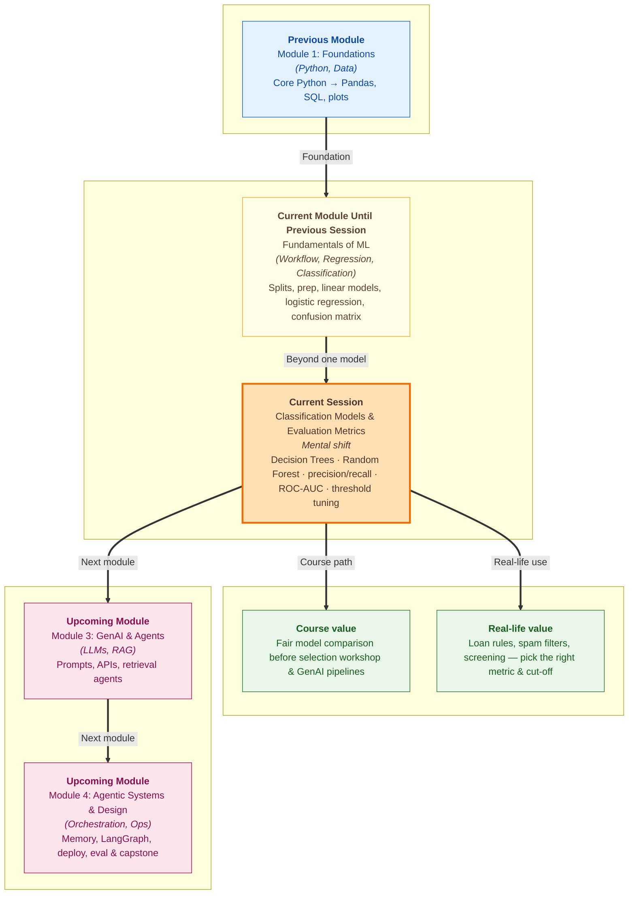

```mermaid
%%{init: {'flowchart': {'nodeSpacing': 45, 'rankSpacing': 55, 'padding': 20}}}%%
flowchart TB
  subgraph foundation[" "]
    direction TB
    M1["<b>Previous Module</b><br/>Module 1: Foundations<br/><i>(Python, Data)</i><br/>Core Python → Pandas, SQL, plots"]
  end

  subgraph path[" "]
    direction TB
    M2U["<b>Current Module Until Previous Session</b><br/>Fundamentals of ML<br/><i>(Workflow, Regression, Classification)</i><br/>Splits, prep, linear models, logistic regression, confusion matrix"]
    CUR["<b>Current Session</b><br/>Classification Models &amp; Evaluation Metrics<br/><i>Mental shift</i><br/>Decision Trees · Random Forest · precision/recall · ROC-AUC · threshold tuning"]
  end

  subgraph value[" "]
    direction LR
    CV["<b>Course value</b><br/>Fair model comparison before selection workshop &amp; GenAI pipelines"]
    RL["<b>Real-life value</b><br/>Loan rules, spam filters, screening — pick the right metric &amp; cut-off"]
  end

  subgraph future[" "]
    direction TB
    M3["<b>Upcoming Module</b><br/>Module 3: GenAI &amp; Agents<br/><i>(LLMs, RAG)</i><br/>Prompts, APIs, retrieval agents"]
    M4["<b>Upcoming Module</b><br/>Module 4: Agentic Systems &amp; Design<br/><i>(Orchestration, Ops)</i><br/>Memory, LangGraph, deploy, eval &amp; capstone"]
  end

  M1 ==>|&nbsp;Foundation&nbsp;| M2U
  M2U ==>|&nbsp;Beyond one model&nbsp;| CUR
  CUR ==>|&nbsp;Course path&nbsp;| CV
  CUR ==>|&nbsp;Real-life use&nbsp;| RL
  CUR ==>|&nbsp;Next module&nbsp;| M3
  M3 ==>|&nbsp;Next module&nbsp;| M4

  classDef prev fill:#e3f2fd,stroke:#1565c0,color:#0d47a1
  classDef currMod fill:#fffde7,stroke:#f9a825,color:#5d4037
  classDef currSes fill:#ffe0b2,stroke:#ef6c00,color:#4e342e,stroke-width:3px
  classDef val fill:#e8f5e9,stroke:#2e7d32,color:#1b5e20
  classDef fut fill:#fce4ec,stroke:#ad1457,color:#880e4f

  class M1 prev
  class M2U currMod
  class CUR currSes
  class CV,RL val
  class M3,M4 fut

  linkStyle default stroke-width:3px
```
