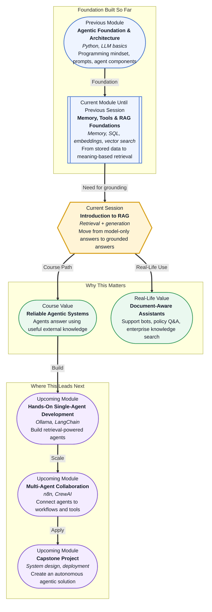

# Pre-read: Introduction to RAG

## Context of This Session in the Course

Imagine you join a new company and ask the office assistant, **"What is the reimbursement policy for travel?"** The assistant sounds very confident and gives you a neat answer. But then you discover the answer was based on an old policy from two years ago. The tone was perfect, the English was clear, but the information was wrong.

This is one of the biggest challenges with AI systems. A Large Language Model can write beautifully, explain clearly, and sound confident. But if it does not have the right information at the right moment, it may still produce an answer that is incomplete, outdated, or simply false.

Now think of a customer support chatbot for a bank, hospital, college, or e-commerce company. Users will ask questions about refunds, admission rules, delivery status, internal policies, benefits, product manuals, or legal documents. These answers cannot depend only on the model's general memory. They must come from trusted documents, updated databases, and company-specific knowledge.

That is where **Retrieval-Augmented Generation**, commonly called **RAG**, becomes important.

---

**What if** an AI assistant had to answer questions from 5,000 company documents?

A human cannot read all those documents every time a customer asks a question. A normal chatbot may guess based on general knowledge. A keyword search may miss the right document if the user's words are different from the document's words.

For example, a user may ask, **"Can I get my money back after returning the item?"** The policy document may say, **"Refunds are processed after reverse pickup verification."** The words are different, but the meaning is connected.

The real challenge is not only generating a nice answer. The challenge is: **find the most relevant information first, then generate an answer using that information.**

This is the core idea of RAG.

---

RAG combines two strengths:

- **Retrieval** means finding useful information from an external source, such as documents, FAQs, databases, policies, notes, or knowledge bases.
- **Generation** means using an LLM to convert that information into a helpful, natural-language answer.

In simple terms, RAG tells the AI: **"Do not answer only from memory. First check the right material, then respond."**

This small shift makes AI systems much more reliable. Instead of behaving like a student trying to remember everything from memory, the model behaves more like a student answering with an open book beside them.

The book does not write the answer by itself. The student still needs to understand the question and explain clearly. But the book gives the student the correct facts. In the same way, retrieved information gives the LLM a stronger base for its answer.

---

In the **previous session**, you worked with vector search systems. You saw how text can be converted into embeddings, stored in a vector database, and searched by meaning instead of exact words. That work now becomes a major building block for RAG.

RAG uses retrieval systems like vector search to bring relevant chunks of knowledge into the LLM's working space. The model then uses those chunks as context.

The high-level flow is simple:

- A user asks a question.
- The system searches for relevant information.
- The best matching text is passed to the LLM as context.
- The LLM generates an answer grounded in that context.

This is why the word **grounding** is so important. A grounded answer is supported by actual information. It is not just a confident sentence. It is connected to a source.

---

In this pre-read, you'll discover:

- How to **understand** the limitations of LLM-only answers, especially when information is old, missing, or domain-specific.
- How to **discover** why grounding helps reduce hallucination, which means the model makes up incorrect information.
- How to **learn** the basic RAG flow: question → retrieval → context → generated answer.
- How to **connect** RAG with vector search, enterprise assistants, document question answering, and agentic systems.

---

## Why LLM-Only Answers Can Fail

LLMs are trained on large amounts of text, but they do not automatically know everything happening right now. They may not know your company's latest refund rule, your college's updated academic calendar, or a new government regulation.

They also may not know private information. A public model cannot magically know your HR policy, sales playbook, project documentation, or internal product guide unless that knowledge is provided to it.

This creates three common problems:

- **Static knowledge:** The model may not know recent changes.
- **Missing domain context:** The model may not understand your specific organization, course, product, or process.
- **Hallucination risk:** The model may produce a confident answer even when it does not have enough facts.

For beginner learners, remember this simple line: **good language does not always mean good knowledge.**

---

## How RAG Changes the Answering Style

An LLM-only system answers mainly from what the model already learned during training. A RAG-based system first brings external information into the conversation.

Suppose a student asks, **"What topics should I revise before building a RAG pipeline?"**

An LLM-only answer may give a generic list: Python, databases, machine learning, and APIs.

A RAG-based answer can look at the actual course material and say: **"Revise embeddings, vector databases, similarity search, Chroma collections, document chunks, and grounding."** That answer is more useful because it is connected to the learner's real path.

This is the difference between a smart guess and a grounded response.

---

## Where RAG Appears in Real Life

RAG is not only a technical idea for research papers. It is already used in many practical systems:

- **Enterprise knowledge assistants** that answer employee questions from internal documents.
- **Document-based question answering** systems for contracts, manuals, policies, and reports.
- **Domain-specific chat systems** for education, healthcare, finance, legal support, and customer service.
- **Agentic systems** where an agent retrieves knowledge before deciding what to do next.

In an agentic system, retrieval acts like the agent's ability to look things up. Without retrieval, the agent may act with weak information. With good retrieval, the agent can reason using better context.

That is why response quality depends heavily on retrieval quality. If the system retrieves poor or irrelevant information, even a powerful LLM may produce a weak answer. If retrieval is strong, the LLM has a much better chance of being accurate and useful.

---

## What's Next

After this session, you will be able to talk about:

- Why RAG is needed when model memory is not enough.
- How external data improves AI answers.
- Why vector search is a natural partner for RAG.
- How grounded responses reduce blind guessing.
- Why agents need retrieval to make better decisions.

You do not need to master the full engineering pipeline yet. The goal is to build a strong mental model: **RAG is the bridge between stored knowledge and generated answers.**

---

## Interesting Questions for the Live Session

- If an LLM sounds confident, how can we know whether its answer is actually grounded?
- What happens when the retriever finds the wrong document, but the generator still writes a polished answer?
- Can RAG fully remove hallucination, or does it only reduce the risk?
- How does better retrieval lead to better agent decisions?

By the end, RAG should feel less like a buzzword and more like a practical design pattern: **search first, provide context, then generate a useful answer.**
