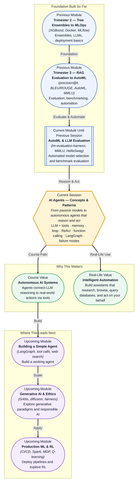

# Pre-read: AI Agents — Concepts & Patterns

## Context of This Session in the Course

You ask an AI assistant to research the latest advances in a technical field, draft a summary email, and check your team's project tracker for overlapping tasks. The assistant returns a polished email citing papers that do not exist and a confident statement about your tracker that is completely wrong. The language was fluent, the tone was professional, and every action produced something that looked right — but nothing was usable.

This is the fundamental limitation of a passive language model. An LLM alone can generate beautiful text, but it cannot search the web, query a live database, run a calculation, or verify a fact against a real source. It has no way to act on the world or check whether its own output is correct. The harder the task — multi-step research, cross-referencing documents, executing a plan with dependencies — the faster the model drifts into hallucination or settles for an incomplete answer. The problem is not the quality of the model; it is the architecture of the system around it.

The solution is not a bigger model. It is a different design: an **AI agent** that combines an LLM with tools, memory, and a reasoning loop so it can perceive a situation, plan a course of action, execute steps, and learn from what comes back. That is where **AI Agents — Concepts & Patterns** becomes essential.

**What if** you could build an assistant that does not just answer questions but independently investigates a topic, runs data analyses across multiple sources, queries APIs to verify facts, and delivers a verified report — all while detecting errors and adjusting its approach when something goes wrong? Imagine assigning it to monitor a competitor's pricing: every day it would check public pages, pull fresh data into a spreadsheet, flag meaningful changes, and email you a summary with visualisations. It would notice if a page changed format and adapt its scraping strategy. It would tell you when it could not find reliable data rather than fabricating it. The concepts in this session — the **ReAct pattern**, **tool use**, **memory**, and the **agent loop** — are exactly what turns that vision from a demo into a dependable system.

An **AI agent** is more than a language model wrapped in an API call. It is a system built around four components: an **LLM** for reasoning and generation, **tools** for interacting with the outside world (search, databases, calculators, APIs), **memory** for maintaining context across steps, and a **loop** that lets it act, observe the result, and decide what to do next. The LLM is still the brain, but now it has hands and eyes.

Think of a human researcher tackling a complex question. You do not sit still and compose an answer from memory alone. You break the question into sub-questions, search for relevant information, read, take notes, refine your search based on what you find, and only then synthesise an answer. An agent works the same way: it reasons about what to do, takes an action (like running a web search or calling a database API), observes the result, and reasons again about the next step. This **ReAct pattern** — Reason then Act, repeat — is the core loop that separates agents from simple Q&A systems. In this session, you will explore **function calling** to let the LLM invoke tools with structured arguments, **in-context memory** (conversation history) versus **external memory** (vector databases or knowledge graphs), and a practical introduction to **LangGraph** — a framework that models agents as graphs of nodes (processing steps) and edges (transitions), with shared **state** flowing through the system. You will also learn where the loop breaks — **infinite reasoning loops**, **hallucinated tool calls**, and **context window overflows** — because knowing failure modes is as important as knowing the happy path.

In the **previous session**, AutoML & LLM Evaluation Concepts (Session 35.2), you explored how to automate model selection with AutoML and how to evaluate LLM performance using frameworks like lm-evaluation-harness and benchmarks like MMLU and HellaSwag. You learned to measure whether a language model is actually capable and reliable before putting it to work. That evaluation lens now becomes the foundation for trusting the agent you will build. Knowing how to assess an LLM's factual accuracy and its susceptibility to hallucination gives you the confidence to place that model at the centre of an autonomous loop. Without evaluation, an agent is just an LLM acting without a safety net; with it, you can monitor, debug, and improve agent behaviour with the same rigour you would apply to any software system.

In this pre-read, you will discover:

- How to **understand** the four-component architecture of AI agents: an LLM, tools, memory, and the reasoning loop.
- How to **learn** the ReAct pattern — the Reason to Act cycle that enables agents to decompose complex tasks.
- How to **recognise** common agent failure modes, including reasoning loops and hallucinated tool calls.
- How to **connect** LangGraph concepts — nodes, edges, and state — to the architecture of a real agent system.

---

## What Makes a Language Model an "Agent"

Adding a tool-calling API to an LLM does not automatically make it an agent. The critical difference is whether the system has a **loop** that lets it observe the outcome of its actions and decide on the next step. A single-turn function call — where the model generates one tool invocation and stops — is not an agent. An agent loops: it calls a tool, receives a result, incorporates that result into its reasoning, and decides whether to call another tool or produce a final answer.

This distinction matters because a loop introduces both power and fragility. Without a loop, the system cannot recover from a failed tool call or refine its approach based on partial results. With a loop, it can retry, decompose, and verify — but it can also get stuck repeating the same action when the result does not change its state, or it can hallucinate a tool call with arguments that make no sense in the real world. The loop is what makes an agent useful, and the loop is also what makes it dangerous.

Consider the difference between asking a model "What is the weather in Tokyo?" and asking an agent to "Plan a three-day trip to Tokyo using real-time data." The first is a lookup; the second requires the agent to check weather forecasts, search for flight options, look up hotel availability, cross-reference travel advisories, and compile everything into a coherent itinerary — all while handling APIs that may be down, search results that may be incomplete, and decisions that depend on earlier results. That multi-step, adaptive reasoning is the hallmark of an agentic system.

## The ReAct Pattern: Think-Do-Think

The **ReAct pattern** (Reason + Act) is the most influential design pattern for LLM-based agents today. At each step of the loop, the model generates a reasoning trace that explains what it is trying to do and why, followed by either a tool call or a final answer. The reasoning trace is not just documentation — it is the mechanism that keeps the agent grounded. By writing out "I need to find X before I can compute Y," the model structures its own thinking and makes it possible for a human (or a monitoring system) to inspect its decision process.

A concrete example: you ask the agent, "What was the revenue growth of Company A from 2023 to 2024?" The agent reasons: "I need to find the 2023 and 2024 revenue figures for Company A. I will search for the most recent annual report." It calls a web search tool and retrieves the report. It then reasons: "The report shows 2023 revenue was $10B and 2024 revenue was $12B. I can now compute the growth rate." It calls a calculator tool with those numbers, gets the result, and produces the final answer. Every intermediate step is visible, auditable, and debuggable.

The failure modes map directly to breaks in this cycle. A **reasoning loop** occurs when the agent keeps reasoning without making progress — repeating "I need more information" without changing its state. A **hallucinated tool call** happens when the model invokes a tool with arguments that do not exist in the real world, like searching for a document ID that was never retrieved, or calling an API with parameters the tool does not support. **Context window overflow** occurs when the accumulated reasoning trace, tool results, and conversation history exceed the model's limit, causing it to lose earlier context and start repeating itself. LangGraph addresses these by giving you explicit control over the graph structure: you define nodes (what happens at each step), edges (when to transition), and state (what information persists), so the loop has clear boundaries and observable behaviour.

## Where AI Agents Appear in Real Life

Agent architectures are not theoretical — they power some of the most impactful AI products in production today. In **enterprise automation**, companies deploy agents that connect to internal APIs to handle tasks like provisioning user accounts, generating compliance reports, or triaging IT support tickets across multiple systems. These agents replace multi-click manual workflows with a single natural-language instruction, cutting response times from hours to seconds. In **software engineering**, coding assistants like GitHub Copilot and Cursor are evolving from autocomplete tools into agentic systems that can navigate a codebase, run tests, identify bugs, and suggest fixes across multiple files — effectively acting as an autonomous pair programmer. In **financial services**, agents monitor market data streams, execute trades against specific criteria, and generate risk summaries by querying multiple data sources in real time, with every action logged for audit and compliance. In **healthcare research**, agents search medical literature databases, extract relevant trial results, cross-reference drug interactions from pharmacovigilance APIs, and compile evidence summaries that researchers can review — reducing weeks of manual literature review to hours. In **customer operations**, support agents with access to order management systems, knowledge bases, and shipping APIs can resolve complex multi-step issues — refund a delayed order, rebook a shipment, and notify the customer — without handing off between departments. In every case, the pattern is the same: an LLM reasons about the goal, selects and invokes the right tool, observes the outcome, and repeats until the task is complete or a stopping condition is reached.

## What's Next

After this session, you will be able to:

- Describe the four components of an agent system and explain how they interact in a reasoning loop.
- Trace a complete ReAct cycle through a concrete example and identify where failures can occur.
- Distinguish between in-context memory and external memory and decide which one a given task requires.
- Read a LangGraph diagram and explain how nodes, edges, and state encode agent behaviour.
- Recognise reasoning loops, hallucinated tool calls, and context overflow before they cause cascading failures.
- Evaluate whether a real-world problem is better solved with an agent architecture or a simpler prompt-based approach.

You do not need to build a production agent framework right now. The goal is to shift your mental model from "LLM as answer machine" to "LLM as reasoning engine inside an action loop": **think, act, observe, and repeat.**

## Interesting Questions for the Live Session

- If an agent calls a tool with incorrect arguments, is the problem in the LLM's reasoning, the tool definition, or the way the loop handles errors — and how would you isolate the root cause?
- When an agent loops indefinitely on a task, how do you distinguish between insufficiently clear instructions, a missing tool capability, and an LLM that simply cannot reason its way out of the cycle?
- Could adding external memory to an agent ever make it less reliable — for example, if stale or contradictory information from a long history pollutes its next decision?
- If a ReAct agent hallucinates a tool call that happens to return a plausible result, have you built a useful feature or a more dangerous system that hides its errors behind successful-looking outputs?

By the end of this session, AI agents should feel less like science fiction and more like a practical design pattern: **an LLM augmented with tools, memory, and a loop that turns thinking into doing.**
