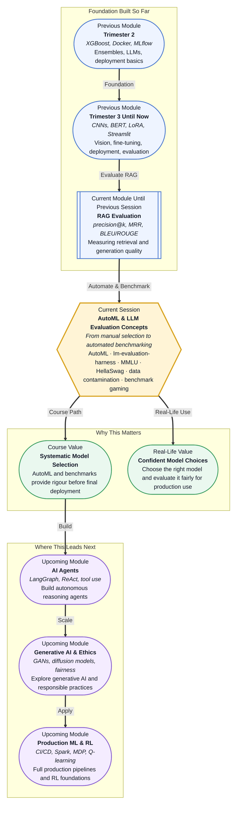

# Pre-read: AutoML & LLM Evaluation Concepts

## Context of This Session in the Course

You spend weeks training a model, tuning hyperparameters, and finally landing impressive accuracy — only to discover that a competitor's off-the-shelf model performs better on your data with zero manual tuning. Worse, when you run your model on a different benchmark, the performance drops sharply, and you cannot tell whether the model genuinely improved or simply memorised the test set.

The naive approach is to trust your metrics blindly. But metrics can mislead: a model that scores 90% on a benchmark may have seen those exact questions during training. Without rigorous evaluation frameworks and automated model selection, you are flying blind — comparing apples to oranges, or worse, comparing against results that were gamed.

That is where **AutoML and LLM Evaluation Concepts** becomes essential.

---

What if you could automatically search through hundreds of model configurations and pick the best one, while simultaneously knowing exactly which benchmark a model was legitimately tested on and which ones it might have been contaminated by? Imagine being the person your team trusts to say, "This model is ready for production, and here is the evidence to prove it." This session gives you the mental toolkit to move from gut-feel model selection to systematic, audit-ready evaluation — the difference between hoping a model works and confidently knowing it does.

---

**AutoML** (Automated Machine Learning) automates the repetitive parts of the ML workflow — data preprocessing, feature selection, model selection, and hyperparameter tuning. Instead of manually trying fifty learning rates, AutoML searches the configuration space for you. **LLM evaluation frameworks** like **lm-evaluation-harness** provide a standardised way to run models through rigorous, reproducible tests. **Benchmark suites** such as **MMLU** (Massive Multitask Language Understanding) and **HellaSwag** (commonsense reasoning through sentence completion) define what "good" means for specific capabilities.

Think of these tools like a flight simulator for AI. You would not certify a pilot after one smooth landing; you test across turbulence, instrument failure, and crosswind scenarios. Similarly, these benchmarks stress-test models across diverse tasks so you know how they behave under pressure — not just on the data they trained on. You will explore when AutoML saves time versus when it adds risk, how the lm-evaluation-harness framework standardises model comparisons, what MMLU and HellaSwag actually measure, and critical pitfalls like data contamination and benchmark gaming that can make evaluation results dangerously misleading.

---

In the **previous session**, you measured retrieval quality with precision@k and MRR, evaluated answer grounding, and used BLEU/ROUGE to assess generation quality in RAG pipelines. Those metrics gave you a lens for diagnosing whether a RAG system retrieved the right documents and generated faithful answers.

This session extends that lens: instead of evaluating a single RAG pipeline, you will now evaluate models themselves — comparing their general knowledge, reasoning, and safety across standardised benchmarks. The skills transfer directly — precision and recall in retrieval become accuracy and robustness in model evaluation. You are moving from evaluating a system's output to evaluating a model's capabilities.

---

In this pre-read, you will discover:

- How to **understand** what AutoML automates and when to apply it in your workflow
- How to **discover** how lm-evaluation-harness provides reproducible LLM evaluations
- How to **interpret** MMLU and HellaSwag benchmarks and what they actually measure
- How to **recognise** evaluation pitfalls like data contamination and benchmark gaming

---

## What AutoML Automates — and When You Should Use It

AutoML answers a deceptively simple question: which model, with which settings, works best for your data? Rather than manually iterating through algorithms and hyperparameters, AutoML frameworks like AutoGluon, H2O, or FLAML treat the search as an optimisation problem — testing configurations, learning from results, and converging on the best performer. This frees you from spending days on trial-and-error grid searches.

But AutoML is not a silver bullet. It shines when you have a well-defined tabular dataset, a clear evaluation metric, and limited time for manual tuning. It struggles when deep domain knowledge must inform feature construction, when interpretability matters more than raw score, or when you need to explain why a particular model was chosen over another. Knowing when to automate — and when to keep the human in the loop — is the real skill this session sharpens.

## Why Benchmark Suites Like MMLU and HellaSwag Matter

Benchmarks are the measuring tape of AI progress. **MMLU** tests a model's breadth of knowledge across 57 subjects, from law and medicine to physics and history. It evaluates how much the model actually knows — not just its ability to produce fluent text. **HellaSwag**, on the other hand, tests commonsense reasoning: given a sentence, which of several completions is most plausible? It was specifically designed to be hard for language models that rely on surface-level pattern matching, making it a strong test of genuine understanding.

The **lm-evaluation-harness** framework ties these benchmarks together into a single, reproducible pipeline. Instead of manually downloading test sets and writing scoring scripts, you run a single command that loads the model, feeds it benchmark data, and outputs standardised results. This reproducibility is crucial — without it, every paper and every vendor can cherry-pick their evaluation setup, making cross-model comparisons meaningless.

## Where AutoML and LLM Evaluation Appear in Real Life

These concepts are not confined to research papers. In **healthcare**, AutoML pipelines automatically select the best diagnostic model from thousands of candidates while evaluation benchmarks ensure reported accuracy is not inflated by data leakage. **Financial services** teams use AutoML to rapidly prototype credit-risk models, then run them through fairness benchmarks to detect bias before deployment. **Enterprise AI procurement** teams rely on standardised evaluations from lm-evaluation-harness to compare vendor models, and will reject any that do not publish their benchmark methodology. In **NLP product development**, teams benchmark every new model release against MMLU and HellaSwag before promoting it to production, catching regressions that a single accuracy number would mask. And in **AI research**, benchmark suites are the gatekeepers of scientific claims — a paper claiming state-of-the-art performance must disclose which data split was used, whether contamination was checked, and exactly how the evaluation was run. Without this rigour, a published score is just a number.

---

## What's Next

After this session, you will be able to:

- Explain what AutoML automates and decide when to use it versus manual tuning
- Set up an lm-evaluation-harness run for a given LLM on a standard benchmark
- Interpret MMLU and HellaSwag scores and identify what each benchmark measures
- Detect signs of data contamination in published model results
- Recognise benchmark gaming tactics and evaluate model claims critically
- Apply evaluation thinking before deploying models to production

You do not need to master every AutoML framework or benchmark right now. The goal is to develop an evaluator's mindset: **always ask how a score was produced before trusting it.**

---

## Interesting Questions for the Live Session

- If a model scores 90% on MMLU, how confident can you be that it truly understands the material versus having memorised similar questions during training?
- When an AutoML system selects a model automatically, who is responsible if that model exhibits biased behaviour in production?
- HellaSwag was designed to expose shallow pattern matching, but could a model eventually learn to ace it through the same surface patterns it is supposed to bypass?
- Would you trust a benchmark result more from lm-evaluation-harness or from a model provider's own reported numbers, and why?

By the end of this session, AutoML and evaluation should feel less like abstract jargon and more like your diagnostic toolkit: **test systematically, benchmark honestly, deploy confidently.**
