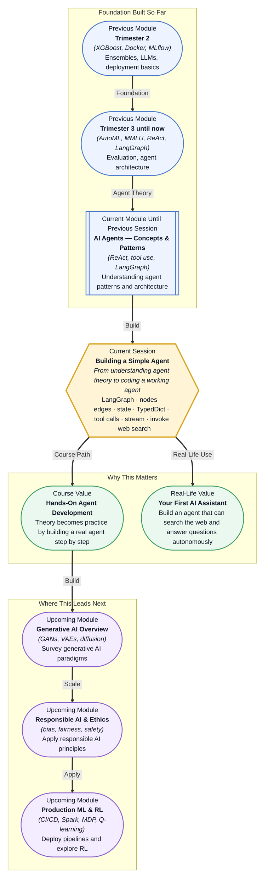

# Pre-read: Building a Simple Agent

## Context of This Session in the Course

You are building a chatbot that needs to answer questions about today's news, stock prices, or weather. You connect it to a powerful LLM, write a clean prompt, and deploy it. The first few questions go well — the model answers from its training data with confidence. Then someone asks, "What is the latest price of Tesla stock?" The model gives a plausible number — but it is from six months ago. The user has no way to know the answer is outdated because the response sounds authoritative.

The problem is not the LLM's reasoning ability. An LLM, by itself, has no access to live information. It cannot check a database, query an API, or search the web. It can only generate text based on patterns from its training corpus. The moment a question requires current or private information, the model guesses — and guessing is not acceptable in production systems. The naive fix — feeding all possible information into the prompt — breaks down as soon as the knowledge base grows beyond a few pages.

The solution is not to make the model smarter. The solution is to give the model **tools** — real functions it can call to fetch information on demand, process results, and decide what to do next. That is where **Building a Simple Agent** becomes essential.

---

What if you could build a system that, when asked "What is the weather in Tokyo?", decides on its own to call a weather API, parses the response, and answers you in natural language — without you writing any explicit if-else logic for each possible question? That is the leap you take when you move from a passive LLM to an active agent. An agent does not just generate text. It reasons, selects which tool to invoke, executes the call, and incorporates the result into its final answer. In a professional setting, this capability is what separates a demo chatbot from a deployable assistant that can pull live data, query internal databases, and take actions on behalf of users. This session gives you the code to make that happen.

---

An **agent** is a system that combines an LLM with tools and state in a reasoning loop. The LLM acts as the "brain" — it receives a user request, decides what action to take, and generates a response. The **tools** are external functions the LLM can call, such as a web search API, a calculator, or a database query. **State** carries information across steps so the agent remembers what it has done and learned. **LangGraph** is a framework that makes this loop explicit by modelling it as a **graph** with **nodes** (the steps the agent takes), **edges** (the flow between steps), and a **state schema** (the data contract passed between nodes).

Think of it like a chef cooking from a recipe. The LLM is the chef's culinary knowledge. The tools are the kitchen appliances — a knife, a stove, a blender. The recipe is the graph structure: first chop, then sauté, then simmer. The state is the dish itself as it evolves from raw ingredients to a finished meal. Without the graph, the chef would just talk about cooking. With the graph, the chef actually cooks. In this session, you will define a **TypedDict state schema** to specify exactly what data flows through your graph, integrate a live **web search tool** as a callable function, and run the agent using **stream** and **invoke** to inspect each reasoning step as it happens.

---

In the **previous session**, you explored AI agent concepts and patterns — the ReAct reasoning loop, tool use, memory types, and the LangGraph abstraction. You understood the architecture conceptually: an agent thinks, acts, observes, and repeats. Now you will implement that pattern in Python. The theory of nodes, edges, and state that was introduced as a diagram becomes working code with imports, function definitions, and graph compilation. The ReAct pattern that you studied as a mental model transforms into a concrete loop with an actual web search tool attached. This session is where the architecture you analysed moves from a whiteboard sketch to a terminal you can run.

---

In this pre-read, you will discover:

- How to **build** a LangGraph agent using graph, nodes, and edges.
- How to **apply** a TypedDict state schema for agent memory and data flow.
- How to **connect** a web search tool to an LLM via function calling.
- How to **discover** the agent's reasoning steps using stream and invoke.

---

## Why State Makes Agents Different from Simple LLM Calls

A standard LLM call is stateless: you send a prompt, you get a response, and the conversation ends. An agent, by contrast, operates over multiple steps — it may receive a question, decide to search the web, process the results, and then generate a final answer. Between each of those steps, information must persist. That is where **state** comes in.

In LangGraph, state is defined as a **TypedDict** schema — a typed dictionary that specifies exactly what fields the agent will carry across nodes. For example, your state might include a `messages` list (the conversation history), a `search_results` field (what the web tool returned), and a `next_action` field (what the agent plans to do next). Each node in the graph reads from and writes to this shared state object. This design makes the agent's behaviour inspectable and debuggable: you can pause execution, check the state at any node, and understand exactly why the agent made the decision it did. Without explicit state management, an agent is just a chain of disconnected LLM calls pretending to be coherent.

## How Tool Calls Turn an LLM into an Action-Oriented Agent

An LLM alone can only produce text. To act on the world — to search the web, run code, fetch a database record — the model needs access to **tools** that it can invoke. In LangGraph, tools are registered as Python functions that the LLM can choose to call based on the conversation context. The model does not execute the tool directly; it outputs a structured request (the function name and arguments), and the graph framework runs the actual function and feeds the result back into the state.

Consider a web search tool. The agent receives a question: "What is the current CEO of OpenAI?" The LLM reasons that it does not know the latest information and decides to call `web_search(query="current CEO of OpenAI")`. The graph intercepts this request, executes the search, and places the results into the agent's state. The LLM then reads those results and generates a grounded answer. This **reason → act → observe** cycle, repeated across nodes, is the core of agentic behaviour. The tools you add define what the agent is capable of doing — and in this session, you will wire up a live web search that turns your agent from a text generator into an information-gathering system.

## Where Simple Agents Appear in Real Life

The pattern you will build — an LLM that reasons, calls tools, and incorporates results — is not a classroom abstraction. It powers real products across multiple industries. Customer support systems use agents that search knowledge bases and ticketing systems to answer user queries with verified information rather than generic guesses. Financial analysis tools deploy agents that can query stock APIs, read earnings reports, and summarise market conditions in real time without a human refreshing a dashboard. Internal enterprise assistants rely on agents that connect to company databases, HR systems, and document stores to answer employee questions about policies, benefits, and project status. In healthcare, agents can retrieve patient records, look up drug interactions, and present a summarised assessment to a clinician. In each case, the architecture is the same: an LLM with a state schema, a set of tools, and a graph that controls the flow of reasoning. The only difference is which tools you plug in.

---

## What's Next

After this session, you will be able to:

- Define a TypedDict state schema to manage data flow across agent steps.
- Set up a LangGraph with nodes, edges, and conditional routing.
- Integrate a web search API as a tool the agent can call autonomously.
- Run the agent using invoke and stream to observe each reasoning step.
- Inspect intermediate states to debug and understand agent behaviour.

You do not need to build a production-ready multi-agent orchestration system right now. The goal is to cross the threshold from theoretical understanding to working code: **your first agent that thinks, searches, and responds.**

---

## Interesting Questions for the Live Session

- If an agent calls the wrong tool, how do you detect that from the state trace, and what structural changes would prevent it?
- What happens when the web search tool returns information that contradicts the LLM's training data — which source should the agent trust, and how would you encode that preference?
- How would you design the state schema differently if the agent needed to remember conversation history across multiple user turns versus handling a single standalone query?
- Is there a practical case where a simpler if-else pipeline could outperform a LangGraph agent, and what criteria would you use to decide?

By the end of this session, building an agent should feel less like an abstract architecture discussion and more like wiring components into a live system: **define the state, add the nodes, connect the tools, and let the LLM reason its way through.**
