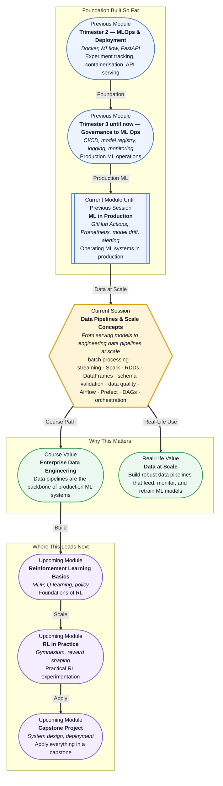

# Pre-read: Data Pipelines & Scale Concepts

## Context of This Session in the Course

You have just deployed a high-performing model into production. The API endpoints are live, the monitoring dashboards are green, and your CI/CD pipeline is running smoothly. A week later, the training data your model depends on arrives late, contains nulls in critical columns, and the retraining pipeline silently fails — while the stale model continues serving predictions.

The model itself was never the problem. The real challenge was the data flowing into it. In production ML systems, data arrives in messy, unpredictable ways — sometimes as large batches overnight, sometimes as a continuous stream of millions of events per minute. Without the right infrastructure to handle both patterns, even a carefully tuned model degrades or breaks. Schema mismatches, silently missing records, and pipelines that stall without alerts are the hidden killers of production ML.

That is where **Data Pipelines & Scale Concepts** becomes essential.

**What if** you were responsible for the data that feeds a fraud detection system processing millions of transactions per day? One delayed batch could leave an hour of fraud undetected. One corrupted column could silently retrain a model on garbage. One unmapped pipeline dependency could strand a production model on stale predictions for weeks. After this session, you will understand how to design data pipelines that are reliable, observable, and scalable — from batch ingestion to real-time streaming, with quality gates and orchestration that keep everything running without constant manual attention.

**Batch processing** handles large volumes of data at scheduled intervals — nightly ETL jobs that aggregate a day's transactions. **Streaming processing** handles data as it arrives, event by event — real-time fraud alerts triggered by individual credit card swipes. Each comes with clear tradeoffs: batch is simpler and more economical but introduces latency; streaming is responsive but demands more robust infrastructure.

Think of batch as meal-prepping for the week — efficient but inflexible when plans change — while streaming is cooking each dish when hunger strikes. Both are valid, but they serve different operational contexts. In this session, you will explore the conceptual architecture of **Apache Spark**, how **RDDs** and **DataFrames** abstract distributed computation, and when reaching for a cluster makes sense versus keeping things on a single node. You will also encounter **schema validation** and **completeness checks** as fundamental data quality gates, and see how orchestration tools like **Airflow** and **Prefect** model pipelines as **DAG structures** — directed acyclic graphs of interdependent tasks.

In the **previous session**, you worked with ML in Production — configuring CI/CD for ML pipelines via GitHub Actions, managing model versioning across staging and production registries, and setting up Prometheus and Grafana for monitoring and alerting. Those skills gave you the operational layer for serving and observing models. Now, you shift one layer deeper: before a model can be served or monitored, data must reach it reliably and at scale. The logging and alerting infrastructure you just built becomes the feedback loop for your data pipelines — a missing batch triggers an alert, a schema drift gets logged, and orchestration retries recover automatically. The production ML mindset you developed in session 38.1 is the foundation on which robust data engineering is built.

In this pre-read, you will discover:

- How to **understand** the difference between batch and streaming data processing and when to choose each approach.
- How to **recognise** the role of Spark RDDs and DataFrames in distributed data processing.
- How to **apply** schema validation and completeness checks as data quality gates in a pipeline.
- How to **connect** pipeline orchestration concepts with DAG-based tools like Airflow and Prefect.

---

## Batch vs Streaming — When Does Latency Matter?

Every data pipeline begins with a fundamental question: when does the data need to arrive? If your model is retrained nightly on historical data, batch processing is the natural fit — you collect data over a period, process it in one job, and write the results. If your application must react to events within seconds, streaming is the only choice.

The real insight is that many production systems use both. A recommendation engine might stream user click events in real time for immediate personalisation while also running hourly batch jobs to update collaborative filtering models. The distinction is not about which one is better but about knowing which parts of your system can tolerate latency and which cannot. This session will help you build that judgement.

## Why Data Quality Deserves a Gate, Not a Hope

A common pitfall in ML pipelines is assuming data will arrive clean. In practice, production data is full of surprises — a source system changes a column type, a field that was always populated starts showing nulls, or a schema evolves without anyone documenting it. Relying on hope is not a strategy.

Data quality checks act as automated guards at pipeline boundaries. **Schema validation** ensures that incoming data matches the expected structure — column names, data types, and required fields. **Completeness checks** verify that critical fields are populated and that the volume of data meets expected thresholds. Without these gates, bad data flows downstream, trains bad models, and corrupts dashboards. These checks are not an afterthought; they are first-class components of any production pipeline, often enforced as tasks within the orchestration DAG itself.

## Where Data Pipelines Appear in Real Life

Data pipelines are the invisible backbone of almost every production ML system. In **financial services**, transaction data is streamed through fraud detection models that must score each event in milliseconds, while overnight batch jobs recalculate risk models on aggregated historical data. In **e-commerce**, clickstream data flows continuously into recommendation engines, and inventory data is batch-synced from warehouses to keep stock predictions accurate. **Healthcare** systems use scheduled batch pipelines to process medical records for population health models, with strict schema validation to ensure patient data integrity and regulatory compliance. **Media and advertising platforms** ingest billions of ad impression events per day through streaming pipelines, enabling real-time bidding decisions, while batch pipelines aggregate performance metrics for campaign reporting. In each case, the pattern is the same: data must be collected, validated, transformed, and delivered reliably before any model or dashboard can do its job.

---

## What's Next

After this session, you will be able to:

- Distinguish between batch and streaming data and identify which pattern fits a given use case.
- Explain the conceptual role of Spark RDDs and DataFrames in distributed data processing.
- Identify where schema validation and completeness checks should be placed in a pipeline.
- Describe how Airflow or Prefect models a pipeline as a DAG of interdependent tasks.
- Recognise when a distributed processing engine is necessary versus when a single-node solution suffices.
- Connect pipeline orchestration concepts to the monitoring and alerting infrastructure from your previous session.

You do not need to write production Spark jobs right now. The goal is to build a clear mental model: **data pipelines are the circulatory system of ML — design them to be reliable, observable, and verifiable at every stage.**

---

## Interesting Questions for the Live Session

- If a streaming pipeline can process events in real time, why would any team still choose batch processing for certain workloads?
- What happens when a schema validation check fails halfway through a pipeline — should the entire pipeline halt, or should bad records be routed to a quarantine?
- Can a DAG-based orchestrator like Airflow handle streaming workloads, or does streaming demand a fundamentally different scheduling paradigm?
- How do you decide whether to validate data quality at ingestion, at transformation, or at the point the model consumes it?

By the end of this session, data pipelines should feel less like an infrastructure concern and more like a core engineering discipline: **move data reliably, check its quality, and orchestrate it wisely.**
