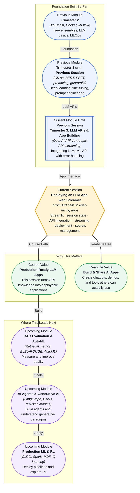

# Pre-read: Deploying an LLM App with Streamlit

## Context of This Session in the Course

You have just finished a Python script that sends prompts to the OpenAI API, streams back responses token by token, and logs the total cost. It runs reliably in your terminal. But when you want to show it to a teammate — a domain expert who has never touched Python — the script is useless to them. They would need to set up a Python environment, install dependencies, configure an API key, and run the file from a command line they have never opened. What you built works, but it is not something others can use.

This is the fundamental gap between backend integration and application building. An API call is invisible. A user interface is tangible. Without a UI, even the most polished LLM logic stays locked inside a developer's terminal, unreachable by the people who would benefit from it most. The real challenge is not just making the API work — it is wrapping that capability in an experience that anyone can open in a browser and interact with naturally.

That is where **Deploying an LLM App with Streamlit** becomes essential.

---

**What if** your team lead asked you to deliver a working chatbot prototype that answers questions about your organisation's internal policies — with a live demo by Friday? You already know how to call the LLM API, stream tokens, and handle errors. But your lead wants a web page they can open in a browser, type a question into, and get an answer back immediately. They do not care about the API client, the retry logic, or the token counters. They care about the interface, the responsiveness, and whether the app actually works when someone else uses it. This session gives you the missing piece: the tools and workflow to transform a terminal-based API integration into a deployable, multi-turn conversational application that anyone with a browser can use.

---

**Streamlit** is an open-source Python framework that turns data scripts into interactive web applications without requiring HTML, CSS, or JavaScript. Every time a user interacts with a Streamlit app — clicking a button, typing a message, adjusting a slider — the entire script reruns from top to bottom. This rerun cycle ensures the UI always reflects the latest state, but it also creates a problem: anything not explicitly saved disappears between interactions. That is where **session state** comes in. Session state is a dictionary-like object that persists data across reruns, acting like a whiteboard that carries information forward with each new interaction. Without it, every user message would erase the conversation history, and your chat app would forget what was said two turns ago.

Think of building a Streamlit app like setting up an interactive display at a conference. Streamlit is the display stand — it provides the screen, the layout, and the interactivity. Your LLM code is the product you are demonstrating. Session state is the notepad where you jot down what each visitor has already said so you do not repeat yourself. And when you deploy to **Streamlit Cloud**, you move your display from your desk to a public hall where anyone can walk up and try it.

In this session, you will explore Streamlit's layout components (`st.chat_message`, `st.write`), manage conversation history using session state, connect your app to an LLM API with secure **key handling** and **streaming responses**, and deploy everything to Streamlit Cloud with **secrets management** that keeps your API keys safe. These pieces combine to turn the API skills from the previous session into a real, shareable application.

---

In the **previous session**, you learned to integrate OpenAI and Anthropic APIs with proper error handling, streaming responses, and real-time cost tracking using token counting and budget guardrails. You built a Python client that could send messages, receive streams, and recover from rate limits and timeouts. That client is the engine. What you have not done yet is build the vehicle that carries that engine to end users.

This session takes that API integration and wraps it in a user interface. Instead of calling the API from a script and printing output to a terminal, you will call it from a Streamlit app and display output in a chat window. Instead of managing costs manually, you will let the app track usage transparently. The API skills you already have are the prerequisite — now you will turn them into something people can actually use.

---

In this pre-read, you will discover:

- How to **build** a conversational interface using Streamlit's `st.chat_message` and layout components
- How to **apply** session state to preserve conversation history across script reruns
- How to **connect** your app to an LLM API with secure key management and streaming output
- How to **understand** the full deployment workflow from GitHub setup to secrets management on Streamlit Cloud

---

## Why Session State Is the Backbone of Conversational Apps

Every Streamlit app has a hidden rhythm: each user action triggers a complete rerun of your script from top to bottom. This is by design — it guarantees the UI always reflects the latest data. But for a chat application, this creates an immediate problem. Conversation is cumulative. Each new message depends on everything that was said before. If your script reruns and forgets the entire history, the LLM receives a single isolated message and responds as if the conversation just started.

**Session state** solves this by giving you a persistent dictionary — `st.session_state` — that survives reruns. You can store the conversation history as a list of messages, append each new exchange, and pass the full context to the LLM with every request. This is what makes a multi-turn chat possible. Without it, your chatbot would be stuck in a loop of perpetual amnesia, unable to reference anything the user said more than one turn ago.

A useful way to think about session state is as the app's short-term memory. It lives only as long as the user's browser tab stays open, but across every button click and text input within that session, it preserves exactly what you choose to put there. For a chat app, that means the message list. For a form, it could mean a draft. The principle is the same: decide what needs to survive a rerun, and store it in session state.

## From API Call to Streaming Chat Interface

In the previous session, you called an LLM API from a standalone Python script. The flow was linear: send a message, receive a response, print it. Now imagine embedding that same logic inside a Streamlit app. The user types a question in a chat input. Your app retrieves the conversation history from session state, appends the new message, sends the full context to the API, and displays the response — all while the user watches from their browser.

The key architectural shift is **streaming**. When an LLM streams its response, tokens arrive one at a time rather than in a single batch. In a terminal script, you simply print each token as it arrives. In a Streamlit app, you need to write each token into a placeholder that updates dynamically, creating the illusion of real-time generation. This dramatically improves perceived responsiveness and lets users see the model thinking as it writes, rather than staring at a loading spinner.

On the security side, your **API key** must never appear in your code or version control. Streamlit Cloud's **secrets management** system lets you store keys in a `.streamlit/secrets.toml` file locally and configure the same variables in the deployment dashboard, keeping credentials out of your repository entirely. Combined with Git-based deployment, this gives you a professional workflow: develop locally, commit to GitHub, and deploy with a single click.

## Where Deployed Streamlit Apps Appear in Real Life

Deployed LLM applications powered by tools like Streamlit are not just classroom exercises — they are increasingly common across professional settings. Startups and internal teams use Streamlit to rapidly prototype customer-facing AI assistants, often moving from idea to deployed demo within days rather than months. Customer support teams deploy internal knowledge-base chatbots that let agents query policy documents mid-call without leaving their browser. Product teams build interactive demos that showcase LLM capabilities to stakeholders, turning a scripted proof-of-concept into a clickable experience that non-technical decision-makers can evaluate firsthand.

In education, instructors use Streamlit to create interactive tutoring apps that let students ask questions about course material and receive grounded, context-aware answers. In healthcare research, teams deploy lightweight data-exploration apps that combine LLM querying with visual dashboards for clinical data analysis. Even in open-source communities, many popular LLM demonstration projects — from code assistants to document Q&A tools — are built on Streamlit because it offers the shortest path from a working Python function to a shareable URL.

The pattern is consistent across every use case: the hard part is rarely the API integration. It is building the interface that makes that integration usable by others. Streamlit removes most of that friction, and this session teaches you the complete cycle — from local prototype to live deployment.

---

## What's Next

After this session, you will be able to:

- Build a Streamlit app with chat interface components and a responsive layout
- Maintain conversation history across user interactions using `st.session_state`
- Connect your app to OpenAI and Anthropic APIs with secure key handling and streaming responses
- Deploy a functional LLM application from a GitHub repository to Streamlit Cloud
- Configure secrets management to protect API credentials in production
- Debug common deployment issues including dependency mismatches and environment configuration

You do not need to build a production-grade system with authentication, databases, or monitoring right now. The goal is to experience the full journey from a working script to a deployed application — and to realise that shipping an AI tool anyone can use is surprisingly close to what you already know.

---

## Interesting Questions for the Live Session

- When a Streamlit app reruns from top to bottom on every interaction, what happens to the partially received tokens from a streaming API response — and where should the incomplete response be stored?
- Two users open your deployed Streamlit app at the same time — does session state leak between them, and what does Streamlit Cloud do to isolate sessions?
- If your app stores conversation history in session state, what happens when the browser tab is closed and reopened — and what would you need to add to make history persist across sessions?
- Why might you choose to embed the API call inside the Streamlit app rather than placing it behind a separate backend server, and at what scale does that decision become a bottleneck?

By the end of this session, deploying an LLM app should feel less like a complex engineering project and more like a natural extension of your API skills: **if you can call an LLM from a script, you can ship it as an app anyone can use.**
