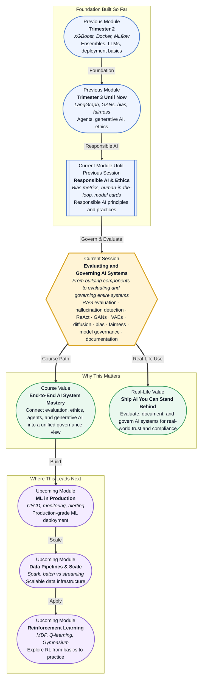

# Pre-read: Evaluating and Governing AI Systems

## Context of This Session in the Course

Your company's AI assistant has just been cleared for internal testing. On the first day, an employee asks about parental leave policy. The assistant retrieves a document, generates a clear response, and helpfully cites the source paragraph. Everything appears flawless — until someone notices the cited document is two years old. The policy has changed, and the old version entitles this employee to fewer weeks than the current law requires.

The assistant did not crash. It did not produce gibberish. It sounded professional, cited a real source, and answered the question directly — yet it failed, because it retrieved the wrong document, had no mechanism to verify currency, and lacked any governance layer to flag the mismatch. Traditional metrics like accuracy or fluency would have given it a passing grade, since the problem is not in generation — it is in **retrieval quality**, **source grounding**, and the absence of oversight.

Now multiply this scenario across thousands of queries, multiple models, biased training data, and agent-driven decision loops. The challenge is no longer about building a single component well — it is about evaluating the entire system across dimensions of quality, fairness, safety, and transparency. That is where **Evaluating and Governing AI Systems** becomes essential.

---

What if you were responsible for approving an AI system used by a hospital to triage emergency room patients? The system processes symptoms, retrieves relevant medical guidelines, and recommends a priority level. It never sleeps and processes in seconds. But before it goes live, you need to certify that it does not favour one demographic over another, that its retrieved sources are current and authoritative, that every recommendation is grounded in those sources, and that each decision can be traced and audited after the fact. This session gives you the evaluation framework and governance mindset to take on that responsibility.

---

Evaluating an AI system is fundamentally different from testing traditional software. A conventional program either produces the correct output or it does not. An AI system can produce output that appears correct but is subtly wrong — a **hallucination** in the generated text, a retrieved document that is relevant but outdated, or a prediction that is accurate overall yet systematically biased against a subgroup of users. That is why modern AI evaluation is not a single metric but a **multi-dimensional assessment** spanning quality, reliability, and fairness.

Think of it like an aviation safety inspection. You do not simply verify that the engines start. You inspect the fuel system, the avionics, the emergency procedures, and the pilot's training log. Each layer compounds the safety of the whole. Similarly, **AI governance** requires inspecting the **retrieval pipeline** in a RAG system, the **answer grounding** mechanism, the **ReAct reasoning loop** in an AI agent, the **latent space** of generative models — asking whether each layer meets its quality bar.

In this session, you will explore **retrieval quality evaluation**, **hallucination detection**, the **ReAct pattern** for AI agents, generative model paradigms (**GANs**, **VAEs**, **diffusion models**), and responsible AI practices including **bias detection**, **fairness metrics**, and **model documentation**. These are not separate topics — they form a unified framework for governing AI systems with confidence.

---

In the **previous session**, you explored **Responsible AI & Ethics** — understanding how bias enters ML systems through data and algorithmic choices, measuring fairness with metrics like demographic parity and equalized odds, and documenting model behaviour through model cards. Those concepts gave you the ethical lens for examining AI systems.

This session transforms that lens into a hands-on practice. Where you learned to recognise bias, you will now learn to evaluate it systematically as part of a broader governance framework. Where you saw model cards as a documentation exercise, you will now see them as one component of a complete governance strategy that includes retrieval quality assurance, hallucination detection, and agent behaviour auditing across generative and agent architectures.

In this pre-read, you will discover:

- How to **evaluate** retrieval quality in RAG systems using metrics like precision@k, recall@k, and answer grounding checks
- How to **recognise** hallucinations and understand why even fluent answers can be unsupported by retrieved sources
- How to **connect** fairness metrics, bias detection, and model documentation into a practical governance framework
- How to **apply** evaluation thinking to AI agent architectures (ReAct pattern) and generative AI paradigms (GANs, VAEs, diffusion models)

---

## Retrieval That Fails Silently — and How to Catch It

When a RAG system answers a question incorrectly, the fault often lies not with the LLM but with the retriever. The generator simply uses whatever context it is given — if that context is outdated, irrelevant, or incomplete, even the most capable LLM will produce a misleading answer. That is why **retrieval quality evaluation** is the first line of defence in any grounded AI system.

Standard metrics include **precision@k** — what fraction of the top-k retrieved documents are actually relevant — and **recall@k** — what fraction of all relevant documents are retrieved. **Mean Reciprocal Rank (MRR)** measures how early the first relevant result appears. These metrics, borrowed from information retrieval, give you a quantitative picture of retriever performance. But metrics alone are not sufficient. You also need **answer grounding** checks — verifying that each claim in the generated answer can be traced back to a specific source in the retrieved context.

**Hallucination detection** builds on this by flagging statements in the output that have no corresponding source support. A hallucination is not always a fabrication — it can be a plausible-sounding inference that the retrieved documents do not actually justify. Training yourself and your system to spot these gaps is the difference between a model that sounds right and a model that is right.

## Governing What You Cannot Fully Control

Once the system is evaluated per query, a harder question emerges: how do you govern behaviour that evolves as the model encounters new inputs? This is where **bias detection**, **fairness metrics**, and **model documentation** converge into a continuous governance practice.

**Fairness metrics** like demographic parity and equalized odds help you detect whether your system treats different user groups unevenly — even when overall accuracy looks acceptable. For example, a hiring assistant might achieve ninety percent accuracy overall but seventy percent for applicants from a particular demographic. Aggregate metrics would hide this gap. Governance demands that you break down performance by subgroup, document the findings, and design interventions — such as rebalanced training data or human-in-the-loop review for high-stakes decisions.

**Model documentation** standards like **model cards** formalise this process. A model card records intended use, evaluated performance across slices, known limitations, and fairness assessments. It is the artefact that turns evaluation from a one-time task into a traceable, auditable practice — essential for regulated industries, compliance requirements, and stakeholder trust.

## Where AI System Evaluation and Governance Appear in Real Life

AI system evaluation and governance are not academic exercises — they are embedded in how organisations deploy AI safely and responsibly across industries.

In **healthcare**, an AI diagnostic assistant must be evaluated not only for accuracy but for fairness across demographic groups. A model that detects skin cancer with high accuracy on light skin but significantly lower accuracy on dark skin is not ready for clinical use, and regulators increasingly require evidence of equitable performance before approval. Governance here means documenting training data composition, testing across subgroups, and maintaining an audit trail for every recommendation.

In **financial services**, credit-scoring and fraud-detection models are subject to regulatory scrutiny around fairness and explainability. A denial of credit must be explainable to the applicant, and the model must be tested for disparate impact across protected groups. Retrieval quality also matters for customer-facing assistants that must pull accurate policy information — citing the wrong regulation can lead to regulatory fines.

In **legal technology**, AI systems that retrieve and summarise case law or contracts must meet a high bar for answer grounding. A hallucinated citation in a legal memo could have real consequences, and firms are adopting governance frameworks that require every generated statement to cite a verifiable source document.

In **customer service**, enterprise knowledge assistants handle thousands of queries daily about HR policies, IT support, and product documentation. Hallucination detection and retrieval evaluation directly impact trust — every incorrect answer erodes user confidence, and governing the system means monitoring quality continuously, not just at launch.

In **government and public services**, AI systems must meet transparency and equity standards that go beyond commercial best practices. Model documentation, bias audits, and human-in-the-loop oversight are increasingly mandated by regulation, making governance frameworks a requirement for deployment rather than an afterthought.

---

## What's Next

After this session, you will be able to:

- Evaluate retrieval quality in a RAG pipeline using precision@k, recall@k, and MRR metrics
- Detect hallucinations in generated answers and verify grounding against retrieved sources
- Describe the ReAct pattern for AI agents and identify evaluation challenges unique to multi-step reasoning
- Distinguish between GANs, VAEs, and diffusion models from an evaluation and risk perspective
- Apply fairness metrics and bias detection techniques to assess system-level equity
- Document model behaviour and limitations using governance practices such as model cards

You do not need to implement every evaluation metric discussed in this session right now. The goal is to adopt the governance mindset: **before an AI system earns trust, it must be evaluated, documented, and governed.**

---

## Interesting Questions for the Live Session

- If a RAG system retrieves the correct document but the LLM misinterprets it and generates an incorrect answer, where does the failure lie — and how would you detect it systematically?
- Can an AI system be accurate for every individual query yet still be unfair overall, and what evaluation approach would reveal this?
- How would you evaluate an AI agent that uses the ReAct pattern, where each reasoning step influences what tool is called next, making final output quality depend on a multi-step chain?
- In a regulated industry like healthcare or finance, who should be responsible for governing an AI system — the engineers who built it, the domain experts who validated it, or an independent review board?

By the end of this session, AI system evaluation should feel less like a checklist of separate metrics and more like a unified discipline: **measure what matters, document what you find, and govern what you deploy.**
