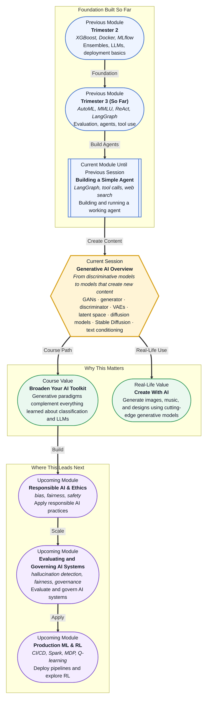

# Pre-read: Generative AI Overview

## Context of This Session in the Course

You open a design tool and describe a scene in natural language — "a cyberpunk café at night, neon reflections on wet asphalt" — and within seconds, a photorealistic image appears. The image was never photographed, never painted, and never existed before that moment. This is not a parlor trick; it is the output of a **generative model**, and it represents a fundamentally different kind of machine intelligence from everything you have studied so far.

Every model you have worked with until now has been **discriminative** — given an input, it predicts a label, a score, or a next token. A classifier tells you whether an email is spam. A regression model estimates a house price. An LLM predicts the next word. But none of them can create a new email, a new house design, or an image of a cyberpunk café from scratch. The leap from *recognising* patterns to *generating* new ones is not incremental; it requires an entirely different set of architectural ideas. Intuitively, you might think "just run the classifier backwards" — but that naive approach collapses because the space of possible outputs is vast, and most of it looks like noise.

That is where **Generative AI** becomes essential. Instead of drawing decision boundaries, generative models learn the underlying distribution of your data and sample from it. They do not ask "Is this a cat?" They ask "What does a cat look like, and can I produce a new one?" This session surveys the three dominant families — **GANs**, **VAEs**, and **diffusion models** — and gives you a mental framework for choosing the right one for the task at hand.

---

**What if** your team asked you to build a system that generates product images for an e-commerce catalogue, given only a text description and a reference style? You have classifiers, you have LLMs, you have agents — but none of them can paint. A classifier can tell you whether an image matches a description, but it cannot produce the image itself. An LLM can describe what a product should look like, but it cannot render pixels. An agent can search the web for existing photos, but it cannot create ones that do not exist yet.

The tools you have built so far stop at the boundary of perception. To cross into creation, you need models that do not just interpret the world but reconstruct and reimagine it. You need to understand how to map random noise into structured outputs, how to condition that process on text prompts, and how to compare the tradeoffs between speed, quality, and control. This session gives you exactly that map.

---

Generative models all share the same high-level goal: learn the true distribution of a dataset so well that you can draw realistic new samples from it. But they arrive at that goal through radically different mechanisms. A **Generative Adversarial Network (GAN)** pits two networks against each other — a **generator** that tries to create convincing fakes and a **discriminator** that tries to spot them. Their competition drives both to improve. A **Variational Autoencoder (VAE)** learns a compressed **latent space** of your data and then decodes samples from that space back into realistic outputs. A **diffusion model** starts with pure noise and gradually removes it step by step, learning the reverse of a noising process.

Think of it this way: a GAN is like a forger and an art critic locked in an escalating duel. A VAE is like an architect who designs a floorplan (the latent code) and then builds the house from it. A diffusion model is like a sculptor who begins with a block of marble and chips away noise until a form emerges. In this session, you will explore all three — including why diffusion models currently dominate image generation, how **Stable Diffusion** uses text embeddings to guide the denoising process, and when you would reach for a GAN or VAE instead.

---

In the **previous session**, you built a working LangGraph agent with tool calls, state management, and live web search integration. That agent could reason, decide which tool to invoke, and retrieve up-to-date information from the web — but it remained a purely discriminative system. It classified intents, selected actions, and generated text tokens one at a time. It could not produce a novel image, compose a melody, or design a synthetic dataset.

The agent you built relied on LLMs that predict the next token — a discriminative view of language. The models in this session take the next step: instead of predicting *what comes next*, they generate *what could exist*. The state-management patterns and tool-calling architecture you learned in LangGraph remain valuable — generative models are often used as tools within agentic loops — but the core mental model shifts from decision-making to creation. You are moving from asking "What should I do?" to asking "What should I bring into existence?"

---

In this pre-read, you will discover:

- How to **understand** the fundamental difference between GANs, VAEs, and diffusion models as three approaches to distribution learning.
- How to **learn** why diffusion models produce superior sample quality and currently dominate generative AI applications.
- How to **connect** text conditioning in Stable Diffusion to the embedding and attention concepts you already know.
- How to **recognise** when to use each generative paradigm based on task requirements, modality, and deployment constraints.

---

## Why Creating Is Harder Than Classifying

A classifier faces a bounded problem: given an input, pick one of K labels. Even with millions of classes, the output space is discrete and finite. A generative model faces an unbounded problem: given nothing (or a conditioning signal), produce an output that lives in a high-dimensional continuous space — pixels, waveforms, 3-D coordinates — and that output must be statistically indistinguishable from real data.

This difference in difficulty explains why generative models require architectural innovations that classification models do not. A classifier can be trained with a straightforward cross-entropy loss because every prediction is either right or wrong against a ground-truth label. A generative model needs a loss function that captures *fidelity* — how realistic is the output? — and *diversity* — does the model cover the full range of the data, or does it collapse to producing the same few plausible outputs?

The three families in this session each solve this problem differently. GANs use adversarial loss, where the discriminator's opinion serves as a learned, dynamic measure of realism. VAEs use a reconstruction loss combined with a KL-divergence penalty that forces the latent space to be smooth and continuous. Diffusion models use a simple denoising objective that, surprisingly, leads to state-of-the-art generation quality. Each approach bakes in different assumptions about training stability, output fidelity, and inference speed — and that is exactly why knowing the tradeoffs matters.

---

## Three Paths From Noise to Meaning

GANs were the first family to produce photorealistic images, and their core idea remains elegant: a **generator** takes random noise and produces a fake sample; a **discriminator** receives both real and fake samples and learns to distinguish them. The generator's loss is the discriminator's accuracy against it — so the generator learns to fool the discriminator, and the discriminator learns to be harder to fool. This adversarial dynamic drives both networks toward better performance. GANs excel at high-speed generation (a single forward pass) and work well for tasks like image-to-image translation, super-resolution, and style transfer. But they suffer from training instability and mode collapse, where the generator learns to produce only a few convincing varieties.

VAEs take a different route. An **encoder** maps each input into a probability distribution in latent space (a mean and a variance), and a **decoder** samples from that distribution to reconstruct the original input. The latent space of a VAE is continuous and structured — interpolating between two latent codes produces smooth transitions in the output space. This makes VAEs ideal for applications that need latent-space arithmetic (like "smiling woman minus neutral woman plus neutral man equals smiling man") and for tasks where a compact latent representation is valuable, such as anomaly detection or semi-supervised learning. The tradeoff is that VAE outputs tend to be blurrier than GAN or diffusion outputs because the reconstruction loss averages over plausible variations.

Diffusion models currently dominate generative AI for a reason. They define a forward process that gradually adds Gaussian noise to an image until it becomes pure noise, then learn a reverse process that denoises step by step. At inference time, you start from random noise and run the reverse process for a predefined number of steps (typically 20–100) to produce a clean image. The results are remarkably sharp and diverse, outperforming GANs on standard benchmarks like FID (Fréchet Inception Distance). **Stable Diffusion** makes this practical by running the denoising process in a compressed latent space (using a VAE-like encoder-decoder) and conditioning it on text embeddings from a pretrained language model. This is why you can type "a cyberpunk café at night" and get a coherent image — the text embeddings guide each denoising step toward the described content.

---

## Where Generative AI Appears in Real Life

Generative models have moved from research papers into production systems across industries. In **media and entertainment**, GANs power real-time face-swapping, video frame interpolation, and old-photo restoration, while diffusion models drive tools like Midjourney and DALL·E for concept art and marketing visuals. In **healthcare**, VAEs are used for anomaly detection in medical scans — because their reconstruction error flags regions the model cannot faithfully reproduce, which often correspond to tumours or lesions. In **e-commerce and retail**, generative models create product images from text descriptions, generate virtual try-on visuals, and synthesise training data for rare product categories that lack sufficient real images. In **gaming and simulation**, GANs and diffusion models generate textures, landscapes, and character assets procedurally, dramatically reducing the manual effort of world-building. In **drug discovery**, generative models propose novel molecular structures by learning the distribution of known active compounds, then sampling candidates that are similar but not identical to existing molecules. Across every one of these applications, the choice of paradigm hinges on the same tradeoffs: Do you need speed (reach for GANs)? Do you need a smooth latent space for interpolation (reach for VAEs)? Do you need the highest possible quality and don't mind slower inference (reach for diffusion)?

---

## What's Next

After this session, you will be able to:

- Distinguish GANs, VAEs, and diffusion models by their core mechanism and training objective.
- Explain why diffusion models produce higher-fidelity outputs than GANs for unconditional and text-conditioned image generation.
- Describe how Stable Diffusion uses a VAE encoder-decoder and a text-conditioned denoising U-Net to generate images from prompts.
- Choose the appropriate generative paradigm based on task requirements — speed, quality, latent-space structure, and deployment constraints.
- Evaluate the tradeoffs between training stability, output diversity, and inference cost across all three families.

You do not need to implement a diffusion model from scratch right now. The goal is to build a clear mental map of the generative landscape: **each paradigm makes a different bet on how to turn noise into meaning, and knowing those bets lets you pick the right tool for the job.**

---

## Interesting Questions for the Live Session

- If a GAN's generator and discriminator reach equilibrium where the discriminator is guessing randomly, does that mean the generator has perfectly captured the data distribution, or could it still be hiding failure modes like mode collapse?
- Diffusion models produce stunning images but require many sequential denoising steps — what would a new paradigm need to look like to match diffusion quality with GAN-like inference speed?
- When a VAE produces blurry outputs, is the blur inherent to the latent-space sampling strategy, or could a different decoder architecture (like a diffusion decoder) fix it while keeping the structured latent space?
- Text conditioning in Stable Diffusion uses cross-attention between image features and text embeddings — does this mean the model implicitly learns a form of visual reasoning about the objects described in the prompt?

By the end of this session, generative AI should feel less like a black box and more like a structured toolkit of complementary paradigms: **different generative families shine for different combinations of speed, quality, and control.**
