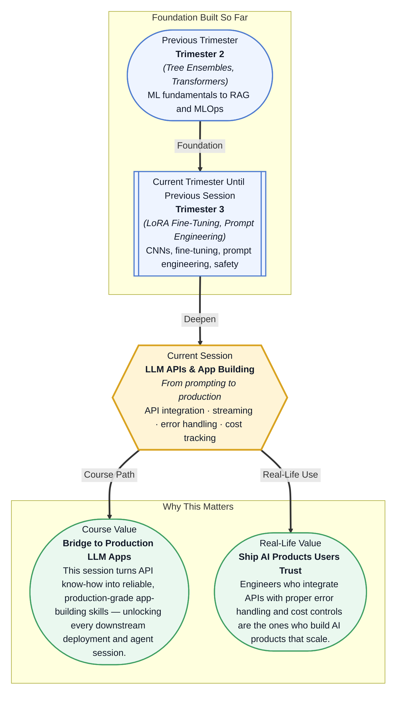

# Pre-read: LLM APIs & App Building

## Context of This Session in the Course

You are building a customer support chatbot for an e-commerce platform. You write a clean Python script that calls an LLM API, test it with a handful of sample queries, and it works beautifully. You deploy it. Within an hour, the first real user query arrives — and your script crashes with a 429 rate-limit error. You fix that, only to discover that streaming responses are cutting off mid-sentence. You patch that, and then your monthly bill arrives: five times what you budgeted.

The naive approach — call the API, get the response, move on — works perfectly in a Jupyter notebook but falls apart in production. Real-world LLM applications must handle unreliable networks, API pricing that scales with every token, users who expect instant streaming responses, and providers who each speak a slightly different protocol. The difference between a prototype and a product is not the model you choose; it is how robustly you integrate with it.

That is where **LLM API integration with production discipline** becomes essential. This session bridges the gap between crafting clever prompts and building robust, cost-aware applications that users can actually rely on.

---

**What if** you could build an AI-powered application — a document assistant, a code reviewer, or a multilingual translator — that not only works correctly but handles API failures gracefully, streams responses to users in real time, and never surprises you with an unexpected bill? What if your app could switch between OpenAI and Anthropic depending on the task, retry automatically when a request times out, and give you a real-time dashboard of every token spent?

Most developers stop at getting the first response from an API. The developers who build products that ship, scale, and stay within budget are the ones who treat API integration as a craft — with structured error handling, smart streaming, and cost visibility built in from the start. This session hands you that craft.

---

Every LLM provider exposes an API that accepts a list of messages and returns a response. But the way you structure those messages, the roles you assign, and the parameters you choose determine whether your app is merely functional or genuinely reliable. The **messages format** is the universal contract: each message has a `role` (system, user, assistant) and `content`. OpenAI and Anthropic both follow this pattern, but their parameter names and default behaviours differ in ways that matter.

Think of an LLM API like a kitchen appliance. The recipe (your prompt) goes in, and a dish (the response) comes out. But if you do not set the temperature correctly — the API parameters — your dish will be undercooked or burnt. **Temperature**, **top-p**, **max tokens**, and **stop sequences** are your dials and knobs. Learning them is not memorisation; it is learning to control the output quality.

Streaming is the difference between waiting for the entire meal to be cooked before it is served, and watching each ingredient come together on the plate in real time. When you stream, your application receives the response token by token, which means the user sees text appearing as it is generated — a dramatically better experience. But streaming also changes how you handle errors, how you count tokens, and how you accumulate the final output.

Error handling and cost tracking are what separate a hobby project from a production system. **Rate limits** are your API provider saying "slow down"; **retries with exponential backoff** are how you politely wait and try again. **Timeouts** prevent your app from hanging indefinitely. And **token counting** — estimating how many tokens a request will consume before you send it — is the foundation of cost control.

---

In the **previous session**, you explored **LLM Safety & Security**, learning how to identify prompt injection attacks, apply guardrails, and design responsible deployment practices. Those safety patterns protect your application at the content layer — ensuring that what users send and what the model returns is safe. But a safe prompt is useless if your API call fails, or if the cost spirals out of control as soon as you hit production traffic. This session takes the safety-conscious mindset you built and extends it to the operational layer: how to communicate with LLM APIs reliably, efficiently, and cost-effectively. Prompt engineering taught you *what* to say to the model; this session teaches you *how* to deliver that message in production.

---

In this pre-read, you will discover:

- How to **integrate** both OpenAI and Anthropic APIs using their respective message formats and key parameters
- How to **stream** LLM responses token by token for a real-time user experience
- How to **handle** API errors — rate limits, timeouts, retries — with robust production patterns
- How to **track** token usage and implement cost guardrails before they become a surprise

---

## OpenAI vs. Anthropic — Two APIs, One Mindset

Both OpenAI and Anthropic offer state-of-the-art language models through HTTP APIs that accept a list of messages and return a completion. The mental model is identical: you construct a conversation history, send it to the endpoint, and receive a response. But the details differ in ways that matter when you are writing production code.

OpenAI's Chat Completions API uses the `messages` array with `role` values of `system`, `user`, and `assistant`. The `system` message sets the behaviour of the assistant, and subsequent `user` and `assistant` messages represent the conversation history. Key parameters include `temperature` (creativity control), `max_tokens` (response length limit), and `top_p` (nucleus sampling). Anthropic's Messages API uses the same `messages` array structure but replaces `max_tokens` with `max_tokens_to_sample`, and uses `system` as a top-level parameter rather than a message role.

These differences are small in isolation, but they compound when you maintain a single codebase that needs to support both providers. A clean abstraction — a thin wrapper that translates your internal message format into each provider's expected shape — lets you switch between OpenAI and Anthropic based on task requirements, cost, or availability without rewriting your application logic. The mindset is not "which API should I learn?" but "how do I design my integration layer so the API provider is a configurable detail, not a hard-coded dependency?"

## Streaming, Error Handling, and Cost Tracking — The Production Triad

A non-streaming API call sends your prompt, waits for the entire response to be generated, and returns it as a single block. This is simple but slow: the user sees nothing until every token has been produced. Streaming changes the contract — your application receives each token as it is generated, via an event stream. The user sees text appear in real time, and your application can process partial output, display intermediate reasoning, or cancel generation if the early tokens are off track.

But streaming introduces complexity. You need to accumulate tokens into a complete response, handle the case where the stream disconnects mid-response, and still count tokens accurately for billing. The pattern is straightforward in both OpenAI (using `stream=True` and iterating over the response) and Anthropic (using the streaming API with event types like `content_block_delta`).

Error handling follows a similar philosophy across providers. **Rate limits** return HTTP 429 status codes. Your application should catch these, wait an exponentially increasing amount of time, and retry. **Timeouts** occur when the API does not respond within a reasonable window. Your application should set a client-side timeout and decide whether to retry or fail gracefully. The key insight is that errors are not exceptional — they are expected in production. Building retry logic with **exponential backoff** and **jitter** (randomised delay) is not optional; it is the minimum viable reliability pattern.

Cost tracking completes the triad. Every API call consumes tokens — input tokens (your prompt) and output tokens (the response). Both OpenAI and Anthropic return token counts in their responses. But the professional approach is to estimate costs *before* sending a request using a tokeniser, set **budget guardrails** that reject requests exceeding a threshold, and log every call's token usage to a monitoring system. Without this discipline, a single runaway loop in your application can burn through a month's budget in minutes.

## Where LLM APIs Appear in Real Life

The skills you build in this session — structured API integration, streaming, error handling, and cost tracking — are not academic exercises. They are the foundation of every production LLM application shipping today.

**Customer support automation** is the most visible use case. Companies like Klarna, Intercom, and Zendesk use LLM APIs to power chatbots that handle refund requests, order tracking, and policy questions. These systems must stream responses to keep users engaged, handle rate limits gracefully during traffic spikes, and track costs per conversation to justify ROI. A single percentage point improvement in error-handling reliability can save thousands of dollars in lost customer trust.

**AI-powered code assistants** — GitHub Copilot, Cursor, and Replit — all stream code completions token by token. They switch between providers based on task complexity, use budget guardrails to prevent runaway inference costs, and implement sophisticated retry logic so that a transient API failure does not interrupt a developer's flow. The difference between a delightful code assistant and a frustrating one often comes down to how well the streaming and error handling are implemented.

**Content generation platforms** like Jasper, Copy.ai, and Writesonic use LLM APIs to generate marketing copy, blog posts, and social media content at scale. These platforms process thousands of requests per minute, each with different token budgets. They use token counting to estimate costs before generation begins, set per-user budget limits, and log every call for billing reconciliation.

**Healthcare and legal document summarisation** tools use LLM APIs with strict cost tracking and audit logging. A single summarisation of a medical record might consume 10,000 tokens. Without budget guardrails, a batch processing job could accidentally cost more than the annual subscription fee. These applications also need robust retry logic because they operate in environments where network reliability is not guaranteed.

**Enterprise internal assistants** — HR chatbots, IT support bots, and knowledge base Q&A systems — are deployed behind corporate firewalls but still use cloud LLM APIs. They implement client-side timeouts to meet internal SLAs, use streaming to make the experience feel responsive, and track per-department token usage for chargeback reporting.

Across every industry, the pattern is the same: the companies that ship reliable, cost-effective LLM applications are not the ones with the best prompts. They are the ones who treat API integration as a first-class engineering discipline — with structured error handling, smart streaming, and cost visibility built into every call.

## What's Next

After this session, you will be able to:

- Integrate the OpenAI Chat Completions API using the messages format with system, user, and assistant roles
- Integrate the Anthropic Messages API and identify the key differences in parameter naming and structure
- Implement streaming responses with both providers to deliver real-time LLM output to users
- Handle rate limits, timeouts, and transient failures with exponential backoff retry logic
- Count tokens and estimate costs before making an API call using provider-specific tokenisers
- Set up budget guardrails that reject or queue requests exceeding a configurable cost threshold

You do not need to memorise every parameter and endpoint right now. The goal is to build the mental model of an LLM API call as a production operation — not just a notebook experiment: **when you own the integration, you own the reliability.**

---

## Interesting Questions for the Live Session

- When would you choose the Anthropic API over OpenAI for the same task — and when would choosing the wrong provider be a costly mistake?
- If a streaming response is interrupted mid-sentence, should your application display the partial output or wait and retry the entire request?
- Is it better to retry a rate-limited request immediately with exponential backoff, or should you build a queue that spreads requests evenly over time?
- If your cost-tracking system detects that a single user's queries are consuming 40% of your monthly budget, what options do you have beyond cutting them off entirely?

By the end of this session, LLM APIs should feel less like mysterious black boxes you send prompts to and more like practical, controllable building blocks: **when you understand the API contract, you own the integration.**
