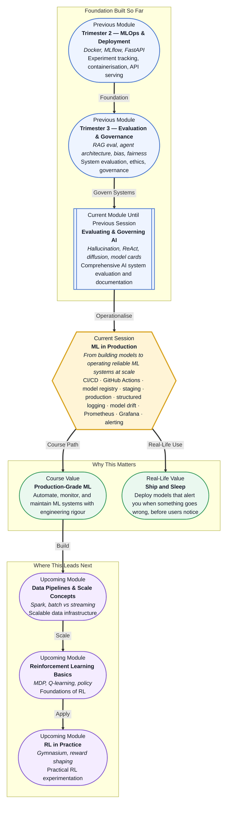

# Pre-read: ML in Production

## Context of This Session in the Course

You push a freshly trained model to production on a Friday evening, satisfied with its 94% accuracy on the test set. By Monday morning, your product manager is showing you screenshots of absurd predictions — the model that aced your validation split is now recommending winter coats to customers in a tropical city that never dropped below 30°C.

The model has not changed, but the world has. Customer behaviour shifted over the weekend because a competing brand launched a flash sale, and your carefully tuned classifier never saw that distribution shift during training. Accuracy metrics from last week mean nothing when the data your model serves on looks nothing like the data it trained on. Without visibility into what your model is actually doing in production, you are flying blind — and so is everyone relying on your predictions.

That is where **CI/CD for ML pipelines, structured logging, and end-to-end observability** become essential.

---

**What if** you could deploy a model knowing that the moment its predictions start drifting, you would receive an alert with the exact feature distributions that changed — before a single user complains? What if your pipeline automatically retrained on fresh data, ran a battery of validation tests, and promoted the new version to staging and then production, all while logging every decision in a structured format that your monitoring stack can analyse in real time? This session gives you the engineering toolkit to make that level of operational maturity a daily reality.

---

At its core, production ML operations are about shifting your mindset from "does this model work?" to "how do I keep this model working?" The answer involves three layers: automation, versioning, and observability. **CI/CD for ML** extends the familiar software engineering practice of continuous integration and delivery to the unique challenges of machine learning — where not just code changes, but data distributions and model behaviour, can break things silently. A model that passes every unit test can still fail in production because the data it encounters has drifted away from its training distribution.

Think of it like flying a modern aircraft. A pilot does not manually check every system before takeoff; automated pre-flight checks run continuously, and the cockpit dashboard surfaces only the alerts that need attention. In the same way, **model versioning** (tracking which model lives in staging versus production), **structured logging** (capturing predictions, feature values, and metadata in machine-readable format), and **alerting and observability** tools like **Prometheus** and **Grafana** turn ML operations from a manual firefight into an instrumented, manageable process.

In the **previous session** (Evaluating and Governing AI Systems), you examined how to assess model quality through retrieval evaluation, hallucination detection, bias and fairness metrics, and model governance. Those skills gave you the vocabulary and frameworks to evaluate an AI system's fitness at a point in time. This session completes the picture: it gives you the operational pipeline to continuously enforce that fitness over time, at scale, and with automated guardrails. The evaluation techniques you learned for detecting hallucination in RAG systems become the same signals you can wire into a monitoring dashboard; the model cards you learned to document become the metadata that a model registry tracks across versions.

---

In this pre-read, you will discover:

- How to **build** CI/CD pipelines for ML models using GitHub Actions, from automated testing to retraining triggers.
- How to **understand** model versioning with registries, staging, and production environments.
- How to **apply** structured logging best practices to capture what matters in production ML systems.
- How to **connect** model drift signals to alerting and observability using Prometheus and Grafana concepts.

---

## Why CI/CD for Machine Learning Is Different

A traditional software CI/CD pipeline compiles code, runs unit tests, and deploys the binary. For ML, the pipeline must also validate data, retrain models, and compare performance across versions. The challenge is that a model's behaviour depends not only on the code but on the data it trains on and the data it sees at inference time.

**GitHub Actions** provides a natural home for this workflow. You can define a pipeline that triggers on a schedule (every night, every week) or on events (new labelled data arrives, a model performance threshold drops). The pipeline runs integration tests against a held-out validation set, trains a candidate model, compares its metrics against the current production model, and — if the candidate passes — promotes it through a model registry from staging to production. Because models are code-dependent and data-dependent, the pipeline should fail fast: a schema validation check on incoming data catches format changes before they waste hours of training time.

## What to Log and How to Know Something Is Wrong

Most teams log far too little in production ML systems. A typical prediction endpoint logs the request and response, but not the feature values, the model version that served the prediction, the inference latency, or the confidence score. Without those fields, debugging a production incident becomes guesswork.

**Structured logging** solves this by emitting every prediction event as a JSON record with consistent fields: `model_version`, `prediction_id`, `features` (or a hash), `predicted_class`, `confidence`, `latency_ms`, and `timestamp`. When aggregated over time, these logs become the raw material for **observability**. A sudden drop in average confidence across predictions may indicate data drift. A spike in latency for a specific feature combination may point to a preprocessing bottleneck. A rise in predictions for a class that should be rare may signal concept drift.

**Prometheus** collects these metrics as time-series data, and **Grafana** visualises them on dashboards that surface exactly the signals that matter: prediction distribution over time, feature value histograms, model version transition points, and alert thresholds. The goal is not to build a pretty dashboard — it is to know, within minutes, whether your production model is still the model you think it is.

## Where ML in Production Appears in Real Life

Every organisation that deploys ML models to users eventually confronts the same operational reality: building a great model is only half the work, and keeping it great is the other half. In **e-commerce**, recommendation systems are retrained nightly to incorporate browsing and purchase signals from the past 24 hours; a CI/CD pipeline validates the new candidate against metrics like click-through rate and revenue per user before it reaches shoppers. In **financial services**, fraud detection models must be monitored for concept drift because fraud patterns evolve continuously — an alert on a sudden change in transaction value distributions can trigger an immediate retraining cycle before losses accumulate. In **healthcare**, diagnostic ML models require strict model versioning and staging protocols because a model that passes on retrospective data may degrade on newer patient cohorts; logging every prediction with the attending physician's feedback creates an audit trail that regulatory bodies require. In **ride-sharing and logistics**, pricing and ETA models are deployed across thousands of geographic zones; a model registry ensures that a rollback to a previous version happens in seconds, not hours, when a city-specific model starts producing anomalous ETAs. In each case, the tools differ but the pattern is the same: automate deployment, log everything, monitor relentlessly, and alert before users notice.

---

## What's Next

After this session, you will be able to:

- Design a CI/CD pipeline that validates, packages, and deploys ML models through staging into production using GitHub Actions.
- Configure model versioning and registry workflows to track which model is serving where, with rollback capability.
- Write structured logs that capture predictions, feature values, confidence scores, and model metadata for production debugging.
- Recognise common drift patterns — data drift, concept drift, and prediction drift — and identify which metrics to alert on.
- Interpret basic Prometheus metrics and Grafana dashboards to monitor model health in real time.
- Identify the right observability strategy for different production deployment scales, from a single model endpoint to multi-model systems.

You do not need to master every tool in this pipeline by the end of one session. The goal is to build the mental model: **production ML is not about building great models — it is about operating them with confidence.**

---

## Interesting Questions for the Live Session

- When a model's accuracy drops in production, how do you distinguish between data drift, concept drift, and a broken data pipeline — and which one should you alert on first?
- If you could only log three fields per prediction request beyond the default request and response, what would they be and why?
- How does promoting a model from staging to production differ semantically from simply copying a file between folders — what guarantees should that promotion carry?
- What happens when your CI/CD pipeline passes all tests but the deployed model still fails in production — what are the gaps that automated testing alone cannot catch?

By the end of this session, ML operations should feel less like a firefighting exercise and more like a well-instrumented control room: **automate the pipeline, monitor the behaviour, and sleep through the night.**
