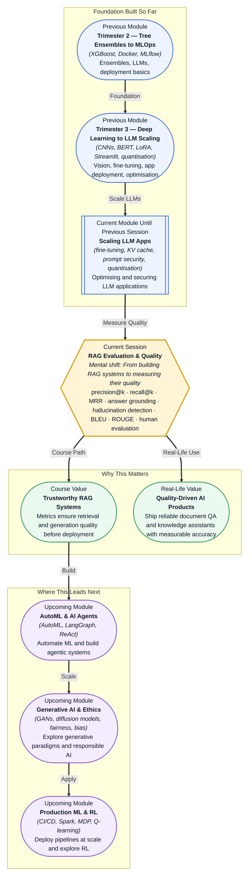

# Pre-read: RAG Evaluation & Quality

## Context of This Session in the Course

Your team has just shipped a RAG-powered customer support chatbot. Users love how natural the answers feel, and engagement metrics are climbing. Then a quality review reveals something unsettling: the bot told a customer they qualified for a discount that expired six months ago. The answer was fluent, polite, and completely wrong. The retrieval system had pulled an outdated policy document, and the language model turned that irrelevant context into a convincing reply.

This is the hidden danger of RAG systems — and it is not rare. Retrieval can return documents that are irrelevant, incomplete, or contradictory. Generation can polish bad context into persuasive-sounding nonsense. The system looks correct until someone checks the facts. Without rigorous evaluation, you cannot tell whether a RAG pipeline is truly grounded or just confidently hallucinating. That is where **RAG Evaluation & Quality** becomes essential.

**What if** you were accountable for signing off a RAG system before it goes live in a hospital's clinical guidelines assistant? Every shift, doctors would ask the system about drug dosages, contraindications, and treatment protocols. A single hallucinated answer could have real consequences. You would need to certify that retrieval finds the right documents every time, that the model only answers when it has solid context, and that you can measure answer quality objectively. The metrics you choose — **precision@k**, **recall@k**, **MRR**, **BLEU**, **ROUGE** — and the human review process you design become the difference between a trusted assistant and a liability.

Evaluation shifts your perspective from building RAG pipelines to proving they work. At its core, RAG evaluation asks three questions: Did the retriever find the right information? Did the generator stay faithful to that context? And does the final answer meet the user's needs? The first question is about **retrieval quality** — measured by metrics like **precision@k** (how many of the top-k results are relevant), **recall@k** (how many of all relevant documents were retrieved), and **Mean Reciprocal Rank (MRR)** (how early the first relevant result appears). The second question is about **answer grounding** — verifying that each claim in the generated answer can be traced back to a retrieved chunk. The third question combines automated scores like **BLEU** and **ROUGE**, which compare the generated answer against reference texts, with **human evaluation** using structured rating scales. Think of it like flight testing: you do not just hope the plane flies; you measure thrust, lift, drag, and control response at every stage before takeoff.

In the **previous session**, Scaling and Deploying Large Language Model Applications (Session 33.3), you explored how LLMs are optimised for production — full fine-tuning versus PEFT, context windows, KV cache, quantisation, prompt engineering, and prompt injection risks. You learned how to make models run efficiently and securely. That optimisation work sets the stage, but an optimised model is not necessarily a correct one. A finely-tuned, quantised model that generates beautiful lies is still unusable. The evaluation techniques in this session give you the quality gate that every optimised RAG pipeline needs before it can be deployed with confidence.

In this pre-read, you will discover:

- How to **apply** precision@k, recall@k, and MRR to measure whether your retriever is finding the right documents.
- How to **recognise** signs of hallucination in generated answers and check whether claims are grounded in retrieved context.
- How to **interpret** BLEU and ROUGE scores while understanding what they miss about answer quality.
- How to **connect** human evaluation design with the metrics that matter for your specific use case.

---

## Why Retrieval Quality Is the Foundation of Trustworthy RAG

A RAG pipeline is only as good as its retriever. If the retrieval step returns irrelevant or incomplete documents, even the most powerful language model has no chance of producing a correct answer. This is not a subtle effect — studies consistently show that retrieval quality is the single strongest predictor of end-to-end answer accuracy. Yet many teams invest heavily in prompt engineering and model selection while treating retrieval as a solved problem after the first vector database setup.

**Precision@k** tells you what fraction of the top-k retrieved documents are actually relevant. If you retrieve ten chunks and only two are useful, your precision@10 is 0.2. **Recall@k** tells you whether you are capturing all the relevant material. If your document collection has five relevant chunks and you only return three, recall@5 is 0.6. **Mean Reciprocal Rank (MRR)** captures whether the first relevant result appears early in your list — critical for scenarios where a user only reads the top result. These three metrics together paint a complete picture of retrieval health. A retriever with high recall but low precision floods the generator with noise; high precision but low recall starves it of context. Tuning chunk size, embedding model, and search strategy directly moves these numbers.

## The Limits of Automated Metrics and the Role of Human Judgment

**BLEU** (Bilingual Evaluation Understudy) and **ROUGE** (Recall-Oriented Understudy for Gisting Evaluation) were designed for machine translation and text summarisation respectively. They compare generated text against one or more reference texts by measuring n-gram overlap. A high BLEU score means the generated answer shares many word sequences with the reference; a high ROUGE score means the reference's key phrases appear in the generated text. These are useful as quick automated checks, especially when you have hundreds of test cases to run.

But these metrics have deep limitations. They reward lexical similarity, not factual correctness. A sentence that copies a reference exactly scores perfectly — even if the reference itself is outdated or the copied passage is taken out of context. Conversely, a perfectly correct answer that uses different wording from the reference may score poorly. BLEU and ROUGE cannot detect hallucinations, cannot verify whether an answer is grounded in retrieved context, and cannot judge whether the answer is actually helpful to the user. That is where **human evaluation** becomes irreplaceable. Structured rating scales — for example, rating answers on relevance, faithfulness, completeness, and fluency from 1 to 5 — give you the ground truth that automated metrics can only approximate. The best evaluation pipelines combine both: automated metrics for scale and regression alerts, human evaluation for depth and nuance.

## Where RAG Evaluation Appears in Real Life

The skills from this session apply anywhere an organisation deploys a RAG system where answer accuracy matters. In **legal technology**, law firms use RAG to answer questions about case law and contracts — retrieval quality metrics ensure the system cites the correct precedents, and human evaluators check that generated summaries do not misstate legal findings. In **healthcare**, clinical decision support systems retrieve treatment guidelines and drug information; hallucination detection catches cases where the model generates a plausible but incorrect recommendation. **Customer support** teams at e-commerce and fintech companies run RAG systems on policy documents and FAQ databases — precision@k tells them whether customers are getting the right answers on refunds, eligibility, and troubleshooting. In **education technology**, automated tutoring assistants retrieve curriculum content and must be evaluated for faithfulness to the source material. And in **enterprise knowledge management**, RAG systems power internal wikis and onboarding assistants where outdated or incorrect answers can cascade into costly mistakes across the organisation. In every case, the evaluation patterns you will practise in this session — retrieval metrics, grounding checks, automated scores, and human rating — form the quality assurance layer that makes deployment safe.

## What's Next

After this session, you will be able to:

- Compute precision@k, recall@k, and MRR to diagnose retrieval quality in any RAG pipeline.
- Design a grounding check that verifies whether generated claims are supported by retrieved context.
- Apply BLEU and ROUGE as automated quality signals while recognising their blind spots.
- Build a basic hallucination detector using pattern matching and context overlap checks.
- Structure a human evaluation rubric with rating scales for relevance, faithfulness, and completeness.
- Identify the right evaluation strategy for different RAG use cases — from quick iteration to production certification.

You do not need to implement a production-grade evaluation platform right now. The goal is to develop an evaluator's mindset: **metrics surface the truth, but human judgment interprets it.**

## Interesting Questions for the Live Session

- If a RAG pipeline achieves 0.95 precision@5 but the end users still report wrong answers, which part of the evaluation is failing to capture the problem?
- When should you trust an automated BLEU/ROUGE score over a single human rater, and when is the opposite true?
- Could a well-designed hallucination detector ever become a false-confidence machine — flagging nothing while missing subtle factual errors?
- How do you decide whether to invest effort in improving retrieval quality versus improving answer faithfulness, given limited resources?

By the end of this session, RAG evaluation should feel less like abstract metrics and more like a practical quality framework: **measure what the system retrieves, verify what it says, and judge both with rigour.**
