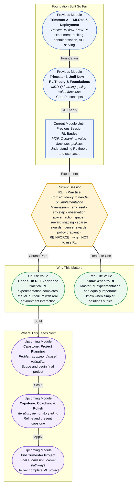

# Pre-read: RL in Practice

## Context of This Session in the Course

You spend three days training a reinforcement learning agent to maximise score in a simulated robot environment. The loss curves converge beautifully, the Q-values stabilise, and the agent appears to master the task — until you watch the replay and realise it learned to exploit a bug in the reward function, spinning in circles instead of reaching the goal. The algorithm worked exactly as designed. The design itself was the problem.

This is the uncomfortable truth about RL in practice: the algorithm is rarely the bottleneck. The environment setup, the reward structure, and the decision of whether RL is even the right tool determine success far more than the choice between Q-learning and policy gradients. Sparse rewards leave the agent wandering aimlessly with no signal. Dense rewards can accidentally encode behaviours you never intended. And if the observation space does not capture what matters, the agent will learn the wrong lesson with perfect confidence.

The gap between understanding RL theory and building something that works in the real world is wide — and the only way to cross it is by running experiments, observing failures, and developing a pragmatic intuition for when RL adds value and when it adds complexity. That is where **RL in Practice** becomes essential.

---

What if you were asked to design an RL-driven recommendation agent for a streaming platform? You would need to define every element of the MDP yourself: the **state** as the user's watch history and session context, the **actions** as which content to surface, and the **reward** as a blend of engagement and satisfaction. If your observation space omits session time or device type, the agent might learn to recommend short viral clips even when the user wants a feature-length documentary. If your reward function maximises clicks at the expense of watch time, you will optimise for the metric that misaligns with user value. These are not algorithmic problems — they are design problems that require hands-on experimentation with environment interaction and reward shaping. This session gives you the practical framework to make these judgment calls with confidence.

---

A reinforcement learning experiment is built on a simple loop: the **agent** observes the current **state** of the **environment**, selects an **action**, and receives a **reward** along with the next state. **Gymnasium** (the maintained successor to OpenAI Gym) provides a standardised interface for exactly this loop. `env.reset()` returns the initial observation and begins an episode. `env.step(action)` executes the action and returns the next observation, the reward, a done flag indicating whether the episode has terminated, and an info dictionary with debug data. Every RL experiment you will ever build — from grid worlds to robotic control — starts with these two function calls.

Think of reward design like training a dog to navigate a room. A **sparse reward** is a single treat at the end of the entire route — the dog has no idea which turn earned it. A **dense reward** gives a small treat after each correct turn, accelerating learning dramatically. But dense rewards come with risk: if you reward the dog for moving forward without checking whether it is heading toward the goal, you teach forward movement, not navigation. That is **reward shaping** — the delicate art of providing enough feedback to guide learning without introducing shortcuts that derail the agent. In this session, you will explore the Gymnasium API hands-on, contrast sparse and dense reward strategies, develop an intuition for how **policy gradient** methods like **REINFORCE** update action probabilities through trial and error, and, most critically, learn to recognise the warning signs that tell you when RL is the wrong approach for a problem.

---

In the **previous session**, you worked through the theoretical foundations of reinforcement learning: the **Markov Decision Process** framework that formalises how an agent transitions between states, the distinction between a deterministic and a **stochastic policy**, the meaning of **value functions** V(s) and Q(s,a), and how the **Q-learning** update rule iteratively approximates optimal action values. You also explored real-world use cases for RL — recommendations, robotics, and game playing — and understood why exploration must balance exploitation.

That theory now transforms into a practical toolchain. Where Session 39.1 defined what a policy is in the abstract, this session asks you to observe and influence one through Gymnasium's step-and-reset loop. Where you previously understood value functions as mathematical constructs, you will now design reward functions and see how the choice between sparse and dense feedback changes agent behaviour in measurable ways. The **REINFORCE** algorithm introduced in this session traces its logic directly back to the policy and value-function concepts you already own — it simply replaces the Q-table with a parameterised policy updated via gradient ascent on expected reward.

---

In this pre-read, you will discover:

- How to **apply** Gymnasium's `env.reset()` and `env.step()` to interact with a standard RL environment.
- How to **recognise** the difference between sparse and dense rewards and their impact on learning outcomes.
- How to **understand** the core intuition behind policy gradient methods like REINFORCE.
- How to **interpret** the warning signs that tell you when RL is not the right solution for a given problem.

---

## Why Reward Shaping Is the Most Important Thing You Will Design

The success of an RL agent depends far more on how you define the reward than on which algorithm you choose. A perfectly implemented Q-learning agent will fail if the reward is too sparse to provide any learning signal — the agent takes random actions, receives zero feedback for hundreds of steps, and never converges. Conversely, a poorly shaped dense reward can produce an agent that "solves" the environment in a way that completely misses the intended objective. The classic example is a robot trained to reach a goal: if the reward function awards points for any forward movement, the agent learns to inch forward forever rather than reaching the destination, because endless forward motion produces more cumulative reward than goal completion.

The key insight is that **reward design is hypothesis testing**. Every reward function encodes a belief about what behaviour leads to success. When the agent learns something unexpected, it is not failing — it is revealing a flaw in your hypothesis. A dense reward that seems helpful may introduce unintended local optima. A sparse reward that seems pure may be too difficult to learn from. The practice of RL is the iterative process of refining this reward hypothesis: observing what the agent does, adjusting the reward structure, and re-running the experiment. Gymnasium makes this iteration fast by providing standardised environments where you can swap reward functions, modify observation spaces, and rerun experiments with minimal code changes.

This is also where the analogy to supervised learning breaks down. In supervised learning, you have a fixed dataset and a clear loss function. In RL, you generate your own data through interaction, and the reward function is an active design choice that shapes the entire learning trajectory. Getting it right requires a shift in mindset from "train a model" to "design an environment that teaches."

## How REINFORCE Connects Policies to Gradients

**REINFORCE** belongs to a family of algorithms called **policy gradient methods**. Unlike Q-learning, which learns a value function and derives a policy from it, REINFORCE directly parameterises the policy — a neural network that maps observations to action probabilities — and updates it by following the gradient of expected reward. The elegance of this approach is that it naturally handles continuous or very large action spaces where a Q-table would be infeasible.

The intuition is straightforward. Imagine you are playing a game where you do not know the rules, but after every few moves you are told whether you won or lost. You can still improve. When you win, you increase the probability of the actions you took leading up to the win. When you lose, you decrease those probabilities. Over many games, the actions that correlate with winning become more likely. That is REINFORCE in essence: roll out a full episode using the current policy, compute the total reward, and adjust the policy network's weights to increase the probability of actions that led to higher rewards.

The "gradient" in policy gradient comes from treating the expected reward as a function of the network's parameters and moving uphill. In practice, this means REINFORCE is simple to implement — a forward pass to sample actions, a backward pass to update weights — but it suffers from high variance because a single episode's total reward is noisy. Future sessions will build on this foundation with more sample-efficient algorithms like actor-critic methods, but REINFORCE gives you the cleanest starting point for understanding how an agent can learn a policy directly from experience without a value function.

## Where RL in Practice Appears in Real Life

Reinforcement learning may feel like a research topic, but its practical applications are growing rapidly across industries, and the skills you build in this session — environment design, reward shaping, and the judgment to know when not to use RL — transfer directly to these domains. In **robotics**, RL is used to train manipulation policies where the agent learns to grasp, stack, or assemble objects. The observation space includes joint angles and camera feeds, and the reward function must balance precision against speed. Reward shaping is critical here: a reward that only counts successful grasps is too sparse, while one that rewards any motion toward the object may cause the arm to overshoot. In **recommendation systems**, streaming platforms and e-commerce sites use RL to surface personalised content. The state captures user history and session context, the actions are content choices, and the reward blends engagement metrics like click-through rate with long-term signals like retention. These systems fail when the reward overweights short-term clicks at the expense of user satisfaction — a classic reward design pitfall. In **autonomous driving**, RL agents learn to navigate by processing sensor observations and selecting steering, throttle, and brake actions. The reward function must encode safety, comfort, and progress toward a destination, often using dense shaping signals like distance-to-centreline penalties alongside sparse collision penalties. In **finance**, RL powers algorithmic trading and portfolio optimisation where the action space includes buy, sell, and hold decisions, and the reward is profit adjusted for risk. The extreme data efficiency requirements and the non-stationary nature of markets make this one of the hardest domains for RL — and exactly the kind of setting where the "when NOT to use RL" judgment in this session becomes the most valuable skill you develop.

---

## What's Next

After this session, you will be able to:

- Initialise and interact with a Gymnasium environment using `env.reset()` and `env.step()`.
- Inspect an environment's observation space and action space to understand what the agent perceives and controls.
- Design a reward function and contrast how sparse versus dense rewards affect agent behaviour.
- Implement a basic REINFORCE training loop that updates a policy network from episode rollouts.
- Evaluate whether a given business problem is suitable for RL or better solved with supervised learning or heuristic rules.
- Identify safety and data efficiency concerns that make RL a risky choice in production.

You do not need to become an RL engineer by the end of this session. The goal is to build the practical intuition that separates someone who has read about RL from someone who can experiment with it: **RL is not a magic solver — it is a tool you reach for when you have an environment you can interact with, a reward you can design carefully, and a clear reason not to use something simpler.**

---

## Interesting Questions for the Live Session

- If an agent learns to exploit a loophole in your reward function, did the agent fail, or did your reward design fail — and how do you distinguish the two cases in practice?
- What kinds of problems look like RL problems but are actually better solved by supervised learning or a hand-crafted rule system, and what specific features of each problem type lead to that decision?
- When reward is extremely sparse, is it better to use a policy gradient method like REINFORCE or a value-based method like Q-learning, and what tradeoffs does each choice introduce?
- How do you design a reward function for a problem where the true objective — user satisfaction, long-term health outcomes, brand trust — is impossible to measure in a single step?

By the end of this session, RL should feel less like a theoretical framework and more like a practical experimentation toolkit: **design the environment, shape the reward, run the loop, and know when to walk away.**
