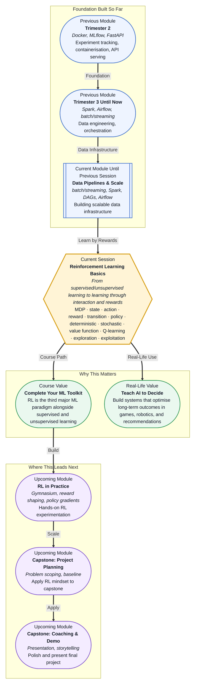

# Pre-read: Reinforcement Learning Basics

## Context of This Session in the Course

You hand a robot a coffee cup and ask it to place the cup on a table. The robot has no manual, no teacher showing it the exact arm trajectory, and no labelled dataset of successful cup-placing movements. It only has one thing: a signal that says "good" when the cup lands safely and "bad" when it falls. On the first try, the arm jerks wildly and the cup drops. On the hundredth try, the arm moves more smoothly. By the thousandth, it executes a near-perfect motion every time.

This kind of learning feels different from everything you have seen so far in this course. Every ML technique you have used until now — whether supervised learning with labelled data, unsupervised learning with clusters, or transformer-based language models — relied on a fixed dataset. The model learned patterns from data that was already collected. But for a robot, a game-playing agent, or a recommendation system, the data does not exist in advance. It is generated by the act of making decisions and observing their consequences.

The tension is real: how do you learn from experience when every decision changes the next piece of data you receive? How do you balance trying new actions versus sticking with what already works? That is where **Reinforcement Learning Basics** becomes essential.

---

**What if** you were asked to build an AI that learns to play a new board game — one with unfamiliar rules — purely by playing against itself? You cannot hardcode strategies because you do not know the rules well enough yourself. You cannot use supervised learning because there are no expert game records. All you can do is let the AI make moves, observe whether it wins or loses, and improve over thousands of self-played games. This is exactly the kind of problem reinforcement learning solves. By the end of this session, you will understand the core framework — the **Markov Decision Process** — that makes this kind of learning possible, and you will be able to recognise when RL is the right tool for a problem.

---

At the heart of reinforcement learning is the **Markov Decision Process**, often called an **MDP**. An MDP is a mathematical framework for describing a world in which an **agent** interacts with an **environment** over time. At every step, the agent observes a **state**, chooses an **action**, receives a **reward**, and transitions to a new state. This cycle — state, action, reward, next state — repeats until a terminal condition is reached. Everything in RL, from game-playing AIs to robotic control systems, is built on this cycle.

Think of it like training a dog. The dog is the agent. The room is the environment. When the dog sits on command (action), it gets a treat (reward). The dog learns that sitting leads to a positive outcome. Over time, the dog learns a **policy** — a strategy for deciding which action to take in each situation. A **deterministic policy** always picks the same action in a given state. A **stochastic policy** introduces randomness, which is surprisingly useful for exploration.

During this session, you will explore not just the MDP framework but also how agents evaluate their decisions through **value functions** — **V(s)** estimates how good a state is, while **Q(s,a)** estimates how good an action is in a given state. You will encounter the **Q-learning** update rule, a simple but powerful mechanism for improving decisions over time. And you will see how RL has moved from research labs into practical systems for recommendations, robotics, and game playing.

---

In the **previous session**, you explored data pipelines at scale — how batch and streaming architectures, powered by tools like Spark and Airflow, move and transform data reliably through a production ML system. You worked through the concepts of RDDs, DataFrames, schema validation, and DAG-based orchestration, building a mental model of how data flows from raw sources to model-ready inputs.

Now, that infrastructure mindset becomes the foundation for a deeper shift: moving from passive data processing to active decision-making. Reinforcement learning operates on the same principle of feedback loops — data flows from environment to agent, actions flow from agent to environment — but the agent does not just transform data; it learns a strategy for maximising cumulative reward. The pipeline concepts you learned — reliable data flow, validation, orchestration — will serve you as you think about how RL agents interact with their environments in a structured, repeatable way.

---

In this pre-read, you will discover:

- How to **understand** the Markov Decision Process as the foundational framework for all reinforcement learning problems.
- How to **recognise** the difference between deterministic and stochastic policies and why randomness helps agents explore.
- How to **interpret** value functions V(s) and Q(s,a) as measures of long-term decision quality.
- How to **identify** real-world RL use cases in recommendations, robotics, and game playing.

---

## Why the MDP Framework Is the Language of Decision-Making

Every decision you make — from choosing a route to work to selecting a dish at a restaurant — follows an implicit pattern. You are in a state (it is 8 AM, you are at home), you take an action (take the highway), you observe an outcome (traffic is heavy), and you receive a signal (you arrive late). The **Markov Decision Process** formalises this intuition into a precise mathematical structure: a tuple of states, actions, transition probabilities, and rewards.

An MDP assumes the **Markov property**: the future depends only on the current state, not on the full history of how you got there. This assumption is surprisingly powerful. It lets an agent treat each decision as an independent choice based on the present moment, making the problem computationally tractable. In practice, the current state encodes enough information — your GPS location, the time, the traffic conditions — to make good decisions without replaying the entire morning.

Understanding the MDP lens is crucial because it changes how you think about ML problems. Instead of asking "what patterns exist in this data?", you begin to ask "what sequence of actions leads to the best cumulative outcome?" This shift — from pattern recognition to sequential decision-making — is what distinguishes RL from every other paradigm you have studied so far.

## How Q-Learning Connects Actions to Long-Term Rewards

If an agent only maximised the immediate reward at every step, it would behave myopically — grabbing the closest treat without considering that waiting might lead to a bigger reward later. This is where **Q-learning** enters the picture. Q-learning learns a function **Q(s,a)** that estimates the total future reward an agent can expect if it takes action **a** in state **s** and then follows the optimal policy thereafter.

The beauty of Q-learning is its update rule: after taking action **a** in state **s**, observing reward **r** and new state **s'**, the agent updates its estimate of Q(s,a) towards the observed reward plus the best possible future value from s'. Over many iterations, this bootstrapping process converges to the true optimal Q-values. The agent does not need a model of the environment to do this — it learns purely from experience, which is why Q-learning is called a **model-free** algorithm.

Notice the tension built into this process: the agent must **explore** actions it has not tried before to discover their value, but it must also **exploit** actions it already knows are good. This **exploration vs exploitation tradeoff** is one of the most fundamental challenges in RL. Too much exploration and the agent wastes time on bad actions. Too little and it never discovers better strategies. Techniques like epsilon-greedy — taking a random action with small probability epsilon — strike a practical balance.

## Where Reinforcement Learning Appears in Real Life

Reinforcement learning is not just a theoretical framework — it powers some of the most impactful AI systems in production today. In **recommendation systems**, platforms like YouTube, Netflix, and Spotify frame content recommendation as an RL problem: the state is the user's history and current context, the action is which item to show next, and the reward is user engagement measured through clicks, watch time, and likes. The system learns to optimise not just the immediate click but long-term user satisfaction across an entire session.

In **robotics**, RL enables machines to learn complex manipulation tasks — picking, placing, assembling — through trial and error in simulation before transferring the learned policy to a physical robot. Companies like Google, Tesla, and Boston Dynamics use RL to train locomotion policies that allow robots to walk, climb, and navigate uneven terrain. The same framework applies to **autonomous driving**, where the agent learns to make safe driving decisions from state representations of the road, traffic, and vehicle dynamics.

In **game playing**, RL achieved its most famous breakthroughs: DeepMind's AlphaGo defeated the world champion in Go, and OpenAI's Dota 2 bots surpassed professional esports players. These results demonstrated that RL can discover strategies humans never considered. Beyond games, RL is used in **healthcare** for treatment policy optimisation — deciding which drug regimen to apply given a patient's current health state — and in **finance** for portfolio management, where the action is an asset allocation decision and the reward is portfolio return adjusted for risk.

---

## What's Next

After this session, you will be able to:

- Define the four components of a Markov Decision Process: state, action, reward, and transition.
- Contrast deterministic and stochastic policies and explain when randomness benefits learning.
- Explain the intuition behind value functions V(s) and Q(s,a) without writing code.
- Describe the Q-learning update rule and how it propagates future rewards back to earlier decisions.
- Identify three real-world domains where RL is actively applied today.
- Recognise when a problem is suitable for RL versus supervised or unsupervised approaches.

You do not need to code an RL agent from scratch right now. The goal is to see that the most powerful decisions emerge not from memorised patterns, but from learning through consequences: **every action is a bet on the future, and every reward sharpens the next bet.**

---

## Interesting Questions for the Live Session

- How would you design the reward function for a self-driving car, and what happens if you accidentally reward dangerous behaviour?
- If an RL agent learns only from rewards, how can it ever discover an action that has a short-term cost but a large long-term benefit?
- In what ways does the exploration vs exploitation tradeoff appear in your daily decision-making as a professional, even outside of AI?
- What happens to Q-learning when the state space is too large to visit every state — for example, all possible positions on a Go board?

By the end of this session, reinforcement learning should feel less like a mysterious black box and more like a practical framework for sequential decision-making: **learn from interaction, improve from rewards, and optimise for the long run.**
