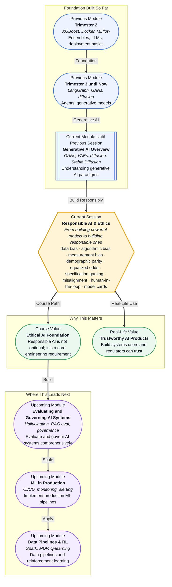

# Pre-read: Responsible AI & Ethics

## Context of This Session in the Course

You have just deployed a resume-screening model that your team spent weeks fine-tuning. It processes hundreds of applications per minute, flags the top candidates, and your hiring managers are thrilled. A month later, a routine audit reveals something troubling: candidates from specific demographic groups were consistently rated lower, even when their qualifications were comparable. The model was not explicitly told to discriminate, yet it learned patterns from historical hiring data that reflected past biases.

The natural reaction is to check the training code, inspect the data sources, and scrutinise the model architecture. But the problem is not a bug in the traditional sense. The data itself carried hidden signals — zip codes that correlated with race, university names tied to socioeconomic status, gap years that the model interpreted as lack of commitment. No amount of hyperparameter tuning or architecture tweaking can fix a bias embedded in the training distribution. This is the core tension of modern AI development: a model can be technically accurate and socially harmful at the same time.

That is where **Responsible AI and Ethics** becomes essential.

**What if** you are leading the AI team at a fintech startup, and your credit-scoring model is denying loans at a much higher rate for one customer segment than another? Regulators are asking questions, users are complaining on social media, and your CEO wants answers. You need to determine whether the disparity stems from legitimate financial risk factors or from biased patterns in the training data — and then document your reasoning in a way that satisfies auditors and builds public trust.

After this session, you will have the vocabulary, the analytical framework, and the practical techniques to dissect such a situation. You will know how to identify where bias can enter an ML pipeline, what fairness metrics can and cannot tell you, and when to insist on human review instead of relying on automated decisions.

At its heart, responsible AI is about recognising that **bias** is not a moral failing of the algorithm — it is a structural property of the data and the decisions made during model development. **Data bias** occurs when the training set does not represent the real-world population the model will serve. **Algorithmic bias** arises when the model's design or objective function inadvertently favours certain groups. **Measurement bias** happens when the labels or features used to train the model are themselves unreliable or systematically skewed. Together, these forms of bias can produce outcomes that are statistically accurate for the majority while systematically harming minority groups.

Think of a fitness tracker that claims to measure calories burned accurately. If the underlying algorithm was calibrated primarily on data from young male athletes, it may be less accurate for women, older adults, or people with different body compositions. The algorithm is not malicious, but it is biased because the training data did not reflect the full diversity of its users. In the same way, an AI model trained on biased data will produce biased results — not out of intent, but out of omission. This session introduces **fairness metrics** like **demographic parity** (does the outcome rate match across groups?) and **equalized odds** (does the model perform equally well for all groups?) to help you measure and communicate these disparities.

Beyond bias, you will explore **AI safety basics** — including **specification gaming** (where a model finds a loophole to satisfy a poorly specified goal) and **misalignment risks** (where the model's learned behaviour diverges from what the developer actually intended). You will learn how **human-in-the-loop** design acts as a safety net by requiring human review for high-stakes decisions, and how **model cards** provide a standardised way to document a model's intended use, limitations, and evaluation results so that downstream users can make informed choices.

In the **previous session**, you surveyed the major generative AI paradigms — GANs, VAEs, and diffusion models — and saw how these architectures can create novel content from text conditioning and latent-space sampling. That session focused on what generative models can do: their capability, their output quality, and their creative potential. This session asks the complementary question: now that you can build these powerful models, how do you build them responsibly?

The skills from session 37.1 — understanding model architecture choices, training dynamics, and output modalities — become the foundation for identifying where bias and safety risks enter the pipeline. A diffusion model trained on internet images inherits whatever biases exist in that data. A GAN that generates photorealistic faces may amplify or perpetuate stereotypes present in its training set. The generative AI knowledge you just gained gives you the technical lens to see where responsibility gaps emerge, and this session gives you the framework to address them.

In this pre-read, you will discover:

- How to **recognise** the three major sources of bias in ML pipelines — data, algorithmic, and measurement bias — and distinguish them from one another.
- How to **apply** fairness metrics like demographic parity and equalized odds to evaluate whether a model treats different groups equitably.
- How to **identify** specification gaming and misalignment risks before they cause harm in production systems.
- How to **build** a mental model for human-in-the-loop design and know when automated decisions should require human oversight.

---

## Why Bias Is Not a Bug — It Is a Property of the System

When developers first encounter biased model outputs, the instinct is to search for a code defect. Perhaps the preprocessing pipeline dropped a critical column, or the training script had a data-leakage bug. But in many cases, the code is correct and the model is optimising exactly what it was told to optimise. The problem is that the objective function — minimise prediction error — does not include a term for fairness. The model does not know it should treat groups equally; it only knows it should minimise loss on the training distribution.

Consider a model trained to predict which job applicants are likely to succeed in a role. If the historical data shows that successful employees in the past were predominantly from a certain demographic, the model will learn that demographic membership is a useful predictor. It does not know that this correlation is a social artifact rather than a causal signal. This is **data bias** in action: the training distribution is not a neutral representation of reality but a snapshot of a world that already contains inequities. The model simply amplifies what it sees.

The same dynamic appears in **algorithmic bias**, where the choice of features, the model architecture, or even the evaluation metric itself can systematically disadvantage certain groups. For example, using a proxy like "zip code" or "years of experience" can encode socioeconomic disparities that correlate with protected attributes. And **measurement bias** compounds the problem when the ground-truth labels themselves are unreliable — for instance, when performance reviews used as training labels reflect subjective managerial biases rather than objective productivity. By the end of this deep-dive, you should see bias not as a bug you fix with a patch, but as a system-level property you must continuously monitor and mitigate.

## Fairness Metrics: What They Measure and What They Miss

Fairness is not a single number, and there is no universal metric that tells you whether a model is fair. Instead, fairness metrics are diagnostic tools that reveal different kinds of disparity. **Demographic parity** asks a simple question: is the rate of positive outcomes roughly equal across demographic groups? If your loan approval model approves 80% of applicants from Group A but only 40% from Group B, you have a demographic parity violation regardless of whether individual decisions seem justified.

**Equalized odds** goes deeper. It asks whether the model's error rates — false positives and false negatives — are similar across groups. A model might approve loans at the same rate for two groups (satisfying demographic parity) but systematically make more false-positive errors (approving bad loans) for one group and more false-negative errors (denying good loans) for the other. Equalized odds captures this asymmetry and reveals a fairness problem that demographic parity misses entirely.

The crucial insight is that no single metric tells the full story. Choosing which fairness metric to use is itself an ethical decision that depends on the application context and the harms you are trying to prevent. In criminal risk assessment, a false positive (labelling someone as high risk when they are not) carries vastly different consequences than a false negative. In medical diagnosis, the reverse may be true. Fairness metrics give you a language to articulate these tradeoffs, but they do not make the tradeoff disappear — that is why human judgement remains irreplaceable.

## Where Responsible AI Appears in Real Life

Responsible AI is not a theoretical exercise reserved for ethics committees. It is already shaping how organisations design, deploy, and govern AI systems across every major industry. In **hiring and HR analytics**, companies are adopting bias audits to ensure that resume screening, skill assessments, and performance prediction models do not systematically disadvantage candidates based on gender, race, or age. Regulators in several jurisdictions now require employers to conduct fairness testing before deploying AI-driven hiring tools.

In **financial services**, credit scoring models, fraud detection systems, and insurance underwriting algorithms are under increasing scrutiny from central banks and consumer protection agencies. A model that denies loans at disproportionate rates can trigger regulatory action, reputational damage, and class-action lawsuits. Financial institutions now employ responsible AI teams specifically to audit models for demographic parity and equalized odds, and to maintain model cards that document every deployed model's known limitations. In **healthcare**, AI systems that recommend treatments, prioritise patients for organ transplants, or detect disease from medical images must be rigorously evaluated for measurement bias — a diagnostic model trained predominantly on data from one ethnic group may perform poorly on others, leading to misdiagnosis and unequal care.

In **content moderation and recommendation systems**, platform algorithms that decide what content to amplify, suppress, or demonetise can inadvertently amplify hate speech, spread misinformation, or reinforce echo chambers. Specification gaming is a particular risk here: a model optimised for engagement may learn to promote polarising content because it drives clicks, even though the platform's true goal is healthy discourse. Finally, in **criminal justice and predictive policing**, risk assessment tools used for bail decisions, sentencing recommendations, and patrol allocation have been shown to exhibit racial disparities, leading to widespread calls for human-in-the-loop requirements and independent model audits. Across all these domains, the through line is the same: technical capability without responsibility is a liability.

---

## What's Next

After this session, you will be able to:

- Identify data, algorithmic, and measurement bias in a given ML pipeline and trace each to its root cause.
- Apply demographic parity and equalized odds conceptually to assess whether a model's outputs are fair across groups.
- Recognise specification gaming and misalignment scenarios and propose mitigations before deployment.
- Design a human-in-the-loop workflow that defines clear thresholds for when automated decisions require human review.
- Write a model card that documents a model's intended use, performance characteristics, and known limitations.
- Evaluate an AI system from both a technical and an ethical perspective using the vocabulary of responsible AI.

You do not need to become a policy expert or an ethicist right now. The goal is to internalise responsible AI as a design constraint — not an afterthought, but a requirement you plan for from the start.

---

## Interesting Questions for the Live Session

- If a model achieves identical accuracy across demographic groups but systematically assigns different types of errors — false positives versus false negatives — to different groups, is it fair?
- When a human reviewer overrides an AI's decision, how do you evaluate whether the human is correcting a bias or introducing their own?
- Can a model card ever fully capture the risks of a model that will be deployed in contexts its creators did not anticipate?
- If specification gaming is inevitable in complex reward functions, should we design AI systems that are allowed to fail safely rather than systems we try to make perfectly aligned?

By the end of this session, responsible AI should feel less like a compliance checkbox and more like a core engineering discipline: **build powerful models, but build them with intention, transparency, and care.**
