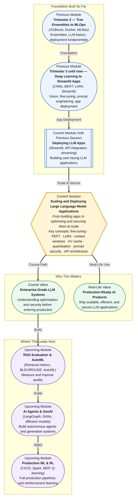

# Pre-read: Scaling and Deploying Large Language Model Applications

## Context of This Session in the Course

Your team just launched a customer-facing chatbot powered by a large language model. The prototype worked beautifully — responses were fluent, users loved the natural conversation, and leadership greenlit a full rollout. Within days, the cost per conversation started climbing, response times crept upward, and someone on Reddit managed to trick the bot into revealing internal instructions.

The naive path is to throw more GPU instances at the problem or swap in a larger model and hope for the best. Neither works. A larger model increases latency and cost without improving reliability. More GPUs multiply infrastructure complexity without addressing the root causes: inefficient inference, unoptimised prompts, and security gaps baked into the application layer. The tension between performance, cost, and safety is not a bug to be worked around — it is the central engineering challenge of deploying LLMs in the real world.

That is where **Scaling and Deploying Large Language Model Applications** becomes essential.

**What if** your engineering team needed to serve a single LLM-powered feature across a product suite used by thousands of users — each with different data, different prompts, and different latency expectations? You would need to decide whether to fine-tune a base model for each use case or build a single API gateway that orchestrates prompts, manages context, and enforces security policies for every request. You would face tradeoffs between model accuracy and inference speed, between flexibility and safety, and between development velocity and production reliability. This session gives you the mental framework to make those decisions with confidence.

**Fine-tuning** is the process of retraining a pre-trained LLM on domain-specific data to improve its performance on a particular task. **Parameter-efficient fine-tuning (PEFT)** achieves similar results by updating only a small fraction of the model's parameters — techniques like **LoRA** (Low-Rank Adaptation) inject lightweight trainable matrices into the model layers, reducing memory and compute requirements by orders of magnitude. Think of full fine-tuning as renovating an entire house, while PEFT is like swapping in smart furniture that adapts the existing structure. You will also explore how **context windows** limit the amount of information a model can process at once, how the **KV cache** accelerates inference by reusing computed attention keys and values, how **quantisation** shrinks model size by reducing numerical precision, how **prompt engineering** shapes model behaviour without retraining, how **prompt injection** can subvert your application, and how **API-based LLM application architecture** ties everything together into a production-ready system.

In the **previous session**, you deployed a Streamlit application connected to an LLM API. You configured session state to preserve conversation history, handled streaming responses, and managed API keys for secure access. That hands-on experience revealed how quickly a simple prototype encounters real-world friction: cost tracking was absent, error handling was naive, and there was no guard against malicious prompts. This session addresses exactly those gaps. Where Streamlit gave you the front-end deployment skills, this session equips you with the optimisation and security knowledge to run that application at scale.

In this pre-read, you'll discover:

- How to **choose** between full fine-tuning and parameter-efficient fine-tuning based on your compute budget and task requirements.
- How to **understand** context windows, KV cache, and quantisation as the three levers of efficient LLM inference.
- How to **recognise** prompt injection attacks and apply engineering controls to protect your application.
- How to **design** an API-based LLM application architecture that balances cost, latency, and security in production.

---

## Why Your Fine-Tuning Strategy Determines Everything

Choosing how to adapt a pre-trained model is the first architectural decision you will face. Full fine-tuning updates every weight in the model, which means it can achieve the highest task-specific accuracy but requires a GPU cluster, days of training, and enough memory to hold the entire model plus optimiser states. For a 7-billion-parameter model, that is roughly 28 GB of memory — and closer to 56 GB once gradients and optimiser states are factored in.

PEFT methods like LoRA sidestep this by freezing the original weights and training a much smaller set of adapter parameters. A typical LoRA adapter adds less than 1% of the original parameter count. You can train it on a single consumer GPU in hours, and the adapter file — often just a few megabytes — can be swapped in and out at inference time without reloading the base model. The tradeoff is subtle: LoRA can match full fine-tuning on many tasks, but for problems that require deep domain reorientation, full fine-tuning still holds an edge. Understanding this tradeoff is not academic — it determines whether your project costs five hundred dollars or fifty thousand.

## The Hidden Mechanics of Efficient Inference

Even after you have chosen a model and a fine-tuning strategy, the way you run inference determines whether your application is viable. Three concepts govern this: the **context window**, the **KV cache**, and **quantisation**.

The context window is the model's working memory — the total number of tokens (words and subwords) it can attend to when generating a response. A larger window means the model can process longer documents, maintain longer conversation histories, and consider more context before answering. But it also means slower inference and higher memory consumption because the self-attention mechanism grows quadratically with sequence length. Every doubling of the context window roughly quadruples the compute required for that layer.

The **KV cache** is what makes autoregressive generation practical. During inference, the model computes key-value pairs for each token in the input and stores them. When generating the next token, it reuses those stored pairs instead of recomputing the entire attention matrix from scratch. This is why the first token takes longer than subsequent tokens — the cache must be populated first. The tradeoff is memory: a long conversation with a large model can fill gigabytes of GPU memory with cached values alone. Systems that handle high throughput must implement cache management strategies such as sliding windows or cache eviction.

**Quantisation** reduces the numerical precision of model weights — typically from 32-bit floating point to 8-bit or even 4-bit integers. This can shrink a model by 75% or more while maintaining most of its accuracy. The tradeoff is a small degradation in output quality, which becomes noticeable on tasks that require fine-grained reasoning or numerical precision. In practice, quantisation is the most accessible optimisation because it requires no retraining and can be applied to any pre-existing model.

## Where LLM Optimisation and Security Appear in Real Life

Enterprise chatbots are the most visible application. A financial services firm deploys a fine-tuned LLM to answer customer queries about account policies, transaction histories, and investment products. The model is quantised to fit on cost-effective inference hardware, the KV cache is tuned for the average conversation length of twelve exchanges, and a guardrail layer filters out prompt injection attempts before they reach the model. Every element — fine-tuning strategy, inference optimisation, and security — works together.

Code generation assistants use a different combination. A software team fine-tunes a base model on their internal codebase using LoRA, producing a lightweight adapter that understands the team's coding conventions and API patterns. Because the adapter is small, it can be swapped in and out as developers switch between projects. Quantisation is less useful here because code generation demands high precision — instead, the team invests in a larger KV cache to handle long file-level context windows.

Customer support automation platforms handle thousands of unique business configurations. Rather than fine-tuning a separate model for each client, these platforms rely on prompt engineering and structured output schemas to adapt a single base model across domains. The architecture becomes a routing layer: classify the intent, select the right system prompt, enforce output formatting with JSON mode, and validate responses against injection patterns before delivery to the end user.

Healthcare summarisation presents the tightest constraints. A hospital deploys an LLM to generate clinical notes from doctor-patient conversations. Regulatory requirements demand that every output cite its source context. The model must be quantised to run on-premises for data privacy, the context window must be large enough to hold entire consultation transcripts, and prompt injection protections must prevent a patient from tricking the model into producing an incorrect diagnosis. This is where the full stack — fine-tuning, efficient inference, and security — converges into a single production system.

## What's Next

After this session, you will be able to:

- Distinguish between full fine-tuning and PEFT and select the right approach for a given task and budget.
- Explain how context windows and KV cache affect inference performance and memory usage.
- Apply quantisation to reduce model size and infer cost implications for deployment.
- Identify prompt injection patterns and implement basic guardrails to mitigate them.
- Design an API-based LLM application architecture with cost tracking, error handling, and rate limiting.

You do not need to implement every optimisation by hand in the first week. The goal is to see that deploying an LLM is an engineering discipline with clear levers: **fine-tune strategically, infer efficiently, and secure by design.**

---

## Interesting Questions for the Live Session

- If LoRA can match full fine-tuning on most benchmarks, what kind of task would justify the tenfold cost of full fine-tuning?
- A longer context window improves recall but increases vulnerability to long-context prompt injection — how would you balance these forces?
- Quantisation saves memory but reduces the model's ability to distinguish subtle adversarial inputs — does that create a security tax on optimisation?
- When prompt engineering, fine-tuning, and retrieval all address the same limitation, what decision framework determines which one to use?

By the end of this session, LLM deployment should feel less like a black box and more like a deliberate system of tradeoffs: **optimise strategically, secure relentlessly, deploy confidently.**
