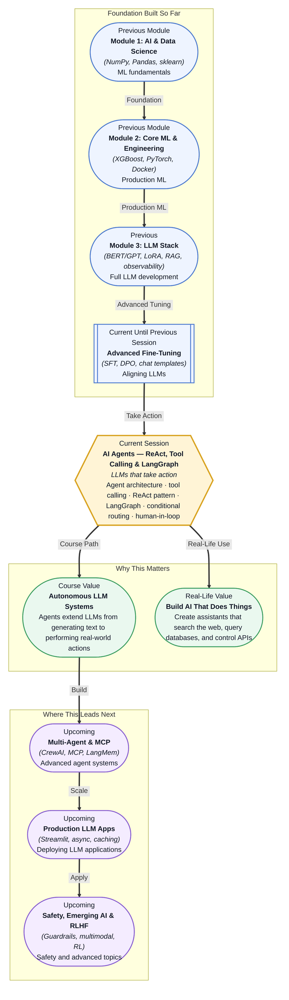

# Pre-read: AI Agents — ReAct, Tool Calling & LangGraph

## Context of This Session in the Course

You just spent weeks fine-tuning an LLM. It can answer questions about your company's internal policies with impressive accuracy. A user types: "Find all invoices from Q3 that exceed fifty thousand dollars and email a summary to the finance lead." Your LLM generates a perfect response: "You should look in the accounting system for Q3 invoices over fifty thousand and then compose an email." The user stares at the screen. They already knew that. What they needed was for the LLM to actually open the accounting system, run the query, compose the email, and send it. The gap between generating text about an action and performing that action is the single biggest limitation of every LLM you have used so far.

The obvious workaround is to write custom code for every possible action. If a user asks about invoices, call the invoice API. If they ask about the weather, call the weather API. If they ask to send an email, call the email API. But this approach collapses immediately: each new capability requires new code, each API has a different interface, and the LLM has no way to decide which tool to use or how to pass the right parameters. You end up maintaining a brittle mapping of intents to functions that breaks the moment a user phrases a request in an unexpected way. What you need is not a larger set of hardcoded integrations — you need an architecture where the LLM itself decides which tool to call, constructs the correct arguments from the conversation context, and uses the tool's output to decide what to do next.

That is where **AI Agents — ReAct, Tool Calling & LangGraph** becomes essential.

---

**What if** you were building a customer support system for an e-commerce platform handling ten thousand tickets a day? A customer writes: "My order from last week arrived damaged — I want a replacement shipped to my office address, and please check if the black version is in stock instead of the blue one." A plain LLM would generate a sympathetic response and tell the customer to contact the returns department. An agent-based system, by contrast, reads the message, identifies the customer in the database via a `get_customer_by_email` tool, looks up the order using a `get_order_by_id` tool, checks inventory via a `check_inventory` tool to see if the black version is in stock, creates a return label with `create_return_label`, and schedules a replacement shipment with `schedule_shipment` — all while composing a natural response that informs the customer of each step. What if you could build systems that do not just understand requests but execute them end-to-end, making decisions, handling edge cases, and asking for human confirmation only when the stakes are high? This session gives you the architecture and tools to build exactly that.

---

An **AI agent** is an LLM-powered system that can perceive its environment, decide which action to take, execute that action through a **tool** (a function or API call), observe the result, and decide the next step — repeating this loop until the task is complete. The core idea is the **ReAct pattern** (Reason + Act): instead of generating a single response in one pass, the LLM produces a reasoning trace ("I need to look up the customer's order first, then check the inventory"), calls a tool, receives the output, and reasons again before taking the next action. This interleaving of reasoning and action is what makes agents more powerful than a standard LLM call. The **tool calling** capability (also called function calling) is the mechanism by which the LLM requests an external action — it outputs a structured JSON object specifying the tool name and arguments, and your application code executes the actual function and returns the result to the LLM.

Think of it like a chef working in a kitchen. The chef (the LLM) does not grow ingredients or wash dishes — they decide the recipe and delegate. They tell the sous-chef to chop vegetables (a tool call), the stove to heat the pan (another tool call), and the timer to count down (another tool call). Each tool returns a result — chopped vegetables, a hot pan, a ringing timer — and the chef uses that information to decide the next step. The chef never leaves the stove; they orchestrate. That is the agent architecture. The session introduces **LangGraph**, a framework from the LangChain ecosystem designed specifically for building these agentic workflows. LangGraph models agent behaviour as a **graph** — nodes represent steps (reasoning, tool execution, conditional checks) and edges represent transitions between steps. **Conditional routing** allows the graph to branch: after a tool returns an error, the agent can retry with different parameters, ask the user for clarification, or escalate to a human — each path is an edge in the graph. **Human-in-the-loop** design adds checkpoints where the agent pauses and waits for human approval before executing a high-stakes action like sending an email or processing a payment.

---

In the **previous session**, you fine-tuned an LLM using Supervised Fine-Tuning (SFT) and Direct Preference Optimization (DPO). You curated instruction datasets, applied chat templates, and aligned the model to follow instructions more reliably. That alignment — making the LLM better at understanding what you ask and generating helpful responses — is the prerequisite for agent behaviour. An LLM that cannot reliably follow a complex instruction cannot be trusted to call the right tool with the right arguments. The chat templates you learned to structure conversations become the scaffolding for agent prompts: the system message defines the available tools and their schemas, the user message contains the request, and the assistant's response includes structured tool calls. DPO-trained models are particularly effective as agents because they have learned to prefer helpful, precise responses — the kind that chooses the correct tool over a vague text answer. The fine-tuning skills from session 28.2 are what make the agent reliable; the ReAct pattern and LangGraph in this session are what make it capable of action.

---

In this pre-read, you will discover:

- How to **understand** the ReAct pattern (Reason + Act) and why interleaving reasoning with tool calls makes agents more capable than plain LLM calls.
- How to **apply** tool calling (function calling) to let an LLM invoke APIs, query databases, and execute code during a conversation.
- How to **build** agentic workflows in LangGraph using nodes, edges, and conditional routing for dynamic decision-making.
- How to **recognise** when and why to incorporate human-in-the-loop checkpoints into an agent pipeline.

---

## Why an LLM Cannot Just Generate Text Anymore — The Case for Agents

Every LLM you have used so far follows the same pattern: receive input, generate tokens, stop. This is sufficient for summarisation, translation, and question-answering, but it fails for any task that requires interaction with the outside world. Consider a simple request: "Book a flight to Mumbai next Tuesday, and check if I have enough reward points." A standard LLM generates a response like "I can help you with that! First, check your reward points on the airline portal, then search for flights to Mumbai on Tuesday." That is not help — that is a to-do list disguised as an answer. The LLM has identified the correct steps but cannot execute any of them. An agent, by contrast, calls a `check_reward_balance` tool that queries the airline API, receives the balance as structured data, calls a `search_flights` tool with the date and destination, receives a list of available flights, and then generates a response that includes the actual information: "You have 12,000 reward points, and there are three flights to Mumbai next Tuesday starting at 8,000 points. Would you like me to book the 6 AM IndiGo flight?"

The fundamental shift is from **passive generation** to **active orchestration**. The LLM does not merely predict the next token — it predicts the next action. This requires the model to produce structured output (a tool call with specific parameters) rather than natural language alone. The **tool calling** API, now standard in GPT-4, Claude, Gemini, and open models like Llama 3, works by providing the LLM with a JSON schema describing each available tool — its name, description, and expected parameters. When the LLM determines that a tool should be called, it outputs a structured request in the format you defined, and your application code executes the actual function. This separation is critical: the LLM decides what to do and with which parameters; your code handles security, authentication, and execution. The **ReAct pattern** extends this by adding an explicit reasoning step before each tool call. The LLM outputs a chain-of-thought reasoning trace ("The user wants to book a flight to Mumbai. First I need to check their reward balance to know what they can afford. Then I need to search flights. After that I can present options.") before making the actual tool call. This reasoning trace makes the agent's decisions transparent and debuggable — you can see why it called a particular tool, not just that it called it.

## How LangGraph Structures Agentic Decision-Making — Nodes, Edges, and Conditional Routing

Building an agent as a simple loop — reason, act, observe, repeat — works for straightforward tasks but breaks down when the agent needs to handle errors, branch based on results, or wait for human input. **LangGraph** solves this by modelling the agent as a **stateful directed graph**. Each **node** is a self-contained step: a "reasoning" node where the LLM decides what to do, a "tool execution" node that runs the chosen function and returns the result, and a "human review" node that pauses execution and waits for approval. **Edges** define the transitions between nodes. A **conditional edge** inspects the output of a node and decides which node to route to next — for example, if a `search_flights` tool returns an error because the date format is wrong, a conditional edge routes to a "rephrase parameters" node instead of proceeding to the "present results" node.

This graph-based architecture gives you precise control over agent behaviour. You can define subgraphs for specific subtasks — a "booking subgraph" that handles flight, hotel, and car rental bookings with their own tool sets — and compose them into a larger agent graph. **State management** is built into LangGraph: each agent execution has a shared state object that accumulates messages, tool outputs, and intermediate decisions. When a node finishes, it updates the state; the next node reads the updated state and decides its action. This is fundamentally different from a stateless chain of calls — the agent remembers what it has already done, what results it received, and which branch it is on. **Conditional routing** is where the real power emerges. Consider an agent that processes customer refunds. After calling `get_order_details`, the result might indicate the order is already refunded, the order is too old to refund, or the refund is eligible. Each outcome routes to a different node: one that informs the user the refund was already processed, one that escalates to a supervisor, and one that proceeds with the refund. You encode these conditions as functions that inspect the state and return the name of the next node — a simple if-else that determines the agent's trajectory at runtime.

## Where AI Agents With Tool Calling Appear in Real Life

The ReAct agent pattern is reshaping how companies build automation across every industry. In **financial services**, banks deploy agent-based systems for fraud investigation. When a transaction is flagged as suspicious, an agent automatically calls multiple tools: `get_transaction_details`, `get_customer_history`, `get_geolocation_data`, and `check_known_fraud_patterns`. Based on the results, the agent either clears the transaction (low risk), flags it for manual review (medium risk), or blocks it and alerts the customer (high risk). Each path is a conditional route in a LangGraph workflow. The agent does not just classify — it investigates, gathers evidence, and makes a decision with audit trails at every step.

In **healthcare operations**, hospitals use agents to manage patient intake and scheduling. A patient messages: "I need to reschedule my cardiology appointment, and can you check if my insurance covers the new slot?" An agent calls `get_appointment` to retrieve the existing booking, `search_available_slots` to find alternatives, and `verify_insurance_coverage` with the new time slot. If the insurance check returns a co-pay amount, the agent informs the patient and asks for confirmation before booking. LangGraph's human-in-the-loop node pauses execution until the patient confirms — the agent never books a chargeable appointment without explicit consent. The same pattern applies to prior authorisation workflows, where an agent gathers clinical notes, matches them to insurance policy requirements, and submits the authorisation request, escalating only when the policy language is ambiguous.

In **software engineering**, coding agents like GitHub Copilot's agent mode and Claude's Code use tool calling to read files, search codebases, run tests, and execute terminal commands. An agent given the task "Fix the flaky integration test in `test_payments.py`" will call `read_file` to inspect the test, `grep_search` to find related mocking code, `run_test` to reproduce the failure, and `edit_file` to apply the fix — all orchestrated through a ReAct loop. Conditional routing handles the case where the first fix attempt fails: the agent reads the error output, adjusts its approach, and retries. In **customer service**, companies like Klarna and Intercom run agent systems that handle the full resolution workflow — identifying the customer, looking up past interactions, checking order status, processing refunds or exchanges — and transfer to a human agent only when the customer explicitly requests one or when the agent's confidence in the resolution falls below a threshold. **LangGraph's conditional routing** makes this threshold-based handoff natural: a confidence score below 0.7 routes to the human handoff node; above 0.7, the agent completes the task autonomously.

---

## What's Next

After this session, you will be able to:

- Design an agent architecture that separates reasoning (what to do) from tool execution (how to do it) using the ReAct pattern.
- Implement tool calling with JSON schema definitions that let an LLM invoke external APIs and functions.
- Build a LangGraph workflow with nodes, edges, and conditional routing that handles errors, retries, and branching logic.
- Add human-in-the-loop checkpoints that pause agent execution for approval before high-stakes actions.
- Debug agent behaviour by inspecting the reasoning trace and state at each step of the graph.

You do not need to build a production multi-agent orchestration system right now. The goal is to understand that an LLM agent is not magic — it is a disciplined loop of reasoning, action, and observation, and LangGraph gives you the vocabulary and structure to design that loop deliberately: **think before you act, act with a tool, observe the result, and think again.**

---

## Interesting Questions for the Live Session

- If the LLM generates the reasoning trace and the tool call, who is responsible when the tool is called with incorrect arguments — the LLM for poor reasoning, or the system for not validating the parameters before execution?
- Conditional routing in LangGraph uses deterministic functions to choose the next node — but what happens when the condition itself requires an LLM judgment (e.g., "is this customer complaint urgent?")? Do you build a separate classifier or let the agent decide recursively?
- Human-in-the-loop checkpoints add safety but break the autonomy that makes agents useful. How do you decide which actions require human approval versus which can proceed automatically?
- Tool calling depends on the LLM receiving the tool's output as text in the conversation context — what happens when a tool returns a massive dataset (like a full transaction history)? How do you avoid overwhelming the context window without losing critical information?

By the end of this session, AI agents should feel less like an abstract research concept and more like a practical architectural pattern: **an LLM that can call tools is no longer just a language model — it is an autonomous system that can change the world, one API call at a time.**
