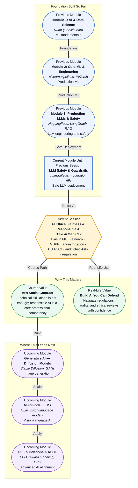

# Pre-read: AI Ethics, Fairness & Responsible AI

## Context of This Session in the Course

You have just deployed a resume-screening AI that ranks candidates by predicted hireability. Within a week, your team notices that candidates from certain zip codes, certain universities, and certain names are consistently ranked lower, even when their qualifications match. You run the numbers. The pattern is real. And you are the person who built the model.

This is not a hypothetical. It has happened — at Amazon, at hiring platforms, at lending institutions, and in healthcare triage systems. Models do not invent bias out of malice. They learn patterns from historical data. If historical hiring data underrepresents women in engineering, the model learns that male candidates are "better fits." If loan data shows higher default rates in certain communities, the model learns to deny loans more aggressively there. The model is doing exactly what it was trained to do. The problem is that what it learned was not fair.

The intuitive fix — "just remove the sensitive attributes like gender or race" — does not work. Bias seeps in through proxy features: zip code correlates with race, university correlates with socioeconomic background, extracurricular activities correlate with privilege. Removing one column does not remove the pattern. You need a systematic way to detect, measure, and mitigate unfairness. That is where **AI Ethics, Fairness, and Responsible AI** becomes essential.

---

**What if** you were the AI ethics officer at a fintech company deploying a credit-scoring model across three countries with different data protection laws? Your model performs well on aggregate, but you discover that its false-positive rate for fraud detection is three times higher for users from a specific demographic. The local regulator has just announced audits under the upcoming EU AI Act. Your CTO asks: "Can we prove our model is fair?" You need to answer with evidence — bias audits, fairness metrics, anonymization audits, and a documented compliance checklist.

---

"Fairness" in machine learning is not a single number. It is a family of competing definitions, and you often have to choose between them. **Demographic parity** requires that a model's positive prediction rate be the same across groups. **Equal opportunity** requires that the true-positive rate be the same. These definitions can conflict — you cannot satisfy both at once in most real datasets. The goal is not to find the single perfect definition. The goal is to measure the gap, understand its source, and decide which trade-off your context demands.

Think of it like a referee in a sport. The referee does not change the rules mid-game, but they apply the same standard to every player. A fair ML model does not change its decision criteria depending on who it is evaluating. The challenge is that the model's training data may already encode an uneven playing field. Your job is to detect that unevenness, quantify it, and decide how to correct it. Tools like **Fairlearn** help you compute disparity metrics and apply mitigation algorithms. Legal frameworks like **GDPR** and the **EU AI Act** define what counts as acceptable use of personal data and what does not. Techniques like **anonymization** (k-anonymity, differential privacy) give you a toolkit for protecting individuals while still extracting signal from data.

In this session, you will explore the full pipeline of responsible AI: detecting **bias in ML models**, measuring it with **Fairlearn**, navigating **GDPR** and **EU AI Act** requirements, applying **anonymization** techniques, and running through **audit checklists** that regulators and compliance officers actually use.

---

In the **previous session**, you explored **LLM Safety & Guardrails**, where you learned how to jailbreak-test models, moderate toxic outputs, and implement guardrails using the guardrails-ai library and OpenAI's moderation API. That session addressed one layer of safety: preventing your model from generating harmful content. This session addresses a deeper layer: ensuring that your model's decisions themselves are fair and lawful, even when no toxic content is involved. Technical safety (guardrails) and ethical safety (fairness) are two sides of the same coin — one prevents what the model *says*, the other governs what the model *does*.

---

In this pre-read, you will discover:

- How to **recognise** the difference between demographic parity, equal opportunity, and equalised odds as fairness metrics.
- How to **apply** Fairlearn's `metricframe` and mitigation algorithms to detect and reduce bias in a trained model.
- How to **interpret** key GDPR requirements (right to explanation, data minimisation, purpose limitation) as concrete engineering constraints.
- How to **connect** anonymization techniques (k-anonymity, differential privacy) to regulatory compliance and real audit workflows.

---

## Why "Just Remove the Sensitive Column" Does Not Work

Imagine you are building a model to predict repayment risk for a peer-to-peer lending platform. You know that including race or gender as features would be illegal and unethical, so you drop those columns from your training data. You train a gradient-boosted tree on the remaining features: income, zip code, years at current address, number of late payments, and credit utilisation ratio. The model achieves an ROC-AUC of 0.82 on the test set, and you move it to production.

Three months later, a fairness audit reveals that approval rates for one demographic group are 40% lower than for others, despite similar credit profiles. How? Your model never saw race or gender, but it learned proxies. Zip code correlates with neighbourhood segregation. Income correlates with historical wage gaps. Years at current address correlates with housing stability differences across communities. The model learned the very pattern you tried to eliminate, just through different variable names.

This is called **redundant encoding** — the sensitive attribute is encoded in a combination of seemingly neutral features. The only way to catch it is to measure fairness directly using a tool like **Fairlearn**, which compares your model's predictions across groups and surfaces disparities that no single feature inspection would reveal. The metric you choose matters: demographic parity checks whether the positive rate is equal across groups, while equal opportunity checks whether the true-positive rate is equal. Both are valid, both are informative, and both can give opposite answers on the same model.

---

## Navigating GDPR, the EU AI Act, and the Global Regulatory Maze

The **General Data Protection Regulation (GDPR)**, enacted in 2018, was the first major data-protection framework to explicitly address automated decision-making. Article 22 gives individuals the right not to be subject to a decision based solely on automated processing that produces legal effects. Article 15 outlines the right to an explanation of how a decision was reached. For a machine learning engineer, this means your model must be interpretable enough that you can explain, in plain language, why a specific prediction was made for a specific individual.

The **EU AI Act**, expected to be fully in force by 2026, takes this further. It classifies AI systems into risk categories: unacceptable, high, limited, and minimal. A resume-screening tool or a credit-scoring model is classified as **high-risk**, which triggers mandatory requirements: risk assessment, technical documentation, human oversight, accuracy benchmarks, and conformity assessment before deployment. The Act also requires that high-risk systems be trained on datasets that are "relevant, representative, and free from biases."

Practically, this means your ML workflow now includes legal gates. Before deploying a model, you need an **audit checklist** that verifies: Is the training data representative of the target population? Have fairness metrics been computed and documented? Can the model's decisions be explained to a regulator? Is there a human-in-the-loop for high-stakes decisions? These are not theoretical questions — they are becoming legal requirements. Companies that cannot produce this documentation risk fines of up to 6% of global annual turnover or €30 million (whichever is higher) under GDPR, and similar penalties under the EU AI Act.

---

## Where AI Ethics Appears in Real Life

The principles you will learn in this session are not academic. They shape the way real organisations build, audit, and defend their AI systems. In **financial services**, lending models are required by law (in jurisdictions like the US under ECOA and in the EU under GDPR) to provide adverse-action notices that explain why a loan was denied. Banks now run Fairlearn-based audits before every model release and maintain model risk management frameworks that mirror the audit checklists you will study. In **healthcare**, diagnostic models that predict disease risk from patient data must be tested for fairness across ethnic groups — a model that works well for one population but poorly for another can cause real harm. Hospitals and health-tech startups increasingly require fairness documentation as part of their procurement process. In **HR technology**, companies like Amazon have learned the hard way that resume-screeners can embed past hiring biases. Modern HR-tech vendors now submit their models to third-party fairness audits and publish bias reports. In **criminal justice**, risk-assessment tools used for bail and sentencing decisions have been heavily scrutinised for racial bias, leading some jurisdictions to ban their use entirely unless fairness can be demonstrated. Even in **advertising and content recommendation**, platform algorithms that optimise for engagement can amplify discriminatory targeting, and regulators in Europe now require audit trails for ad-delivery systems. Across every industry, the same pattern repeats: a model performs well until someone asks "fair for whom?"

---

## What's Next

After this session, you will be able to:

- Detect bias in a trained ML model using Fairlearn's `metricframe` and interpret the resulting disparity metrics.
- Choose between demographic parity, equal opportunity, and equalised odds for a given business context.
- Apply a mitigation algorithm (e.g., exponentiated gradient, grid search) to reduce observed disparity.
- Map GDPR Article 22 and Article 15 requirements to specific engineering decisions in your ML pipeline.
- Construct an audit checklist that covers bias testing, anonymization, documentation, and human oversight for a high-risk AI system.
- Explain the EU AI Act's risk-classification system and identify whether a given application qualifies as high-risk.

You do not need to memorise every article of the GDPR or every line of the EU AI Act right now. The goal is to develop a reliable mental model: **fairness is a measurable property of a model's outputs, not an intention buried in its training data.**

---

## Interesting Questions for the Live Session

- If demographic parity and equal opportunity give conflicting results on the same model, which one should you use — and who decides?
- Can a model be considered fair if it was trained on biased data but uses a mitigation algorithm, or does fairness require unbiased data from the start?
- The EU AI Act requires high-risk systems to be "free from biases" — but how do you prove absence of bias when bias can hide in proxy features?
- Anonymization techniques like k-anonymity reduce granularity, which can hurt model performance. Where is the right trade-off between privacy and utility for a credit-scoring model?

By the end of this session, AI ethics should feel less like a philosophical lecture and more like an engineering discipline: **measure the disparity, document the trade-off, and design for accountability from the start.**
