# Pre-read: Advanced LLM Fine-Tuning — SFT, Instruction Tuning & DPO

## Context of This Session in the Course

```mermaid
%%{init: {"flowchart": {"nodeSpacing": 45, "rankSpacing": 65, "diagramPadding": 20}} }%%
flowchart TB
    subgraph Foundation["Foundation Built So Far"]
        P1(["Previous Module<br/><b>Module 1: Foundations of AI and Data Science</b><br/><i>(Linear Algebra, Probability, sklearn)</i><br/>ML fundamentals"])
        P2(["Previous Module<br/><b>Module 2: Core Machine Learning &amp; Engineering</b><br/><i>(Ensembles, Neural Networks, SHAP)</i><br/>Production ML"])
        P3(["Previous Module<br/><b>Module 3: Deep Learning &amp; LLM Stack</b><br/><i>(BERT/GPT, Evaluation, LoRA, RAG)</i><br/>LLM development"])
        C1[["Current Until Previous Session<br/><b>LLM Observability</b><br/><i>(LangSmith, Langfuse, trace inspection, eval-driven dev)</i><br/>Monitoring LLMs"]]
    end

    CS{{"Current Session<br/><b>Advanced LLM Fine-Tuning — SFT, Instruction Tuning &amp; DPO</b><br/><i>Align LLMs with human intent</i><br/>SFT · dataset curation · instruction tuning · chat templates · DPO · RLHF alternative"}}

    subgraph Value["Why This Matters"]
        CV(["Course Value<br/><b>Alignment and Control</b><br/>SFT and DPO make general LLMs follow instructions reliably and refuse harmful requests"])
        RV(["Real-Life Value<br/><b>Build Your Own Assistant</b><br/>Fine-tune models to follow instructions, match tone, and reflect human preferences"])
    end

    subgraph Future["Where This Leads Next"]
        F1(["Upcoming<br/><b>AI Agents</b><br/><i>(ReAct, tool calling, LangGraph, conditional routing, human-in-loop)</i><br/>Building autonomous agents"])
        F2(["Upcoming<br/><b>Multi-Agent Systems &amp; MCP</b><br/><i>(CrewAI, MCP architecture, sub-agent patterns, semantic memory)</i><br/>Advanced agent systems"])
        F3(["Upcoming<br/><b>Production LLMs, Safety &amp; Advanced AI</b><br/><i>(Streaming, caching, guardrails, diffusion, multimodal, RLHF)</i><br/>Production and emerging AI"])
    end

    P1 ==>|&nbsp;Foundation&nbsp;| P2
    P2 ==>|&nbsp;Production ML&nbsp;| P3
    P3 ==>|&nbsp;Observe LLMs&nbsp;| C1
    C1 ==>|&nbsp;Advanced Tuning&nbsp;| CS
    CS ==>|&nbsp;Course Path&nbsp;| CV
    CS ==>|&nbsp;Real-Life Use&nbsp;| RV
    CV ==>|&nbsp;Build&nbsp;| F1
    F1 ==>|&nbsp;Scale&nbsp;| F2
    F2 ==>|&nbsp;Apply&nbsp;| F3

    classDef previous fill:#eef4ff,stroke:#4f7ccf,color:#111827,stroke-width:2px;
    classDef current fill:#fff4d6,stroke:#d9a321,color:#111827,stroke-width:3px;
    classDef value fill:#eaf8ef,stroke:#3f9f63,color:#111827,stroke-width:2px;
    classDef future fill:#f4ecff,stroke:#8a61d1,color:#111827,stroke-width:2px;

    class P1,P2,P3,C1 previous;
    class CS current;
    class CV,RV value;
    class F1,F2,F3 future;
    linkStyle default stroke-width:3px;
```

You deploy a 7B LLM as your customer support chatbot. It speaks fluently, remembers context across turns, and never hallucinates — you fine-tuned it with LoRA. But when a customer asks "Can I return a product I already opened?", the bot answers, "That depends on the product." It is technically cautious but not helpful. It does not say whether opening the box voids the policy, how many days the return window is, or whether electronics are treated differently from clothing. The model knows the facts — you trained it on your policy documents — but it does not know how to answer *helpfully* in the format your customers actually expect.

The frustration is not that the model is wrong. It is that you never told it what a *good* answer looks like versus a *bad* one, even when both are factually correct. You gave it domain knowledge through continued pre-training or LoRA fine-tuning, but you never taught it the instruction-following layer: the conversational structure that separates a useful assistant from a cautious text completer. The model memorised your policies but missed the most critical skill — how to respond as an assistant, not as a language model that happens to know about your business.

That is where **Supervised Fine-Tuning (SFT)**, **instruction tuning**, **chat templates**, and **Direct Preference Optimization (DPO)** become essential. These techniques transform a general-purpose language model into one that reliably follows instructions, matches a desired conversational tone, and — critically — knows which answers humans actually prefer.

---

**What if** you could build your own instruction-tuned assistant — one that answers consistently in your company's tone, refuses harmful requests gracefully, and outperforms the base model on every prompt you test, with nothing more than a small curated dataset and a single consumer GPU? What if you could teach the model not just what to say in response to a prompt, but which of two possible responses humans would prefer — shifting the model's probability distribution toward helpful, harmless, and on-brand completions without ever training a separate reward model or running a complex reinforcement learning loop? This session gives you the techniques that make this possible: **SFT** to establish the instruction-following pattern, **chat templates** to enforce correct conversational structure, and **DPO** to optimise for human preference directly.

---

**Supervised Fine-Tuning (SFT)** teaches a pre-trained LLM how to follow instructions by training on thousands of pairs: a user prompt and an ideal assistant response. Before SFT, a base model like Llama 3 or Mistral can complete sentences, translate text, or write code — but it does not naturally behave as an assistant. It might answer a question as though it were continuing the prompt rather than responding to it. SFT closes that gap by exposing the model to examples of the (instruction, desired response) pattern, teaching it to continue a conversation in the assistant role.

The next layer is **instruction tuning format** — the precise structure of your training examples. Different model families use different **chat templates**: Llama 3 uses special tokens like `<|begin_of_text|>` and `<|start_header_id|>user<|end_header_id|>`, while Mistral uses `[INST]` and `[/INST]`. If your training data does not match the model's expected chat template, the model will fail to respond correctly at inference time — it may treat your instruction as text to continue rather than a query to answer. Getting the template right is not a detail; it is the mechanic that tells the model which role it plays in the conversation.

Where SFT teaches the model *what* a good answer looks like, **Direct Preference Optimization (DPO)** teaches it *which* answers humans prefer. DPO is a simpler alternative to **Reinforcement Learning from Human Feedback (RLHF)**. Instead of training a separate reward model on preference judgments and then running PPO optimisation (the full RLHF pipeline), DPO rewrites the preference learning objective directly into the supervised loss. Given pairs of preferred and dispreferred responses to the same prompt, DPO increases the likelihood of the preferred response and decreases the likelihood of the dispreferred one relative to a frozen reference model. The result is an aligned model that actively avoids low-quality or harmful completions — without the complexity of a multi-stage RL system.

---

In the **previous session**, you used LangSmith, Langfuse, and W&B Weave to inspect LLM traces, log prompts and completions, and run online evaluations against deployed models. You learned to detect when a model is underperforming — high hallucination rates, poor evaluation scores, or unexpected behaviour on edge cases. That observability layer gives you the diagnostic: it tells you your model needs better instruction following or that its outputs do not align with user expectations. This session hands you the treatment. Observability tells you *what* is wrong; SFT and DPO tell you *how to fix it* — by curating targeted data and fine-tuning the model itself.

---

In this pre-read, you will discover:

- How to **curate** a dataset for supervised fine-tuning and preference optimisation, including prompt-response pairs and preference pairs.
- How to **apply** instruction tuning format and chat templates correctly so the model learns the conversational assistant role.
- How to **understand** DPO as a direct preference optimisation method that replaces the full RLHF pipeline with a simpler supervised objective.
- How to **build** a practical DPO fine-tuning pipeline that aligns an LLM with human preferences using the TRL library.

---

## Why Instruction Tuning Is Not Just More Training

A base LLM knows how to complete text. Give it "The capital of France is" and it produces "Paris". But ask "What is the capital of France?" and a base model might answer "France is a country in Western Europe." It answers the question literally — as a text completion — instead of responding conversationally. The model is not being obstinate; it simply has never been taught the turn-taking structure of an assistant conversation. **Instruction tuning** solves this by reframing the training objective: instead of predicting the next token across arbitrary text, the model learns to produce a response that follows a user instruction, separated by clear role markers.

The chat template is the syntax that enforces this structure. Llama 3, for example, expects training data in a format where user messages are wrapped in `<|start_header_id|>user<|end_header_id|>` and assistant responses are wrapped in `<|start_header_id|>assistant<|end_header_id|>`. If you train a model with data that omits these markers — for instance, plain text pairs without role delimiters — the model will produce correct *words* but wrong *behaviour*. It may ignore the system prompt, fail to stop generating, or blend the user and assistant voices. The template is not metadata; it is the scaffold that tells the model when to listen, when to speak, and how to recognise the boundary between them. Every practical SFT pipeline begins not with model architecture decisions but with getting this format exactly right.

## DPO — Preference Learning Without the Reward Model

The full RLHF pipeline involves three stages: supervised fine-tuning on high-quality demonstrations, training a separate reward model on human preference judgments, and then using Proximal Policy Optimization (PPO) to fine-tune the LLM against that reward model. This pipeline is powerful but operationally heavy — it requires maintaining three separate models (policy, reference, reward), tuning the PPO hyperparameters (KL penalty, clip range, advantage normalisation), and managing the instability that arises when the policy diverges too far from the reference during RL training.

**Direct Preference Optimization (DPO)** eliminates the reward model entirely. The key insight is simple: the Bradley-Terry preference model — which turns pairwise comparisons into a probability distribution — can be expressed directly in terms of the policy model and a reference model. Given a preferred response \(y_w\) and a dispreferred response \(y_l\) for the same prompt \(x\), DPO computes the log-sigmoid of the difference between the two responses' implicit rewards (derived from the policy's and reference's log-probabilities). The loss pushes the policy to increase the probability of \(y_w\) relative to \(y_l\) while staying close to the reference via an implicit KL constraint. The result is a single-stage training loop that matches — and sometimes beats — full RLHF on alignment benchmarks like Anthropic's Helpful-Harmless and MT-Bench, with dramatically less engineering complexity. In practice, DPO means you curate a preference dataset, write a standard PyTorch training loop with the DPO loss from the TRL library, and watch the model's preference distribution shift across a few hours of training on a single GPU.

## Where SFT and DPO Appear in Real Life

In **customer support**, companies curate SFT datasets from historical chat transcripts — pairing customer questions with the best agent responses — to fine-tune an LLM that matches the brand's support tone, escalation flow, and policy knowledge. DPO is then applied on preference pairs derived from customer satisfaction ratings, teaching the model to favour concise, accurate answers over verbose or evasive ones. In **healthcare**, clinical LLMs are instruction-tuned on doctor-patient dialogue datasets and then preference-optimised to avoid giving medical advice outside the model's intended scope — DPO naturally decreases the probability of dispreferred (unsafe or speculative) completions without needing hard-coded refusal rules. In **legal technology**, firms instruction-tune models to summarise case law, draft clauses, and redline contracts using associate-reviewed (instruction, response) pairs, with DPO used to prefer responses that correctly cite sources over those that fabricate references. In **content generation**, marketing teams fine-tune LLMs on brand voice guidelines — creating SFT data from approved marketing copy — and then apply DPO to prefer outputs with the desired tone, length, and structure over generic alternatives. And in **safety-critical domains**, DPO has become a standard alignment technique for reducing toxic, biased, or harmful outputs: rather than filtering completions after generation, the model learns through gradient updates to shift its probability distribution away from dispreferred behaviours during training, making alignment an intrinsic property of the model rather than an external filter.

---

## What's Next

After this session, you will be able to:

- Curate a supervised fine-tuning dataset with proper prompt-response formatting and create preference pairs for DPO.
- Apply the correct chat template and instruction-tuning format for Llama 3, Mistral, or OpenAI-compatible model families.
- Implement a DPO training loop using the TRL library to align an LLM with human preferences on a custom dataset.
- Evaluate the impact of SFT and DPO on instruction-following quality using held-out prompt sets and preference comparisons.

You do not need to implement a reward model or master PPO to align an LLM with human preferences. The goal is to see alignment not as a complex research problem but as a practical data-centric skill: **curate good data, choose the right template, let SFT teach the pattern and DPO teach the preference.**

---

## Interesting Questions for the Live Session

- When a base model is already instruction-tuned (like Llama 3 Instruct), what additional value does a second round of SFT on domain-specific data provide — are you reinforcing existing behaviour or introducing genuinely new capabilities?
- DPO avoids training a reward model, but it still requires a frozen reference model throughout training — does this mean DPO's effectiveness is bounded by the quality of that reference, or can the policy recover from a weak reference through enough preference data?
- Chat templates vary across model families (Llama, Mistral, ChatML). If you train with one template and deploy with another, does instruction-following quality degrade gracefully or catastrophically, and why?
- SFT teaches the model what to say and DPO teaches it what to prefer — is there a scenario where DPO alone (without the SFT stage) could match the two-stage SFT-then-DPO pipeline, or does SFT provide an essential prerequisite the model needs before preference learning can work?

By the end of this session, alignment should feel less like a complex RL problem and more like a targeted data curation and training exercise: **good data, the right template, and a preference-aware loss are all you need to align an LLM.**
