# Pre-read: Advanced RAG — Hybrid Search & Re-ranking

## Context of This Session in the Course

```mermaid
%%{init: {"flowchart": {"nodeSpacing": 45, "rankSpacing": 65, "diagramPadding": 20}} }%%
flowchart TB
    subgraph Foundation["Foundation Built So Far"]
        P1(["Previous Module<br/><b>Module 1: AI &amp; Data Science Foundations</b><br/><i>(NumPy, Pandas, sklearn)</i><br/>ML fundamentals from math to first models"])
        P2(["Previous Module<br/><b>Module 2: Core ML &amp; Engineering</b><br/><i>(XGBoost, PyTorch, Docker)</i><br/>Production ML pipelines and deployment"])
        P3(["Previous Module<br/><b>Module 3: LLM Foundations</b><br/><i>(HuggingFace, LoRA, prompt engineering)</i><br/>Transformers, fine-tuning, and prompt techniques"])
        C1[["Current Until Previous Session<br/><b>Vector Databases &amp; RAG Fundamentals</b><br/><i>(FAISS, Chroma, embeddings)</i><br/>Basic RAG with vector databases"]]
    end

    CS{{"Current Session<br/><b>Advanced RAG — Hybrid Search &amp; Re-ranking</b><br/><i>Retrieval quality matters</i><br/>BM25 · dense retrieval · hybrid search · cross-encoder re-ranking · semantic chunking · parent-child chunking · query expansion · Ragas"}}

    subgraph Value["Why This Matters"]
        CV(["Course Value<br/><b>Production-Grade RAG</b><br/>Basic RAG works; advanced RAG makes it reliable enough for production"])
        RV(["Real-Life Value<br/><b>Search That Really Works</b><br/>Build enterprise knowledge assistants that find the right document every time"])
    end

    subgraph Future["Where This Leads Next"]
        F1(["Upcoming<br/><b>LLM Observability</b><br/><i>(LangSmith, Langfuse, W&B Weave)</i><br/>Monitoring and evaluating LLM applications"])
        F2(["Upcoming<br/><b>Advanced Fine-Tuning &amp; Agents</b><br/><i>(SFT, DPO, LangGraph, MCP)</i><br/>Advanced LLM techniques and multi-agent systems"])
        F3(["Upcoming<br/><b>Production LLMs &amp; Emerging</b><br/><i>(Caching, guardrails, diffusion, multimodal)</i><br/>Production systems and advanced AI"])
    end

    P1 ==>|&nbsp;Foundation&nbsp;| P2
    P2 ==>|&nbsp;Production ML&nbsp;| P3
    P3 ==>|&nbsp;Basic RAG&nbsp;| C1
    C1 ==>|&nbsp;Advanced Retrieval&nbsp;| CS
    CS ==>|&nbsp;Course Path&nbsp;| CV
    CS ==>|&nbsp;Real-Life Use&nbsp;| RV
    CV ==>|&nbsp;Build&nbsp;| F1
    F1 ==>|&nbsp;Scale&nbsp;| F2
    F2 ==>|&nbsp;Apply&nbsp;| F3

    classDef previous fill:#eef4ff,stroke:#4f7ccf,color:#111827,stroke-width:2px;
    classDef current fill:#fff4d6,stroke:#d9a321,color:#111827,stroke-width:3px;
    classDef value fill:#eaf8ef,stroke:#3f9f63,color:#111827,stroke-width:2px;
    classDef future fill:#f4ecff,stroke:#8a61d1,color:#111827,stroke-width:2px;

    class P1,P2,P3,C1 previous;
    class CS current;
    class CV,RV value;
    class F1,F2,F3 future;
    linkStyle default stroke-width:3px;
```

You have built a RAG system. Your vector database stores embeddings for ten thousand policy documents. A user asks, "What is the travel reimbursement limit for international conferences?" The system retrieves the top-three nearest chunks, your LLM generates a clean answer, and the response looks perfect. But you notice something unsettling: the third paragraph in your answer comes from a chunk about domestic travel that happened to have a similar embedding to the question. The LLM blended it into the answer seamlessly, and a human reading it would never notice — unless they knew the policy well enough to catch the contradiction. Your RAG system is working, but it is not working well enough.

The obvious fix is to retrieve more chunks. If you retrieve five instead of three, surely the relevant document will be in there, right? But more chunks means more noise. You feed the LLM five chunks; it picks the wrong one as the primary source and hallucinates around the right one. Retrieving more does not solve the problem of retrieving precisely. A basic vector search — embedding a query and finding the nearest neighbours — is powerful, but it collapses every document into a single semantic space. A policy about "reimbursement limits" and a policy about "audit thresholds" can end up close together if they both use financial language. And even when the right chunk is in the top-three, there is no guarantee the LLM treats it as authoritative. What you need is not just retrieval — you need retrieval that is precise, layered, and self-correcting.

That is where **Advanced RAG — Hybrid Search & Re-ranking** becomes essential.

---

**What if** you were building the internal knowledge assistant for a multinational bank with fifty thousand compliance documents, quarterly regulatory updates, and policies written in multiple languages? An employee asks a question that has never been asked before: "What are the capital reserve requirements for cross-border transactions under the new Basel framework?" A keyword search on "capital reserve" would miss documents that use "regulatory capital" or "capital adequacy." A pure vector search would pull up documents about reserve requirements in general, but it might rank a document about domestic retail banking higher than the one about cross-border transactions because the embedding space lumps them together. What if you could combine the precision of keyword matching with the semantic understanding of vector embeddings, rescore your results with a model trained specifically to judge relevance, and structure your document chunks so the most self-contained unit of knowledge is always retrieved first? This session gives you the techniques to build that system.

---

The core insight of this session is that retrieval quality is not a single problem — it is a pipeline of decisions, each one introducing a failure mode that the next technique can correct. **Hybrid search** combines **BM25**, a classical keyword-matching algorithm that scores documents by term frequency and inverse document frequency, with **dense retrieval** that matches documents by embedding similarity. BM25 catches exact phrase matches and domain terminology that dense retrieval might gloss over; dense retrieval catches semantic paraphrases that BM25 would miss. Together they produce a combined result set that is more robust than either alone. But even a good initial retrieval can contain irrelevant results. That is where **cross-encoder re-ranking** comes in: unlike a bi-encoder that produces a fixed embedding for every document, a cross-encoder processes the query and each candidate document together as a pair, producing a relevance score that is far more accurate but too expensive to run on the full document collection. You use the fast methods — BM25 and dense retrieval — to narrow the candidate set, and the accurate method — cross-encoder re-ranking — to score the top candidates.

Think of it like hiring for a role. The first round of screening (BM25 + dense retrieval) scans thousands of resumes looking for any signal — keywords from the job description, and semantic fit based on overall experience. That narrows the pool to the top twenty candidates. Then the interview round (cross-encoder re-ranking) closely evaluates each candidate by reading the job description alongside their specific resume — a much more accurate signal, but far too expensive to apply to all applicants. This two-stage pattern — fast and broad, then slow and precise — is the architectural pattern behind every production-grade RAG system. The session extends this pattern further with **semantic chunking** (splitting documents at natural boundary points rather than fixed token counts), **parent-child chunking** (retrieving small child chunks but returning their larger parent context), **query expansion** (generating alternative phrasings of the user's question to cast a wider retrieval net), and **Ragas** metrics (measuring retrieval quality systematically — how faithful the answer is to the retrieved context, how relevant the retrieved context is to the question, and how precise the context itself is).

---

In the **previous session**, you built a basic RAG system using a vector database. You saw how FAISS and Chroma store embedding vectors, how cosine similarity retrieves semantically related documents, and how grounding an LLM's answer in retrieved context reduces hallucination. You learned the fundamental pattern: embed the query → search the vector store → pass retrieved chunks to the LLM → generate a grounded answer. That system works, but it surfaces the next layer of questions: What happens when the vector store returns the wrong documents? What happens when the right document is phrased differently from the query? What happens when the chunking strategy cuts a sentence in half and loses the key context? The techniques in this session — hybrid search, re-ranking, smarter chunking, query expansion, and systematic evaluation — are the answers to those questions. They are what transforms a working RAG demo into a reliable RAG system that can be trusted in production.

---

In this pre-read, you will discover:

- How to **understand** the limitations of pure vector search and why combining BM25 with dense retrieval produces more robust results.
- How to **apply** a cross-encoder re-ranker to improve the precision of retrieved documents without sacrificing recall.
- How to **connect** chunking strategy — semantic chunking and parent-child chunking — directly to retrieval quality and answer faithfulness.
- How to **recognise** the role of query expansion and Ragas metrics in building a measurable, improvable RAG pipeline.

---

## Why Keyword Search Still Matters — BM25 and the Hybrid Advantage

When you learned about vector search in the previous session, you might have felt that keyword-based methods like BM25 were obsolete relics from the pre-embedding era. The reality is more nuanced. **BM25** (Best Matching 25) is a ranking function that scores a document against a query by computing term frequency (how often the query terms appear in the document) adjusted by inverse document frequency (how rare those terms are across the full corpus). If a user searches for "amortisation schedule for intangible assets," BM25 immediately boosts documents that contain the exact phrase "amortisation schedule" or the specific term "intangible assets" — because those terms are relatively rare across most corporate document collections. A dense embedding model, by contrast, might map "amortisation schedule" and "depreciation timeline" close together in vector space, which is useful for conceptual understanding but harmful when the user literally needs the document about amortisation, not depreciation.

The hybrid approach combines both signals. A query like "capital reserve requirements for cross-border transactions" is sent to both a BM25 index and a dense vector index. BM25 returns the documents that contain the exact regulatory terminology. The dense index returns the documents that are semantically closest to the question's meaning — which might include documents that discuss "international capital adequacy" using different words. The results are merged using a weighted score, often with reciprocal rank fusion (RRF), which combines the rank positions from both systems rather than the raw scores. This fusion is powerful because it corrects each method's blind spot: BM25 misses the paraphrase that dense retrieval catches; dense retrieval misses the exact term match that BM25 catches. In production RAG systems, hybrid search is not a nice-to-have — it is the default starting point because it catches more of the long tail of queries than either method alone.

## Why One Round of Retrieval Is Not Enough — Re-ranking and Query Expansion

A common misconception about RAG is that retrieval happens once per query and the result is final. In practice, retrieval is a multi-step pipeline, and the two most important post-retrieval techniques are re-ranking and query expansion. **Cross-encoder re-ranking** addresses a fundamental limitation of the bi-encoder architecture used in dense retrieval. A bi-encoder (like the embedding model in your vector database) produces a single fixed vector for each document offline and a single vector for the query at search time. It compares them with a distance metric. This is fast — the documents are pre-computed — but it loses the interaction between query terms and document terms. A cross-encoder, by contrast, takes the query and one candidate document as a paired input and processes them through a transformer together, attending to the relationship between every query token and every document token. The output is a relevance score far more precise than cosine similarity between two fixed vectors. The catch is that a cross-encoder is too slow to run on a million documents — it must process each query-document pair separately. That is why the two-stage pattern exists: fast methods (hybrid BM25 + dense) narrow the field to the top 20–50 candidates, then the cross-encoder scores each one and returns the top 3–5.

**Query expansion** operates on the input side rather than the output side. A user's question is often short, ambiguous, or missing key terminology. "How do I file a claim?" from a customer might match many different document types: auto claims, health claims, travel insurance claims. Query expansion generates alternative phrasings of the original question — using an LLM or a synonym-based technique — and sends all variants simultaneously to the retrieval system. If the original query retrieves documents about auto claims and the expanded queries retrieve documents about travel insurance, the combined result set covers the ambiguity. The effect is to widen the retrieval net without lowering the relevance threshold, because the expanded queries are targeted alternatives, not random noise. **Semantic chunking** and **parent-child chunking** solve a different retrieval problem: the granularity of what you retrieve. Fixed-token chunking fragments sentences and loses context. Semantic chunking splits documents at natural boundaries — paragraph breaks, section headers, topic shifts — so each chunk is a self-contained unit of meaning. Parent-child chunking takes this further: you index small child chunks (e.g., one paragraph each) for precise retrieval, but you return the parent context (the surrounding section) to the LLM. This gives the retriever fine-grained search without starving the LLM of context.

## Where Hybrid Search and Re-ranking Appear in Real Life

The two-stage retrieval pattern — fast broad search followed by precise re-ranking — is not unique to RAG. It is the architectural pattern behind almost every large-scale search and recommendation system you interact with daily. In **legal technology**, firms use hybrid search to find precedents across millions of case documents. A lawyer queries for "vicarious liability in supply chain disputes." BM25 catches every document with the exact phrase "vicarious liability"; dense retrieval catches documents about "third-party liability in distribution agreements" that use different wording but describe the same legal principle. A cross-encoder re-ranker then scores the combined results, ranking the most legally relevant cases highest. Without hybrid search, relevant cases with different terminology would be missed. Without re-ranking, perfectly phrased but factually weak cases would outrank stronger ones with different wording.

In **healthcare knowledge management**, clinical decision support systems retrieve relevant research papers and treatment guidelines in response to a physician's query about a rare symptom presentation. Semantic chunking ensures that a paper about "Barrett's oesophagus screening guidelines" is split into self-contained sections — diagnosis criteria, surveillance intervals, treatment options — rather than arbitrary 512-token fragments that cut across sections. Parent-child chunking lets the retriever match a specific question about "surveillance intervals" to the exact sentence, while returning the full section context so the LLM can generate a complete answer. Query expansion handles the variability in clinical language: a query about "GERD management" is expanded to include "gastro-oesophageal reflux treatment" and "acid reflux therapy guidelines" to catch documents that use any of these phrasings.

In **e-commerce product search**, a user searching for "waterproof phone case for kayaking" benefits from hybrid retrieval: BM25 catches the exact keyword "waterproof" and "phone case"; dense retrieval understands that "kayaking" implies water resistance and outdoor activity, so it retrieves products described as "splash-proof" or "marine-grade" even if they never use the word "waterproof." A cross-encoder re-ranks the combined results based on how well each product truly matches the full query context. The **Ragas** library evaluates this entire pipeline in production by measuring whether the retrieved products actually support the generated answer and whether the answer addresses the user's full question — catching regressions when new products are indexed or the retrieval configuration changes.

In **enterprise knowledge management**, a multinational corporation's internal assistant handles millions of documents across HR policies, engineering specs, compliance guidelines, and project documentation. A single query — "What is the approval workflow for vendor contracts above fifty thousand?" — must search across multiple document types, some using "approval workflow," others using "procurement authorization process," and still others using "purchase order review." Hybrid search catches all three. A cross-encoder re-ranker ensures that the document about the actual approval threshold is ranked above a document that merely mentions "vendor contracts" in passing. Parent-child chunking ensures that the specific paragraph about the fifty-thousand threshold is retrieved, while the broader contract approval section is provided to the LLM for context. And Ragas metrics continuously monitor whether the answers remain faithful to the retrieved policies, alerting the team when retrieval drift or LLM hallucination degrades the assistant's reliability.

---

## What's Next

After this session, you will be able to:

- Deploy a hybrid BM25-plus-dense retriever that balances keyword precision with semantic breadth.
- Implement a cross-encoder re-ranker that scores query-document pairs for relevance and improves top-k accuracy.
- Design a semantic chunking strategy that splits documents at natural boundaries and a parent-child strategy that retrieves small chunks while returning full context.
- Apply query expansion to handle ambiguous or under-specified user questions.
- Measure retrieval quality using Ragas metrics — faithfulness, answer relevance, and context precision.
- Diagnose and fix retrieval failures in a RAG pipeline by isolating whether the failure is in the retriever, the re-ranker, the chunking, or the generator.

You do not need to build a production-grade hybrid search index from scratch right now. The goal is to understand that retrieval in a RAG system is never a single step — it is a pipeline of checks and corrections, and each technique in this session fixes a specific failure mode that the previous technique cannot: **fast retrieval casts the widest net; precise re-ranking catches the right fish.**

---

## Interesting Questions for the Live Session

- If hybrid search combines BM25 and dense retrieval scores, how do you determine the optimal weighting between the two — and does that weighting change across different query types within the same corpus?
- A cross-encoder re-ranker is more accurate than a bi-encoder, but it must process every query-document pair separately. How do you decide where to set the candidate pool size — too few candidates and you miss relevant documents; too many and your latency becomes unacceptable?
- Parent-child chunking retrieves small chunks but returns large context — does the LLM always benefit from more context, or can extra context introduce noise that degrades accuracy?
- Query expansion adds alternative phrasings to the retrieval step, but if an expansion drifts too far from the original intent, you can pollute the result set. How do you validate that your expanded queries are faithful to the user's original question?

By the end of this session, advanced RAG should feel less like a collection of isolated tricks and more like a systematic engineering discipline: **every retrieval failure has a known fix, and the art is knowing which fix to apply and in what order.**
