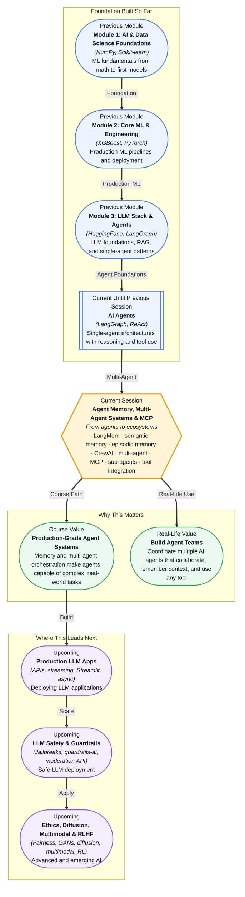

# Pre-read: Agent Memory, Multi-Agent Systems & Model Context Protocol (MCP)

## Context of This Session in the Course

You have built an AI agent. It reasons through problems, calls tools, follows a LangGraph workflow, and completes tasks autonomously. You ask it to handle a customer support ticket — investigate a delayed order, check inventory across warehouses, coordinate a refund. The agent executes everything perfectly. Then the next customer asks about a similar issue, and the agent starts from complete scratch. It does not remember the refund policy it looked up five minutes ago. It cannot recall that it called the warehouse API twice already this shift. It has no sense of continuity across conversations — every query is a fresh, amnesia-stricken beginning. And when a customer asks a question that spans billing, logistics, and product knowledge, your single agent struggles because one brain is trying to be an expert in every domain at once.

The immediate impulse is to cram more context into the agent's prompt. Make the system prompt longer. Append conversation history. Stuff the context window with every tool description you own. But context windows are finite, and every token you add makes the agent slower, more expensive, and more prone to losing the true signal in a sea of text. A monolithic agent armed with fifty tools becomes indecisive — it spends more time choosing which tool to call than actually solving the problem. The naive approach of "one agent, more context" collapses under its own weight. What you need is not a bigger agent — it is a system where agents remember what they learned, hand off work to specialists, and discover tools through a standard protocol rather than hardcoded integrations.

That is where **Agent Memory, Multi-Agent Systems & Model Context Protocol (MCP)** becomes essential.

---

**What if** you were responsible for the AI operations layer of an e-commerce platform that processes ten thousand orders a day — handling refunds, coordinating inventory across three continents, managing logistics handoffs, and responding to customer inquiries in real time — and you needed agents that remember every warehouse check they performed, every customer they spoke to, and every policy they referenced, while orchestrating a team of specialist sub-agents who each own a domain (billing, shipping, returns, fraud detection), all connected through a standardised protocol so that swapping a payment gateway or adding a new data source does not require rewriting your entire agent codebase? What if your senior agent could delegate a billing question to the billing specialist agent, receive its findings, and compose a final answer using knowledge from both its own memory and the specialist's report — all without you manually wiring every interaction? That is the capability this session unlocks. Whether you are building a legal research assistant that remembers case law from prior matters, a healthcare triage system where a triage agent hands off to specialists, or an internal IT helpdesk where agents access live system status through pluggable tools, the patterns are the same: memory, multi-agent orchestration, and a standard tool protocol.

---

A single agent with one context window, one tool set, and no persistent memory is like a brilliant but exhausted employee working a 24-hour shift — it starts strong, but every new conversation resets it to zero. **Semantic memory** — the storage of facts, policies, and knowledge that the agent retains across sessions — and **episodic memory** — the record of past actions, decisions made, tools called, and outcomes observed — solve this by giving the agent a durable, queryable record of its own experience. Think of semantic memory as the agent's reference library (what it knows) and episodic memory as its personal journal (what it has done). Together, they transform an agent from a stateless function call into a learning system that improves with every interaction.

This is where **LangMem** enters. LangMem provides structured memory primitives for LLM agents — you configure what the agent should remember, how memories are stored (as embeddings, structured records, or summaries), and when they are retrieved and injected into the agent's context. But memory alone is only half the picture. **Multi-agent orchestration** with frameworks like **CrewAI** moves you from a single agent doing everything to a team of specialists: a researcher agent that gathers data, a writer agent that drafts responses, a reviewer agent that checks quality — each with its own memory store, its own tools, and its own defined role. **Sub-agent patterns** emerge naturally: a manager agent breaks a complex request into subtasks, delegates each to a sub-agent, and synthesises the results. And across all of this, **MCP (Model Context Protocol)** standardises how agents discover and invoke tools. Instead of hardcoding API calls for every external service, MCP defines a client-server protocol where agents (MCP clients) discover available tools, resources, and prompts from MCP servers at runtime. This is the difference between a system where adding a new API means editing source code and redeploying, and a system where adding a new API means starting a new MCP server that any agent can discover and use immediately.

---

In the **previous session**, you built AI agents using the **ReAct pattern** and **LangGraph** — agents that can reason step-by-step, call tools based on that reasoning, route conditionally between graph states, and include human-in-the-loop validation gates. That single-agent architecture is the essential foundation for everything in this session. You saw how an agent can observe its environment, decide on an action, execute a tool call, and incorporate the result back into its reasoning loop. But you likely noticed its constraints: the agent works alone, it forgets everything when the conversation ends or the graph resets, and every new tool required a custom integration wired directly into the agent's tool definitions. This session breaks those constraints on three axes: persistent memory so agents learn from experience rather than starting fresh each time, multi-agent orchestration so specialists can parallelise work and collaborate, and the Model Context Protocol so tools become discoverable and pluggable at runtime rather than hardcoded at development time.

---

In this pre-read, you will discover:

- How to **understand** the limitations of single-agent, stateless architectures and why memory and multi-agent design are necessary for production-grade systems.
- How to **learn** the distinction between semantic memory (facts and knowledge) and episodic memory (past actions and experiences) and how LangMem implements both.
- How to **apply** multi-agent orchestration patterns using CrewAI, including role-based agents, task delegation, and sub-agent handoffs.
- How to **connect** MCP architecture to your existing agents so they discover and use tools dynamically through a standard protocol.

---

## Why an Agent Without Memory Cannot Improve

An agent without memory faces the same question every time it starts: *Who am I, what do I know, and what have I done?* It has no recollection of the last customer it served, the policy document it retrieved, or the tool call that returned an error. Every interaction is a groundhog day — the agent repeats the same lookups, makes the same mistakes, and never accumulates wisdom.

**Semantic memory** solves the knowledge problem. When an agent reads a company policy document during one conversation, it can store the key facts in semantic memory and retrieve them in a later conversation without re-querying the document. The agent builds a personal knowledge base over time. **Episodic memory** solves the experience problem. It stores sequences of actions — "I called the inventory API at 2:34 PM, it returned stock level 42 for product X, and I authorised the refund." The next time a similar refund request arrives, the agent can recall that specific sequence, note what worked, and follow the same efficient path instead of reasoning from scratch.

LangMem implements both types through configurable memory stores. You define what triggers a memory write (after a tool call returns, after a conversation ends), how memories are indexed (by semantic similarity, by timestamp, by entity), and how they are retrieved (automatically injected into the system prompt, fetched on demand, summarised into a compact digest). This turns your agent from a stateless function — input in, output out, memory discarded — into a stateful system that gets better at its job the more work it does.

---

## From One Agent Doing Everything to a Team of Specialists

A single agent with thirty tools is slow. Every decision requires scanning all thirty tool descriptions, evaluating which one fits, calling it, processing the result, and looping. The agent becomes a bottleneck because one brain is pretending to be an expert in inventory management, billing policy, shipping logistics, fraud detection, and customer communication simultaneously. No human would work this way, and no agent should either.

**Multi-agent orchestration** with **CrewAI** changes the architecture. Instead of one agent with thirty tools, you create a crew of specialised agents, each with a focused role, a small set of relevant tools, and its own memory. A billing agent knows PaymentGateway and RefundPolicy tools. A logistics agent knows TrackingAPI and WarehouseStatus tools. A manager agent does not need to know how to call a payment API — it needs to know which agent to delegate to. This is the **sub-agent pattern**: the manager decomposes a complex request ("customer order #4821 is delayed, investigate and resolve") into subtasks, assigns each to the appropriate sub-agent, collects results, and synthesises a coherent final response. Sub-agents can even spawn their own sub-agents for narrower subtasks, creating a hierarchy of expertise.

CrewAI formalises this with three primitives: **Agents** (roles, goals, backstories, tools, memory), **Tasks** (descriptions, expected outputs, assigned agents), and **Crews** (the orchestration flow that sequences tasks and manages handoffs). The result is a system where complexity is managed through division of labour rather than through larger context windows — a principle that scales far beyond AI agents and into every well-architected engineering system.

---

## Where Agent Memory and Multi-Agent Systems Appear in Real Life

These patterns are not theoretical — they are already deployed in production systems that handle high-stakes, multi-domain decisions.

In **financial services**, a fraud detection crew might consist of a transaction analyst agent that examines payment patterns, a customer profile agent that checks behavioural history, and a compliance agent that reviews regulatory flags — each with its own memory of past cases, coordinated by a manager agent that decides whether to approve, flag, or escalate. The manager does not need to be an expert in every fraud pattern; it trusts its specialists and synthesises their findings.

In **healthcare**, a clinical decision support system can use sub-agents: a symptoms analyst agent, a medication interaction checker agent, and a patient history agent — each accessing different databases through MCP servers, each maintaining episodic memory of prior cases, and each reporting to a supervising physician agent that presents a consolidated recommendation. The **Model Context Protocol** makes this practical by standardising how each agent discovers and connects to hospital systems (EMR databases, drug interaction APIs, lab result services) without custom integration code for every data source.

In **enterprise IT operations**, an incident response crew can include a log analysis agent, a metrics agent (querying Prometheus through an MCP server), a deployment history agent, and a communication agent that drafts status updates — all coordinated by a senior agent that triages the severity and delegates investigation threads in parallel. The agents remember past incidents through LangMem-backed episodic memory, so when a similar pattern repeats, the crew resolves it in minutes instead of hours.

In **legal and compliance**, a contract review crew can distribute document sections across sub-agents: one for jurisdiction clauses, one for liability terms, one for data privacy compliance — each equipped with domain-specific knowledge stored in semantic memory. An MCP server connects them to live regulatory databases so their knowledge is always current. What was once a single agent drowning in a hundred-page contract becomes a focused team completing the review in a fraction of the time.

---

## What's Next

After this session, you will be able to:

- Distinguish between semantic and episodic memory and configure LangMem to store and retrieve agent knowledge across sessions.
- Design a multi-agent crew with CrewAI, defining agent roles, tasks, and delegation flows.
- Implement the sub-agent pattern where a manager agent decomposes work and delegates to specialist agents.
- Understand the MCP architecture and how MCP servers expose tools, resources, and prompts that any MCP client agent can discover.
- Connect agents to external tools through MCP without hardcoding API integrations.
- Recognise when a single-agent architecture is insufficient and a multi-agent, memory-backed design is warranted.

You do not need to build a production multi-agent system with full MCP integration in this session. The goal is to see why memory and multi-agent design are not optional enhancements but fundamental architectural decisions: **agents that remember, collaborate, and connect through standard protocols are what turn prototypes into production systems.**

---

## Interesting Questions for the Live Session

- If an agent can retrieve its own past decisions from episodic memory, how do you prevent it from reinforcing incorrect patterns instead of learning from them?
- When a manager agent delegates to sub-agents, who is accountable if the final answer is wrong — the sub-agent that provided faulty information, or the manager who trusted it?
- MCP makes tools dynamically discoverable, but that also means an agent could discover and call a tool it was not explicitly authorised to use — how should access control work in an MCP ecosystem?
- LangMem stores memories as retrievable records, but at what point does an agent's accumulated memory become so large that retrieval degrades and the agent slows down — and how would you compress or forget strategically?

By the end of this session, agent memory and multi-agent architecture should feel less like experimental research and more like a practical scalability pattern: **agents that remember, collaborate, and plug into any tool form the backbone of production-grade AI systems.**
