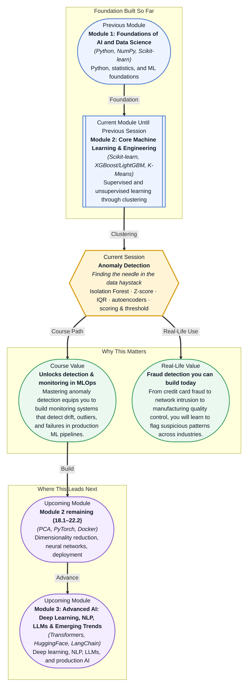

# Pre-read: Anomaly Detection

## Context of This Session in the Course

Your bank's fraud detection system pings your phone with a notification: "Unusual transaction — was this you?" You tap "No," the card is instantly blocked, and a replacement arrives the next day. Behind that seamless experience is a model that scanned millions of transactions in real time and singled out exactly one as suspicious. No human reviewed every purchase. A machine made the call.

The naive approach would be to write rules: "Flag any transaction above ₹50,000" or "Block purchases from a new country." But fraudsters adapt. A ₹49,000 transaction slips under the threshold. A stolen card is used locally for small purchases. Simple rules miss subtle patterns, and worse, they drown you in false alarms when legitimate customers travel or make large purchases. The real problem is that fraudulent behaviour looks almost like normal behaviour — just different enough to be invisible to a rule, but detectable to the right algorithm.

That is where **Anomaly Detection** becomes essential.

What if you were the data scientist responsible for protecting a payment platform processing a million transactions a day? A single undetected fraud incident could cost thousands of rupees, but flagging too many legitimate transactions frustrates customers and burns out the support team. You need a system that learns what normal looks like, adapts to new fraud patterns without manual rule updates, and surfaces only the transactions that genuinely warrant investigation. This session gives you the tools to build exactly that.

**Anomaly detection** is the task of identifying rare items, events, or observations that raise suspicion by differing significantly from the majority of the data. Think of it as the reverse of clustering: where clustering finds the dense, common groupings, anomaly detection finds the lonely points far from any group. The core techniques span from simple statistical methods to sophisticated tree-based algorithms. You will explore the **Z-score** and **IQR** (Interquartile Range) methods, which measure how far a point is from the centre of the data in standard deviations or quartile ranges. You will then dive into the **Isolation Forest algorithm** — a tree-based approach that isolates anomalies by randomly splitting the data, relying on the insight that anomalies are rare and therefore easier to separate. You will also get an introductory look at **autoencoders**, neural networks that learn to reconstruct normal data and flag anomalies through their reconstruction error. And throughout, you will grapple with the practical challenge of **scoring and threshold selection**: how do you decide the cutoff that balances missed fraud against false alarms?

In the **previous session**, you explored Clustering with K-Means, DBSCAN, and hierarchical methods. You learned to group data points into clusters — essentially finding what is "normal" or typical by identifying dense regions in the data. Anomaly detection flips this perspective entirely. Instead of modelling the majority, you now learn to spotlight the few points that belong to no group. Your understanding of distance metrics from K-Means and DBSCAN translates directly: a point far from every cluster centroid is a natural anomaly candidate. And the silhouette score you used to evaluate clustering quality gives you intuition for how "separated" anomalies may be from the main distribution. Clustering taught you to see the structure in data; anomaly detection teaches you to notice when something breaks that structure.

## In this pre-read, you will discover:

- How to detect anomalies using the **Isolation Forest** algorithm and interpret its scoring mechanism
- How to apply **Z-score and IQR** methods for fast, interpretable statistical anomaly detection
- How to select and tune **scoring thresholds** based on the cost of false positives versus false negatives
- How to connect these techniques to a **real-world fraud detection case study** and see where autoencoders fit into the picture

---

## How Isolation Forest Isolates the Unusual

Most machine learning algorithms build a model of what normal looks like and then measure how far a new point deviates from that model. **Isolation Forest** takes a radically different approach: instead of profiling normality, it directly isolates anomalies. The algorithm repeatedly and randomly selects a feature, picks a random split value between the minimum and maximum of that feature, and partitions the data. It builds an entire forest of such random decision trees. Because anomalies are rare and their feature values differ from the majority, they require far fewer random splits to be separated into their own leaf. A normal point, surrounded by many similar points, needs many more splits to be isolated. The anomaly score is derived from the average path length across all trees — shorter paths mean more anomalous.

This approach gives Isolation Forest several practical advantages. It handles high-dimensional data well because it does not need to compute distances in the full feature space. It is computationally efficient with a linear time complexity, making it suitable for large datasets. And it requires no assumption about the underlying data distribution, unlike statistical methods that assume normality. In the session, you will train an Isolation Forest using Scikit-learn, examine how changing the contamination parameter affects which points get flagged, and see why this algorithm is the go-to choice for modern fraud detection pipelines. The same session also introduces **autoencoders** — a neural network architecture trained to compress and reconstruct normal data. When an autoencoder encounters an anomaly, the reconstruction error spikes, providing a deep-learning-powered signal for anomalies in complex, high-dimensional spaces like images or sequences.

## Why Z-Score and IQR Matter — and When to Be Wary

Before tree-based methods entered the mainstream, anomaly detection relied on simple statistical assumptions about how data is distributed. The **Z-score** measures how many standard deviations a data point lies from the mean. In a normally distributed dataset, about 95% of points fall within two standard deviations and 99.7% within three. A transaction with a Z-score of 4.5 is exceptionally rare and worth investigating. The **Interquartile Range (IQR)** method is more robust: it looks at the spread between the 25th and 75th percentiles and flags any point that falls below the first quartile minus 1.5 times the IQR, or above the third quartile plus 1.5 times the IQR. These methods are fast, transparent, and require no training — you can run them on a spreadsheet.

Their appeal is also their limitation. Both methods assume each feature can be evaluated independently, so they miss anomalies that only appear through unusual combinations of features. The Z-score is sensitive to outliers — the very thing you are trying to detect can distort the mean and standard deviation you are measuring against. The IQR handles this better but still assumes a unimodal distribution where normal data clusters in one region. Real-world fraud is often multimodal: legitimate transactions cluster differently by region, time of day, and customer segment. This is where **scoring and threshold selection** becomes a business decision rather than a purely mathematical one. Every threshold creates a tradeoff between precision and recall, between false positives that irritate customers and false negatives that let fraud through. You will explore this tradeoff directly in the fraud detection case study, learning to calibrate your thresholds using the tools you already know from classification evaluation.

## Where Anomaly Detection Appears in Real Life

The most visible application is financial fraud detection. Every card transaction, insurance claim, and account login generates a real-time anomaly score. Banks and payment processors use Isolation Forest and statistical methods to screen millions of events per second, flagging the tiny fraction that diverge from a customer's historical pattern. In cybersecurity, anomaly detection powers network intrusion systems that monitor packet flows for deviations from normal traffic baselines — a sudden spike in outbound data or an unusual protocol handshake can signal a breach before damage is done. On the manufacturing floor, sensor data from industrial equipment is continuously scored for anomalies; a vibration pattern that drifts from normal indicates bearing wear, triggering predictive maintenance before a catastrophic failure stops the production line. In healthcare, patient monitors and wearable devices detect anomalous vital signs — a heart rate that suddenly diverges from a patient's recovery trajectory — prompting early intervention for conditions like sepsis or cardiac events. Even e-commerce platforms rely on anomaly detection to identify click fraud, fake reviews, and inventory discrepancies, separating genuine user behaviour from automated abuse. Across every industry, the core challenge is the same: the signal is rare, the noise is vast, and the cost of missing the signal is high.

## What's Next

After this session, you will be able to:

- Detect anomalies in a dataset using the Isolation Forest algorithm from Scikit-learn and interpret the resulting anomaly scores
- Apply Z-score and IQR methods for univariate anomaly detection and explain when statistical assumptions limit their effectiveness
- Select and tune scoring thresholds by weighing the business cost of false positives against false negatives
- Connect anomaly detection techniques to a real-world fraudulent transaction dataset through a guided case study
- Recognise where autoencoders can extend anomaly detection to complex, unstructured data like images and sequences

You do not need to memorise every formula or implement an autoencoder from scratch right now. The goal is to see outliers not as noise to remove, but as signals worth investigating — **finding the exception that matters.**

## Interesting Questions for the Live Session

- If your dataset has 99.9% normal transactions and 0.1% fraudulent ones, why might a model that simply predicts "normal" for every row achieve 99.9% accuracy while being completely useless, and how do anomaly detection methods address this directly?
- Isolation Forest builds trees using random splits without ever seeing a target variable — how is this fundamentally different from a supervised decision tree, and what does that tell you about the types of patterns anomaly detection is designed to find?
- You deploy a fraud detector using Z-scores and it works well for six months, then suddenly generates a surge of false alarms — what might have changed in the data, and how would you diagnose and respond to this drift?
- In a fraud detection system, every false positive costs a manual review and every false negative lets a fraudulent transaction through — if you could only optimise one side of this tradeoff, which would you choose for a low-value, high-volume payment system versus a high-value, low-volume one, and why?

By the end of this session, anomaly detection should feel less like an abstract statistical concept and more like a practical investigation tool: **finding the exception that matters.**
