# Pre-read: BERT & GPT with HuggingFace

## Context of This Session in the Course

```mermaid
%%{init: {"flowchart": {"nodeSpacing": 45, "rankSpacing": 65, "diagramPadding": 20}} }%%
flowchart TB
    subgraph Foundation["Foundation Built So Far"]
        P1(["Previous Module<br/><b>Module 1: AI &amp; Data Science Foundations</b><br/><i>(NumPy, Scikit-learn)</i><br/>ML fundamentals from linear algebra through pipelines"])
        P2(["Previous Module<br/><b>Module 2: Core ML &amp; Engineering</b><br/><i>(PyTorch, XGBoost)</i><br/>Neural networks, ensemble methods, production ML"])
        P3(["Previous Module<br/><b>Module 3 Until Now — Vision &amp; NLP</b><br/><i>(CNN, Transfer Learning, Tokenization, Word2Vec)</i><br/>Deep learning foundations for vision and text"])
        C1[["Current Until Previous Session<br/><b>Transformer Architecture</b><br/><i>(Self-attention, Q/K/V, positional encoding)</i><br/>Understanding the attention mechanism behind LLMs"]]
    end

    CS{{"Current Session<br/><b>BERT &amp; GPT with HuggingFace</b><br/><i>Pre-trained models for everyone</i><br/>BERT · masked language modeling · GPT · causal masking · HuggingFace pipeline · fine-tuning · text classification"}}

    subgraph Value["Why This Matters"]
        CV(["Course Value<br/><b>Pre-Trained AI Power</b><br/>HuggingFace gives you state-of-the-art models with just a few lines of code"])
        RV(["Real-Life Value<br/><b>NLP in Production</b><br/>Build text classifiers, question answerers, and language generators in minutes"])
    end

    subgraph Future["Where This Leads Next"]
        F1(["Upcoming<br/><b>LLM Evaluation</b><br/><i>(MMLU, BLEU, ROUGE, Ragas)</i><br/>Measuring LLM output quality"])
        F2(["Upcoming<br/><b>LLM Fine-Tuning</b><br/><i>(LoRA, QLoRA, PEFT, SFT)</i><br/>Efficient LLM customization"])
        F3(["Upcoming<br/><b>RAG, Agents &amp; Production Systems</b><br/><i>(Vector DBs, LangGraph, RLHF)</i><br/>Advanced LLM systems in production"])
    end

    P1 ==>|&nbsp;Foundation&nbsp;| P2
    P2 ==>|&nbsp;Production ML&nbsp;| P3
    P3 ==>|&nbsp;Transformers&nbsp;| C1
    C1 ==>|&nbsp;Pre-trained Models&nbsp;| CS
    CS ==>|&nbsp;Course Path&nbsp;| CV
    CS ==>|&nbsp;Real-Life Use&nbsp;| RV
    CV ==>|&nbsp;Build&nbsp;| F1
    F1 ==>|&nbsp;Scale&nbsp;| F2
    F2 ==>|&nbsp;Apply&nbsp;| F3

    classDef previous fill:#eef4ff,stroke:#4f7ccf,color:#111827,stroke-width:2px;
    classDef current fill:#fff4d6,stroke:#d9a321,color:#111827,stroke-width:3px;
    classDef value fill:#eaf8ef,stroke:#3f9f63,color:#111827,stroke-width:2px;
    classDef future fill:#f4ecff,stroke:#8a61d1,color:#111827,stroke-width:2px;

    class P1,P2,P3,C1 previous;
    class CS current;
    class CV,RV value;
    class F1,F2,F3 future;
    linkStyle default stroke-width:3px;
```

You join a product team that manages a customer support inbox receiving 5,000 messages a day. Users write in about billing issues, account access problems, feature requests, cancellations, and refunds. The team currently triages everything manually — a support agent reads each message, tags it with a category, prioritises it, and drafts a response. Every new team member spends weeks learning the difference between a billing escalation and a technical outage. The company wants you to build a system that reads the incoming message, classifies it into the right category, and routes it to the appropriate team — all in under a second.

The natural instinct is to treat this as a text classification problem. You think about bag-of-words, TF-IDF vectors, and a logistic regression classifier. You implement it, and it works — somewhat. It catches obvious keywords like "refund" and "password reset" but completely collapses on ambiguous messages like "I was charged twice but I also can't log in" (which is both a billing issue and an account problem). Worse, it cannot understand the meaning behind sentences that use no obvious keywords — "I need someone to reverse a transaction on my recent order" contains none of the words you trained on for "refund" but obviously means exactly that. Your bag-of-words model has no notion of word order, context, or semantics. It sees a cloud of independent words and guesses based on frequency, not understanding.

That is where pre-trained language models become essential. Instead of building a classifier from scratch with handcrafted features, you can take a model that has already read millions of sentences across the entire internet — a model that understands that "reverse a transaction" means the same thing as "refund" — and adapt it to your specific classification task with just a few lines of code. **BERT & GPT with HuggingFace** gives you exactly this power: state-of-the-art NLP models that you can load, fine-tune, and deploy without building anything from scratch.

---

**What if** you had to build a system that reads all 5,000 daily customer emails, classifies each one into 12 distinct categories with 95% accuracy, identifies whether the customer is frustrated or calm, and generates a draft response with the correct policy reference — all without a dedicated NLP engineering team? You cannot train a model from scratch — you do not have 10 million labelled emails. You cannot handcraft rules for every edge case — the language customers use is too varied. And you certainly cannot hire enough agents to do it manually at scale. This session gives you the tools to build exactly that system: a **BERT** model fine-tuned for text classification that understands the semantic nuance of customer language, and a **HuggingFace** pipeline that wraps the entire inference workflow into a single call. What once required a PhD-level research team and months of training now takes an afternoon with a Jupyter notebook and a pre-trained checkpoint.

---

**Pre-trained language models** are neural networks trained on enormous text corpora — billions of words from Wikipedia, books, news articles, and web pages — that learn general-purpose representations of language before being adapted to specific tasks. The two most influential architectures for this are **BERT** (Bidirectional Encoder Representations from Transformers) and **GPT** (Generative Pre-trained Transformer). BERT is a bidirectional model: when processing a sentence, it looks at the words on both the left and the right of every token simultaneously. It was trained using **masked language modeling**, where random words in a sentence are hidden and the model learns to predict them from surrounding context — like a fill-in-the-blank exercise where the blank can be informed by everything before and after it. GPT, on the other hand, is an **autoregressive** model: it reads text strictly from left to right, predicting the next token given only the tokens before it. This is called **causal masking** — the model cannot peek at future tokens.

Think of the difference as two ways of understanding a sentence. BERT is like a student who reads the entire paragraph before answering a comprehension question — they see the whole picture before making a judgment. GPT is like a writer composing a story one word at a time — at each step, they only know what they have written so far, and they decide what comes next. Neither approach is universally better; they excel at different tasks. BERT, with its bidirectional view, is ideal for classification, question answering, and named entity recognition — tasks that benefit from understanding the full context. GPT, with its autoregressive design, is ideal for generation, summarisation, and dialogue — tasks where producing coherent, flowing text is the goal. In this session, you will use the **HuggingFace transformers library** to load both architectures, run inference with the **pipeline API**, and fine-tune a BERT model for **text classification** — taking a pre-trained checkpoint and adapting it to your own labelled data.

---

In the **previous session**, you studied the transformer architecture in depth: self-attention, the Query/Key/Value mechanism, multi-head attention, positional encoding, and the encoder-decoder structure that powers every modern language model. You saw how self-attention allows every token to attend to every other token in the sequence, how multi-head attention gives the model multiple representation subspaces, and how positional encoding injects information about word order into a fundamentally order-agnostic attention computation. That architecture is the engine inside both BERT and GPT. BERT uses the **encoder stack** of the transformer — the part that reads the entire input bidirectionally and produces rich contextual representations for every token. GPT uses the **decoder stack** — the part that generates text one token at a time using causal masking. Everything you learned about Q/K/V multiplication, attention scores, and multi-head splitting applies directly: you are not learning a new mechanism today, you are seeing how the same mechanism is specialised for two different purposes.

---

In this pre-read, you will discover:

- How to **understand** the difference between BERT's bidirectional masked language modeling and GPT's autoregressive causal masking, and why each is suited to different NLP tasks.
- How to **apply** the HuggingFace transformers pipeline API to perform text classification, text generation, and other NLP tasks with minimal code.
- How to **recognise** the teacher-forcing training pattern used during fine-tuning and how it differs from the autoregressive generation pattern used during inference.
- How to **build** a text classifier by fine-tuning a pre-trained BERT model on a custom labelled dataset.

---

## Why BERT Reads in Both Directions and GPT Reads Only Forward

The design choice between bidirectional and unidirectional attention is not arbitrary — it reflects a fundamental trade-off between understanding and generation. BERT was designed to solve NLU (Natural Language Understanding) tasks: classification, question answering, entailment, and named entity recognition. For these tasks, every word in the input is available at once, and the model benefits enormously from seeing the full context. When you classify a movie review as positive or negative, the word "not" in "not bad at all" completely changes the sentiment, and BERT sees that "not" modifies "bad" because it can attend to both words in both directions simultaneously. This bidirectional context is what gives BERT its deep representational power — it builds a representation of each token that is informed by every other token in the sequence.

GPT was designed for NLG (Natural Language Generation) tasks: text completion, summarisation, translation, and dialogue. For these tasks, the model must produce text sequentially, one token at a time, and it cannot know what comes next. If GPT could see future tokens during training, it would simply copy them instead of learning to predict. The causal mask enforces this: during the attention computation, each token can only attend to tokens at positions less than or equal to its own. This means GPT's training objective — **next token prediction** — forces the model to build a representation that is genuinely predictive. The trade-off is that GPT has no access to future context, which makes it weaker at pure classification tasks compared to BERT. Understanding this trade-off is critical: when you reach for a pre-trained model, you choose BERT when you need to analyse or classify existing text, and GPT when you need to generate new text.

---

## How HuggingFace Turns Transformers into a Three-Line Python Script

Before the HuggingFace transformers library, using a model like BERT meant cloning a GitHub repository, installing custom CUDA kernels, writing a tokenisation pipeline from scratch, managing model checkpoints manually, and praying that the configuration files were compatible. The ecosystem was fragmented — BERT had one codebase, GPT-2 had another, and they shared nothing. HuggingFace unified this landscape by creating a single library with a consistent API: every model, whether BERT, GPT, RoBERTa, DistilBERT, or T5, shares the same `model`, `tokenizer`, and `pipeline` interface. You load a tokenizer and model with `from_pretrained()`, tokenise your text, pass it through the model, and decode the output. The **pipeline API** abstracts even further: `pipeline("sentiment-analysis")` gives you a complete inference pipeline — tokenisation, model forward pass, and output decoding — in a single line of code.

The power of this abstraction becomes visible when you fine-tune. Instead of building a classification head from scratch, you load a pre-trained BERT model, replace the final classification layer with one that matches your number of classes, and train for a few epochs on your labelled data. The HuggingFace `Trainer` API handles batching, gradient accumulation, logging, evaluation, and checkpointing. The underlying attention mechanism — the Q/K/V multi-head self-attention you studied in the previous session — remains unchanged. You are not modifying how the model reads language; you are only teaching it which patterns in its existing representations correspond to your specific classes. The same architecture that learned to understand Wikipedia sentences is now learning to distinguish a billing issue from a technical outage, and the only thing you changed was the last linear layer.

---

## Where BERT and GPT Appear in Real Life

In **customer experience and support**, BERT-based classifiers route incoming tickets to the correct team with 90-95% accuracy, reducing manual triage time by hours per day. Companies like Zendesk and Intercom embed fine-tuned BERT models in their routing pipelines, where the model reads every new ticket and assigns department, priority, and sentiment labels simultaneously. In **content moderation**, platforms like Reddit and Discord use fine-tuned BERT classifiers to detect toxic comments, spam, and policy violations in real time, processing millions of posts daily. The same bidirectional understanding that makes BERT good at sentiment analysis makes it good at recognising hate speech, even when it uses subtle phrasing that keyword filters would miss. In **healthcare**, BERT models fine-tuned on clinical notes classify patient records by diagnosis category, extract medical entities like medication names and dosages, and answer questions about treatment protocols from unstructured doctor notes. In **code generation and developer tools**, GPT-based models power GitHub Copilot, TabNine, and Cursor — they take the code you have already written and predict what you will write next, one token at a time, using the same causal masking and next-token prediction you will study in this session. In **email and document classification**, every major SaaS platform — Gmail's smart categories, Outlook's focused inbox, Notion's AI search — uses a fine-tuned transformer model under the hood. The pattern across every industry is the same: a pre-trained model that already understands language is loaded from HuggingFace, fine-tuned on a specific labelled dataset, and deployed through a pipeline that makes the entire system look deceptively simple from the outside.

---

## What's Next

After this session, you will be able to:

- Load a pre-trained BERT or GPT model from HuggingFace using `from_pretrained()` and run inference with the pipeline API.
- Explain the difference between bidirectional attention (BERT) and causal masked attention (GPT) in terms of their attention matrices and training objectives.
- Fine-tune a BERT model for text classification using the HuggingFace Trainer API on a custom labelled dataset.
- Tokenise text inputs using the correct tokenizer for each model and understand how subword tokenisation (WordPiece, BPE) handles out-of-vocabulary words.
- Contrast the teacher-forcing training loop of BERT with the autoregressive generation loop of GPT and identify when each is appropriate.
- Build a complete text classification pipeline from raw text input to predicted class label using HuggingFace components.

You do not need to reimplement the transformer from scratch right now. The goal is to understand that every modern NLP application you use — smart replies, content moderation, search ranking, code autocomplete — is powered by a pre-trained model you can load in three lines of Python: **the architecture is the same; only the fine-tuning data changes.**

---

## Interesting Questions for the Live Session

- BERT uses bidirectional attention, meaning every token attends to every other token. During fine-tuning for text classification, does the `[CLS]` token's representation contain information from all tokens equally, or do certain tokens dominate its attention distribution?
- GPT cannot see future tokens because of causal masking. When you use GPT for text generation, how does the model decide when to stop generating? What happens if you set the maximum token length too short or too long?
- A BERT model fine-tuned on product reviews achieves 96% accuracy on the test set. You deploy it on live reviews and accuracy drops to 82%. The distribution of reviews has not changed. What is the most likely cause, and how would you detect it?
- HuggingFace's `pipeline("text-classification")` abstracts away tokenisation, model inference, and post-processing. What practical problems could this abstraction hide when you move from a notebook to a production API serving 10,000 requests per second?

By the end of this session, BERT and GPT should feel less like mysterious research breakthroughs and more like practical tools you can load, adapt, and deploy: **pre-trained transformers are the NumPy of modern NLP — the foundational building block that everyone builds on top of.**
