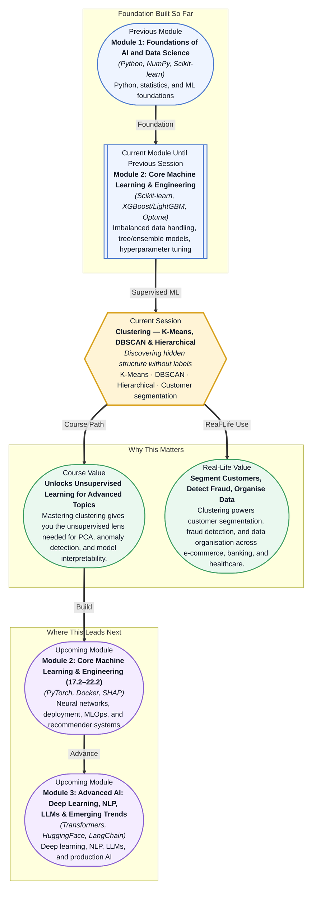

# Pre-read: Clustering — K-Means, DBSCAN & Hierarchical

## Context of This Session in the Course

You work on the marketing team at an e-commerce company with a million customers. Your manager asks for a customer segmentation — high-value, mid-tier, bargain-hunters — to personalise promotions. But there are no labels. No one has tagged a single customer. You cannot train a classifier because you have nothing to predict. So you open a spreadsheet and start drawing thresholds: spend above ₹10,000 is high-value, below ₹2,000 is bargain-hunter. The results are brittle — two customers who spent ₹9,800 and ₹10,200 end up in completely different tiers, and your segments change every month as you tweak the cut-offs.

The deeper problem is that thresholds are arbitrary. They impose rigid boundaries on data that has none. Real customer behaviour does not respect neat spreadsheet cut-offs — it forms natural groupings based on purchasing frequency, category preferences, average basket size, and dozens of other signals you cannot capture with a few manually chosen rules. What you need is a way to let the data reveal its own structure, without forcing your assumptions onto it. That is where **Clustering** becomes essential.

What if you could hand an algorithm a raw customer dataset — purchase amounts, visit frequency, product categories, time since last purchase — and have it automatically uncover distinct behavioural segments, each with a clear profile, without you writing a single business rule? What if the same approach could help a radiologist group tumour images by morphology, or help a fraud team discover suspicious transaction patterns they had never thought to look for? Clustering turns unlabeled data from a problem into a source of insight, and after this session, you will be the one finding those hidden groups.

**Clustering** is the task of partitioning data into groups (clusters) such that points in the same group are more similar to each other than to points in other groups. It belongs to a category called **unsupervised learning** — you have data but no labels, no "right answer" to train against. Think of organising a library without having read any of the books: you might group by cover colour, by thickness, by how often they are borrowed — but the "right" grouping depends entirely on what you care about, and no single grouping is objectively correct. This is the fundamental shift from every model you have built so far: clustering does not predict anything; it reveals structure.

Different clustering algorithms make different assumptions about what makes a good group, which means your choice of algorithm is itself a design decision. **K-Means** assumes clusters are spherical and roughly equal in size — it is fast, scalable, and works beautifully on well-behaved data. **DBSCAN** assumes clusters are dense regions separated by sparse regions, making it ideal for irregular shapes and noisy data. **Hierarchical clustering** makes no strong shape assumptions and instead builds a complete tree of possible groupings, leaving the final cut to you. Each approach is suited to a different kind of problem, and evaluating them requires different tools — the **elbow method** and **silhouette score** for K-Means, neighbourhood analysis for DBSCAN, and dendrogram inspection for hierarchical clustering.

In the **previous session**, you practised hyperparameter tuning and experiment tracking — using GridSearchCV, RandomizedSearchCV, and Optuna to find optimal model parameters, and logging those experiments with MLflow and Weights & Biases. That systematic search mindset carries directly into clustering. Choosing K in K-Means with the elbow method is a hyperparameter search; tuning DBSCAN's eps and min_samples is a grid search over density assumptions. The difference is that without labels, your evaluation metrics change — you move from accuracy or F1-score to internal validation metrics like silhouette score and inertia. The tools and the rigour remain the same.

In this pre-read, you will discover:
- How to apply **K-Means** with k-means++ initialisation to segment unlabeled data.
- How to evaluate cluster quality using the **elbow method** and **silhouette score**.
- How to distinguish density-based clustering (**DBSCAN**) from centroid-based approaches and when to use each.
- How to interpret **hierarchical clustering** dendrograms and linkage strategies for real-world segmentation.

---

## How K-Means Finds Groups — and the Art of Choosing K

K-Means is the workhorse of clustering: you tell it how many groups you want (K), and it finds K centre points (centroids) that minimise the average distance from each point to its assigned centroid. The algorithm starts by picking K initial centroids — modern implementations use **k-means++**, which spreads the initial seeds to avoid poor starting positions — then alternates between assigning every point to the nearest centroid and moving each centroid to the mean of its assigned points. This repeats until the centroids stop moving. The result is a clean partition of your data into K spherical, evenly sized clusters.

But how do you choose K? You cannot ask a business stakeholder, "What K should I use?" — they do not know. Instead, you use two diagnostic tools. The **elbow method** plots K against inertia (the sum of squared distances from each point to its centroid) and looks for a "knee" where adding more clusters stops giving meaningful improvement. The **silhouette score** measures how well each point fits its own cluster versus the next nearest cluster, averaged over all points — a score near +1 means dense, well-separated clusters, while values near 0 or negative suggest overlapping or misassigned points. Together, these metrics turn K selection from guesswork into a disciplined, data-driven decision.

The catch is that K-Means assumes clusters are spherical and roughly equal in size. If your customer data contains a small niche of luxury buyers and a massive mainstream segment, K-Means may split the large segment or merge the niche into it. That limitation is not a bug — it is a constraint of the model. When your data violates this assumption, you turn to density-based or hierarchical methods.

## DBSCAN and Hierarchical Clustering — Beyond Spherical Groups

**DBSCAN** (Density-Based Spatial Clustering of Applications with Noise) takes a fundamentally different approach. Instead of assuming clusters are blobs around centres, it defines a cluster as a dense region of points separated by sparser regions. Two parameters control everything: **eps** (the radius of the neighbourhood around each point) and **min_samples** (the minimum number of points needed to form a dense region). A point with at least `min_samples` neighbours within `eps` distance is a **core point**; points within `eps` of a core point but with fewer neighbours are **border points**; and points that are not reachable from any core point are labelled **noise**. This design lets DBSCAN discover clusters of arbitrary shape — crescents, rings, interleaved spirals — and naturally identifies outliers, all without requiring you to specify K beforehand.

**Hierarchical clustering** builds a tree (a dendrogram) of nested groupings, giving you the full flexibility to decide where to cut. The algorithm starts with every point as its own cluster, then iteratively merges the two closest clusters. How you define "closest" is determined by the **linkage strategy**: single linkage (minimum pairwise distance) produces long, chain-like clusters; complete linkage (maximum pairwise distance) creates compact, tight clusters; and average or Ward's linkage strike a balance. The dendrogram lets you see the entire merging history at a glance — you can choose a cut that yields 3 segments for one stakeholder and 5 for another, all from the same tree.

## Where Clustering Appears in Real Life

Customer segmentation is the classic use case — e-commerce platforms group users by purchase behaviour to tailor recommendations, offers, and retention campaigns. But clustering radiates across industries. In **banking**, transaction clustering helps detect fraudulent patterns that traditional rule-based systems miss — a sudden cluster of small, rapid transactions from a single merchant may indicate a card-testing attack. In **healthcare**, clustering of patient vitals or genomic profiles can reveal disease subtypes that respond differently to treatments, enabling personalised medicine protocols. In **logistics**, warehouse inventory clustering groups products that are frequently ordered together, optimising shelf placement and picking routes. In **media and content**, clustering user engagement patterns drives content recommendation — Netflix does not just recommend what you watched; it recommends what the cluster of users most like you watched. Across all these domains, clustering provides the same fundamental value: transforming raw, unlabeled data into actionable structure.

## What's Next

After this session, you will be able to:

- Apply K-Means clustering with k-means++ initialisation using Scikit-learn to segment unlabeled datasets.
- Determine the optimal number of clusters using the elbow method and silhouette score.
- Implement DBSCAN with tuned eps and min_samples parameters to handle non-spherical cluster shapes and detect outliers.
- Distinguish between core points, border points, and noise points in a DBSCAN clustering output.
- Build and interpret hierarchical clustering dendrograms using different linkage strategies.
- Segment real customer data into actionable groups and evaluate the business relevance of each segment.

You do not need to memorise every clustering variant right now — the key is understanding what assumptions each algorithm makes about your data. The goal is to see unlabeled data not as a problem, but as an opportunity to discover hidden structure.

## Interesting Questions for the Live Session

- What happens to K-Means when clusters have vastly different sizes or densities — and why does the algorithm systematically fail to capture them?
- The silhouette score can be computed for any clustering — so if it is positive for a given K, does that guarantee the clusters are meaningful in a business sense?
- DBSCAN's eps parameter can make or break a clustering — how would you choose it when you have no ground truth to validate against?
- Hierarchical clustering gives you a dendrogram of all possible cuts — how do you decide which cut to present to a business stakeholder who wants exactly four segments?

By the end of this session, clustering should feel less like a black-box algorithm and more like a practical lens for uncovering value in unlabeled data: **finding groups is not magic — it is a systematic search for structure.**
