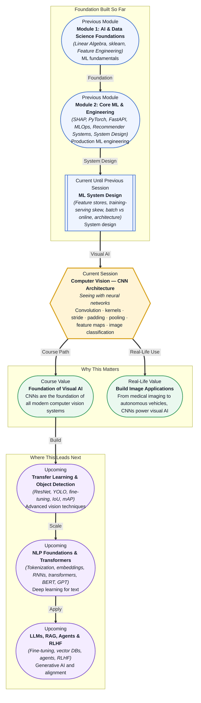

# Pre-read: Computer Vision — CNN Architecture

## Context of This Session in the Course

You upload a photo to social media, and within seconds the platform recognises every face in the frame — tagging friends, suggesting filters, even identifying the dog in the background. That camera on your phone, the one that unlocks when it sees your face, is doing something extraordinary: it is making sense of raw pixels, one grid of numbers at a time, without ever being told what a nose or an eye looks like. This ability to extract meaning from visual data has transformed how we interact with machines, and it rests on a single architectural breakthrough.

The naive approach to image recognition — flatten every pixel into a long list and feed it to a fully connected neural network — collapses immediately. A modest 224×224 colour image produces over 150,000 input values. The first layer alone would demand tens of millions of parameters, and those parameters would treat pixel (0,0) and pixel (223,223) identically, learning nothing about spatial structure. Worse, a cat shifted ten pixels to the left would look like an entirely different input to the network. The problem is not complexity; the problem is that dense layers have no concept of locality, translation, or hierarchy — everything a neural network needs to understand an image.

That is where **Computer Vision — CNN Architecture** becomes essential.

---

What if you were asked to build a system that reads chest X-rays and flags suspicious nodules — with no pre-built vision API, no cloud service, just your own neural network and a dataset of labelled scans? You would need to design a network that learns local patterns (edges, textures, shapes) at multiple scales, that does not care whether a feature appears in the top-left or bottom-right corner, and that can progressively build from simple lines to complete anatomical structures. That is exactly what convolutional neural networks are built to do, and this session gives you the architecture to make it happen.

---

A **convolutional neural network** (CNN or ConvNet) is a specialised neural network designed for grid-structured data — images being the most common example. Instead of connecting every input pixel to every neuron in the next layer, a CNN slides a small window called a **kernel** or **filter** across the image, computing dot products at every position. This single operation — the **convolution** — preserves spatial relationships, reuses the same learned weights across the entire image, and produces a **feature map** that highlights where specific patterns exist.

Think of it like a metal detector sweeping a beach. The detector (kernel) does not have a different sensitivity for every square inch of sand; it applies the same electronic signature everywhere. As you sweep, it beeps (activates) wherever it finds metal — producing a rough map of buried objects. Similarly, an edge-detection kernel sweeps across an image and produces a map of where vertical edges exist. Now imagine dozens of different detectors sweeping simultaneously, each looking for a different pattern — horizontal edges, corners, textures, circles. The output is a stack of **feature maps**, each representing where a particular pattern was found. By stacking **convolutional layers** followed by **pooling layers** (which downsample the feature maps, keeping only the most important activations), the network builds increasingly abstract representations: from pixels to edges to shapes to object parts to complete objects. You will learn how **stride** controls how fast the kernel moves, how **padding** preserves border information, and how pooling strategies like **max pooling** and **average pooling** compress each feature map while retaining its most salient signals. By the end of this session, you will implement a complete CNN that classifies images of cats and dogs.

---

In the **previous session**, you studied ML system design principles — feature stores, training-serving skew, batch versus online inference, and production architecture patterns. You learned how to think about ML systems holistically: data pipelines, model serving, monitoring, and the architectural decisions that separate a proof-of-concept from a production deployment. Now you cross from systems engineering into visual intelligence. Where ML system design taught you how to organise ML components for scale, this session gives you the core model architecture that powers every modern computer vision application. The mental model flips from "how do I serve predictions at scale?" to "how do I design a network that learns to see?"

---

In this pre-read, you will discover:

- How to **understand** the convolution operation and why it is fundamentally different from a fully connected layer.
- How to **apply** kernels, stride, and padding to control the shape and quality of feature maps.
- How to **build** a CNN architecture that stacks convolutional and pooling layers for image classification.
- How to **connect** feature map hierarchies to the real-world problem of distinguishing cats from dogs.

---

## Why Fully Connected Layers Fail on Images

A fully connected layer treats every input as an independent feature. For a 224×224 RGB image, that means 150,528 input values, each connected to every neuron in the next layer. A modest first layer of 1,000 neurons produces over 150 million parameters — far more than you could train on any realistic dataset, and utterly blind to spatial structure. The kernel breaks this curse by sharing weights across the entire image. A 3×3 kernel has exactly 9 weights (plus a bias), regardless of the image size. That same kernel slides across the entire input, detecting the same pattern everywhere. This **weight sharing** reduces parameters by orders of magnitude and, more importantly, makes the network **translation invariant** — it recognises a cat ear whether it sits at pixel (50,100) or (200,300). The price is that a convolutional layer has far fewer degrees of freedom than a dense layer, but for images that trade-off is exactly what makes deep networks trainable and generalisable.

## How Stride and Padding Give You Control

When a kernel slides across an image, **stride** determines how many pixels it moves between each computation. A stride of 1 produces a dense feature map that preserves spatial resolution but also produces more activations and slower computation. A stride of 2 skips every other pixel, reducing the feature map dimensions by roughly half — a built-in downsampling that many architectures use instead of a separate pooling layer. **Padding** controls what happens at the image borders. Without padding, a 3×3 kernel applied to a 32×32 image produces a 30×30 feature map — information at the edges is processed less often than information in the centre. **Same padding** (adding zeros around the border) keeps the output the same size as the input, ensuring edge pixels receive equal treatment. Together, stride and padding are the two knobs that let you control the spatial dimensions of every feature map in your network. A common pattern is to use stride 1 with same padding in early layers (preserving detail) and increase stride or add pooling layers as the network deepens (building compressed, high-level representations).

## Where CNNs Appear in Real Life

Convolutional neural networks have become the backbone of visual intelligence across industries. In **healthcare**, CNN architectures analyse chest X-rays, CT scans, and retinal photographs — detecting tumours, fractures, and diabetic retinopathy with accuracy that matches or exceeds specialist radiologists in controlled studies. In **autonomous vehicles**, CNNs process camera feeds in real time to identify pedestrians, traffic signs, lane markings, and other vehicles, often running on embedded hardware inside the car itself. In **retail and e-commerce**, image classification models power visual search ("find me a shirt that looks like this"), automated product tagging, and quality inspection on manufacturing lines. In **agriculture**, CNNs analyse drone and satellite imagery to estimate crop health, detect pest infestations, and predict yield — giving farmers data-driven insights at continental scale. In **security and surveillance**, face recognition, object detection, and anomaly detection systems process millions of video frames daily, flagging events that warrant human attention. Every one of these applications starts with the same building blocks you will learn in this session: a convolutional kernel sliding over an image, producing feature maps that stack into ever more abstract representations.

---

## What's Next

After this session, you will be able to:

- Explain why convolution outperforms dense layers for image data and how weight sharing reduces parameters.
- Implement a convolution operation with configurable kernel size, stride, and padding.
- Design a CNN architecture with alternating convolutional and pooling layers for a binary image classification task.
- Train a cats-versus-dogs classifier and interpret the feature maps produced at each layer.
- Describe how feature map hierarchies build from edges to shapes to complete objects.

You do not need to memorise every architectural variant (LeNet, AlexNet, VGG, ResNet) right now. The goal is to see CNNs not as a separate branch of deep learning but as a direct answer to the question "what happens when your data has spatial structure?": **sliding windows, shared weights, and hierarchical features — that is the whole idea.**

---

## Interesting Questions for the Live Session

- A 3×3 kernel applied twice produces the same effective receptive field as a 5×5 kernel — what advantages might stacking smaller kernels have over using one larger kernel?
- Max pooling keeps only the strongest activation in each window — what information is discarded, and when might that loss be harmful?
- If you increase stride from 1 to 2, you halve the spatial dimensions — could you design a CNN with only strided convolutions and no pooling layers? What trade-offs would you face?
- A CNN that classifies cats versus dogs might fail if the cat is photographed upside down — what architectural limitation does this reveal, and how would you address it?

By the end of this session, CNNs should feel less like a black box for images and more like a principled architectural response to spatial data: **kernels learn where patterns live, and depth builds understanding.**
