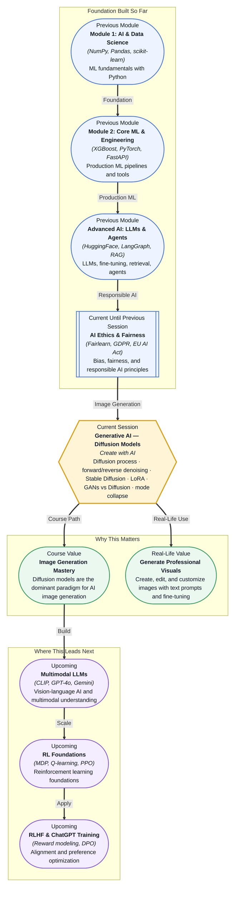

# Pre-read: Generative AI — Diffusion Models

## Context of This Session in the Course

You upload a selfie and type: "Turn this into a portrait in the style of Alphonse Mucha — art nouveau, floral details, warm earth tones." Seconds later, the AI returns four variations. Each one is coherent, beautiful, and recognisably you. The lighting changes, the background transforms, the brushstrokes shift — but nothing looks like a filter slapped on top. The image was generated from scratch, guided only by your photo and your words.

That seamlessness hides a deep challenge. Early generative models — specifically **Generative Adversarial Networks (GANs)** — could produce impressive images, but they were famously brittle. Training two competing networks (a generator and a discriminator) required meticulous hyperparameter tuning. More frustratingly, GANs frequently suffered from **mode collapse**: the generator would discover one or two convincing outputs and produce them over and over, ignoring the full diversity of the training data. A face generator that could only produce smiling blondes; a landscape generator stuck on sunsets. The output looked good, but the variety was gone.

That is where **diffusion models** become essential. Instead of pitting networks against each other, diffusion models take a radically different approach: start with pure noise and learn to remove it, step by step, until a coherent image emerges. The result is more stable training, greater output diversity, and state-of-the-art image quality. **Stable Diffusion**, the most widely used implementation, brings this capability to consumer hardware.

---

**What if** a product design team asks you to generate 500 on-brand images for an e-commerce catalogue — each showing the same product from different angles, in different lighting, on different backgrounds — and the product itself is a newly designed sneaker that exists only as a 3D model? You cannot photograph it yet. You cannot hire a stylist. You have maybe 15 reference renders. A GAN-based approach would likely collapse into repetitive outputs after a few generations. A diffusion model, however, can be fine-tuned on your small reference set using **LoRA** adapters — lightweight trainable modules that inject your product's visual identity into the model without retraining it from scratch. Within hours, you could be generating hundreds of unique, consistent, production-ready images. This session gives you the mental model to understand why diffusion models succeed where earlier approaches struggled, and how to customise them for your own data.

---

A **diffusion model** learns to reverse a gradual noising process. Imagine a photograph slowly dissolving into static — first fine details blur, then shapes dissolve, and finally nothing remains but random noise. The **forward diffusion process** does exactly this: it takes a real image and adds small amounts of Gaussian noise over many steps (typically 1,000) until the image is indistinguishable from pure noise. The model then learns the **reverse denoising process** — starting from noise and predicting how to remove it at each step to recover the original image structure.

Think of it like sculpting from a block of marble, except the sculptor starts with a completely shapeless block and makes a thousand tiny, precise chisels, each removing a specific amount of noise. **Stable Diffusion** performs this denoising in a compressed **latent space** rather than in pixel space, making it efficient enough to run on consumer GPUs. The text prompt is encoded using a CLIP model and injected into the denoising process through cross-attention layers, which tells the model what content to generate. You will also explore **LoRA (Low-Rank Adaptation)** for image fine-tuning — small trainable matrices injected into the model's cross-attention layers that adapt the model to a specific style, object, or person using very few parameters. The session contrasts **GANs and diffusion models**, including why diffusion models have largely overtaken GANs and what **mode collapse** means as a failure pattern.

---

In the **previous session**, you examined how bias manifests in ML models, used the Fairlearn library to measure disparities across demographic groups, and mapped the regulatory landscape — from GDPR's data protection framework to the EU AI Act's risk-based compliance tiers. You worked through audit checklists and anonymization techniques designed to make AI systems transparent and accountable. That critical lens is not left behind when you enter generative AI. The same questions apply: Is the training data for a diffusion model representative? Does generating photorealistic faces of people who do not exist introduce new ethical risks? Can a fine-tuned LoRA adapter encode harmful biases? The fairness and accountability toolkit you built in session 31.2 becomes your guide for evaluating generative outputs — because responsible creation is just as important as responsible decision-making.

---

In this pre-read, you will discover:

- How to **understand** the forward diffusion process and its reverse denoising counterpart.
- How to **learn** how Stable Diffusion generates images using latent space diffusion.
- How to **apply** LoRA adapters to fine-tune image generation on custom data.
- How to **compare** GANs and diffusion models, including why mode collapse happens.

---

## Why Add Noise Just to Remove It?

At first glance, the diffusion process seems wasteful. Why spend 1,000 computational steps deliberately destroying an image, only to teach a model to undo the destruction? The insight is that the forward process creates a known, tractable distribution — Gaussian noise — that the model can learn to reverse. Unlike GANs, which require the generator and discriminator to reach a delicate equilibrium, the diffusion training objective is a simple mean-squared error loss between the predicted noise and the actual noise added at each step. This stability is what makes diffusion models practical to train at scale.

The reverse process is equally elegant. At inference time, the model starts from pure noise and iteratively denoises it, guided at each step by the text prompt. Because the forward process is Markovian (each step depends only on the previous one), the reverse process decomposes naturally into learnable steps. Each step makes a small, local correction. Over 50 to 1,000 steps, those corrections compound into a globally coherent image. This step-by-step refinement is why diffusion models can generate fine details — fur texture, skin pores, fabric weave — that GANs often blur or repeat.

## Why Diffusion Models Beat GANs (And Why Mode Collapse Matters)

**Mode collapse** occurs when a generative model learns to produce only a limited subset of the possible outputs. A GAN trained on the full MNIST digit dataset might only ever generate the digit "1" because the discriminator was easier to fool that way. The generator found a shortcut and exploited it. Preventing mode collapse requires careful architectural choices (minibatch discrimination, unrolled GANs, spectral normalization) and still offers no guarantee — the collapse can happen mid-training without warning.

Diffusion models avoid mode collapse by design. Because the loss is computed per-pixel against a known noise target at each step, the model has no incentive to cheat by collapsing its output distribution. Every region of the latent space is equally learnable because the training signal is uniformly distributed across all noise levels. This does not mean diffusion models are perfect — they can still exhibit distributional biases if the training data is skewed — but they do not suffer from the catastrophic diversity loss that plagues GANs.

The trade-off is speed. GANs generate images in a single forward pass; diffusion models require tens to hundreds of sequential denoising steps. Recent innovations like **latent diffusion** (used by Stable Diffusion) and **consistency models** (which distill the denoising trajectory into a single step) are closing this gap, but the fundamental tension between iterative quality and one-shot speed remains a design consideration.

## Where Diffusion Models Appear in Real Life

Stable Diffusion and its derivatives power a growing ecosystem of creative and commercial tools. In **advertising and e-commerce**, brands use fine-tuned diffusion models to generate product shots at scale — a single model trained on 20 reference images can produce hundreds of on-brand lifestyle visuals without a photography studio. In **architecture and interior design**, diffusion models generate photorealistic renderings from rough sketches or text descriptions, letting clients visualise spaces before construction begins. The **gaming and entertainment industry** uses diffusion models for concept art, texture generation, and asset prototyping, compressing weeks of manual illustration into hours of guided generation.

In **medical imaging**, diffusion models are being explored for super-resolution and denoising of MRI and CT scans — the reverse denoising process maps naturally onto cleaning up low-quality medical imagery. The **fashion and apparel sector** uses diffusion models to generate variations of clothing designs, visualise fabrics on different body types, and create marketing assets from a single reference garment. Across all these domains, LoRA fine-tuning has become the standard method for adapting base models to proprietary visual styles without exposing sensitive reference images to third-party APIs.

---

## What's Next

After this session, you will be able to:

- Explain the forward diffusion process and how reverse denoising reconstructs images from noise.
- Describe how Stable Diffusion operates in latent space for efficient image generation.
- Identify when LoRA fine-tuning is the right tool for customising image generation on small datasets.
- Contrast GANs and diffusion models across training stability, output diversity, and mode collapse.
- Recognise the ethical implications of generative imagery — bias, consent, and auditability.

You do not need to train a diffusion model from scratch right now. The goal is a clear mental model: **diffusion models make creation reliable by learning to reverse a controlled destruction of information.**

---

## Interesting Questions for the Live Session

- If a diffusion model generates an image nearly identical to a copyrighted artwork, who bears responsibility — the model trainer, the LoRA adapter author, or the user who wrote the prompt?
- Mode collapse in GANs limits output diversity; diffusion models avoid this, but can they still exhibit hidden demographic or stylistic biases based on imbalanced training data?
- LoRA adapters can be as small as a few megabytes. Does this small size make them harder to audit for harmful content compared to inspecting full model weights?
- If a diffusion model is trained iteratively on its own outputs (synthetic data loops), does image quality degrade or stabilise over generations?

By the end of this session, generative AI should feel less like a black box and more like a principled engineering toolkit: **adding noise is destruction, but learning to reverse it is creation.**
