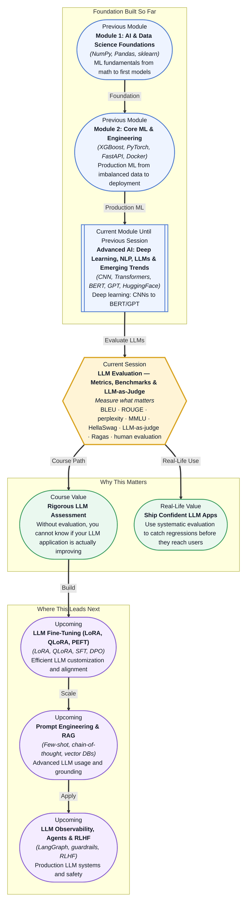

# Pre-read: LLM Evaluation — Metrics, Benchmarks & LLM-as-Judge

## Context of This Session in the Course

You and your team just spent three weeks fine-tuning a 7-billion-parameter LLM on customer support transcripts. The model sounds natural, responds quickly, and your demo wows the stakeholders. Then the first real user asks, "What is your return policy for opened electronics?" — and the model invents a policy that does not exist. The demo was impressive, but the model was never tested against a rubric, never benchmarked against a diverse set of edge cases, and never measured for hallucination rate. You deployed a model that looked great and performed poorly where it mattered.

The intuitive approach to LLM quality is to trust your eyes. You read a few outputs, they sound fluent, you ship it. But fluency is not accuracy, confidence is not correctness, and a handful of cherry-picked examples tell you nothing about how the model behaves across the long tail of real-world inputs. A model can ace a single prompt and fail catastrophically on a near-identical rephrasing. Without systematic measurement, you are flying blind — and in production, blind deployments break user trust.

That is where **LLM evaluation** — the systematic measurement of model output quality using metrics, benchmarks, and judge frameworks — becomes essential.

---

**What if** you were responsible for the AI assistant at a hospital that answers patient questions about symptoms, medications, and appointment scheduling? A single hallucinated interaction — telling a patient the wrong dosage or dismissing a real symptom — could cause real harm. You cannot read every response manually. You cannot rely on the model's own confidence scores. You need an objective, repeatable system that catches bad outputs before they reach a patient. What if that system could flag hallucinations automatically, grade responses against clinical guidelines, and alert you when the model starts drifting?

Every production LLM application — whether in healthcare, finance, legal, or customer service — needs this evaluation layer. This session gives you the tools to build it.

---

At its core, LLM evaluation asks a deceptively simple question: how do you know if an AI-generated answer is good? The answer is more complex than it seems because "good" depends on context. For a machine translation task, **BLEU** (Bilingual Evaluation Understudy) measures how many n-grams in the generated text overlap with a human reference translation — a fast, automated check for surface-level similarity. For summarization, **ROUGE** (Recall-Oriented Understudy for Gisting Evaluation) compares generated summaries against reference summaries by counting overlapping units like words, bigrams, and longest common subsequences. **Perplexity** measures how surprised a language model is by a given sequence — lower perplexity means the model finds the text more predictable, which correlates with but does not guarantee quality.

But these n-gram-based metrics only scratch the surface. They cannot detect factual errors in a paragraph that happens to use the right words, nor can they assess whether a response is helpful, harmless, or honest. That is where the field has evolved toward richer evaluation paradigms: benchmark suites like **MMLU** (Massive Multitask Language Understanding) that test LLMs across 57 subjects from anatomy to law, **HellaSwag** that measures commonsense reasoning through adversarial sentence completion, the **LLM-as-judge** pattern where a capable model scores another model's outputs against a rubric, the **Ragas** library for evaluating RAG pipelines on faithfulness and answer relevance, **human evaluation loops** that bring annotators into the feedback cycle, and **rubric-based evaluation** where you define explicit scoring criteria before generation begins.

---

In the **previous session**, you used BERT and GPT models through the HuggingFace pipeline API for text classification, working with both bidirectional masked language models and autoregressive causal models. You saw how a pretrained transformer can be adapted to label text — but you did not yet have a way to measure whether that adaptation is actually good enough for production. That is the gap this session closes. The same HuggingFace models you fine-tuned now become the objects of evaluation: you will learn how to measure their output quality, compare them against benchmarks, and catch regressions before they reach users. Evaluation is what transforms a trained model into a trustworthy system.

---

In this pre-read, you will discover:

- How to **understand** the strengths and limitations of n-gram metrics like BLEU and ROUGE for measuring LLM output quality.
- How to **apply** benchmark frameworks such as MMLU and HellaSwag to assess model knowledge and reasoning.
- How to **recognise** when and why the LLM-as-judge pattern is more effective than automated metrics for open-ended tasks.
- How to **connect** evaluation strategies — from Ragas to human evaluation loops — to real-world production LLM systems.

---

## Why BLEU and ROUGE Are Not Enough

BLEU and ROUGE were revolutionary when they were introduced — they gave NLP researchers automated, cheap, and reproducible ways to evaluate machine translation and summarization without requiring human judges on every run. BLEU works by computing precision of n-grams (contiguous sequences of n words) between a candidate translation and one or more reference translations, applying a brevity penalty to discourage overly short outputs. A BLEU score of 0.4 or higher is generally considered good for translation. ROUGE, in its most common variant ROUGE-L, computes the F1-score of the longest common subsequence between candidate and reference, rewarding summaries that capture the key content in the right order.

But here is the problem: these metrics measure surface-form overlap, not meaning. A translation that uses perfect synonyms, restructures a sentence for natural flow, or adapts a phrase to cultural context may score poorly on BLEU while being objectively better than a literal word-for-word rendering. Similarly, a summary that correctly captures every key point but uses different vocabulary from the human reference will score low on ROUGE despite being factually accurate. Worse, neither metric detects factual hallucination: a model can generate a paragraph with perfect n-gram overlap that contains a critical factual error, and BLEU and ROUGE will not flag it. This is why modern LLM evaluation does not stop at automated metrics — it layers on benchmark suites, LLM-as-judge frameworks, and human evaluation to capture dimensions of quality that n-gram overlap simply cannot see.

## How LLM-as-Judge Changes the Evaluation Paradigm

The LLM-as-judge pattern emerged from a practical insight: if humans can evaluate LLM outputs by reading them and applying a rubric, and LLMs are increasingly good at reading and reasoning about text, then perhaps one LLM can evaluate another. The idea is straightforward: you define a scoring rubric — for example, "rate this response on a scale of 1 to 5 for helpfulness, harmlessness, and honesty" — and pass both the user query and the model's response to a judge LLM (often a more capable or differently configured model) with specific instructions to produce a structured evaluation. The judge model returns a score, a rationale, or both.

This pattern is powerful because it captures dimensions that automated metrics miss: tone, relevance, safety, factual consistency, and even creativity. When combined with **rubric-based evaluation**, where the scoring criteria are defined in advance and tied to specific business requirements, LLM-as-judge becomes a highly reproducible evaluation method. The **Ragas** library extends this idea specifically to RAG pipelines, measuring dimensions like faithfulness (is the answer grounded in the retrieved context?), answer relevance (does the answer address the question?), and context precision (are the retrieved documents actually useful?). The key caveat is that the judge model itself can be biased — it may prefer longer answers, answers that match its own style, or answers that avoid controversial topics — which is why **human evaluation loops** remain the gold standard for catching subtle failures. The best practice is layered: automated metrics for quick regression detection, LLM-as-judge for medium-fidelity evaluation, and human judges for high-stakes assessments.

## Where LLM Evaluation Appears in Real Life

Every organisation deploying LLMs in production needs evaluation, but the evaluation strategy shifts with the use case. In **healthcare**, a clinical LLM that generates patient summaries or suggests diagnoses must pass stringent rubric-based evaluation with human expert review before deployment — a single hallucinated lab value could change a treatment decision. Systems like Med-PaLM are evaluated against physician-written rubrics across multiple axes including factuality, reasoning, and safety. In **finance**, LLMs used for regulatory filing analysis or customer communication are benchmarked on domain-specific metrics: precision on numerical extraction, consistency across document sections, and adherence to compliance guidelines. A model that helps draft responses to SEC inquiries must be evaluated not just for fluency but for regulatory accuracy.

In **customer service**, evaluation is the difference between a chatbot that frustrates users and one that resolves issues. Companies evaluate response quality along axes like politeness, resolution rate, and hallucination avoidance — often using a combination of LLM-as-judge for scale and human sampling for calibration. The **Ragas** library is particularly relevant here for RAG-based support bots that retrieve answers from a knowledge base: it evaluates whether the retrieved context actually supports the generated answer and whether the answer is complete relative to the question. In **education technology**, LLM-powered tutoring systems are evaluated on pedagogical correctness, age-appropriate language, and the model's ability to avoid giving away answers while still guiding students. And in **content generation** — marketing copy, news summaries, code generation — evaluation blends automated metrics for surface quality with rubric-based human review for tone, originality, and factual correctness. Across all these domains, the principle is the same: evaluation is not a one-time checkpoint but an ongoing practice embedded in the development lifecycle, catching regressions every time the model or its context changes.

---

## What's Next

After this session, you will be able to:

- Compute and interpret BLEU and ROUGE scores for translation and summarization tasks.
- Use perplexity as a diagnostic signal for model uncertainty and output quality.
- Evaluate an LLM's knowledge and reasoning capabilities using MMLU and HellaSwag benchmarks.
- Design an LLM-as-judge evaluation with a rubric tailored to your application's requirements.
- Apply the Ragas library to evaluate faithfulness and relevance in a RAG pipeline.
- Plan a human evaluation loop that catches the failures automated metrics and LLM judges miss.

You do not need to implement every evaluation metric from scratch or build a full human evaluation pipeline right now. The goal is to internalise the evaluation mindset: **you cannot improve what you cannot measure, and you cannot deploy what you have not evaluated.**

---

## Interesting Questions for the Live Session

- If BLEU and ROUGE only measure n-gram overlap, what kind of errors do they consistently miss, and how could a metric be designed to catch those errors?
- When using an LLM as a judge, how do you prevent the judge model's own biases — preference for longer answers, stylistic similarity, positional bias — from corrupting the evaluation?
- MMLU tests knowledge across 57 subjects, but how well does performance on MMLU predict real-world task performance for a domain-specific LLM application?
- In a RAG pipeline, which matters more for answer quality — the retriever's precision, the generator's capability, or the evaluator's ability to detect and flag bad retrievals?

By the end of this session, LLM evaluation should feel less like an afterthought and more like the engineering discipline that separates prototype demos from production systems: **measure rigorously, deploy confidently.**
