# Pre-read: LLM Fine-Tuning — LoRA, QLoRA & PEFT

## Context of This Session in the Course

```mermaid
%%{init: {"flowchart": {"nodeSpacing": 45, "rankSpacing": 65, "diagramPadding": 20}} }%%
flowchart TB
    subgraph Foundation["Foundation Built So Far"]
        P1(["Previous Module<br/><b>Module 1: Foundations of AI and Data Science</b><br/><i>(Linear Algebra, Probability, sklearn)</i><br/>ML fundamentals"])
        P2(["Previous Module<br/><b>Module 2: Core Machine Learning &amp; Engineering</b><br/><i>(Ensembles, Neural Networks, SHAP)</i><br/>Production ML"])
        P3(["Previous Module<br/><b>Module 3: Deep Learning &amp; LLM Basics</b><br/><i>(CNN, Transformers, BERT, GPT)</i><br/>Deep learning + LLM foundation"])
        C1[["Current Until Previous Session<br/><b>LLM Evaluation</b><br/><i>(BLEU, ROUGE, MMLU, HellaSwag, LLM-as-judge, Ragas)</i><br/>Measuring LLM quality"]]
    end

    CS{{"Current Session<br/><b>LLM Fine-Tuning — LoRA, QLoRA &amp; PEFT</b><br/><i>Customize LLMs efficiently</i><br/>Full fine-tuning · LoRA · low-rank adapters · QLoRA · 4-bit quantization · PEFT library"}}

    subgraph Value["Why This Matters"]
        CV(["Course Value<br/><b>LLM Customization</b><br/>Fine-tuning adapts general-purpose LLMs to your domain, style, and task"])
        RV(["Real-Life Value<br/><b>Your Own Specialized LLM</b><br/>Fine-tune models for legal, medical, coding, or customer support tasks"])
    end

    subgraph Future["Where This Leads Next"]
        F1(["Upcoming<br/><b>Prompt Engineering &amp; Structured Output</b><br/><i>(Few-shot, CoT, function calling, JSON mode, Pydantic)</i><br/>Advanced prompting"])
        F2(["Upcoming<br/><b>RAG &amp; Advanced RAG</b><br/><i>(Vector DBs, hybrid search, re-ranking, chunking)</i><br/>Grounded generation"])
        F3(["Upcoming<br/><b>LLM Observability, Agents &amp; RLHF</b><br/><i>(LangSmith, LangGraph, guardrails, RLHF, alignment)</i><br/>Production LLMs"])
    end

    P1 ==>|&nbsp;Foundation&nbsp;| P2
    P2 ==>|&nbsp;Production ML&nbsp;| P3
    P3 ==>|&nbsp;LLM Foundation&nbsp;| C1
    C1 ==>|&nbsp;Efficient Tuning&nbsp;| CS
    CS ==>|&nbsp;Course Path&nbsp;| CV
    CS ==>|&nbsp;Real-Life Use&nbsp;| RV
    CV ==>|&nbsp;Build&nbsp;| F1
    F1 ==>|&nbsp;Scale&nbsp;| F2
    F2 ==>|&nbsp;Apply&nbsp;| F3

    classDef previous fill:#eef4ff,stroke:#4f7ccf,color:#111827,stroke-width:2px;
    classDef current fill:#fff4d6,stroke:#d9a321,color:#111827,stroke-width:3px;
    classDef value fill:#eaf8ef,stroke:#3f9f63,color:#111827,stroke-width:2px;
    classDef future fill:#f4ecff,stroke:#8a61d1,color:#111827,stroke-width:2px;

    class P1,P2,P3,C1 previous;
    class CS current;
    class CV,RV value;
    class F1,F2,F3 future;
    linkStyle default stroke-width:3px;
```

You spend weeks curating a dataset of your organisation's legal contracts, customer support transcripts, and internal documentation. You load a state-of-the-art 7-billion-parameter LLM and press "train." Twenty-four hours later, the run crashes — out of memory. You resize the GPU instance and restart, watching your cloud bill climb past a thousand dollars before the first epoch completes. The model did not finish a single pass through your data.

The naive approach — **full fine-tuning** — updates every single one of the model's billions of parameters. For a 7B model in full precision, storing the weights, gradients, and optimizer states simultaneously demands over 100 GB of GPU memory. That means multiple A100 GPUs, complicated distributed setup, and cooling costs that turn fine-tuning from a routine engineering task into a moonshot infrastructure project. Most teams, most projects, and most experiments simply cannot afford it.

That is where **LLM Fine-Tuning — LoRA, QLoRA & PEFT** becomes essential.

---

**What if** you could fine-tune a 70-billion-parameter model on a single consumer GPU — the same hardware you might have in your personal workstation — in hours instead of days, training less than 1% of the parameters while retaining 95%+ of the quality of full fine-tuning? What if you could spin up dozens of fine-tuning experiments in parallel, each targeting a different domain or task, without petitioning IT for a GPU cluster? This session gives you the techniques that make this possible: **LoRA** (Low-Rank Adaptation), **QLoRA** (4-bit quantized LoRA), and the **PEFT** library that packages them into a single line of code.

---

**Parameter-efficient fine-tuning (PEFT)** is a family of techniques that adapt a pre-trained model by training only a small number of extra parameters while keeping the vast majority of the original model frozen. The most influential PEFT method is **LoRA** (Low-Rank Adaptation). LoRA rests on a deceptively simple observation: when you fine-tune a model, the _change_ in the weight matrices — the difference between the pre-trained weights and the fine-tuned weights — tends to have a low **intrinsic rank**. The update can be approximated by the product of two much smaller matrices. Instead of updating a 4096×4096 weight matrix (16.8 million parameters), LoRA learns a 4096×8 matrix and an 8×4096 matrix — just 65,536 parameters — and injects their product into the original layer. The original weights never change; the adapter carries the entire domain adaptation.

Think of it like the difference between rewiring an entire house (full fine-tuning) versus plugging a smart dimmer into each light switch (LoRA). The original wiring stays untouched, but the behaviour changes — dimmer, brighter, or scene-specific — through a tiny, swappable component. **QLoRA** takes this further by first quantizing the frozen base model to 4-bit precision using a novel **NormalFloat** data type, reducing memory consumption by roughly 4×, then applying LoRA adapters on top. This is what makes fine-tuning a 7B model possible on a single 24 GB GPU. You will also explore the **PEFT** library from HuggingFace, which provides a unified API for LoRA, QLoRA, prompt tuning, prefix tuning, and more — letting you switch between methods by changing a single configuration object.

---

In the **previous session**, you learned to evaluate LLM output quality using benchmarks like **MMLU** and **HellaSwag**, lexical metrics like **BLEU** and **ROUGE**, and the **LLM-as-judge** pattern for subjective evaluation. You measured, scored, and compared model outputs. That evaluation skill is the prerequisite for fine-tuning: you cannot improve what you cannot measure. Where the previous session taught you to detect when a model underperforms, this session teaches you to fix it — to take a general-purpose model that scores X on your benchmark and push it to X + 10% by training it on your own data. Evaluation gives you the compass; fine-tuning gives you the engine.

---

In this pre-read, you will discover:

- **Why** full fine-tuning requires prohibitive compute and memory resources.
- **How** LoRA exploits low-rank structure to reduce trainable parameters by 99% or more.
- **How** QLoRA adds 4-bit quantization to run large-model fine-tuning on consumer GPUs.
- **How** to apply the PEFT library to fine-tune a model in a practical project.

---

## Why Fine-Tuning a 7B Model Costs Thousands of Dollars

Fine-tuning an LLM is not about running a training loop — it is about fitting the model, its gradients, and its optimizer state into GPU memory simultaneously. A 7-billion-parameter model in 32-bit floats occupies roughly 28 GB. The Adam optimizer stores two additional values per parameter (first and second moments), adding another 56 GB. The gradients themselves require 28 GB more. That is 112 GB before you account for input data, activations, and temporary buffers. A single NVIDIA A100 offers 80 GB, so you need at least two — and realistically four — to avoid memory thrashing. At cloud rates of $2–4 per GPU per hour, a single training run can cost hundreds to thousands of dollars. The problem scales linearly with parameter count: a 70B model pushes into the terabyte range, requiring a full DGX node or multi-node cluster. This economic barrier is why full fine-tuning remains inaccessible to most practitioners — not because the algorithm is complex, but because the hardware bill is prohibitive.

## How Low-Rank Adapters Do More with Far Fewer Parameters

LoRA is built on an empirical finding: the weight updates learned during fine-tuning have a low intrinsic rank. The change ΔW you would apply to a weight matrix W can be approximated as ΔW = BA, where B and A are small matrices whose inner dimension r is much smaller than W's original dimensions. The original weight matrix W remains frozen — you never compute gradients for it, so you never need its optimizer states in memory. You only train the tiny adapter matrices. For a typical LLM, the attention projection matrices (Q, K, V, O) are the primary LoRA targets. With rank r = 8, total trainable parameters for a 7B model drop from 7 billion to roughly 4–8 million — a 99.9% reduction. Memory consumption follows proportionally. Where full fine-tuning required 100+ GB, LoRA fits comfortably within a single 24 GB GPU. QLoRA pushes further by quantizing the frozen base model to 4-bit using **NormalFloat** quantization, which optimally maps normally distributed weights into 16 evenly spaced bins. The base model memory drops from 28 GB (fp32) to roughly 3.5 GB, freeing the rest of GPU memory for LoRA adapters and activations. The result: a 7B model fine-tunable on a single RTX 3090 or 4090, often with less than a 1% quality gap compared to full fine-tuning.

## Where LoRA and QLoRA Appear in Real Life

These techniques have become the default approach for LLM customisation across nearly every industry that works with language models. In **legal technology**, firms fine-tune Llama- or Mistral-based models on thousands of annotated contracts, case briefs, and regulatory documents — creating models that understand jurisdiction-specific terminology and clause structures without needing a cluster of GPUs. In **healthcare**, clinical NLP pipelines use LoRA-adapted models to extract symptoms, medications, and diagnoses from physician notes, with each hospital system training its own adapter on its own patient data while the base model remains frozen and compliant with data governance requirements. In **customer support**, companies fine-tune LLMs on historical ticket resolutions and brand voice guidelines, producing chatbots that reflect the company's exact tone and product knowledge without rewriting the model from scratch. The **open-source model ecosystem** itself has embraced LoRA as the standard distribution mechanism: instead of releasing a full 7B model fine-tuned for every niche task, developers share 5 MB LoRA adapter files that can be swapped in and out like plugins. Platforms like HuggingFace host thousands of community-trained adapters for coding, translation, storytelling, and domain-specific question answering. In **finance**, quant teams fine-tune models on earnings call transcripts and regulatory filings, creating LLMs that understand market-specific jargon and reporting standards. And in **software engineering**, teams deploy LoRA-adapted code models that learn internal API conventions and company-specific library usage patterns — turning a general-purpose code LLM into one that writes code that actually compiles against your codebase.

---

## What's Next

After this session, you will be able to:

- Explain why full fine-tuning is memory-prohibitive and when PEFT is the appropriate alternative.
- Implement LoRA by inserting low-rank adapter matrices into attention layers of a transformer.
- Configure QLoRA with 4-bit NormalFloat quantization to reduce memory by a further 4×.
- Use the HuggingFace PEFT library to attach, train, and merge LoRA adapters in under 20 lines of code.
- Run a practical fine-tuning project on a real dataset using a single consumer GPU.

You do not need to derive the rank decomposition from scratch or memorise the NormalFloat bin boundaries right now. The goal is to see fine-tuning not as an infrastructure ordeal reserved for well-funded labs, but as a routine engineering skill: **freeze the model, insert adapters, train the adapters, swap them out — that is the whole paradigm.**

---

## Interesting Questions for the Live Session

- If LoRA achieves near-full-fine-tuning quality by only updating a low-rank subspace, does this mean that the "true" fine-tuning signal lives in a low-dimensional manifold? What would it imply if some tasks require a higher rank than others?
- QLoRA quantizes the base model to 4-bit and then applies LoRA in full precision — does the quantization noise from the base model limit how precisely the LoRA adapter can compensate, or can the adapter learn to counteract it?
- The PEFT library supports LoRA, prompt tuning, prefix tuning, and IA³ — given the same budget of trainable parameters, how would you decide which method to use for a specific task?
- LoRA adapters are a few megabytes and fully swappable — does this change how you think about model versioning, A/B testing, or multi-tenant deployments where each tenant needs slightly different model behaviour?

By the end of this session, LLM fine-tuning should feel less like an expensive infrastructure problem and more like a lightweight, modular engineering practice: **freeze the foundation, insert adapters, train the adapters, deploy — parameter-efficient tuning is the default for a reason.**
