# Pre-read: LLM Production Patterns — Async, Prompt Caching & Cost Optimization

## Context of This Session in the Course

```mermaid
%%{init: {"flowchart": {"nodeSpacing": 45, "rankSpacing": 65, "diagramPadding": 20}} }%%
flowchart TB
    subgraph Foundation["Foundation Built So Far"]
        P1(["Previous Module<br/><b>Module 1: AI &amp; Data Science</b><br/><i>(sklearn, Pandas)</i><br/>ML fundamentals, data pipelines"])
        P2(["Previous Module<br/><b>Module 2: Core ML &amp; Engineering</b><br/><i>(XGBoost, FastAPI, Docker)</i><br/>Production ML, deployment automation"])
        P3(["Previous Module<br/><b>Module 3 until now — Agents &amp; LLM Apps</b><br/><i>(ReAct, MCP, streaming, Streamlit)</i><br/>LLM application building"])
        C1[["Current Until Previous Session<br/><b>Production LLM Apps</b><br/><i>(APIs, streaming, Streamlit, context management)</i><br/>Building LLM applications"]]
    end

    CS{{"Current Session<br/><b>LLM Production Patterns — Async, Prompt Caching &amp; Cost Optimization</b><br/><i>Scale without breaking the bank</i><br/>Async API calls · prompt caching · semantic caching · cost tracking · rate limiting · A/B testing"}}

    subgraph Value["Why This Matters"]
        CV(["Course Value<br/><b>Production-Grade LLM Engineering</b><br/>Building the app is step one; scaling it cost-effectively is the real challenge"])
        RV(["Real-Life Value<br/><b>Run LLM Apps at Scale</b><br/>Handle thousands of users without latency spikes or budget overruns"])
    end

    subgraph Future["Where This Leads Next"]
        F1(["Upcoming<br/><b>LLM Safety &amp; Guardrails</b><br/><i>(Jailbreaks, guardrails-ai, moderation API)</i><br/>Safe LLM deployment"])
        F2(["Upcoming<br/><b>AI Ethics &amp; Fairness</b><br/><i>(Bias, Fairlearn, GDPR, EU AI Act)</i><br/>Responsible AI"])
        F3(["Upcoming<br/><b>Diffusion, Multimodal &amp; RLHF</b><br/><i>(Stable Diffusion, CLIP, RL)</i><br/>Advanced and emerging AI"])
    end

    P1 ==>|&nbsp;Foundation&nbsp;| P2
    P2 ==>|&nbsp;Production ML&nbsp;| P3
    P3 ==>|&nbsp;Build LLM Apps&nbsp;| C1
    C1 ==>|&nbsp;Scale &amp; Optimize&nbsp;| CS
    CS ==>|&nbsp;Course Path&nbsp;| CV
    CS ==>|&nbsp;Real-Life Use&nbsp;| RV
    CV ==>|&nbsp;Build&nbsp;| F1
    F1 ==>|&nbsp;Scale&nbsp;| F2
    F2 ==>|&nbsp;Apply&nbsp;| F3

    classDef previous fill:#eef4ff,stroke:#4f7ccf,color:#111827,stroke-width:2px;
    classDef current fill:#fff4d6,stroke:#d9a321,color:#111827,stroke-width:3px;
    classDef value fill:#eaf8ef,stroke:#3f9f63,color:#111827,stroke-width:2px;
    classDef future fill:#f4ecff,stroke:#8a61d1,color:#111827,stroke-width:2px;

    class P1,P2,P3,C1 previous;
    class CS current;
    class CV,RV value;
    class F1,F2,F3 future;
    linkStyle default stroke-width:3px;
```

Your team's chatbot streams responses beautifully, remembers what users said five turns ago, and logs every interaction to a database. The demo earns applause from the product team. Then someone asks: "How much does each conversation cost?" and "What happens when 500 people use it at the same time?" and "Can we A/B test whether this prompt actually performs better than the old one?" The silence that follows is longer than any API timeout.

A single user chatting with your app costs pennies. A thousand concurrent users chatting for an hour can cost hundreds of dollars in API fees — and if every user's conversation sends the full message history each time, the cost compounds with every turn. The naive approach — calling the API synchronously, requesting a fresh generation for every identical question, using the cheapest model without measuring whether it actually serves the use case — works for a prototype but becomes financially unsustainable at scale. You discover that 30% of your API calls are answering questions that have already been answered, that your latency spikes because requests queue up behind each other, and that you have no data to justify whether switching to a more expensive model actually improves user satisfaction. That is where **LLM Production Patterns — Async, Prompt Caching and Cost Optimization** becomes essential.

---

**What if** you could serve a thousand users with the same API budget that currently serves a hundred, cut median response latency by 60% without changing models, and prove — with real metrics — that your new prompt template increased user satisfaction by 22%? Imagine deploying a caching layer that detects when two different users ask semantically similar questions and serves the cached response instead of hitting the API again, or writing a few lines of `asyncio` code that lets your application handle dozens of concurrent requests without blocking. This session gives you the engineering patterns — **async programming** for concurrency, **prompt caching** and **semantic caching** for latency and cost reduction, **rate limiting** for reliability, and **A/B testing** for data-driven prompt decisions — that separate a hobby project from a production-grade LLM service. By the end, you will not just build LLM apps; you will run them at scale without breaking the bank.

---

**Production patterns** are the engineering practices that make LLM applications reliable, fast, and cost-efficient when real users arrive. **Async API calls** use Python's `asyncio` and `aiohttp` (or `httpx`) to send multiple API requests concurrently rather than one at a time — your application fires twenty requests and waits for all of them in parallel instead of waiting for each to finish before starting the next. **Prompt caching** is a provider-side feature (offered by both Anthropic and OpenAI) where the API recognises that the beginning of your prompt — a system instruction, a long context document, or a few-shot example set — is identical to a recent request and skips recomputing its internal representations, returning results faster and at a lower cost. **Semantic caching** goes further: it stores entire response-completion pairs in a local database (like Redis or SQLite) and, when a new query arrives, checks whether a semantically similar question has already been answered — if so, it returns the cached response without calling the API at all. **Cost calculation and tracking** connects token usage data — tracked per request, per user, per session — to dollar amounts, using provider pricing tables to build dashboards that answer "how much did yesterday cost?" before the finance team asks. **Rate limiting** protects both your application and the API provider by controlling how many requests your system sends per minute, using token-bucket or sliding-window algorithms to stay within quota without silent failures. **A/B testing prompts** pairs every request with a prompt variant ID and a random assignment, then logs which variant produced better outcomes — measured by user ratings, task completion, or guardrail compliance — so you can retire underperforming prompts with data, not intuition.

Think of the difference between a food stall during lunch rush and a professional kitchen during a dinner service. The stall takes orders one at a time, cooks each meal from scratch, and the line grows. The professional kitchen starts prep work before service begins, keeps common ingredients pre-prepared, and fires multiple orders in parallel. The diners get their food faster, the kitchen uses resources more efficiently, and nobody burns out. This session is about building the professional kitchen around your LLM — prepped ingredients are cached prompts, parallel burners are async calls, and the recipe book is the A/B tested prompt that you know works.

---

In the **previous session**, you built a production-grade Streamlit chatbot that streamed responses from OpenAI and Anthropic APIs, managed conversation context across multiple turns using `st.session_state`, implemented error handling with retries and rate-limit backoff, and logged every interaction with metadata. That session gave you the application layer — the user interface, the streaming protocol, and the audit trail. This session adds the performance and cost layer on top. The conversation context management you learned becomes the foundation for **prompt caching**, because the long system prompt and few-shot examples you pass on every call are exactly the kind of repeated prefix the API can cache. The error handling you wrote for rate limits becomes the foundation for **rate limiting**, where you proactively control request flow instead of reactively catching 429 errors. The logging infrastructure you built becomes the data source for **cost tracking** and **A/B testing**, because every logged token count and prompt variant ID feeds directly into the dashboards that answer "are we spending wisely?" and "which prompt performs best?"

---

In this pre-read, you will discover:

- How to **apply** async API calls to handle concurrent LLM requests without blocking your application.
- How to **understand** prompt caching and semantic caching as two complementary strategies for latency and cost reduction.
- How to **build** a cost-tracking system that connects token usage to dollar spending with provider pricing.
- How to **recognise** when rate limiting and A/B testing become critical for maintaining production reliability and continuous improvement.

---

## Why Calling the API One at a Time Hurts at Scale

Every synchronous `client.chat.completions.create()` call blocks your Python thread until the response returns. When one user sends a request, the application waits. When twenty users send requests, they wait in a queue — each user's experience degrades linearly with the number of concurrent users. **Async API calls** solve this by using Python's `async` and `await` keywords to mark non-blocking operations. While one request waits for the network, the event loop switches to another task, sends the next request, and collects responses as they arrive. The `asyncio.gather()` function is the workhorse: you build a list of coroutine objects — one per API call — and fire them all at once. The total wall-clock time for twenty requests becomes roughly the time of the slowest single request, not the sum of all twenty.

The practical implementation uses the async versions of provider SDKs: `openai.AsyncOpenAI()` and `anthropic.AsyncAnthropic()`. These classes expose the same methods (`chat.completions.create`, `messages.create`) but return coroutines instead of blocking until completion. Combined with `httpx.AsyncClient` for HTTP-level control and `asyncio.Semaphore` for capping concurrency, you can build an LLM router that handles bursts of traffic without overwhelming either your server or the API provider's rate limits. The async pattern is not about making individual calls faster — each call still takes the same time — but about making your system's throughput dramatically higher by overlapping I/O wait time with useful work.

---

## How Caching Transforms Your Cost Structure

**Prompt caching** is a provider-side optimisation. When you send a long system prompt — say, a 2,000-token instruction set with few-shot examples — every time a user starts a conversation, the API must recompute the internal key-value cache for those tokens on each request. Both Anthropic (through its `cache_control` parameter in the Messages API) and OpenAI (through its prompt caching feature) detect that you are sending the same prompt prefix and reuse the cached representation, returning the completion faster and at a reduced token rate for the cached portion. The cost saving is significant: cached input tokens are billed at a fraction of the uncached rate (Anthropic, for example, charges roughly 10% of the base input token price for cached tokens). The latency saving is even more dramatic — the time-to-first-token drops because the model skips the heavy computation of processing the entire prompt prefix.

**Semantic caching** is a different beast entirely. Instead of asking the provider to cache the prompt, you cache the *response* — the entire completion — in your own database, keyed by an embedding of the user query. When a new query arrives, you compute its embedding and search your cache for a semantically similar previous query. If you find one within a similarity threshold (typically a cosine similarity above 0.92–0.95), you return the cached response without any API call. This is a zero-latency, zero-cost response. The trade-off is staleness: cached answers may become outdated if the underlying knowledge changes, and semantically similar queries may need different answers depending on subtle differences in framing. A well-designed semantic cache includes a **time-to-live (TTL)** that expires entries and a **cache invalidation strategy** that evicts responses when the source data is updated. Together, prompt caching and semantic caching form a two-layer defence: the provider cache handles repeated prefixes at the API level, and your semantic cache handles repeated questions at the application level.

---

## Where Production LLM Patterns Appear in Real Life

The patterns in this session — async concurrency, prompt caching, semantic caching, cost tracking, rate limiting, and A/B testing — are the operational backbone of every LLM product serving real users at scale. In **customer service automation**, a company like Klarna or Lemonade processes thousands of concurrent support conversations using async API calls, caches answers to frequently asked questions about refund policies and claim statuses, and tracks per-conversation costs to ensure the AI is cheaper than a human agent. When a new insurance policy goes live, they expire the relevant cache entries and observe whether response accuracy recovers. In **education technology**, platforms like Duolingo or Khan Academy use semantic caching to serve identical practice questions from different students without redundant API calls — two students asking "explain the subjunctive in Spanish" receive the same high-quality explanation, while the cache logs how many times each explanation was served and at what cost savings. In **legal technology**, paralegal assistants running on LLMs use prompt caching to reuse the same multi-thousand-token contract analysis instructions across hundreds of documents, reducing per-document analysis from seconds to milliseconds for the cached prefix and dropping costs by an order of magnitude. In **internal enterprise tools**, companies deploy A/B testing frameworks on their HR policy chatbots, randomly assigning employees to one of three prompt variants for answering leave policy questions and measuring which variant produces answers that require fewer follow-up clarifications. The prompt that reduces follow-ups by 30% is promoted to production by Friday afternoon. In **healthcare**, clinical decision support systems implement rate limiting to ensure that during peak hours — Monday morning triage — the system never exceeds the API quota, queueing non-urgent queries while prioritising symptom-based questions that arrive from emergency departments. Across every sector, the pattern is the same: build it first, then make it fast, cheap, and measurable.

---

## What's Next

After this session, you will be able to:

- Implement async API calls with `AsyncOpenAI` and `AsyncAnthropic` to handle concurrent requests without blocking.
- Configure provider-side prompt caching to reduce latency and cost for repeated prompt prefixes.
- Build a semantic caching layer using embeddings and vector search to serve zero-latency responses for repeated queries.
- Track and calculate LLM costs per request, per user, and per session using provider pricing tables.
- Apply rate-limiting algorithms (token bucket, sliding window) to stay within API quotas.
- Design and evaluate A/B tests for prompt variants with measurable success criteria.

You do not need to implement all six patterns in production immediately. The goal is to internalise the shift from prototype builder to production engineer: **building the app is step one; making it fast, affordable, and measurable at scale is what makes it a real product.**

---

## Interesting Questions for the Live Session

- Async API calls improve throughput, but they also mean multiple requests are in flight simultaneously. If the API provider enforces a per-minute token limit, how do you coordinate async concurrency with rate limiting without either under-utilising the quota or triggering 429 errors?
- Prompt caching saves cost when the prompt prefix is identical, but what happens when you iterate on your system prompt — do you flush the cache, version it, or accept that cached results from the old prompt may be served for overlapping prefixes?
- A semantic cache serves identical answers to semantically similar questions, but users phrasing the same question differently may expect different levels of detail. How do you decide the similarity threshold, and what happens when a near-match query gets a cached answer that is technically correct but slightly misaligned with the user's intent?
- A/B testing prompts requires randomly assigning users to different prompt variants, but user satisfaction depends on consistency — if a user gets variant A on Monday and variant B on Tuesday, they may notice different behaviour. How do you balance statistical rigour with user experience when designing prompt experiments?

By the end of this session, production LLM patterns should feel less like advanced infrastructure and more like a deliberate engineering mindset: **async to stay fast, cache to stay cheap, track to stay informed, and A/B test to stay better.**
