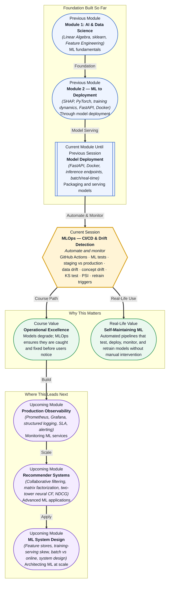

# Pre-read: MLOps — CI/CD & Drift Detection

## Context of This Session in the Course

You ship a model to production. The Docker container is running, the FastAPI endpoint responds in milliseconds, and the monitoring dashboard shows healthy traffic. Two weeks later, a product manager asks why the model's recommendations have been deteriorating for the past ten days. You check the logs — the API never crashed, the response times are fine, and no errors were thrown. The model is serving predictions flawlessly, but the predictions themselves have become wrong. The infrastructure is perfect, yet the model is failing silently, and there is no alert to tell you.

This is the fundamental blind spot of traditional software deployment. In software, if the code compiles, tests pass, and the server responds, the application works. In ML, the model can be deployed correctly and still produce bad predictions because the data it sees in production has drifted away from the data it was trained on. Customer behaviour shifts, new product categories emerge, seasonal patterns cycle, and data collection pipelines change — all without breaking any infrastructure metric. You cannot monitor your way out of this with CPU usage and response times alone. You need a system that tests the model itself, tracks whether production data still resembles the training distribution, and takes action when it does not.

That is where **MLOps — CI/CD & Drift Detection** becomes essential.

---

**What if** you could push a model to a staging environment, run a battery of automated ML tests — data quality checks, feature distribution comparisons, performance against a holdout set — and have the pipeline decide whether to promote it to production, all without a human pressing a button? And once live, what if a monitoring system tracked every incoming prediction against the training distribution, flagged the exact moment a feature began drifting, and triggered an automatic retrain before anyone noticed a degradation? That is the level of operational maturity this session unlocks: a self-maintaining ML pipeline that tests its own assumptions, detects its own decay, and heals itself. Without it, you are the engineer refreshing the accuracy dashboard every morning, hoping the numbers stay green.

---

MLOps is the discipline of applying **CI/CD (Continuous Integration and Continuous Deployment)** principles to machine learning systems. In traditional software, CI/CD means that every code change triggers automated tests, builds, and deployments. For ML, the pipeline must also validate data, test models, and monitor for drift — because the thing that breaks in production is rarely the code and almost always the data.

Think of it like a building's structural health monitoring system. The **CI pipeline** is the inspection during construction — checking that every beam and weld meets specifications before the building goes up. Your **automated ML tests** verify that the data schema is correct, that features have the expected distributions, and that the model meets a minimum performance bar. The **staging environment** is a full-scale replica where you simulate live conditions before the final deployment. Once the building is occupied, **data drift** and **concept drift** sensors are the strain gauges and accelerometers that detect whether the structure is shifting over time. The **Kolmogorov-Smirnov (KS) test** and **Population Stability Index (PSI)** are the statistical tools that quantify how far the current data distribution has strayed from the baseline. When drift crosses a threshold, a **retrain trigger** fires — the equivalent of a structural alert that says "reinforcement needed." A **production readiness checklist** ensures that every model deployment meets a consistent set of quality gates before it serves live traffic.

---

In the **previous session**, you packaged and deployed an ML model using FastAPI and Docker. You wrote a REST API that accepts input features and returns predictions, built a Docker image with pinned dependencies, and understood the difference between batch inference and real-time serving. You took a trained model and made it accessible over HTTP — a critical skill that turns a Jupyter notebook into a production service.

That deployment now becomes the subject of everything this session automates and protects. The FastAPI app you built is the "what" — it serves predictions. This session is the "how well" and the "for how long." You already know how to make a model available; now you will learn how to keep it reliable, test it automatically before release, and detect when its assumptions about the world are no longer true. Model deployment without MLOps is like launching a satellite without ground control — it works until it stops, and you have no way to bring it back.

---

In this pre-read, you will discover:

- How to **build** automated ML testing pipelines with GitHub Actions for continuous integration.
- How to **detect** data drift and concept drift using the Kolmogorov-Smirnov test and Population Stability Index.
- How to **design** staging versus production deployment strategies with promotion gates.
- How to **configure** retrain triggers and a production readiness checklist for reliable model governance.

---

## Why CI/CD for ML Is Fundamentally Different from CI/CD for Software

In a traditional software CI/CD pipeline, tests check that the code is syntactically correct, that functions return expected outputs, and that the application integrates properly with its dependencies. The contract is deterministic: given the same input, the same code always produces the same output. If the tests pass, the code is good to deploy.

ML breaks this contract. A model's behaviour depends not only on the code but on the data it was trained on, the features it receives at inference time, and the statistical relationship between those features and the target variable. The code can be identical while the model silently fails because the relationship between `income` and `credit_risk` changed after an economic shift. This means your ML CI/CD pipeline must test more than code correctness. It must validate **data schema conformity** — are all expected features present and of the right type? It must run **model performance checks** — does this candidate model meet precision, recall, or RMSE thresholds on a held-out validation set? It must detect **feature distribution shifts** — does the training data for this new model look statistically different from the previous version's data? And it must enforce a **production readiness checklist** that gates deployment until data lineage, reproducibility, and fairness checks all pass. Adding these ML-specific gates transforms a standard CI/CD pipeline into a **ML pipeline** that treats data as a first-class testing concern.

## Data Drift and Concept Drift — Two Ways Models Decay

A deployed model can degrade in two fundamentally different ways, and confusing them leads to the wrong remediation. **Data drift** (also called covariate shift) occurs when the distribution of the input features changes while the underlying relationship between features and the target stays the same. Imagine a house price model trained on homes in 2022. In 2024, the distribution of square footage has shifted because new construction trends favour larger homes — but the price per square foot relationship remains the same. Your model sees homes it was not trained on and its predictions drift, even though the underlying pricing logic is still valid. The fix is to retrain on the new feature distribution.

**Concept drift** (also called prior probability shift) occurs when the relationship between features and the target changes. Now imagine that post-pandemic, the premium on home office space doubled. A house with 3,000 square feet and a dedicated office that was worth \$500,000 in 2022 is now worth \$600,000 because buyers value office space more. The features are the same, but the mapping from features to price has changed. Retraining on recent data helps here too, but the deeper question is whether the model's architecture can capture the new relationship, or whether the features themselves need to be re-engineered.

Two statistical tools dominate drift detection. The **Kolmogorov-Smirnov (KS) test** compares two distributions — your training set and your production window — and quantifies the maximum vertical distance between their cumulative distribution functions. A high KS statistic with a low p-value indicates that the distributions are unlikely to be the same. The **Population Stability Index (PSI)** takes a binned approach, measuring how the proportion of observations in each bin has shifted between the two populations. PSI values below 0.1 suggest no meaningful change, 0.1 to 0.25 indicates moderate drift, and above 0.25 signals significant drift requiring investigation. Both are simple, interpretable, and effective enough to be the industry standard for triggering model retraining pipelines.

## Where MLOps and Drift Detection Appear in Real Life

Drift detection is not a theoretical exercise — it is the difference between a model that silently fails and a system that self-corrects. In **e-commerce**, recommendation models at Amazon and Netflix are continuously monitored for data drift as user behaviour shifts with seasons, promotions, and cultural trends. A model trained on holiday shopping patterns will show significant drift in January; a drift-aware pipeline retrains on post-holiday data automatically rather than serving irrelevant recommendations for weeks. In **banking and fintech**, fraud detection models face concept drift constantly — fraudsters adapt their patterns, making yesterday's fraud signature irrelevant today. PSI and KS tests are deployed on every batch of transactions to detect when the feature distribution signals a new fraud pattern, triggering an urgent retrain or even a model rollback. In **healthcare**, patient risk models deployed across hospital systems face data drift when a hospital updates its lab equipment or coding practices, changing the distribution of clinical features. A drift alert tells the ML team that the model needs recalibration for the new data source. In **autonomous vehicles**, perception models encounter concept drift when deployed in new geographical regions with different road signage, lighting conditions, and traffic patterns. Continuous drift monitoring across deployment regions determines when a region-specific fine-tune is needed. Even in **SaaS products**, churn prediction models must be retrained as the product evolves — new features change what "engagement" means, and old training data becomes misleading. A production readiness checklist that includes drift detection thresholds, retrain triggers, and rollback procedures transforms ML operations from reactive firefighting into proactive, automated reliability.

---

## What's Next

After this session, you will be able to:

- Set up a GitHub Actions workflow that runs ML-specific tests — data validation, model evaluation, and schema checks — on every pull request.
- Detect data drift and concept drift in production using the KS test and Population Stability Index.
- Design a staging-to-production promotion pipeline with automated quality gates.
- Configure retrain triggers that fire when drift exceeds a defined threshold and integrate them into your deployment pipeline.
- Apply a production readiness checklist to evaluate whether a model is safe to deploy.

You do not need to build a complete production MLOps platform from scratch right now. The goal is to develop an operational mindset: **every model you deploy should test itself, monitor itself, and know when to ask for a refresh.**

---

## Interesting Questions for the Live Session

- If a KS test on a production feature shows a p-value of 0.03 after three weeks, would you trigger an automatic retrain, or would you investigate the root cause first — and what factors would influence that decision?
- Data drift and concept drift can occur independently, but they often co-occur. How would you design a monitoring system that distinguishes between them, so you know whether to retrain on new data or redesign the features?
- A staging environment can never perfectly replicate production traffic patterns. How do you decide whether a model that passes all staging tests but shows mild drift against production data should be deployed or held back?
- If a retrain trigger fires based on PSI crossing 0.25, but the retrained model performs worse on the latest data than the current model, what should the pipeline do — deploy the worse model, keep the old one, or halt and alert?

By the end of this session, MLOps should feel less like overhead and more like the engineering discipline that keeps deployed models trustworthy: **the goal is not to build models that never degrade — it is to build systems that detect and correct degradation before anyone notices.**
