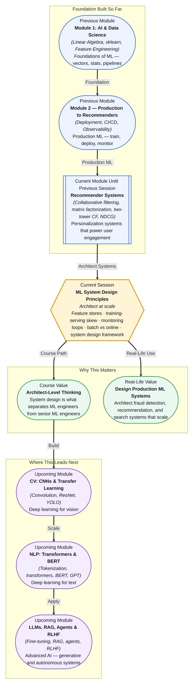

# Pre-read: ML System Design Principles

## Context of This Session in the Course

Your team has spent six months building a fraud detection model. The offline metrics are stellar — 0.98 AUC on the test set, precision above 90%, the head of risk is thrilled. On Monday morning, you deploy the model to production. By Wednesday, the data science team is panicking: the real-time predictions are worse than random. The model that aced your test set is failing in the wild because the production data looks nothing like your training data.

The root cause was not a bug in the model. It was a subtle mismatch between how features were computed during training and how they are computed in production — a phenomenon called **training-serving skew**. The training pipeline used the raw transaction timestamp to compute "hour of day," but the production pipeline computed it from the API request timestamp. What looked like a trivial engineering detail collapsed an otherwise perfect model. This is the reality of production ML: a model that works beautifully in a notebook can fail the moment it touches real traffic, and the failures are almost never in the model itself.

That is where **ML System Design Principles** become essential.

---

**What if** you were asked to design the ML architecture for a ride-hailing platform processing 15 million trips per day? Your system would need to serve real-time ETAs with latency under 50 milliseconds, detect surge pricing opportunities from streaming demand data, recommend optimal driver positions, and identify fraudulent trips — all while handling feature computation, model inference, and monitoring across a distributed system. One wrong architectural choice — computing features in batch while inference runs online — could silently degrade every downstream model. This session gives you the architectural framework to decompose problems like this into tractable, production-ready systems.

---

**ML system design** is the practice of architecting the end-to-end pipeline that takes a model from development to production and keeps it running reliably at scale. The core challenge is that ML systems operate on two distinct surfaces: the **training surface**, where features are computed in batch over historical data, and the **serving surface**, where features must be computed online from a single request. Every gap between these surfaces creates **training-serving skew** — the silent killer of production models.

Think of it like building a restaurant kitchen. The training kitchen has unlimited prep time, a full pantry, and the chef's complete attention. The serving kitchen has customers arriving every two minutes, limited fridge space, and no time to chop vegetables from scratch. If the head chef designs recipes assuming the full kitchen but hands them to a line cook working in a food truck, the dishes will fail. A **feature store** is your shared pantry — a centralised system where features are computed once and served consistently to both training and production pipelines, ensuring the same ingredients reach both kitchens. **Monitoring loops** are your quality assurance team tasting every dish that goes out, flagging when flavours drift from expectations, and triggering retraining when the recipe needs updating.

In this session, you will explore the tradeoffs between **batch inference** and **online inference**, the architecture of feature stores that eliminate training-serving skew, the anatomy of monitoring loops that detect data drift, concept drift, and model degradation, and a **system design interview framework** that helps you decompose any ML problem — whether building a recommendation engine, a fraud detection pipeline, or a search ranking system.

---

In the **previous session**, you built recommender systems — you implemented collaborative filtering, factorised user-item matrices with SVD, constructed two-tower neural networks, and evaluated personalisation quality using HitRate and NDCG. Those models represent the algorithmic heart of many production systems, but they exist within a larger architecture that must handle data ingestion, feature computation, model serving, latency constraints, and continuous monitoring. The collaborative filtering model that works beautifully on your local Jupyter notebook will face training-serving skew the moment its features are computed in a production pipeline. The two-tower architecture that achieves 0.85 NDCG on offline test data may degrade within weeks as user behaviour drifts. This session takes the models you know how to build and shows you how to wrap them in the production infrastructure that makes them reliable, observable, and maintainable at scale.

---

In this pre-read, you will discover:

- How to **understand** the end-to-end architecture of a production ML system and identify its critical failure points.
- How to **recognise** training-serving skew and design feature stores that prevent it.
- How to **build** monitoring loops that detect data drift, concept drift, and model degradation.
- How to **apply** a system design interview framework to architect fraud detection, recommendation, and search systems.

---

## Why a Perfect Model Can Fail in Production

Your model achieves 0.95 AUC on the held-out test set. You deploy it. Predictions are garbage. The most common cause is not a bug in your model but a mismatch between training and serving. During training, you had access to the full feature set — transaction amount, user location, device fingerprint, historical velocity — computed in batch over your entire dataset. In production, each prediction request arrives as a single event. The real-time feature pipeline must compute the same features from a single request, using exactly the same logic, and return them within milliseconds. Even a one-hour difference in how a timestamp is parsed creates a feature the model has never seen during training. This is **training-serving skew**, and it is the single most common reason production ML systems fail. The antidote is a **feature store** — a centralised system that defines, computes, and serves features with identical logic to both training and inference pipelines. When a feature is registered in the feature store, any model that uses it automatically receives the same value whether it is training on historical data or scoring a live request.

## Batch vs Online Inference: Choosing the Right Serving Strategy

If your model does not need to predict in real-time, why pay the latency cost? **Batch inference** processes large volumes of data at scheduled intervals — think ten million users scored overnight to generate personalised recommendation lists for the next day. It is cheaper, simpler to operate, and naturally handles large-scale offline evaluation. **Online inference** processes one request at a time with sub-second latency — think flagging a credit card transaction as fraudulent while the card is still being swiped. It requires feature stores that can serve real-time features, model servers that can load and run models in milliseconds, and monitoring that detects degradation within minutes rather than hours. The tradeoff is not purely technical; it is a product decision. A movie recommendation service that recomputes suggestions once per day delivers an acceptable experience. A fraud detection system that runs on a 24-hour batch schedule is useless — every fraudulent transaction would already be settled. In practice, many systems use a hybrid approach: batch for candidate generation (retrieve 500 potentially relevant items from a catalogue of ten million) and online for ranking (score those 500 items in real-time and return the top ten).

## Where ML System Design Appears in Real Life

Every large-scale ML deployment follows the architectural patterns you will learn in this session. **Fraud detection systems** at Stripe and PayPal process thousands of transactions per second, using feature stores to maintain real-time user velocity features, online inference models to score each transaction in under 100 milliseconds, and monitoring loops that detect when fraud patterns shift — such as a sudden increase in transactions from a newly compromised merchant. **Recommendation systems** at Netflix and YouTube use batch pipelines to precompute candidate sets from catalogues of millions of items, then online inference to re-rank those candidates based on real-time user session context, all served through feature stores that normalise user and item attributes across the two stages. **Search ranking systems** at Google and Amazon use a multi-stage architecture: a first-stage retriever filters billions of documents down to thousands, a second-stage ranker scores the remaining candidates, and continuous monitoring tracks whether user click-through rates or relevance metrics indicate model degradation. **Healthcare ML systems** at hospitals use batch inference for population-level risk stratification and online inference for real-time patient monitoring alerts, with strict monitoring loops for model drift given the regulatory requirements of clinical decision support. **Autonomous vehicle systems** at Waymo combine batch inference for offline perception model training with online inference for real-time obstacle detection, using feature stores that handle spatiotemporal features computed from multi-sensor streams. In every case, the architectural decisions — feature store design, serving strategy, monitoring infrastructure — determine whether the system succeeds or silently fails.

---

## What's Next

After this session, you will be able to:

- Design an end-to-end ML architecture that separates training and serving concerns while maintaining feature consistency.
- Architect a feature store that prevents training-serving skew by computing features once and serving them to both pipelines.
- Choose between batch and online inference strategies based on latency, cost, and product requirements.
- Build a monitoring loop that detects data drift, concept drift, and model degradation using statistical tests and alerting.
- Apply a structured system design interview framework to decompose any large-scale ML problem into tractable components.
- Communicate architectural tradeoffs clearly — the difference between a junior and senior ML engineer.

You do not need to build a production-grade feature store from scratch right now. The goal is to develop the architectural lens that separates notebook-level ML from production-level ML: **a model is only as good as the system that surrounds it.**

---

## Interesting Questions for the Live Session

- If training-serving skew is so common, why do most ML courses and tutorials not address it until the very end of the curriculum?
- When a feature store introduces ten milliseconds of latency per feature lookup, at what point does the cumulative cost outweigh the consistency benefit?
- If you could only monitor one signal in production — data drift, concept drift, or model performance — which would you choose, and why?
- How would you design a fraud detection system knowing that fraudsters actively adapt to your model's behavior?

By the end of this session, ML system design should feel less like an abstract engineering concern and more like the practical discipline that turns a good model into a reliable product: **architecture is what makes ML work outside the notebook.**
