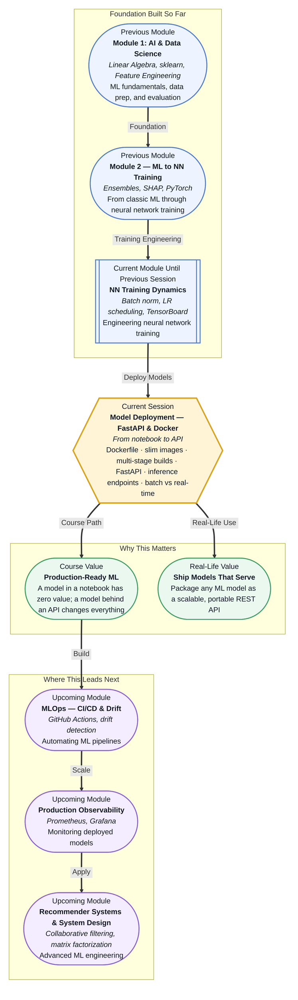

# Pre-read: Model Deployment — FastAPI & Docker

## Context of This Session in the Course

You just spent weeks building a neural network that achieves 94% accuracy on your validation set. The training curves are beautiful, the hyperparameters are tuned, and the model generalises well. You export the weights, write a summary notebook, and close your laptop feeling accomplished. But nobody outside your laptop can use it. Your model is a prisoner inside a `.ipynb` file, and every time someone asks for a prediction, you have to open Jupyter, re-run cells, and copy-paste the result back. In any real engineering context, a model that is not accessible over a network might as well not exist.

The obvious workaround — wrapping the notebook in a simple script and sharing it — collapses under its own weight. Your teammate has a different Python version, the scikit-learn dependency conflicts with their other project, and the pickle file you trained on an M-series Mac refuses to load on their Linux machine. Even when the script runs, there is no contract — nobody knows what input format the function expects, what the output means, or whether the endpoint is ready to handle more than one request at a time. The notebook worked perfectly; the deployment is a disaster.

That is where **Model Deployment — FastAPI & Docker** becomes essential.

---

**What if** you could write a single configuration file that guarantees your model runs identically on your laptop, your teammate's machine, a cloud VM, and a Kubernetes cluster? What if you could wrap your PyTorch or sklearn model in a Python web endpoint that accepts a JSON payload and returns a prediction in milliseconds, complete with input validation, automatic documentation, and concurrent request handling — all with fewer than 30 lines of code? This session gives you those two superpowers: **Docker** for environment reproducibility and **FastAPI** for turning a model into a live, production-grade API.

---

Deploying a machine learning model means solving two distinct problems that are easy to conflate. The first is **environment reproducibility** — ensuring that the software stack your model depends on (Python version, CUDA drivers, library versions, system libraries) is identical everywhere it runs. The second is **serving** — exposing the model's prediction logic over a network protocol so that other services, applications, or users can send data and receive results programmatically.

Think of a model like a food recipe. Your Jupyter notebook is the kitchen where you perfected it. **Docker** is the meal-prep container system that lets you freeze that exact kitchen environment — right down to the stove temperature and spice brand — and ship it to any restaurant in the world. **FastAPI** is the waiter who takes orders from customers, brings them to the kitchen, and delivers the finished dish back. The model stays in its carefully controlled environment (the Docker container), and FastAPI acts as the well-defined interface between the outside world and the model's prediction logic. Together, they turn a one-off experiment into a service that other systems can depend on. This session covers **Dockerfile basics**, **slim images**, **dependency pinning**, **multi-stage builds**, **FastAPI inference endpoints**, **POST request handling**, and the tradeoffs between **batch and real-time deployment patterns**.

---

In the **previous session**, you trained a neural network and learned to diagnose training dynamics — batch normalisation, learning rate scheduling, weight initialisation, and TensorBoard debugging. You built a model that converges reliably and you know exactly why it works. But a trained model is only half the story. All that engineering effort — the careful architecture choices, the hyperparameter sweeps, the gradient diagnostics — becomes valuable only when the model can serve predictions in the real world. The training loop you mastered is the engine; deployment is the vehicle that carries that engine to production. This session takes the model you know how to build and teaches you how to make it accessible, reproducible, and scalable.

---

In this pre-read, you will discover:

- How to **build** a Dockerfile that packages an ML model with pinned dependencies and produces a slim production image.
- How to **create** a FastAPI inference endpoint that accepts POST requests with JSON payloads and returns predictions.
- How to **apply** multi-stage builds to separate build-time dependencies from runtime dependencies.
- How to **compare** batch and real-time deployment patterns and choose the right strategy for a given use case.

---

## Why Docker Is the Standard for ML Model Deployment

You train a model with scikit-learn 1.2, Python 3.10, and a specific NumPy version. Six months later, your production server runs Python 3.13 with scikit-learn 1.5, and the model's `predict()` method silently produces garbage because a internal C function changed its rounding behaviour. This is the **dependency reproducibility problem**, and it is the single most common cause of deployment failures in machine learning.

**Docker** solves this by packaging your entire software environment — operating system layer, system libraries, Python interpreter, pip packages, and the model artifact itself — into a single immutable image. The image is built from a **Dockerfile**, a plain-text recipe that specifies every layer of the stack. When you run the image as a **container**, it behaves identically regardless of the host machine, because Docker provides its own isolated filesystem, process space, and network namespace. **Dependency pinning** means specifying exact versions (e.g., `fastapi==0.104.1` instead of `fastapi`) so that a rebuild six months from now produces the same environment. **Slim images** (like `python:3.10-slim`) strip unnecessary operating system packages, reducing image size from gigabytes to hundreds of megabytes — critical when transferring images across a network or storing them in a registry. **Multi-stage builds** take this further by using one stage for compilation and dependency installation (with all build tools) and a second minimal stage that copies only the runtime artifacts, keeping the final image lean and reducing the attack surface.

## How FastAPI Turns a Model into a Live Endpoint

A trained model is a function — input data goes in, predictions come out. FastAPI turns that function into a live HTTP endpoint with remarkably little boilerplate. You define a Python class (a **Pydantic model**) that describes the expected input schema — which fields are floats, which are integers, what ranges are valid — and FastAPI automatically validates incoming requests, returning clear 422 errors when the payload is malformed. You then decorate a function with `@app.post("/predict")`, and inside it you load your model, extract the features from the request body, call `.predict()`, and return the result as a JSON response.

What makes FastAPI production-ready out of the box is its use of **Python type hints** to generate interactive OpenAPI documentation at `/docs`, its **asynchronous** request handling via Starlette (so one slow prediction does not block other requests), and its native support for **concurrency** and **background tasks**. POST handling is the standard pattern for inference endpoints because the request body carries arbitrary structured data — unlike GET, which is limited by URL length and should never trigger side effects. In the live session, you will build an endpoint that accepts a batch of feature vectors, runs them through a pre-trained model, and returns predictions, all with automatic input validation, serialisation, and documentation.

## Where Model Deployment Appears in Real Life

Model deployment is not a postscript to the ML workflow — it is the entire point. In **fintech**, fraud detection models must respond to transaction API calls in under 100 milliseconds; every microsecond of latency translates to dollars lost to fraud or user abandonment, and Docker ensures that the model's inference environment is identical across canary, staging, and production deployments. In **healthcare**, a radiology AI model packaged as a Docker container can be deployed on-premises at partner hospitals that have no internet access to external APIs — the hospital runs the container behind its own firewall, and FastAPI endpoints accept DICOM images and return annotated results. In **e-commerce**, recommendation models are deployed as batch pipelines that score millions of users nightly and as real-time APIs that personalise the current session based on the last click — the choice between batch and real-time deployment depends entirely on latency requirements and infrastructure cost, and knowing both patterns lets you design the right architecture for the problem. In **SaaS platforms**, every major ML feature — from spam detection to content moderation to dynamic pricing — is delivered through REST APIs, and the team that can package a model into a FastAPI container in hours instead of weeks has a decisive advantage. Even in **edge computing**, models are deployed on Raspberry Pis and IoT devices using lightweight Docker variants, with FastAPI endpoints responding to local sensor data. The skill of turning a model into an API is what separates experimental work from production impact.

---

## What's Next

After this session, you will be able to:

- Build a Dockerfile from scratch that installs pinned Python dependencies and copies model artifacts into a reproducible container image.
- Create a FastAPI application with a POST `/predict` endpoint that validates input using Pydantic schemas and returns model predictions as JSON.
- Apply multi-stage build patterns to separate build dependencies from runtime dependencies, producing a slim production image.
- Choose between batch inference and real-time API deployment based on latency requirements, cost, and infrastructure constraints.
- Test a deployed model endpoint by sending HTTP requests with `curl` or the FastAPI `/docs` interface.

You do not need to memorise every Dockerfile instruction or FastAPI configuration option right now. The goal is to internalise the mental model: **deployment is not a separate skill from ML engineering — it is the skill that makes ML engineering matter.**

---

## Interesting Questions for the Live Session

- When you use `pip freeze > requirements.txt`, you get exact versions of every transitive dependency — is this always the right choice, or can it create problems for long-term maintenance?
- If FastAPI endpoints are asynchronous, what happens when your model inference itself is CPU-bound and blocks the event loop?
- A multi-stage build produces a smaller image, but debugging inside a slim container is harder because common tools like `curl`, `vim`, and `bash` are missing. How do you balance image size against debuggability?
- Your batch inference pipeline takes 45 minutes to score 10 million records, but the business needs results within 15 minutes. Would you optimise the model, scale horizontally, or switch to a real-time streaming architecture?

By the end of this session, deployment should feel less like a daunting operations hurdle and more like the natural final step of model building: **a model that cannot be reached over a network is a model that does not exist.**
