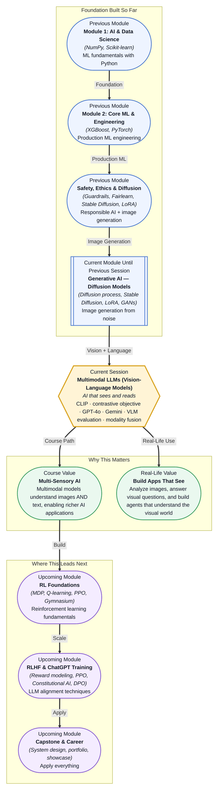

# Pre-read: Multimodal LLMs (Vision-Language Models)

## Context of This Session in the Course

You upload a screenshot of a restaurant menu to a travel app and type, "Does this place have vegan options, and how much is the most expensive item?" A text-only AI reads your question but ignores the image — it cannot see the menu. A traditional OCR pipeline extracts the raw text, but the layout, the highlighted vegan symbols, and the handwritten specials board in the background are all lost. You get a list of words, not a real answer.

This is the fundamental gap that multimodal AI closes. Before vision-language models, developers had to stitch together separate systems — an object detector for images, an OCR engine for text, a classifier for categories — and hope the outputs could be merged into a coherent answer. Each component introduced errors, and no single model understood how visual information and language related to each other. The image was processed in a silo, the text in another, and the user's question connected to neither.

That is where **multimodal LLMs (vision-language models)** become essential — models that can simultaneously perceive visual content and reason about it in natural language, treating both as first-class inputs within a single architecture.

---

**What if** you were tasked with building an AI assistant for a hospital radiology department? Doctors upload chest X-rays and ask questions like, "Is there evidence of pneumothorax in the left lung?" or "Compare this scan to the one from last month — has the nodule grown?" A text-only assistant cannot see the image. A vision-only classifier can label the X-ray but cannot answer a nuanced comparative question. A naive image-captioning system might produce "a chest X-ray showing lungs" — technically correct but clinically useless. The real challenge is understanding both the visual content and the specific reasoning intent behind each question. This session gives you the conceptual toolkit to design systems that perceive images and reason about them in language together, not as separate tasks.

---

Multimodal learning is built on the idea that different types of data — images, text, audio — can be mapped into a shared representational space where their meanings align. The breakthrough model that made this practical is **CLIP (Contrastive Language-Image Pre-training)**, developed by OpenAI. CLIP learns from 400 million image-caption pairs by solving a simple but powerful task: given a batch of images and captions, figure out which caption matches which image. This is called the **contrastive objective** — the model pulls matching image-text pairs closer together in embedding space while pushing non-matching pairs apart.

Think of it like a multilingual dictionary that does not contain direct translations. Instead, it learns that the word "dog" and a photo of a golden retriever should occupy nearby locations in a shared reference space, while "dog" and a photo of a car should be far apart. Once trained, the model can be used for zero-shot classification, image retrieval, and as a vision encoder for larger systems. You will explore CLIP's architecture, how modern models like **GPT-4o**, **Gemini**, and **Claude Sonnet 4 vision** extend this idea with native multimodal understanding, and what **modality fusion patterns** (early fusion, late fusion, hybrid) mean in practice.

---

In the **previous session**, you explored how diffusion models generate images from text prompts by learning to reverse a gradual noising process. You saw how Stable Diffusion uses a CLIP text encoder to guide image generation, how LoRA adapters fine-tune the model on small datasets, and how diffusion models compare to GANs. That CLIP encoder — the same one used to align text prompts with generated images — is now your entry point into multimodal understanding. The same technology that guided image synthesis in the forward direction (text → image) is now repurposed for the reverse direction (image → text understanding). What you learned about latent representations, cross-attention, and conditioning in diffusion models maps directly onto how vision-language models fuse modalities. The generation session gave you the "output" perspective; this session gives you the "understanding" perspective.

---

In this pre-read, you will discover:

- How to **understand** the CLIP contrastive objective and how it aligns images and text in a shared embedding space.
- How to **discover** how modern vision-language models like GPT-4o, Gemini, and Claude Sonnet 4 process and fuse multimodal inputs.
- How to **build** practical agents that combine image understanding with text reasoning.
- How to **evaluate** vision-language model performance using appropriate benchmarks and metrics.

---

## How CLIP Unlocks Shared Understanding Between Vision and Language

Before CLIP, training a model to understand images and text together required expensive labelled datasets curated for each specific task — a dataset for captioning, a separate dataset for visual question answering, another for image classification. Each task needed its own model. CLIP changed this by reframing the problem: instead of predicting labels or captions, the model predicts which of N captions goes with which of N images within a batch. This is the **contrastive objective**, and it is surprisingly data-efficient because the training signal comes from the relationship between pairs rather than from human-annotated labels.

The architecture is elegant. An image encoder (typically a Vision Transformer or ResNet) converts each image into a vector. A text encoder (a Transformer) converts each caption into a vector. Both vectors are projected into a shared embedding space of the same dimensionality — typically 512 or 768 dimensions. The contrastive loss then computes the cosine similarity between every image vector and every text vector in the batch, forming a similarity matrix. For a batch of 32,768 pairs (the batch size used in CLIP's original training), the model sees over a billion possible pairings and learns to maximise the similarity score for the 32,768 correct pairs while minimising it for the rest.

The result is a model that can perform **zero-shot classification** — classify an image into categories it has never seen labelled examples of — by simply embedding the category names as text and finding the closest match in the shared space. This zero-shot capability is what makes CLIP a foundational building block for larger multimodal systems. It provides the shared representational vocabulary that models like GPT-4o and Gemini are built on top of.

## Modality Fusion: How Models Combine What They See and Read

Once an image and a piece of text are in a shared embedding space, the question becomes: how do you combine them to produce a reasoning step or a generated answer? This is the domain of **modality fusion**, and different architectures make different trade-offs.

**Late fusion** keeps the image and text encoders separate and combines their outputs only at the final decision layer. This is what CLIP does — it produces two independent embeddings and compares them with a similarity score. Late fusion is modular and efficient (you can swap out either encoder independently), but it limits the model's ability to reason about fine-grained interactions between visual regions and specific words. **Early fusion**, by contrast, feeds image patches and text tokens into a single Transformer from the very first layer, allowing cross-attention between modalities at every level of representation. Models like GPT-4o, Gemini, and Claude Sonnet 4 vision use variants of early fusion — their attention mechanisms learn which parts of an image are relevant to which parts of a text query through the standard self-attention and cross-attention layers inherited from the Transformer architecture.

A practical way to understand this: in a late-fusion system, the model might embed the entire image as one vector and your question as another vector, then compare them at the end. In an early-fusion system, the model breaks the image into patches (like 16x16 pixel tiles), treats each patch as a token similar to a word token, and runs all of them through the same Transformer layers. The attention mechanism can then directly relate the word "pneumothorax" to specific patches of the X-ray image, or the word "vegan" to the green-highlighted section of a menu. This per-token interaction is what gives early-fusion models their superior performance on tasks like visual question answering, document understanding, and multimodal reasoning — but it comes at a significantly higher computational cost, since the combined sequence length (image patches + text tokens) is much longer.

## Where Multimodal AI Appears in Real Life

Multimodal vision-language models are already reshaping how AI systems interact with the visual world across industries. In **healthcare**, models that can read chest X-rays and radiology reports simultaneously are being deployed to flag urgent findings, generate draft reports, and answer clinician questions about specific images — reducing the turnaround time from scan to diagnosis. **Autonomous vehicle companies** use vision-language models to interpret complex traffic scenes: the model sees camera footage and a text query like "Is the pedestrian at the crosswalk about to cross?" and must reason about motion, intent, and traffic rules simultaneously.

In **e-commerce and retail**, multimodal search lets users upload a photo of a piece of furniture and ask "Find me a matching armchair under $500" — the system must understand both the visual style of the uploaded item and the parametric constraint in the text. **Content moderation platforms** use VLMs to evaluate whether an image violates policy in context: a photo of a surgical incision might be inappropriate for general audiences but educational in a medical context, and the model must read the accompanying caption to make that judgment. **Accessibility tools** for visually impaired users rely on vision-language models to describe surroundings, read text from signs and menus aloud, and answer questions about visual environments in real time. Across all these domains, the same pattern holds: the model is not simply labelling what it sees but reasoning about what it sees in the context of specific language — and that reasoning capability is what makes multimodal LLMs fundamentally more useful than their vision-only or text-only predecessors.

---

## What's Next

After this session, you will be able to:

- Explain how CLIP's contrastive objective creates a shared embedding space for images and text.
- Describe the architectural differences between major VLMs like GPT-4o, Gemini, and Claude Sonnet 4 vision.
- Build an application that accepts image and text inputs and produces grounded, multimodal responses.
- Evaluate VLM output using task-specific metrics for visual question answering and image captioning.
- Identify appropriate modality fusion patterns (early fusion, late fusion, hybrid) for different use cases.

You do not need to train a multimodal model from scratch right now. The goal is a clear mental model: **multimodal AI treats vision and language not as separate pipelines but as two channels of the same reasoning process — aligned in a shared space, connected through attention.**

---

## Interesting Questions for the Live Session

- If CLIP's contrastive objective only needs image-caption pairs, does it implicitly learn correlations it should not — for example, associating certain visual backgrounds with certain text descriptions in ways that encode societal bias?
- Early fusion models like GPT-4o attend to every image patch against every text token. How does the quadratic cost of attention scale when you add hundreds of image patches to the sequence length?
- When a VLM answers a visual question incorrectly, is the failure more likely to be a vision failure (misinterpreting the image) or a reasoning failure (misunderstanding the question), and how would you diagnose the difference?
- If two VLMs achieve the same accuracy on a visual reasoning benchmark but one uses early fusion and the other uses late fusion with a larger encoder, which would you trust more in a production setting, and why?

By the end of this session, multimodal AI should feel less like a collection of separate APIs for vision and language and more like a unified reasoning paradigm: **seeing and reading are not separate tasks — they are the same task in different modalities, connected by a shared representational space.**
