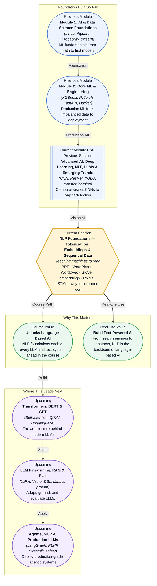

# Pre-read: NLP Foundations — Tokenization, Embeddings & Sequential Data

## Context of This Session in the Course

Imagine you type a query into a search engine — "best way to learn machine learning" — and it returns pages that contain exactly those words, but the results are irrelevant because the articles were written for beginners while you are already a working engineer. The engine matched your words, but it did not understand what you meant. This is the fundamental limitation of treating text as raw strings: the surface form of words carries far less meaning than their context, usage, and relationship to one another.

The naive approach — matching exact strings, counting words, relying on keyword overlap — breaks down in almost every realistic scenario. Synonyms, polysemy (the same word having multiple meanings), grammatical variation, and domain-specific vocabulary all defeat simple text matching. A search for "bank" could mean a financial institution or a riverbank, and without deeper understanding, no amount of keyword counting will resolve the ambiguity.

That is where **Natural Language Processing (NLP)** becomes essential — specifically the foundational techniques of tokenization, embeddings, and sequence modeling. These techniques give machines a way to move beyond raw text and into the realm of meaning.

---

**What if** you could build a system that reads thousands of product reviews and understands the difference between "the battery life is long" and "the wait times are long" — both use the word "long" but in opposite sentiment contexts? Or a system that translates a legal contract from English to Hindi while preserving the legal nuance, not just the dictionary meaning of each word?

Every modern NLP system — from Google Search to ChatGPT to medical diagnosis assistants — relies on a small set of foundational techniques that convert human language into a form machines can process and reason about. You do not need a PhD to understand them. You need the right mental models. This session gives you the first and most important ones.

---

At its core, NLP is about transforming unstructured text into structured data that a mathematical model can work with. The first step is **tokenization**: breaking a sentence into smaller units — words, subwords, or characters — that form the vocabulary the model will learn. The choice of tokenizer matters enormously. Early systems split on whitespace and punctuation, but modern approaches like **Byte-Pair Encoding (BPE)** and **WordPiece** learn an optimal vocabulary by merging the most frequent character pairs, allowing them to handle rare words, misspellings, and morphologically rich languages by representing them as combinations of known subword units.

Once you have tokens, you need to represent them as numbers. The simplest approach — one-hot encoding — creates a sparse vector where each dimension corresponds to a unique word in the vocabulary. But this representation is both enormous and meaningless: every word is equally distant from every other, with no notion of similarity. **Word embeddings** solve this by learning dense, low-dimensional vectors where semantically similar words cluster together. **Word2Vec** (Mikolov et al., Google, 2013) learns these vectors by training a shallow neural network to predict a word from its surrounding context (CBOW) or to predict the context from a word (skip-gram). **GloVe** (Pennington et al., Stanford, 2014) takes a different approach: it factorizes a global word-word co-occurrence matrix to produce embeddings that capture corpus-level statistics. Both produce vectors where "king − man + woman ≈ queen" becomes a real arithmetic operation. On the sequence side, you will also explore why **Recurrent Neural Networks (RNNs)** and **Long Short-Term Memory networks (LSTMs)** were the dominant architecture for sequential data for years, and what fundamental limitations — vanishing gradients, slow training, inability to parallelize — led the **transformer** to replace them.

---

In the **previous session**, you worked with convolutional neural networks and transfer learning — fine-tuning ResNet on custom image datasets and using YOLO for object detection with metrics like IoU and mAP. You saw how vision models learn hierarchical features: from edges to textures to object parts to complete objects. Now you will see how NLP models follow a parallel arc: from tokens to embeddings to sequence patterns to meaning. Just as convolution operations extract spatial features from pixel arrays, tokenization and embeddings extract linguistic features from text arrays. The same PyTorch skills you used to fine-tune a ResNet will soon be applied to fine-tune BERT on a text classification task in the next sessions. This session is the bridge from visual to linguistic AI.

---

In this pre-read, you will discover:

- How to **understand** why raw text must be tokenized and embedded before a model can process it.
- How to **learn** the difference between BPE and WordPiece tokenization and why subword tokenizers dominate modern NLP.
- How to **connect** word embeddings like Word2Vec and GloVe to semantic similarity, analogy, and meaning.
- How to **recognise** why RNNs and LSTMs were the best option for sequential data and what limitations the transformer resolved.

---

## Why Tokenization Is Not Just Splitting Text

Tokenization sounds deceptively simple: split a sentence into words. But consider "I don't like OpenAI's policy." Should "don't" be one token, two ("do" and "n't"), or three ("do", "n", "'t")? What about "OpenAI's" — kept whole or split into "OpenAI" and "'s"? These decisions have real consequences. If the tokenizer treats "running," "runs," and "ran" as completely separate tokens, the model never learns they share a root meaning, and it wastes vocabulary capacity on surface variants.

**Byte-Pair Encoding (BPE)** solves this by starting with individual characters and iteratively merging the most frequent adjacent pair into a new token. Applied to a large corpus, BPE naturally learns that "running," "runs," and "ran" share the subword "run" while keeping suffixes as separate but common tokens. This means the model can handle words it has never seen — even misspellings or novel compounds — by decomposing them into known subword units. GPT models use a BPE variant with a roughly 50,000-token vocabulary.

**WordPiece** (used by BERT) is similar but uses a different merging criterion: instead of raw frequency, it merges pairs that maximize the likelihood of the training data under a language model. The result is a vocabulary of about 30,000 tokens that balances coverage and efficiency. Because WordPiece tends to keep whole words when they are frequent enough, BERT's tokenizer often produces longer but more interpretable token sequences than BPE. Understanding this distinction directly affects how you choose a pretrained model for your language or domain — a model trained with an English-optimized tokenizer will perform poorly on agglutinative languages like Turkish or Finnish, where subword boundaries matter more.

## How Word Embeddings Capture Meaning

Once text is split into tokens, each token needs a numeric representation. The critical insight of word embeddings is that a word's meaning is defined by its context — "You shall know a word by the company it keeps" (Firth, 1957). Word2Vec operationalizes this by training a shallow neural network on a prediction task: given a target word, predict the surrounding words (skip-gram), or given the surrounding words, predict the target word (CBOW). The network's hidden layer weights become the word embeddings after training. What makes this powerful is that the resulting vectors encode genuine semantic and syntactic relationships. The classic example — vector("king") − vector("man") + vector("woman") ≈ vector("queen") — is not a parlor trick; it reflects that the embedding space has learned a dimension for "royalty" and a dimension for "gender," and these dimensions are sufficiently disentangled to support arithmetic.

**GloVe** approaches the same goal from a different angle. Instead of a prediction task on local contexts, it builds a global co-occurrence matrix counting how often each word appears near every other word across the entire corpus, then factorizes this matrix to produce dense vectors. The advantage is that GloVe captures global corpus statistics that Word2Vec's local windows may miss, often yielding better performance on word analogy tasks. In practice, both remain influential, and the choice between them depends on corpus size and the specific downstream task. Neither, however, addresses the fundamental problem that a word's meaning shifts with context — "bank" near "river" differs from "bank" near "loan" — which is why contextual embeddings (ELMo, BERT) later superseded static embeddings. But Word2Vec and GloVe remain the conceptual foundation you need to understand before moving to contextual representations.

## Where Tokenization and Embeddings Appear in Real Life

Every major NLP system you interact with relies on these techniques. Google Search uses embeddings to match queries to documents by meaning rather than exact keywords — that is why searching "how to fix a broken smartphone screen" returns relevant results even when matching pages use "repair," "cracked," or "display" instead of your exact words. ChatGPT uses subword tokenization (a BPE variant) as its first processing step, converting every incoming message into a sequence of token IDs before the transformer begins its work. Machine translation systems from Google Translate to DeepL use embeddings to align words across languages in a shared semantic space, enabling translations that preserve meaning rather than performing word-by-word substitution.

In healthcare, clinical NLP systems process doctor's notes and discharge summaries by first tokenizing with specialized medical vocabularies and then embedding the tokens to enable semantic search over millions of patient records. E-commerce platforms like Amazon and Netflix use embeddings to power recommendation engines — not just for products, but for search queries, user reviews, and product descriptions — matching the language of their customers to the language of their catalog. Even the voice assistant on your phone converts speech to text, tokenizes it, embeds each token, and classifies the intent before deciding whether to set a timer or answer a question. These foundations are invisible by design, but they are the reason modern language AI works at all.

---

## What's Next

After this session, you will be able to:

- Explain why raw text cannot be fed directly into a neural network and what preprocessing steps are required.
- Distinguish between BPE and WordPiece tokenization and understand the tradeoffs each makes.
- Describe how Word2Vec and GloVe learn word embeddings and why embedding arithmetic reveals semantic structure.
- Trace the historical arc from RNNs and LSTMs to the transformer and identify the key limitations that drove the transition.
- Recognize where tokenization and embeddings appear in real-world systems like search, translation, and chatbots.

You do not need to implement BPE from scratch or train Word2Vec on a million documents right now. The goal is to build a clear mental map: **language becomes computable only after it is tokenized, embedded, and contextualized.**

---

## Interesting Questions for the Live Session

- If BPE and WordPiece both learn subword vocabularies, what practical difference does the merging criterion make when you switch between models that use different tokenizers?
- Word embeddings encode gender and racial biases from the training corpus — should debiasing happen during training, after embeddings are learned, or at the model level downstream?
- RNNs process sequences one token at a time, while transformers process all tokens in parallel — what tradeoff in memory, computation, or expressiveness makes the transformer the clear winner for long sequences?
- If "king − man + woman ≈ queen" works so cleanly, why does this arithmetic sometimes produce unexpected or nonsensical results with less common words?

By the end of this session, tokenization and embeddings should feel less like abstract preprocessing steps and more like the fundamental bridge between human language and machine computation: **text in, numbers out, meaning preserved.**
