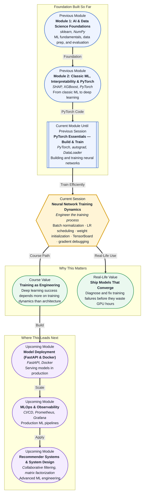

# Pre-read: Neural Network Training Dynamics

## Context of This Session in the Course

You spend hours designing a neural network architecture. The layers are perfectly arranged, the activation functions thoughtfully chosen, and the loss function is precisely what the paper recommended. You run the training script, watch the loss curve... and nothing happens. The loss barely moves. Or worse — it shoots up to infinity after three steps. The model refuses to train.

The frustrating truth is that a well-designed architecture means little if the training dynamics are broken. The model's weights might be initialised in a bad region of the loss landscape, the learning rate could be sending gradients into chaos, or internal activations might be drifting so far that later layers see only noise. The architecture is fine, but the training process is not. This is why two teams with identical model designs can get radically different results — one understands training dynamics, the other relies on luck.

That is where **Neural Network Training Dynamics** becomes essential.

---

**What if** you could look inside your neural network while it trains, spot exactly when gradients explode or activations collapse, fix the learning rate at the perfect moment, and walk away knowing your model will converge every time? Without these skills, training a neural network feels like flying blind — you write the code, hit run, and hope. With them, you become the engineer who can diagnose a broken training loop in minutes, explain why a model is stuck, and apply the exact fix — whether it is a batch normalization layer, a smarter weight initialisation strategy, or a learning rate schedule that adapts as training progresses. This session gives you that diagnostic toolkit.

---

Training a neural network is not a single event — it is a dynamic process where every decision about how you initialise, update, and monitor the model shapes whether it succeeds or fails. Think of training like piloting an aircraft. Your **weight initialization** is the pre-flight checklist — start with bad initial conditions and you will never get off the ground. Your **learning rate** is the throttle — push it too hard and the engine stalls; keep it too low and you never reach altitude. **Batch normalization** is the autopilot that keeps the cabin pressure stable even as conditions change. **TensorBoard** is your instrument panel — without it, you are flying in fog, unable to see whether gradients are vanishing or weights are oscillating.

Together, these tools transform training from a black box into a transparent, debuggable process. This session explores **batch normalization**, **learning rate scheduling**, **weight initialization strategies**, **TensorBoard debugging**, **weight histogram analysis**, and **gradient anomaly detection** — the essential toolkit for engineering convergent training.

---

In the **previous session**, you built and trained your first neural network using PyTorch. You defined an `nn.Module`, wired up forward and backward passes with autograd, created DataLoaders for batching, and ran a training loop with SGD and Adam optimizers. You saw that training "works" — but you likely also noticed that results varied dramatically depending on the learning rate, that sometimes the loss would plateau, and that you had no real way to diagnose why.

That experience now becomes the foundation for this session. The training loop you built is the engine, but the training dynamics are the fuel, the tuning, and the dashboard. You already know how to make the model train — now you will learn how to make it train *reliably*.

---

In this pre-read, you will discover:

- How to **apply** batch normalization to stabilise activations and accelerate convergence.
- How to **interpret** weight histograms and gradient distributions to detect training anomalies.
- How to **build** learning rate schedules that adapt as training progresses.
- How to **debug** a failing training loop using TensorBoard and diagnostic techniques.

---

## Why Weight Initialization Can Make or Break Your Network

Imagine being dropped into a mountain range at a random starting point and told to find the lowest valley. If you start on a high peak, every step goes downhill, and you find the valley quickly. If you start at the bottom of a narrow crevice, you are stuck before you begin. This is what happens when you initialise neural network weights badly.

If you initialise all weights to zero, every neuron in a layer computes the same output, gradients become identical, and the network never learns to differentiate features — a problem called **symmetry breaking failure**. If you initialise weights too large, activations explode through the layers and gradients become unstable. If too small, activations vanish and the network learns nothing. Modern strategies like **Xavier/Glorot initialization** and **He initialization** solve this by scaling the initial weights based on the number of input and output connections, keeping the variance of activations constant across layers. The choice is not arbitrary — it is a mathematical precondition for successful training, and using the wrong initialisation for your activation function (e.g., He init with ReLU, Xavier with tanh) can silently cripple convergence.

## How Batch Normalization Keeps Activations in Check

During training, the distribution of activations feeding into each layer shifts as the weights in previous layers change. This phenomenon, called **internal covariate shift**, means that every layer is constantly adapting to a moving target — making training slower and more sensitive to hyperparameters.

**Batch normalization** addresses this by normalising the activations of each mini-batch to have zero mean and unit variance, then applying a learned scale and shift. This simple intervention has profound effects: it allows much higher learning rates, reduces the sensitivity to weight initialisation, and provides a regularising effect that can reduce or even eliminate the need for dropout. In practice, adding batch normalization often accelerates convergence by a factor of 5–10x and makes training robust to choices that would otherwise cause divergence. You will see it used in nearly every modern convolutional and feed-forward network because it is one of the highest-ROI techniques in the deep learning engineer's toolkit.

## Where Training Dynamics Debugging Appears in Real Life

Training dynamics skills are not academic — they directly determine whether a model ships or stalls, and they are applied daily across the industry. Research teams at Google and Meta run thousands of training experiments in parallel, and the difference between a model that converges in 2 hours versus one that diverges after 12 is the engineer's ability to read a weight histogram and adjust the learning rate schedule proactively. In autonomous vehicle development, where training a single perception model can cost tens of thousands of GPU hours, early detection of gradient anomalies can save entire training runs from being wasted. Production retraining pipelines — where models are automatically re-trained on fresh data — depend on automated monitoring of training dynamics to detect when data distribution shifts cause training instability. Even in smaller-scale projects like fine-tuning a BERT model for text classification, knowing how to interpret TensorBoard scalars, histograms, and gradient distributions transforms debugging from guesswork into a systematic process. Whether you are building a recommendation model at a startup, deploying a vision model in healthcare, or fine-tuning LLMs, the ability to diagnose training failures is what separates engineers who ship from those who restart.

---

## What's Next

After this session, you will be able to:

- Add batch normalization layers to a PyTorch model and observe the effect on training stability and convergence speed.
- Apply Xavier and He weight initialization strategies and explain why zero or random initialization fails.
- Implement learning rate schedulers (step decay, cosine annealing, ReduceLROnPlateau) in a training loop.
- Launch TensorBoard, visualise weight histograms and gradient distributions, and identify vanishing or exploding gradient patterns.
- Diagnose common training failures — loss plateau, NaN loss, diverging gradients — and apply the appropriate fix.

You do not need to memorise every initialisation formula or scheduler configuration right now. The goal is to build a diagnostic mindset: **training is not magic — it is a system you can instrument, measure, and fix.**

---

## Interesting Questions for the Live Session

- If batch normalization reduces internal covariate shift, why does it sometimes hurt performance on very small batch sizes or recurrent networks?
- When you see a weight histogram that is heavily skewed toward zero after 10 epochs, what hypotheses should you test first?
- How would you design a learning rate schedule for a model that is being retrained daily on streaming data with changing distributions?
- If gradient norms suddenly spike at epoch 20 after being stable for 19 epochs, is the model broken, or is it escaping a local plateau?

By the end of this session, training should feel less like a black box you hope works and more like a cockpit you can pilot: **every dial, every gauge, every lever serves one purpose — making the model converge.**
