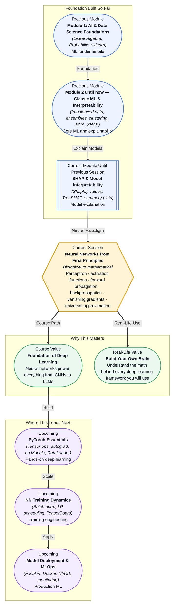

# Pre-read: Neural Networks from First Principles

## Context of This Session in the Course

You show your phone a photo of a cat, and it labels it "cat" — not because someone wrote a rule like "if pointed ears and whiskers, return 'cat'", but because the phone learned this pattern from thousands of examples. Every time you tag a face in a photo, search by image, or get an autocomplete suggestion, you are witnessing a system that discovered patterns so complex no human could have programmed them by hand.

Yet classical ML algorithms hit a hard ceiling when faced with raw, high-dimensional data like pixels, audio samples, or text. Logistic regression draws straight decision boundaries. Decision trees split on individual features. To succeed on images or speech, you would need to engineer thousands of hand-crafted features — and even then, the interactions between them would overwhelm any shallow model. The world's richest data does not arrive in neat tabular columns.

That is where **Neural Networks from First Principles** becomes essential.

---

What if you were asked to build a system that reads handwritten digits from bank cheques — with no pre-built deep learning library and no black-box API — using nothing but Python and your understanding of the math? You would need to know how a single artificial neuron makes a decision, how to chain those neurons into layers, how information flows forward from input to output, and how to adjust every weight so the network gets progressively less wrong. This session equips you with that blueprint.

---

A **neural network** is a computational system loosely inspired by the biological brain. Its smallest building block is the **perceptron** — a mathematical function that takes several inputs, multiplies each by a **weight**, sums them, and passes the result through an **activation function** to produce an output. Stack these perceptrons into layers, connect every neuron in one layer to every neuron in the next, and you have a **multi-layer network** capable of representing far more complex patterns than any single unit could.

Think of it like a factory assembly line. Raw materials (input data) enter at one end. Each workstation (layer) transforms the materials — twisting, combining, filtering — until a finished product (the prediction) emerges at the other end. The weights are the machine settings at each station. Learning means finding the right settings so that the final product matches what you want. You will explore activation functions like **ReLU**, **sigmoid**, and **tanh** — each introduces a different kind of non-linearity that lets the network model curved, overlapping decision boundaries. You will trace **forward propagation** (data moving left to right) and then learn **backpropagation**, the chain-rule-powered algorithm that flows errors backward to update every weight. Along the way you will encounter the **vanishing and exploding gradient** problem — a key challenge in training deep networks — and discover why researchers say neural networks are **universal approximators**, capable of approximating any continuous function given enough neurons.

---

In the **previous session**, you explored SHAP and model interpretability — learning how Shapley values attribute predictions to individual features, how TreeSHAP explains tree-based models, and how summary and dependence plots reveal global and local patterns. Those tools let you inspect a trained model after the fact. Now you will go one level deeper: you will learn how to build the model itself from the ground up, and understand exactly why each weight and activation matters. Where SHAP answers "what matters most in this prediction?", neural networks answer "how do we design a system that learns what matters, on its own?"

---

In this pre-read, you will discover:

- How to **build** a perceptron from scratch and understand how a single neuron makes decisions.
- How to **connect** multiple neurons into layers and trace forward propagation through a network.
- How to **apply** the chain rule to derive backpropagation, the learning algorithm behind every modern neural network.
- How to **recognise** the vanishing gradient problem and why it makes deep networks hard to train.

---

## Why One Neuron Is Not Enough

A single perceptron can only separate data that is linearly separable — think of a straight line dividing two classes on a graph. That works fine for problems like "is this email longer than 100 words?" but fails for something as simple as XOR, where the two classes interlock in a pattern no single line can split. This was famously pointed out by Minsky and Papert in 1969, and it temporarily stalled neural network research. The solution was hiding in plain sight: stack multiple perceptrons into layers. A two-layer network can solve XOR by having the first layer learn intermediate patterns and the second layer combine them. This insight — that depth creates representational power — is the entire reason modern networks have dozens or hundreds of layers rather than just one. Without multiple layers and non-linear activation functions, you are limited to drawing straight lines in a high-dimensional space. With them, you can model curves, islands, spirals, and any other shape the data demands.

## How Backpropagation Turns Errors into Wisdom

Once you have a multi-layer network making predictions, you need a way to tell every single weight — not just the ones in the final layer — whether it should increase or decrease. This is where **backpropagation** enters. At its core, backpropagation is the **chain rule** from calculus applied across a computation graph. You compute the error at the output (say, the difference between the predicted digit and the correct digit), then walk backward through the network, layer by layer, asking: "how much did each weight contribute to this error?" The answer is a gradient — a vector pointing in the direction of steepest increase. You then move each weight in the opposite direction by a small step controlled by the **learning rate**. Repeat this thousands of times across many examples, and the network gradually converges toward a set of weights that produces accurate predictions. The elegance is that the same forward structure that computes predictions also defines, through the chain rule, exactly how to improve them. This is why backpropagation is often called the most important algorithm in modern AI.

## Where Neural Networks Appear in Real Life

Neural networks are not confined to research labs. In **healthcare**, convolutional networks analyse medical scans for tumours, fractures, and retinal damage with accuracy rivaling radiologists. In **finance**, recurrent and transformer networks detect fraudulent transactions by learning spending patterns across millions of accounts. In **autonomous vehicles**, multi-modal networks fuse camera, lidar, and radar data to identify pedestrians, lane markings, and traffic signs in real time. In **e-commerce**, neural recommendation engines model user behaviour across billions of interactions to suggest products, videos, and music. In **natural language processing**, the transformer architecture — a neural network variant with self-attention — powers every major language model from GPT and Claude to Gemini and Llama, enabling translation, summarisation, code generation, and conversation. Every one of these systems rests on the same mathematical foundations you will build in this session: a perceptron, an activation function, forward propagation, and backpropagation.

---

## What's Next

After this session, you will be able to:

- Implement a perceptron in NumPy and trace its decision boundary on simple data.
- Chain multiple layers into a feedforward network using matrix multiplication.
- Compute gradients manually using the chain rule and relate them to backpropagation.
- Identify vanishing gradients and explain why ReLU helps mitigate the problem.
- Connect every concept to the PyTorch abstractions (tensors, autograd, nn.Module) you will use in the next session.

You do not need to memorise every partial derivative right now. The goal is to see neural networks not as magical black boxes but as a direct, elegant application of the calculus and linear algebra you already know: **weights, gradients, and chain rule — that is the whole game.**

---

## Interesting Questions for the Live Session

- If a single-layer network cannot learn XOR, what does that tell you about the kinds of problems that truly require depth?
- Backpropagation multiplies many gradients together through the chain rule — what happens when those gradients are consistently smaller than 1? How would you detect this in a real training run?
- The universal approximation theorem guarantees a network can represent any function — but does it guarantee you can learn that function from data? What practical gap exists between representation and learning?
- ReLU is simple (max(0, x)) yet it fixed the vanishing gradient problem for sigmoid and tanh. What trade-off did we accept in exchange?

By the end of this session, neural networks should feel less like mysterious brain-inspired machines and more like a clear mathematical system built from perceptrons, gradients, and the chain rule: **learn the weights, and you learn the pattern.**
