# Pre-read: Production LLM Applications — APIs, Streaming & Streamlit

## Context of This Session in the Course

```mermaid
%%{init: {"flowchart": {"nodeSpacing": 45, "rankSpacing": 65, "diagramPadding": 20}} }%%
flowchart TB
    subgraph Foundation["Foundation Built So Far"]
        P1(["Previous Module<br/><b>Module 1: AI &amp; Data Science</b><br/><i>(sklearn, Pandas)</i><br/>ML fundamentals, data pipelines"])
        P2(["Previous Module<br/><b>Module 2: Core ML &amp; Engineering</b><br/><i>(XGBoost, FastAPI, Docker)</i><br/>Production ML, deployment automation"])
        P3(["Previous Module<br/><b>Module 3: Advanced AI</b><br/><i>(LangGraph, CrewAI, MCP, memory)</i><br/>Agents, multi-agent, tool calling"])
        C1[["Current Until Previous Session<br/><b>Multi-Agent &amp; MCP</b><br/><i>(LangMem, CrewAI, MCP architecture)</i><br/>Memory, multi-agent orchestration, MCP"]]
    end

    CS{{"Current Session<br/><b>Production LLM Applications — APIs, Streaming &amp; Streamlit</b><br/><i>From code to deployed app</i><br/>OpenAI API · Anthropic API · streaming · Streamlit · conversation context · error handling · logging"}}

    subgraph Value["Why This Matters"]
        CV(["Course Value<br/><b>LLM Productization</b><br/>LLM APIs turn models into usable products that users can interact with"])
        RV(["Real-Life Value<br/><b>Ship AI Apps Users Love</b><br/>Build responsive, streaming chatbots and AI tools deployed to real users"])
    end

    subgraph Future["Where This Leads Next"]
        F1(["Upcoming Module<br/><b>Production Patterns</b><br/><i>(Async, caching, cost tracking)</i><br/>Optimizing LLM apps at scale"])
        F2(["Upcoming Module<br/><b>LLM Safety &amp; Ethics</b><br/><i>(Guardrails, moderation, bias)</i><br/>Responsible LLM deployment"])
        F3(["Upcoming Module<br/><b>Advanced AI / Capstone</b><br/><i>(Diffusion, multimodal, RLHF)</i><br/>Diffusion, vision-language, RLHF"])
    end

    P1 ==>|&nbsp;Foundation&nbsp;| P2
    P2 ==>|&nbsp;Production ML&nbsp;| P3
    P3 ==>|&nbsp;Agent Systems&nbsp;| C1
    C1 ==>|&nbsp;Ship LLM Apps&nbsp;| CS
    CS ==>|&nbsp;Course Path&nbsp;| CV
    CS ==>|&nbsp;Real-Life Use&nbsp;| RV
    CV ==>|&nbsp;Build&nbsp;| F1
    F1 ==>|&nbsp;Scale&nbsp;| F2
    F2 ==>|&nbsp;Apply&nbsp;| F3

    classDef previous fill:#eef4ff,stroke:#4f7ccf,color:#111827,stroke-width:2px;
    classDef current fill:#fff4d6,stroke:#d9a321,color:#111827,stroke-width:3px;
    classDef value fill:#eaf8ef,stroke:#3f9f63,color:#111827,stroke-width:2px;
    classDef future fill:#f4ecff,stroke:#8a61d1,color:#111827,stroke-width:2px;

    class P1,P2,P3,C1 previous;
    class CS current;
    class CV,RV value;
    class F1,F2,F3 future;
    linkStyle default stroke-width:3px;
```

Your Jupyter Notebook prototype works. The model responds, the outputs make sense, and your friends say "that is cool." Then your product manager asks for a working demo the team can test, and you freeze. You copy your notebook cells into a Python script, add a `while True` loop for user input, and run it in the terminal. The raw interaction works, but nobody on the product team wants to paste questions into a black terminal window. You need a web interface, streaming responses that feel alive, graceful handling when the API rate-limits your account, and a way to see what users actually asked — because debugging without logs is like flying without instruments.

This is the gap between a working LLM and a usable LLM application. A model API call is a single line of code — `client.chat.completions.create(...)` — but a production-grade chatbot requires state management, error recovery, real-time streaming, a user interface, and conversation persistence. The naive approach of printing every response breaks as soon as you need to handle a multi-turn conversation, recover from a dropped connection, or show the assistant typing tokens as they arrive. When the API returns a 429 status code, your silent crash tells the user nothing. When the model forgets what was said three turns ago, the conversation degrades without explanation.

That is where **Production LLM Applications — APIs, Streaming and Streamlit** becomes essential.

---

**What if** you could build a chatbot in one afternoon that streams responses like ChatGPT, remembers the full conversation context across turns, gracefully retries when the API throttles your account, and logs every interaction to a database — all exposed through a clean web interface that your product team, manager, or client can open in a browser and start using immediately? Now imagine that chatbot connects to your multi-agent system from the previous session, letting users delegate complex tasks to a crew of agents while watching the reasoning unfold token by token. This session gives you the application layer that turns an agentic backbone into a shippable product — the UI, the streaming protocol, the error boundaries, and the audit trail that separates a demo from a deployment.

---

An **LLM API** is a service endpoint — typically from OpenAI, Anthropic, or another provider — that accepts a prompt and returns a generated completion. What makes this session distinct from earlier model usage is the **application engineering** around that call. **Streaming** changes the response delivery from a single blocking payload to a sequence of tokens arriving one at a time, letting your UI render text progressively the way ChatGPT does. **Streamlit** is a Python framework purpose-built for data and AI applications — it abstracts away HTML, CSS, and JavaScript so you can build a multi-page chatbot interface using only Python. Because Streamlit reruns your script on every interaction, managing conversation state requires explicit design: you store messages in `st.session_state`, append each turn, and pass the full history into every API call so the model knows what came before. **Error handling** around API calls is not optional — network failures, rate limits, token limits, and content moderation flags all produce exceptions that your application must catch, interpret, and surface as helpful messages rather than crash dumps. **Conversation logging** writes every user query and model response — along with timestamps, model version, latency, and token count — to a file or database, creating the audit trail needed for debugging, improvement, and compliance.

Think of the difference between a street performer and a streaming platform. The performer delivers the full act at once, in one place, to whoever happens to be watching. The platform delivers content frame by frame, to millions of devices simultaneously, with buffering, error recovery, and analytics. This session is about building the platform layer around your LLM — not just calling an API, but designing the user experience, the state management, and the operational infrastructure that makes an AI application feel professional.

---

In the **previous session**, you built multi-agent systems with CrewAI and LangMem, giving agents memory structures — semantic memory for facts, episodic memory for past interactions — and connecting them through the Model Context Protocol. You saw how agents can collaborate, delegate, and remember context across conversations. But those agents ran in a script or a notebook, interacting through print statements. This session bridges that gap: you will wrap those agent capabilities inside a Streamlit application that streams responses token by token, manages conversation history across turns, handles API errors without crashing, and logs every interaction. The memory patterns you learned — storing facts, retrieving relevant history — now become the foundation for **conversation context management**, where the full message history is passed to the API on every turn so the model can reference earlier statements, follow thread logic, and maintain a consistent persona throughout the session.

---

In this pre-read, you will discover:

- How to **build** a Streamlit chatbot that streams LLM responses token by token with a real-time UI.
- How to **apply** OpenAI and Anthropic APIs with proper error handling, retries, and rate-limit awareness.
- How to **learn** conversation context management patterns that maintain multi-turn coherence.
- How to **connect** conversation logging to debugging, user analytics, and audit compliance.

---

## Why Streaming Is Not Just a Performance Feature

When you call an LLM API without streaming, your application sends a request and waits — sometimes 10, 20, or 30 seconds — for the full response body to arrive before displaying anything. To the user, the interface appears frozen. They stare at a blank screen wondering whether the model is thinking, whether the request failed, or whether the application crashed. The cognitive experience is dead silence followed by a wall of text. **Streaming** solves this by setting `stream=True` in the API call, which returns an iterator yielding tokens as they are generated. Your application renders each token as it arrives, turning the waiting experience into a live, progressive reveal — the same interaction pattern that made ChatGPT feel magical when it first launched.

The streaming mechanism works through **Server-Sent Events (SSE)**, a standard HTTP protocol where the server keeps the connection open and pushes data frames as they become available. OpenAI and Anthropic both use SSE under the hood. On the client side — your Streamlit app — you iterate over the response stream and write each chunk to the UI using `st.write_stream()` or a custom container that updates incrementally. This is not cosmetic. Streaming changes the perceived latency dramatically: the time-to-first-token can be under a second even when the full response takes fifteen seconds. Users feel like the system is working, not broken. Streaming also enables **interruptibility** — the ability to stop generation mid-response — because the UI can close the connection at any point rather than waiting for a monolithic response to complete. In production, streaming is the difference between an app that feels alive and one that feels like a batch job.

---

## How to Manage Conversation Context Without Losing Your Mind

The simplest chatbot implementation sends only the latest user message to the API: `client.chat.completions.create(messages=[{"role": "user", "content": input_text}])`. This works for the first turn, but on the second turn the model has no memory of what was just said. If the user asks "and why does that matter?" the model has no idea what "that" refers to. **Conversation context management** solves this by maintaining a **messages list** — a Python list of dictionaries, each with `role` (system, user, or assistant) and `content` — that grows with every turn. On each API call, you send the entire list: the system prompt that defines the assistant's behaviour, followed by every user message and every assistant response in chronological order.

The practical challenge is **token budget**. LLM APIs charge by token and have context windows — typically 8K, 16K, 32K, or 128K tokens depending on the model. A long conversation will eventually exceed the limit. This demands a **truncation strategy**: you keep the system prompt, keep the most recent N turns, and optionally include a summary of older conversation history generated by the model itself. Streamlit makes this manageable through `st.session_state`, a dictionary that persists across script reruns. You store `st.session_state.messages` as the running history, append new turns from both user and assistant, and pass `st.session_state.messages[-context_window:]` — the last K messages — to the API on each call. The result is a chatbot that behaves like a conversational partner with memory, not a stateless function call. **Conversation logging** takes this one step further: you write every message, along with metadata like timestamp, model name, token count, and response latency, to a structured log file or a database. When a user reports a confusing answer three days later, you can replay the exact conversation, inspect the context that was passed, and debug whether the issue was a truncation boundary, a weak system prompt, or an API degradation.

---

## Where Production LLM Applications Appear in Real Life

The patterns in this session — streaming interfaces, conversation management, error handling, and logging — are not academic exercises. They are the baseline architecture for every LLM product shipping today. In **customer support**, companies like Intercom, Zendesk, and Ada deploy streaming chatbots that handle tier-1 support queries, escalate to human agents when confidence is low, and log every interaction for quality assurance and model improvement. A customer who types "my order has not arrived" receives a streaming response showing the system checking order status, not a loading spinner. In **healthcare**, HIPAA-compliant LLM applications stream clinical decision support to physicians while logging every generated suggestion with the context window and model parameters that produced it — creating the audit trail required for regulatory review. A misattributed diagnosis suggestion must be traceable to the exact conversation state that triggered it. In **legal technology**, document review assistants stream contract analysis clause by clause, maintain conversation context across multi-hour review sessions, and log every query so law firms can demonstrate defensible AI use during discovery. In **education technology**, platforms like Khan Academy's Khanmigo and Quizlet's Q-Chat use streaming responses and conversation context to tutor students step by step, logging student interactions to identify common misconceptions and improve pedagogical prompting. In **internal enterprise tools**, companies build custom LLM dashboards on Streamlit — deployed behind VPNs — that connect to internal knowledge bases, stream answers to employee questions, and log usage patterns to identify which topics generate the most queries and whether the assistant's answers are driving ticket deflection. Across every sector, the stack is the same: an API call wrapped in an application layer that streams, remembers, recovers from errors, and logs everything.

---

## What's Next

After this session, you will be able to:

- Build a multi-turn Streamlit chatbot that streams responses from OpenAI and Anthropic APIs.
- Manage conversation context using `st.session_state` with truncation strategies for long sessions.
- Implement API error handling with retries, rate-limit backoff, and user-friendly error messages.
- Log every conversation turn with metadata for debugging, analytics, and audit compliance.
- Structure a production-grade LLM application with separate concerns for UI, state, API, and logging.
- Deploy a Streamlit app that real users can interact with in a browser.

You do not need to build a full production observability stack around your chatbot right now. The goal is to internalise the shift from model caller to application builder: **LLM APIs are the engine, but your application code — streaming, state, error handling, and logging — is the vehicle that delivers that engine to users.**

---

## Interesting Questions for the Live Session

- Streaming improves user experience, but it also means the user sees partial, potentially incomplete reasoning. How do you decide when to show raw tokens versus buffering until a complete sentence is formed?
- Conversation context management passes the full history on every call, which means every new turn costs more tokens and money. At what point does summarising old turns become more valuable than retaining exact history, and how do you detect that threshold?
- An API error handler catches a 429 rate-limit and retries after a backoff. But if the user asked a question that triggered the rate limit, do you silently retry, inform the user, or queue the request? How does the answer change for a streaming versus non-streaming call?
- Conversation logging stores every user query — including personally identifiable information or sensitive business data. What logging practices balance debugging utility with privacy compliance, and where does the responsibility lie — with the developer, the organisation, or the API provider?

By the end of this session, production LLM applications should feel less like intimidating infrastructure and more like a deliberate design pattern: **stream to feel alive, remember to stay coherent, handle errors to stay reliable, log to stay informed.**
