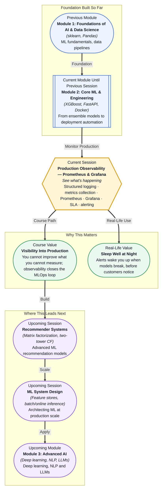

# Pre-read: Production Observability — Prometheus & Grafana

## Context of This Session in the Course

Your model is live. You deployed it with FastAPI, containerised it with Docker, set up a CI/CD pipeline with GitHub Actions, and configured drift detection. Everything looks solid. Then at 2 AM on a Saturday, your API latency spikes from 50 milliseconds to 12 seconds. Users are staring at loading spinners. By Monday morning, the product manager has a screenshot of error rates climbing through Friday evening — and zero alerts reached your phone. The model was serving degraded predictions for nearly 36 hours, and nobody noticed.

This scenario is more common than most teams admit. A deployed model is a living system. It can be running but broken — returning predictions, handling requests, consuming resources, and failing silently. The API might be up, but the prediction distribution might have shifted. The pod might be healthy, but memory might be leaking. The model might be serving, but latency might have degraded so gradually that no single request triggers an alert. Without deliberate instrumentation, your production ML system is a black box wrapped in HTTP.

That is where **Production Observability — Prometheus and Grafana** becomes essential.

---

**What if** your weekend phone buzzed at 2 AM with a single alert: "Response latency exceeded 2 seconds for 5 consecutive minutes — model endpoint /predict is degrading." You open Grafana on your phone, see a dashboard showing that memory usage has been climbing since midnight, correlate it with a recent deployment in the CI/CD pipeline, and decide to roll back — all in under five minutes, without opening a laptop. Now imagine doing that for every model your team maintains: knowing not just whether each service is "up", but how it is performing, whether it is drifting, whether SLA targets are being met, and whether that unusual pattern in prediction values is an anomaly or a feature release. This session gives you the instrumentation to go from hoping your models are healthy to knowing they are.

---

Observability is different from monitoring, and the distinction matters. **Monitoring** tells you when something is wrong — a server is down, an error rate has crossed a threshold. **Observability** tells you *why* it is wrong — by exposing the internal state of the system through data you can explore in real time. Think of the difference between a car's check-engine light and a diagnostic port that streams every sensor reading. The light tells you something is broken; the sensor stream lets you find the exact cylinder misfiring and decide whether to pull over or finish the trip.

The three pillars of observability in modern systems are **logs**, **metrics**, and **traces**. Logs are detailed, timestamped records of events — "request /predict returned 200 in 450ms". Metrics are numeric aggregations over time — average latency, request count, error rate, memory usage. Traces follow a single request across multiple services, showing where time was spent. For ML systems, you add model-specific metrics: prediction distribution histograms, feature value drift, inference throughput, and per-class performance breakdowns. **Prometheus** collects and stores these metrics using a pull-based architecture where it scrapes metric endpoints at configured intervals. **Grafana** visualises them in dashboards that give you real-time visibility into every layer of the system — from infrastructure (CPU, memory, disk) to the application layer (latency, error rates) to the model layer (prediction distributions, feature drift).

---

In the **previous session**, you automated ML testing and deployment with GitHub Actions and implemented drift detection using KS tests and PSI. You learned how to push model updates through staging into production, and how to detect when the data distribution shifts. But drift detection runs on a schedule and checks statistical properties of features — it does not tell you whether your API endpoint is responding, whether memory is leaking after a new deployment, whether latency spiked after a library update, or whether your model's prediction distribution collapsed to a single value. Drift detection answers "is the world changing around the model?", but observability answers "is the model service itself healthy?" The CI/CD pipeline delivers the code; observability tells you whether that code is running correctly once it lands. These two sessions together — drift detection and observability — form the complete production monitoring story: one watching the data, the other watching the service.

---

In this pre-read, you will discover:

- How to **apply** structured logging to ML services for production debugging and audit trails.
- How to **learn** Prometheus architecture — pull-based scraping, metric types, and alert rules.
- How to **build** Grafana dashboards that visualise model and system health in real time.
- How to **interpret** SLA metrics and alert rules to catch anomalies before they affect users.

---

## Why Logging "Prediction: 0.85" Is Not Enough

A common instinct when deploying a model is to log every prediction to a file. `print("Prediction:", result)` feels like observability, but it is not. Raw logs are unstructured text — they are useful for debugging a single request but useless for understanding system health at a glance. If latency degrades gradually over an hour, a log file shows a wall of timestamps with no aggregate signal. If error rates climb, you need to page through thousands of lines to find the pattern.

**Structured logging** solves this by emitting log entries as machine-parseable key-value pairs — typically JSON — with consistent fields: timestamp, log level, service name, request ID, prediction value, latency, model version, feature hash, and any other context that helps you reconstruct what happened. A structured log line looks like `{"level": "INFO", "service": "fraud-detector", "latency_ms": 45, "prediction": 0.12, "model_version": "v2.3.1", "request_id": "abc-123"}`. This format lets you aggregate, filter, and search logs at scale using tools like Loki, Elasticsearch, or CloudWatch. When an alert fires at 2 AM, your first action is not to guess — it is to query: "show me all requests with latency > 1000ms in the last hour, grouped by model version." Structured logging turns raw text into a queryable data source.

## How Prometheus and Grafana Turn Metrics into a Control Panel

Prometheus is built on a **pull-based** architecture. Instead of services pushing metrics to a central server, Prometheus runs a scraper that polls each service's HTTP endpoint (typically `/metrics`) at a configured interval — every 15 or 30 seconds. This design gives you control over which services are monitored and at what frequency, and it means a service does not need to know about Prometheus to be observable — it only needs to expose a `/metrics` endpoint.

Prometheus supports four core **metric types**. **Counters** are monotonically increasing values — total requests served, total errors — useful for measuring rates. **Gauges** are values that go up and down — current memory usage, active connections, queue depth. **Histograms** sample observations — request latencies, prediction values — and count them in configurable buckets, letting you compute percentiles like p99 latency. **Summaries** are similar but calculate quantiles on the client side. For ML systems, you will typically expose counters for prediction counts and error counts, gauges for memory and model confidence, and histograms for inference latency and prediction distribution — giving you a complete picture of both system health and model behaviour.

**Grafana** connects to Prometheus (and dozens of other data sources) to build dashboards. A well-designed dashboard has three tiers: a top row showing high-level SLA status (service up/down, error budget remaining), a middle row showing system health (CPU, memory, request rate, latency percentiles), and a bottom row showing model health (prediction distribution, drift score, feature value histograms). You configure **alert rules** in Prometheus that trigger when a metric crosses a threshold — "p99 latency > 2 seconds for 5 minutes" or "error rate > 1% over 10 minutes" — and route them through Alertmanager to email, Slack, PagerDuty, or your phone. The combination means you do not stare at dashboards waiting for something to break; the system wakes you when it needs attention.

## Where Production Observability Appears in Real Life

Observability is not a nice-to-have — it is a baseline requirement for any ML system that serves real users. In **financial services**, fraud detection models process millions of transactions per hour. A latency spike of even 200 milliseconds can cause transaction timeouts and lost revenue. Banks run Prometheus-Grafana stacks to monitor every inference endpoint, with dashboards split by transaction type, model version, and geographic region, and alerts that page the on-call MLE within 60 seconds of a p99 latency breach. In **e-commerce**, recommendation systems serving personalised product rankings must maintain strict SLA targets — a recommendation model that degrades to showing popular items instead of personalised ones directly impacts conversion rate. Observability catches this by tracking prediction distribution divergence: if the model starts outputting the same scores for all users, it is broken, and the dashboard signals it immediately.

In **healthcare**, clinical decision support models must be monitored for both performance and fairness. A hospital deploying a readmission risk model logs every prediction with the structured fields needed to audit decisions months later — model version, input features, predicted probability, and the clinician's final action — creating a complete audit trail for regulatory compliance. In **ML platform teams**, observability is the foundation of the internal developer platform: every model deployed via the internal MLOps pipeline automatically gets a Prometheus endpoint, a pre-built Grafana dashboard, and alert rules configured from a template, so model owners get production visibility without manual setup. In **autonomous systems**, where retraining pipelines run automatically, observability detects when a retrained model's prediction distribution shifts relative to the previous version — catching silent regressions before they reach production. Across every industry, the pattern is the same: you cannot operate what you cannot observe, and observability transforms deployment from a handover to a continuous feedback loop.

---

## What's Next

After this session, you will be able to:

- Add structured JSON logging to a FastAPI model serving endpoint for production debugging.
- Configure a Prometheus `/metrics` endpoint on your ML service with custom model metrics.
- Set up Grafana to visualise request rate, latency percentiles, error rate, and prediction distribution.
- Write Prometheus alert rules that page you when SLA targets are breached or model behaviour drifts.
- Build a Grafana dashboard with three tiers — SLA status, system health, and model health.
- Correlate deployment events in CI/CD with observability signals to detect regressions.

You do not need to design a full production monitoring stack from scratch right now. The goal is to build the mental model: **observability is the feedback loop that turns a deployed model into a known, measurable, alertable system.**

---

## Interesting Questions for the Live Session

- Structured logging emits every field you might need for debugging, but each log costs storage and query time. How do you decide which fields are essential versus noise, and what happens to observability when you log too little?
- Prometheus scrapes metrics on a fixed interval. If a service crashes and restarts between two scrape cycles, the spike in error count is lost. What architectural choices prevent this blind spot?
- A Grafana dashboard shows that prediction latency is stable but prediction distribution suddenly shifted at 3 AM. What are the possible causes, and how would you distinguish between a data drift event, a model retrain issue, and a feature engineering bug?
- Alert rules that trigger too often create alert fatigue and get ignored; rules that trigger too rarely miss incidents. How would you tune alert thresholds for a metric like p99 latency when the baseline itself changes seasonally?

By the end of this session, production observability should feel less like an operations burden and more like a superpower: **every model you deploy becomes a system you can see, measure, and trust.**
