# Pre-read: Prompt Engineering & Structured Output

## Context of This Session in the Course

```mermaid
%%{init: {"flowchart": {"nodeSpacing": 45, "rankSpacing": 65, "diagramPadding": 20}} }%%
flowchart TB
    subgraph Foundation["Foundation Built So Far"]
        P1(["Previous Module<br/><b>Module 1: AI &amp; Data Science</b><br/><i>NumPy, Scikit-learn</i><br/>ML fundamentals from math to models"])
        P2(["Previous Module<br/><b>Module 2: Core ML &amp; Engineering</b><br/><i>XGBoost, PyTorch</i><br/>Production ML engineering"])
        P3(["Previous Module<br/><b>Module 3: Advanced AI (Earlier)</b><br/><i>HuggingFace, MMLU, LoRA</i><br/>LLM foundations from BERT to fine-tuning"])
        C1[["Current Module Until Previous Session<br/><b>LLM Fine-Tuning</b><br/><i>LoRA, QLoRA, PEFT</i><br/>Efficient LLM customization without full retraining"]]
    end

    CS{{"Current Session<br/><b>Prompt Engineering &amp; Structured Output</b><br/><i>Direct LLM behavior control</i><br/>System roles · temperature · few-shot · chain-of-thought · function calling · JSON mode · Pydantic · injection defense"}}

    subgraph Value["Why This Matters"]
        CV(["Course Value<br/><b>Control Without Fine-Tuning</b><br/>Prompt engineering is the most accessible way to direct LLM behavior"])
        RV(["Real-Life Value<br/><b>Build Reliable LLM Features</b><br/>Structured outputs turn LLMs into dependable API endpoints for your app"])
    end

    subgraph Future["Where This Leads Next"]
        F1(["Upcoming Module<br/><b>RAG Fundamentals</b><br/><i>Vector DBs, chunking, embedding retrieval</i><br/>Grounded generation with external knowledge"])
        F2(["Upcoming Module<br/><b>Advanced RAG</b><br/><i>Hybrid search, re-ranking, semantic chunking</i><br/>Improving RAG quality and precision"])
        F3(["Upcoming Module<br/><b>LLM Observability, Agents &amp; RLHF</b><br/><i>LangSmith, LangGraph, guardrails</i><br/>Building production-grade LLM systems"])
    end

    P1 ==>|&nbsp;Foundation&nbsp;| P2
    P2 ==>|&nbsp;Production ML&nbsp;| P3
    P3 ==>|&nbsp;Fine-tune LLMs&nbsp;| C1
    C1 ==>|&nbsp;Engineer Prompts&nbsp;| CS
    CS ==>|&nbsp;Course Path&nbsp;| CV
    CS ==>|&nbsp;Real-Life Use&nbsp;| RV
    CV ==>|&nbsp;Build&nbsp;| F1
    F1 ==>|&nbsp;Scale&nbsp;| F2
    F2 ==>|&nbsp;Apply&nbsp;| F3

    classDef previous fill:#eef4ff,stroke:#4f7ccf,color:#111827,stroke-width:2px;
    classDef current fill:#fff4d6,stroke:#d9a321,color:#111827,stroke-width:3px;
    classDef value fill:#eaf8ef,stroke:#3f9f63,color:#111827,stroke-width:2px;
    classDef future fill:#f4ecff,stroke:#8a61d1,color:#111827,stroke-width:2px;

    class P1,P2,P3,C1 previous;
    class CS current;
    class CV,RV value;
    class F1,F2,F3 future;
    linkStyle default stroke-width:3px;
```

You build a customer support chatbot that can answer product questions. The first version works — the LLM generates fluent, helpful-sounding replies. But when you show it to your team, someone asks: "Can we make it return structured ticket categories and confidence scores, not just free text?" You try describing the format in the prompt. Sometimes it works. Sometimes the LLM decides to add extra commentary. Sometimes it ignores the format entirely.

The deeper problem becomes clear. Providing information to an LLM in plain text is not the same as controlling what it produces. You can ask nicely for JSON. You can show examples. But without the right scaffolding, the LLM may still drift, hallucinate, or produce output that your application cannot parse. A user-friendly chatbot is one thing. A reliable API endpoint that your backend code can consume is a much higher bar.

That is where **Prompt Engineering and Structured Output** becomes essential.

---

**What if** you could instruct an LLM the same way you configure a function: define the input schema, set the output format, tune the creativity level, and guarantee that the response matches your application's contract — every single time? What if your prompt could say "extract these three fields, return them as valid JSON matching this Pydantic model, and never add a single extra word"?

This is not science fiction. It is what prompt engineering, combined with structured output techniques like function calling and JSON mode, delivers today. By the end of this session, you will understand how to move from vague, unreliable prompts to precise, programmatically enforceable instructions.

---

At its core, prompt engineering is the practice of designing the input to a language model to produce a desired output. It is not about tricking the model. It is about communicating clearly — defining the **system role** (the model's persona), the **user role** (the human's instruction), and the constraints that govern the response.

Think of it like giving directions to a very talented but overly eager intern. The intern can write beautifully and knows a lot. But if you say "write an email", you may get a three-page essay when you wanted a two-sentence confirmation. If you say "write a two-sentence confirmation in JSON with fields `subject` and `body`", and you set the **temperature** to a low value so the intern does not get creative, you are much more likely to get exactly what you need.

This session explores a range of techniques that build on this idea: **system and user roles** to set context, **temperature and top-p** to control randomness, **few-shot prompting** to teach by example, **chain-of-thought** to guide reasoning, **function calling and JSON mode with Pydantic** to enforce structured outputs, and **prompt injection defense** to protect your application from adversarial inputs.

---

In the **previous session**, you learned how to fine-tune LLMs efficiently using LoRA, QLoRA, and the PEFT library. That approach modifies the model itself — adapting its weights so it performs better on specific tasks or domains. Fine-tuning is powerful, but it requires data, compute, and careful evaluation.

Prompt engineering offers a different path. Instead of changing the model, you change how you talk to it. Where fine-tuning is like hiring a specialist, prompt engineering is like becoming a better manager. The skills from the previous session — understanding model behavior, choosing the right level of customization, thinking about output quality — now apply in a lighter-weight, more immediate way. You can achieve remarkable results without touching a single weight.

---

In this pre-read, you will discover:

- How to **understand** the role of system and user prompts, temperature, and top-p in controlling LLM behavior.
- How to **apply** few-shot prompting and chain-of-thought reasoning to improve response quality and task accuracy.
- How to **build** structured outputs using function calling and JSON mode with Pydantic validation.
- How to **recognise** prompt injection attacks and defend against them in production applications.

---

## Why System Prompts and Temperature Are Your First Controls

The most basic prompt engineering decision — separating system context from user instruction — is also one of the most important. A **system prompt** tells the model who it is and what rules to follow: "You are a helpful tutor who explains concepts in simple terms." A **user prompt** contains the actual query. This separation lets you reuse the same system persona across thousands of user requests, without repeating yourself.

**Temperature** and **top-p** then control how creative the model is. Temperature (0 to 2) scales the probability distribution over tokens. A low temperature (0.1–0.3) makes the model almost deterministic — it picks the most likely token every time. This is ideal for structured extraction or factual answers. A high temperature (0.8–1.5) spreads the probability, allowing less likely tokens to be chosen, which works well for creative writing or brainstorming.

The key insight: you should not use the same settings for every task. A code generator benefits from low temperature. A story generator benefits from higher temperature. Choosing these values deliberately is your first step from treating the LLM as a magic black box to engineering it as a controllable tool.

## How Few-Shot Prompting and Chain-of-Thought Unlock Reasoning

Giving instructions is one thing. Showing examples is another. **Few-shot prompting** includes a small number of input-output examples directly in the prompt. For a classification task, instead of saying "classify this review as positive or negative", you show three labeled examples and then ask for the fourth. This technique works because LLMs are highly sensitive to in-context patterns and can infer the task from examples alone.

**Chain-of-thought (CoT) prompting** takes this further. Instead of asking for a final answer directly, you ask the model to reason step by step. For a math problem, a CoT prompt might say: "Let us think through this carefully. First, calculate the total cost. Then, subtract the discount. Finally, add tax." This dramatically improves accuracy on tasks that require multi-step reasoning, from arithmetic to logical deduction.

Together, few-shot and CoT prompting represent a fundamental shift: you are not just feeding the model data — you are teaching it a _process_. When combined with **function calling** — where you define the function signature and the model decides when to invoke it — you move from producing raw text to enabling structured, tool-driven interactions that your application can parse, validate, and act on.

## Where Structured Output Appears in Real Life

The techniques in this session power some of the most widely used LLM features in industry today. **Customer support systems** use function calling to extract intent, sentiment, and action items from user messages, piping structured data directly into ticketing workflows. **Healthcare applications** use JSON mode with Pydantic to extract structured patient symptoms, medication names, and follow-up instructions from free-text clinical notes, ensuring downstream systems receive valid, parseable data.

**E-commerce platforms** use low-temperature prompts and few-shot classification to tag product descriptions with categories, attributes, and confidence scores at scale. **Financial services** rely on chain-of-thought reasoning to walk through compliance checks step by step, logging each decision for audit trails. **AI agent frameworks** like LangGraph and CrewAI use function calling as the bridge between LLM reasoning and tool execution — the LLM decides what tool to call and with what parameters, and the structured output ensures the tool receives valid inputs.

In every case, the pattern is the same: raw LLM output is unpredictable; engineered prompts with structured output guarantees make it production-ready. That is why this session sits at the heart of Module 3 — it is the gateway from experimental LLM use to reliable, integration-ready features.

---

## What's Next

After this session, you will be able to:

- Design system and user prompts that reliably steer LLM behavior for different tasks.
- Select appropriate temperature and top-p values based on whether you need determinism or creativity.
- Construct few-shot and chain-of-thought prompts to improve reasoning and task accuracy.
- Use function calling to define tool signatures and let the LLM invoke them with valid parameters.
- Enforce structured JSON outputs using Pydantic models and JSON mode.
- Identify common prompt injection patterns and apply basic defenses.

You do not need to become an expert in every technique right now. The goal is to build the mental shift: **prompting is not asking — it is engineering.**

---

## Interesting Questions for the Live Session

- If a low temperature makes output deterministic, does that mean it also reduces the chance of a correct answer on tasks where multiple paths lead to the same right result?
- What happens when a few-shot prompt contains examples that contradict the system prompt — which one does the model follow?
- Chain-of-thought improves reasoning but also increases token usage and latency. When is the cost justified, and when is a direct answer good enough?
- If you validate JSON output with a Pydantic model, do you still need to worry about prompt injection, or does schema enforcement act as a safety net?

By the end of this session, prompt engineering should feel less like writing instructions to a black box and more like designing a precise communication protocol: **your prompt is the API contract between you and the model.**
