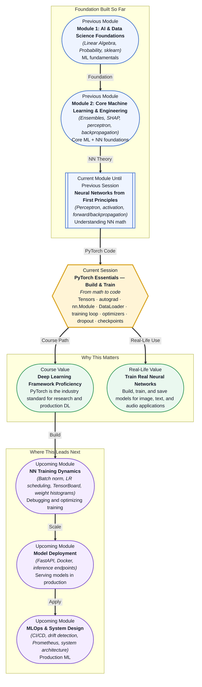

# Pre-read: PyTorch Essentials — Build & Train

## Context of This Session in the Course



You just finished deriving backpropagation by hand — chain rule expansions, gradient flows, the whole notebook. Your two-layer network works on paper. Then your teammate says: "Great, now scale it to 10 million parameters and train it on images." Suddenly the NumPy code you wrote, beautiful as it was, grinds to a halt. No GPU support. No automatic gradient tracking. No batching. No way to save progress mid-training.

This is the wall every aspiring deep learning practitioner hits. The mathematics of neural networks is one thing — elegant, teachable, something you can reason about with a pen and paper. But translating that math into software that actually runs at scale, on real hardware, with real data, is an entirely separate skill. You need a framework that handles the mechanical complexity so you can focus on the architecture and the data.

That is where **PyTorch** becomes essential. PyTorch is not just a library — it is the bridge between the neural network theory you mastered in the previous session and the industrial-strength models that power modern AI. It gives you **tensors** (GPU-accelerated arrays), **autograd** (automatic differentiation), and a modular design that lets you build, train, and deploy neural networks with the same mental model you already have.

---

**What if** you had to train a model that classifies 100,000 customer support tickets into 50 categories, with new tickets arriving every minute? A pure NumPy solution would collapse under the weight of manual gradient computation, memory management, and batch processing. You would spend more time debugging matrix shapes and gradient flows than actually improving the model.

The real challenge is not understanding how backpropagation works in theory. The challenge is building a training pipeline that is correct, efficient, and extensible — one that can swap optimizers with a single line, add dropout without touching the forward pass logic, and save checkpoints so that a twelve-hour training run survives a laptop shutdown.

This session gives you that power. By the end, you will go from a hand-coded NumPy network to a PyTorch training loop that runs on a GPU, logs loss automatically, and saves model weights with one method call.

---

A **neural network** is a function composed of layers of learned weights and nonlinear activations. Training it means finding the weights that minimise a loss function over your data. In theory, that is what you already know: forward pass, compute loss, backpropagate gradients, update weights. In practice, the engineering details matter enormously.

Think of PyTorch as a **programmable autopilot** for neural networks. You still design the architecture — how many layers, what activation functions, which loss — but PyTorch handles the repetitive, error-prone machinery. **Tensors** are the data containers, and they behave like NumPy arrays except they can live on a GPU and track every operation performed on them. **Autograd** is the automatic differentiation engine: when you call `.backward()` on a loss tensor, it walks the computational graph backwards and populates every tensor's `.grad` attribute with the correct gradient — no chain rule derivations needed.

The tools you will explore in this session include **nn.Module** (a base class for building any neural network layer or model), **DataLoader** (which feeds data in shuffled, batched chunks), the **training loop** pattern (forward, loss, backward, step, zero-grad — repeated until convergence), **optimizers** like SGD and Adam, **dropout** for regularisation, and **checkpointing** for saving and resuming training.

---

In the **previous session**, you built and understood neural networks from first principles. You implemented the **perceptron** model, experimented with **activation functions** like ReLU, sigmoid, and tanh, constructed **multi-layer networks**, ran **forward propagation**, and derived **backpropagation** from the chain rule. You also encountered **vanishing and exploding gradients** — a real problem that motivated modern techniques like batch normalisation and careful weight initialisation.

All of that mathematical intuition now becomes the foundation for this session. Every concept you derived by hand — weight matrices, gradient vectors, loss surfaces — has a direct counterpart in PyTorch. The forward pass you coded in NumPy becomes a few lines of `nn.Module`. The backpropagation you wrote by hand becomes a single call to `loss.backward()`. The gradient descent update you implemented as `weights -= lr * grad` becomes `optimizer.step()`.

You are not starting over. You are upgrading from manual transmission to automatic — the underlying mechanics are the same, but you can now operate at a much higher level of abstraction.

---

In this pre-read, you will discover:

- How to **understand** tensors as the fundamental data structure in PyTorch and how they differ from NumPy arrays.
- How to **learn** the autograd system and why it eliminates manual gradient computation.
- How to **build** a neural network using `nn.Module` and train it with a complete PyTorch training loop.
- How to **apply** dropout, optimiser selection, and checkpointing to make training robust and reproducible.

---

## Why Tensors and Autograd Are the Engine Under the Hood

Every neural network, no matter how complex, reduces to a sequence of tensor operations. A **tensor** is a generalisation of a scalar, vector, and matrix into higher dimensions. A grayscale image is a 2D tensor (height × width). A colour image is a 3D tensor (height × width × channels). A batch of 32 colour images is a 4D tensor (32 × height × width × channels). PyTorch tensors feel like NumPy arrays — you can slice, reshape, broadcast, and perform element-wise arithmetic — but with two critical additions: GPU acceleration and automatic differentiation.

When you run `x = torch.tensor([1.0, 2.0, 3.0], requires_grad=True)`, you are telling PyTorch: "Track every operation involving this tensor." PyTorch constructs a **computational graph** — a directed acyclic graph where nodes are tensors and edges are operations. When you call `loss.backward()`, PyTorch traverses this graph backwards from the loss, applying the chain rule at every edge. This is exactly the backpropagation algorithm you derived by hand, but now it runs automatically, supports arbitrary computational graphs (not just sequential networks), and executes on GPUs without any code changes.

Understanding the computational graph mental model is crucial. If you break the graph — by converting a tensor to a NumPy array mid-forward-pass, or by using in-place operations carelessly — gradients will not flow, and your model will silently fail to learn. PyTorch gives you freedom, but it demands that you respect the graph.

## From nn.Module to a Complete Training Loop

Building a neural network in PyTorch means subclassing **nn.Module**. You define the layers in `__init__` and the forward pass in `forward`. The `nn.Module` base class handles parameter registration, device movement (`model.to(device)` switches everything to GPU), and the state dictionary that powers checkpointing. A linear layer with 128 inputs and 64 outputs is one line: `nn.Linear(128, 64)`. A ReLU activation is `nn.ReLU()`. Dropout is `nn.Dropout(0.5)`. You compose them the same way you think about them on paper.

The **training loop** is the core pattern you will see, and write, hundreds of times:

```
for epoch in range(num_epochs):
    for batch_x, batch_y in dataloader:
        outputs = model(batch_x)         # forward
        loss = criterion(outputs, batch_y) # compute loss
        optimizer.zero_grad()            # clear previous gradients
        loss.backward()                  # backpropagate
        optimizer.step()                 # update weights
```

The **DataLoader** wraps your dataset and provides batching, shuffling, and parallel loading. Choosing **SGD vs Adam** is a tradeoff: SGD with momentum gives finer control and generalises well with proper learning rate scheduling, while Adam adapts per-parameter learning rates and converges faster out of the box, especially on noisy or sparse gradients. **Dropout** randomly zeroes a fraction of neuron outputs during training, forcing the network to learn redundant representations — it is a regularisation technique, not a performance booster.

**Checkpointing** with `torch.save(model.state_dict(), "model.pth")` saves only the learned parameters, not the entire model object. This makes checkpoints lightweight, portable, and safe to share. Loading is symmetrical: `model.load_state_dict(torch.load("model.pth"))`.

## Where PyTorch Training Loops Appear in Real Life

The pattern you are learning — define a model, wrap data in a DataLoader, loop over batches with forward/backward/step — is the universal skeleton of deep learning, and it appears across virtually every industry applying AI today.

In **healthcare**, researchers train convolutional neural networks on chest X-rays to detect pneumonia and lung nodules. The training loop is the same, but the data loader pulls from medical imaging archives, the loss function may use class weights to handle rare conditions, and checkpoints must be versioned for regulatory compliance. In **autonomous vehicles**, perception teams train object-detection models on millions of labelled driving frames. Here the DataLoader performs heavy augmentation — random crops, colour jitter, synthetic weather effects — and the training loop runs across dozens of GPUs in parallel, with checkpoints saved every hour to guard against cluster failures. In **finance**, fraud detection models are trained on transaction sequences using recurrent or transformer architectures. The training loop includes temporal batching (you cannot shuffle across time), and checkpoint rollback is essential when a new model underperforms the previous production version. In **natural language processing**, every large language model from GPT to BERT was trained using the same fundamental loop: tokens in, loss out, gradients back, weights update. The scale is enormous — thousands of GPUs, months of training — but the loop is recognisably the one you will write in this session. In **robotics**, reinforcement learning agents collect environment interactions, store them in a replay buffer, and train Q-networks using mini-batches sampled from that buffer — still the same forward-backward-step rhythm.

Mastering this pattern once means you can walk into any of these domains and be productive immediately. The framework handles the hardware; you handle the ideas.

---

## What's Next

After this session, you will be able to:

- Build a neural network from scratch using `nn.Module` and `nn.Sequential`.
- Write a complete training loop with batching, loss computation, and weight updates.
- Switch optimisers between SGD and Adam and explain when each is appropriate.
- Apply dropout and understand how it changes the training behaviour of a network.
- Save and load model checkpoints using `state_dict` for resumable training.
- Track tensors through the computational graph and debug gradient flow issues.

You do not need to memorise every PyTorch API method right now. The goal is to internalise the loop — forward, loss, backward, step — until it becomes as automatic as breathing: **tensors carry the data, autograd carries the gradients, and you carry the design decisions.**

---

## Interesting Questions for the Live Session

- If autograd automatically computes gradients, what kinds of operations would silently break the computational graph, and how would you detect that your model has stopped learning as a result?
- Adam converges faster than SGD in most cases, so why would an experienced practitioner ever choose SGD with momentum instead?
- Dropout is applied during training but disabled during evaluation — what does this reveal about how the network learns features versus relying on any single neuron?
- Your model trains to 92% accuracy, but the saved checkpoint fails to load on a teammate's machine — what decisions in your model definition or data pipeline could cause this mismatch?

By the end of this session, PyTorch should feel less like a black-box framework and more like a programmable engine for neural computation: **tensors are the data, autograd is the memory, and you are the conductor of the training loop.**
