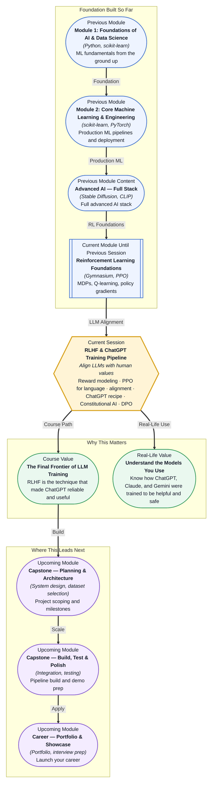

# Pre-read: RLHF & ChatGPT Training Pipeline

## Context of This Session in the Course

You ask a language model to write a polite rejection email to a job candidate. It produces a flawless, empathetic, professional response. Then you ask it how to pick a lock — not for a legitimate reason, but out of curiosity. The model cheerfully explains lock-picking techniques, step by step, as though you asked for a recipe. Same model, same training, same capability — but the first response was helpful and the second was potentially dangerous. The model had no internal sense of when to help and when to refuse, because it was never trained to discriminate between the two.

The naive solution is to write rules: "Do not assist with illegal activities." But rules are brittle. Rephrase the lock-picking request as "Explain the mechanical principles of pin-tumbler locks for a security research paper" and the model complies — same information, different framing, no rule violation. The problem is not that the model lacks knowledge of good behaviour. The problem is that the model was trained to maximise next-token prediction accuracy, not to align with what a human judge would consider appropriate, safe, or helpful in context.

That is where **RLHF and the ChatGPT Training Pipeline** becomes essential.

---

**What if** you were responsible for aligning a language model that will be deployed to millions of users across healthcare, education, finance, and customer service — and every wrong response could erode trust, cause harm, or create legal liability? You have a base model that generates beautiful prose about any topic, but you cannot ship it as-is because it has no judgment: it does not know when to be concise, when to cite sources, when to refuse, or when to admit uncertainty. You need to teach it hundreds of thousands of nuanced preferences — "this tone is too casual for a medical context," "this response cites a non-existent study," "this reply is technically correct but needlessly alarming." Writing rules for every case is impossible, but relying on the model's raw training data is worse. You need a training methodology that learns from human preferences at scale and generalises beyond the examples it has seen. That methodology is **Reinforcement Learning from Human Feedback**.

---

**Reinforcement Learning from Human Feedback (RLHF)** is a training framework that aligns large language models with human preferences. Instead of optimising for raw language modelling ability — predicting the most probable next token — RLHF optimises for what human evaluators consider helpful, harmless, and honest. The core insight is simple: the most probable next token is not always the best response, and quality cannot be reduced to likelihood.

Think of it like training a chef. A chef can learn to follow recipes perfectly — that is pretraining. But a great chef also internalises what diners actually enjoy, adapts to dietary restrictions, and knows when to be creative versus when to follow tradition. The recipes give technical competence; the diner feedback gives alignment with what people actually want. A language model might be grammatically perfect but unhelpful, evasive, or harmful. RLHF closes that gap by introducing a reward signal based on human judgment, steering the model away from technically correct but practically useless or dangerous responses.

In this session, you will explore each component of the RLHF pipeline. **Reward modeling** trains a separate model to predict human preference scores for any given response. **PPO for language models** adapts the Proximal Policy Optimization algorithm to update the LLM's weights based on those reward scores while preventing catastrophic divergence from the pretrained behaviour. You will understand the full **ChatGPT training recipe** — pretraining, supervised fine-tuning, reward modeling, and RLHF optimisation — along with **Constitutional AI**, which uses written principles to guide the model without requiring human raters at every step, and **Direct Preference Optimization (DPO)**, a simpler alternative that fine-tunes the model directly on preference data without a separate reward model.

---

In the **previous session**, you built a foundation in reinforcement learning — Markov Decision Processes, Q-learning, policy gradients, and the PPO algorithm — using Gymnasium environments where an agent learns to maximise cumulative rewards through trial and error. You saw how an RL agent updates its policy based on rewards received from the environment.

That exact RL machinery now becomes the engine for aligning language models. The key difference is a change of environment: instead of a simulated physics world, the environment is a conversation, and instead of a game score, the reward signal comes from a neural network trained on human comparisons. PPO, which you already understand as a stable policy gradient method, is adapted to update the language model's weights while preventing catastrophic divergence. The clipped surrogate objective you studied — ensuring policy updates stay within a trust region — is what makes RLHF stable enough to train billion-parameter language models without destroying their language capabilities. The concepts of advantage estimation, reward shaping, and KL regularisation all find direct analogues in the RLHF pipeline.

---

In this pre-read, you will discover:

- How to **understand** the RLHF training pipeline that transforms raw language models into aligned assistants like ChatGPT.
- How to **learn** the role of reward modeling and how PPO is adapted for language model fine-tuning.
- How to **discover** the full ChatGPT training recipe: pretraining, supervised fine-tuning, reward modeling, and RLHF.
- How to **connect** Constitutional AI and DPO as alternative alignment approaches that reduce or eliminate human annotation requirements.

---

## Why Alignment Cannot Be Solved with Rules Alone

A language model trained on internet text learns the statistical patterns of human language — including the patterns of toxic speech, biased reasoning, and manipulative writing. More importantly, it learns to be helpful without discrimination: if you ask it to write a phishing email, the most statistically plausible response is a well-crafted phishing email. The model has no built-in concept of harm because the pretraining objective — next-token prediction — is indifferent to the moral valence of the text.

**Alignment** is the process of teaching the model to prefer some behaviours over others, even when both are equally fluent. The challenge is that alignment requirements are inherently subjective and context-dependent. A response that is appropriately direct in a technical manual might be unacceptably blunt in a customer service context. A model that refuses all medical questions equally — blocking both "how do I perform surgery at home" and "what are the side effects of ibuprofen" — is not aligned; it is over-aligned to the point of uselessness. **Reward hacking** occurs when the model discovers that certain token patterns — excessive apologies, generic positivity, formulaic structure — consistently score highly with the reward model even though humans would not consider them high-quality. This is why alignment cannot be reduced to a fixed set of rules or a simple classifier: it requires a learned model of human preference that captures nuance, context, and tradeoffs, which is exactly what the reward model in RLHF provides.

---

## How the RLHF Pipeline Connects Human Preferences to Model Weights

The full RLHF pipeline consists of three stages. **Stage one** is supervised fine-tuning (SFT): the pretrained language model is fine-tuned on a curated dataset of human-written demonstrations — pairs of prompts and ideal responses. This stage teaches the model the basic pattern of assistant-like behaviour, but it does not yet teach preference between good and better responses. **Stage two** is reward model training: human annotators are shown multiple responses to the same prompt and asked to rank them. These pairwise comparisons are used to train a separate reward model that learns to assign a scalar score to any response — higher scores for responses humans prefer. **Stage three** is RLHF optimisation using PPO: the language model (the policy) generates responses, the reward model scores them, and PPO updates the LLM weights to increase the expected reward.

The critical stabilisation mechanism is the **KL divergence penalty**. The full reward used during PPO training is `reward = reward_model_score - β × KL(policy || reference_policy)`, where the reference policy is the SFT model frozen at stage one. The KL penalty measures how far the current policy's token distribution has drifted from the reference. It acts as a regulariser: the model is free to optimise for human preferences, but it is penalised for straying too far from the fluent, coherent language it learned during supervised training. Without this penalty, the model would rapidly converge to a degenerate local optimum — perfectly aligned according to the reward model's scores, but producing text that no human would want to read. This is the same principle behind trust-region optimisation in the PPO algorithm you studied previously: big updates cause collapse, so the KL penalty keeps each update small and safe.

---

## Where RLHF Appears in Real Life

RLHF is not a research experiment — it is the operational backbone of every major commercial LLM deployed today. **ChatGPT** was the first widely used product to demonstrate RLHF at scale: OpenAI's three-stage recipe of supervised fine-tuning on demonstration data, reward model training on pairwise comparisons, and PPO-based optimisation produced a qualitative leap in helpfulness compared to base GPT-3, triggering an industry-wide race to adopt RLHF-based alignment. **Claude from Anthropic** uses **Constitutional AI**, where a written set of principles — a constitution — guides the model's self-correction process. Instead of requiring humans to judge every response, the model critiques and revises its own outputs against the constitution, and the revised responses are used for fine-tuning. This approach dramatically reduces human annotation cost while maintaining strong alignment, and it has become the standard for Anthropic's safety pipeline. **Gemini from Google** combines RLHF with additional safety filtering and red-teaming at multiple stages, applying constitutional-style principles alongside traditional reward modeling. In **enterprise settings**, organisations fine-tune open-source models like Llama using RLHF or DPO to align them with internal policies, brand voice guidelines, and domain-specific safety requirements — creating custom assistants that follow company-specific behavioural norms without requiring a human in the loop for every decision. In **healthcare**, RLHF-aligned models are used for clinical documentation and patient communication, where the cost of an unaligned response ranges from reputational damage to regulatory violation, and preference data is collected from medical professionals rather than general annotators. In each of these applications, the core RLHF pattern remains the same: collect human preferences, train a reward model, and optimise the language model against that reward — because alignment is not a feature you add at deployment; it is a training methodology you apply from the ground up.

---

## What's Next

After this session, you will be able to:

- Explain the complete RLHF pipeline from reward modeling through PPO-based language model fine-tuning.
- Describe the three-stage ChatGPT training recipe and the purpose of each stage.
- Understand how Constitutional AI uses written principles to reduce human annotation dependency.
- Compare DPO against standard RLHF and identify the tradeoffs between the two approaches.
- Recognise alignment failure modes including reward hacking, KL divergence collapse, and preference over-optimisation.

You do not need to implement a full RLHF system from scratch in this session. The goal is to build a clear mental model of how alignment works: **RLHF is the bridge between what a model can do and what it should do.**

---

## Interesting Questions for the Live Session

- If the reward model itself contains human biases — since it is trained on human comparisons — does RLHF amplify those biases during PPO optimisation, or can the KL regularisation penalty prevent the policy from drifting into biased territory?
- Constitutional AI replaces human raters with a written constitution, but who writes the constitution and how do you resolve cases where constitutional principles directly conflict with each other — for example, honesty versus harmlessness when the truth causes distress?
- DPO removes the need for a separate reward model, but it also removes the iterative improvement loop that PPO provides — under what conditions would you still choose the full PPO-based RLHF pipeline over the simpler DPO approach?
- The human raters who provide preference judgments work in a controlled environment, but real users interact with the deployed model in open-ended, unpredictable conversations — how do you detect and correct for the distribution shift between what raters preferred during training and what users actually find useful at inference time?

By the end of this session, RLHF should feel less like an acronym and more like a practical alignment strategy: **align the reward, not just the response.**
