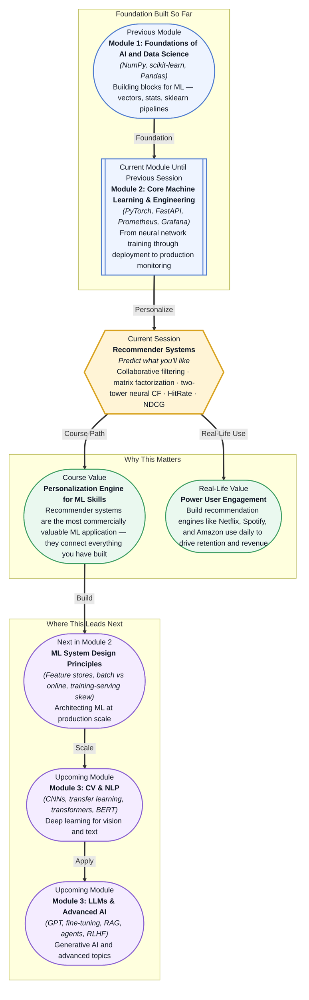

# Pre-read: Recommender Systems

## Context of This Session in the Course

You open Netflix after a long day, ready to unwind. The homepage loads, and you are greeted by rows of carefully categorized titles — "Trending Now," "Because You Watched Stranger Things," "Top 10 in India Today." Yet you scroll for ten minutes, unsure what to pick. The platform has over 17,000 titles, but none of them seem to speak directly to your current mood.

The most obvious solution — just show popular titles — fails because popularity is not personal. What half a billion other users are watching has little to do with what *you* want to see tonight. Showing everything fails even harder: choice paralysis drives users away within seconds. Manual curation by a team of editors cannot scale to 200 million subscribers across 190 countries, each with unique tastes, moods, and viewing habits. Personalisation at this scale is not a curation problem — it is a mathematical one.

That is where **Recommender Systems** become essential.

---

**What if** you were the ML engineer at Spotify responsible for the Discover Weekly playlist — a personalised mix of 30 songs delivered fresh every Monday to over 400 million users? Each user expects the playlist to feel like it was handpicked by someone who deeply understands their musical taste, mood patterns, and discovery appetite. The naive approach — recommending the most popular songs in their country — would bore them within a month. The moderate approach — recommending songs from artists they already listen to — would never help them discover new music. The right approach must balance familiarity with novelty, personal taste with serendipity, and do it all within the latency of a mobile app refresh. This session gives you the core techniques to solve that problem.

---

Recommender systems solve one deceptively simple question: given a user and a catalogue of items, which items will the user enjoy most? The dominant approach is **collaborative filtering**, which does not look at what items *are* — it looks at how people have interacted with them. The core insight is that people who agreed in the past will likely agree in the future. If Alice and Bob both loved *Inception* and *The Matrix*, and Alice loved *Interstellar*, the system recommends *Interstellar* to Bob — even though the system knows nothing about the actual content of these films.

Think of collaborative filtering as a party where you do not know most of the guests, but you find a few people whose taste in movies matches yours perfectly. You trust their recommendations, even if you have never met them, because your past preferences aligned. **User-based collaborative filtering** finds those like-minded people and recommends what they liked. **Item-based collaborative filtering** flips the logic: it finds items that tend to be liked by the same users, so if you liked item A, you will probably like item B — like noticing that everyone who buys a phone also buys a screen protector. **Matrix factorization**, powered by **SVD (Singular Value Decomposition)** , takes this further by uncovering hidden "latent factors" — secret dimensions like how action-packed a movie is or how much dialogue it contains — and placing both users and items in that latent space. **Two-tower neural collaborative filtering** replaces the linear algebra of SVD with deep neural networks, learning user and item embeddings through separate network towers that are combined at the top to predict preference. To measure whether these recommendations actually work, you use metrics like **HitRate** (did the user engage with any of the top-K recommendations?) and **NDCG** (Normalized Discounted Cumulative Gain, which rewards you for placing the items a user loved at the very top of the list).

---

In the **previous session**, you built a production observability stack with **Prometheus** and **Grafana** — you learned to collect structured logs, set up metric dashboards, configure SLA monitors, and trigger alerts when model performance degraded. That infrastructure is not separate from building recommender systems; it is the scaffolding that makes them trustworthy in production. Every recommender model you deploy needs exactly this kind of observability: you need to track whether HitRate drops over time, whether new users experiencing the "cold start" problem are receiving poor recommendations, and whether user engagement signals are drifting from the patterns your model was trained on. The Prometheus and Grafana skills you just gained are the safety net that lets you ship a recommender system with confidence.

---

In this pre-read, you will discover:

- How to **understand** the difference between user-based and item-based collaborative filtering and when to apply each.
- How to **discover** the way matrix factorization with SVD uncovers latent preference patterns from user-item interactions.
- How to **build** a two-tower neural network architecture for collaborative filtering using embeddings.
- How to **evaluate** recommendation quality using HitRate and NDCG metrics.

---

## Why Collaborative Filtering Beats Content-Based Rules

Imagine you are building a movie recommender. A content-based approach would look at each movie's attributes — genre, director, cast, runtime — and recommend movies similar to ones you have liked before. This works reasonably well until you realise that you loved *The Dark Knight* not because of its genre (action) but because of its moral ambiguity, pacing, and Christopher Nolan's narrative structure — attributes that are nearly impossible to encode as clean features. Content-based systems also suffer from a filter bubble: they can only recommend items similar to what you have already consumed, never surprising you with something genuinely new.

**Collaborative filtering** sidesteps these limitations entirely by ignoring item attributes and focusing purely on the pattern of user interactions. It does not need to know what a movie is *about* — it only needs to know that users who liked movie A also tended to like movie B. This makes it domain-agnostic: the same algorithm that recommends movies can recommend products, songs, news articles, or job postings. The tradeoff is that collaborative filtering requires sufficient interaction data to find meaningful similarities — a problem known as the **cold start**, where new users or new items have no history to build on. In practice, production systems combine both approaches: collaborative filtering for users with enough history and content-based fallbacks for new users.

## How Matrix Factorization "Reads" Hidden Preferences

A user-item interaction matrix is sparse — most users have rated or interacted with only a tiny fraction of the total catalogue. Matrix factorization compresses this sparse matrix into two dense, low-dimensional matrices: one representing users and one representing items, each with the same number of latent factors. The intuition is that a handful of hidden dimensions — say, "how intense," "how romantic," "how intellectually challenging" — can explain most of the variation in user preferences. SVD (Singular Value Decomposition) is the classic linear algebra technique that finds these latent factors by decomposing the original matrix into three components, then keeping only the strongest dimensions.

What makes this powerful is that the latent factors emerge from data, not from human intuition. The model might discover a dimension that separates "weekend binge-watch" content from "Sunday evening documentary" content — a distinction no genre label captures. Once the user and item matrices are learned, predicting a user's rating for an unseen item is a simple dot product between their latent vectors. The **two-tower neural CF** model reframes this same idea using deep learning: one neural network (a "tower") learns user embeddings from user features, another learns item embeddings from item features, and a joint layer computes the interaction score. This lets the model learn non-linear relationships between features rather than assuming they combine linearly as in SVD.

## Where Recommender Systems Appear in Real Life

Recommender systems are not an academic curiosity — they are the economic engine of the internet's largest platforms. **Netflix** estimates that its recommendation algorithms save the company over $1 billion per year by reducing churn; every title on your homepage is there because a model predicted you would watch it, and the platform's famous "recommendation row" layout is the result of a two-stage pipeline: candidate generation (retrieving hundreds of potentially relevant titles from a catalogue of thousands using collaborative filtering or matrix factorization) followed by a ranking stage that scores and orders them. **Spotify** uses a blend of collaborative filtering and natural language processing for its Discover Weekly and Release Radar playlists; the system analyses listening patterns across millions of users to find acoustic and behavioral similarities that no genre tag could capture, and it specifically optimises for discovery — recommending tracks that are new to the user but similar to what users with comparable taste have enjoyed. **Amazon** powers over 35% of its revenue through its recommendation engine, which combines item-based collaborative filtering ("customers who bought this also bought") with personalised home page ranking, session-based recommendations for guest users, and cross-category suggestions that connect seemingly unrelated product categories based on purchase co-occurrence patterns. Beyond e-commerce and media, **YouTube** uses deep neural network recommenders with billions of parameters to serve personalised video feeds, balancing engagement metrics like watch time against diversity and freshness. **LinkedIn** recommends jobs, people to follow, and news articles using collaborative filtering on professional engagement signals. In each case, the fundamental pattern is the same: collect user-item interaction data, learn latent preference representations, generate candidate items, rank them, and serve the best ones — measured and monitored using metrics like HitRate and NDCG to ensure the system is actually delivering value.

---

## What's Next

After this session, you will be able to:

- Implement user-based and item-based collaborative filtering using similarity computations on user-item interaction matrices.
- Apply matrix factorization with SVD to decompose a user-item matrix into latent user and item factors.
- Build a two-tower neural network in PyTorch that learns user and item embeddings for collaborative filtering.
- Evaluate a recommender model using HitRate@K and NDCG@K.
- Recognise the cold-start problem and reason about strategies like content-based fallbacks and hybrid approaches.
- Explain how production recommender systems handle scale through offline candidate generation and online re-ranking.

You do not need to build a full-scale Netflix recommender from scratch right now. The goal is to build a clear mental model: **recommender systems are not one algorithm — they are a design pattern for matching people with the items they will love.**

---

## Interesting Questions for the Live Session

- When a new user joins a platform with zero interaction history, how would you generate recommendations without any collaborative filtering signal?
- If two recommender models produce identical HitRate@10 but one recommends more diverse items, which one is serving the user better?
- The latent dimensions from SVD are not inherently interpretable — does a model need to be interpretable to be useful, or is predictive performance enough?
- A two-tower neural CF model achieves excellent NDCG on offline test data but loses in an online A/B test. What factors could explain this gap?

By the end of this session, recommender systems should feel less like a black-box personalisation engine and more like a systematic matching problem: **find the right signal, learn user preferences, and deliver value one recommendation at a time.**
