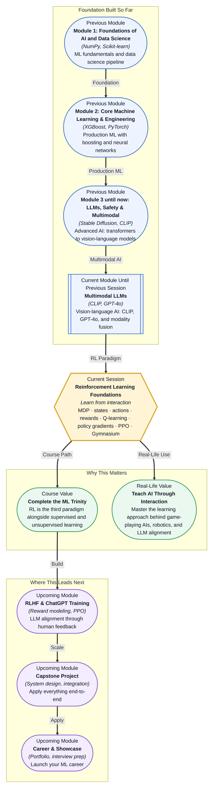

# Pre-read: Reinforcement Learning Foundations

## Context of This Session in the Course

You sit down to play a new video game you have never seen before. No tutorial, no instructions, no hints. You pick up the controller and start pressing buttons. Sometimes nothing happens. Sometimes you move forward. One button makes your character jump. You try jumping near a cliff and fall into a pit — that was bad. You avoid the cliff next time. After a few minutes, you have figured out the basics. Not because anyone told you the rules, but because you tried things, observed what happened, and adjusted.

That is exactly how reinforcement learning works — except it happens inside a machine.

The naive approach to teaching an AI is to give it labelled examples: here is what a cat looks like, here is what a dog looks like. That is supervised learning. But what about tasks where there are no labelled examples? Nobody can hand the AI a dataset of "good driving decisions" because every situation is different. Nobody can pre-annotate every possible chess move. The AI must discover good behaviour by doing, failing, and improving. That tension — how to learn without being told the answer — is what this session resolves.

That is where **Reinforcement Learning** becomes essential.

---

**What if** you were asked to build an AI that learns to play a 2D platformer game from scratch, using only the pixels on the screen and a score counter? No code for how to move, no pre-programmed strategy — just the raw ability to observe, act, and receive feedback. The AI starts pressing random buttons. It fails hundreds of times. But gradually, it learns that moving right tends to increase the score, jumping over gaps prevents death, and collecting coins is worthwhile.

This is not science fiction. It is exactly how DeepMind trained agents to play Atari games, how AlphaGo defeated world champions, and how robots learn to pick and place objects in warehouses. After this session, you will understand the mathematical framework that makes this possible — and you will have the tools to build it yourself using Python and Gymnasium.

---

Reinforcement learning solves a fundamentally different problem from the supervised learning you have practised so far. In supervised learning, you had a dataset of inputs and correct outputs. The model learned to map one to the other. In RL, there is no dataset of correct actions. Instead, an **agent** exists in an **environment**, takes **actions**, and receives **rewards** — signals that tell it whether what it just did was good or bad.

Think of it like training a dog. You do not hand the dog a book of "correct sitting postures." You say "sit," the dog either sits or does not, and you give a treat when it works. The dog learns that sitting leads to treats. It does not need to understand English or canine anatomy. It just needs to connect an action to a positive outcome.

The formal name for this structure is a **Markov Decision Process (MDP)**. An MDP has four components: **states** (where the agent is), **actions** (what it can do), **transitions** (where it ends up after an action), and **rewards** (the feedback signal). Almost every RL algorithm you will encounter — from **Q-learning** to **Policy Gradients** to **PPO** — is a strategy for solving an MDP: finding which actions lead to the highest cumulative reward over time. You will explore all of these through **Gymnasium**, the standard Python library for RL environments, which gives you ready-made worlds where your agent can practise.

---

In the **previous session**, you worked with **Multimodal LLMs** and vision-language models like CLIP, GPT-4o, and Gemini. You saw how AI can understand images and text together — perceiving the world through multiple modalities. That was the perception layer: the AI seeing, reading, and understanding.

This session adds the action layer. RL teaches the AI to *do something* based on what it perceives. The same way a multimodal model sees a photo and describes it, an RL agent sees a game screen and decides which button to press, or sees a dialogue history and decides what to say next. When you combine perception (what you studied in session 32.2) with decision-making (what you are about to study), you get the full loop that powers autonomous systems.

---

In this pre-read, you will discover:

- How to **understand** the Markov Decision Process framework and why it is the universal language of sequential decision-making.
- How to **learn** the intuition behind Q-learning and policy gradients — the two main families of RL algorithms.
- How to **connect** reward shaping and PPO to real-world training stability and sample efficiency.
- How to **apply** Gymnasium environments to write your first RL training loop.

---

## Why a Decision Framework Matters When the Future Is Uncertain

When you take an action in the real world, the outcome is rarely guaranteed. You press the accelerator, but the car might skid on a wet road. You invest in a stock, but the market might crash. You say something in a conversation, but the other person might react in an unexpected way.

RL formalises this uncertainty through the **Markov Decision Process**. An MDP assumes that the future depends only on the current state — not on the entire history of how you got there. This is the **Markov property**, and it is what makes RL computationally tractable. Instead of tracking everything that ever happened, your agent only needs to understand where it is right now to make a good decision.

In practice, this means your agent's job is to learn a **policy**: a function that maps every possible state to the best action in that state. The policy might be a simple lookup table (for tiny environments) or a neural network with millions of parameters (for complex ones like video games or robotics). Gymnasium provides environments like `CartPole-v1` where a pole is balanced on a cart — a simple enough MDP that you can watch your agent improve in real time.

## How an Agent Learns Without a Teacher

If there is no labelled dataset, how does the agent know which actions are good? The answer is **trial, error, and credit assignment**.

Suppose your agent is playing a game of Pong. It moves the paddle left, then right, then hits the ball. The ball goes over the opponent and scores a point. Which action caused the point? The last hit? The paddle movement before it? Something five moves earlier?

This is the **credit assignment problem**, and Q-learning solves it elegantly. **Q-learning** maintains a table (or a neural network approximation) that stores a value for every state-action pair: Q(s, a). This value represents the expected total future reward if you take action *a* in state *s* and then act optimally afterwards. When the agent tries an action and receives a reward, it updates the Q-value to be slightly closer to the reward plus the best Q-value of the next state. Over thousands of iterations, the Q-values converge to the true optimal policy.

But Q-learning has limits. When the action space is continuous (steering a car, not just pressing left or right), storing Q-values for every possible action becomes impossible. That is where **policy gradients** come in. Instead of learning values first and deriving actions from them, policy gradient methods directly learn a policy: a neural network that takes a state and outputs a probability distribution over actions. **PPO (Proximal Policy Optimization)** improves on this by ensuring that each update does not change the policy too drastically — preventing the catastrophic collapse that plagued earlier policy gradient methods. PPO is the algorithm behind many modern RL successes, including the RLHF pipeline used to align ChatGPT.

## Where Reinforcement Learning Appears in Real Life

Reinforcement learning is not confined to games and research papers. It powers some of the most impactful AI systems in production today.

In **robotics**, RL trains robot arms to pick, place, and assemble objects in warehouses and factories. Instead of hand-coding every joint movement, engineers define a reward for successful grasps and let the robot learn through practice. In **autonomous driving**, RL agents learn to merge lanes, brake smoothly, and navigate intersections by simulating millions of driving scenarios and rewarding safe, efficient behaviour.

In **healthcare**, RL is used for personalised treatment planning. The state is a patient's medical history and current vitals, the actions are treatment options, and the reward is improved health outcomes. The agent learns a policy that recommends the best sequence of interventions over time. In **finance**, RL algorithms optimise trading strategies, portfolio allocation, and dynamic pricing by treating market conditions as states and buy/sell decisions as actions.

And most relevant to this course, **RLHF (Reinforcement Learning from Human Feedback)** — which you will study in the very next session — uses RL to align large language models with human preferences. The language model generates responses, a reward model scores them based on human feedback, and PPO updates the language model to produce responses that humans prefer. ChatGPT, Claude, and Gemini all use some variant of this pipeline. The RL foundations you build today are the direct prerequisite for understanding how modern LLMs are trained to be helpful, honest, and harmless.

---

## What's Next

After this session, you will be able to:

- Define the four components of an MDP and relate them to any sequential decision problem.
- Implement a Q-learning agent that learns to solve a simple Gymnasium environment like CartPole or FrozenLake.
- Explain why policy gradient methods scale to continuous action spaces where Q-learning struggles.
- Compare Q-learning, vanilla policy gradients, and PPO in terms of stability and sample efficiency.
- Set up a Gymnasium environment, run episodes, and visualise an agent's learning progress.
- Connect RL concepts to the RLHF pipeline used in modern LLM alignment.

You do not need to implement PPO from scratch or master every formula right now. The goal is to build a strong mental model: **RL is the art of learning from interaction — an agent, an environment, a reward, and a loop.**

---

## Interesting Questions for the Live Session

- If an agent receives a reward only after 100 steps, how does it know which of those 100 actions was responsible — and how do Q-learning and policy gradients solve this differently?
- What happens to Q-learning when the state space is continuous and infinitely large, and why does that motivate function approximation?
- Reward shaping can speed up learning, but it can also lead to reward hacking where the agent finds a loophole. Can you think of an example where a clever agent exploits a poorly designed reward?
- PPO clips updates to prevent large policy changes, but how do you choose the right clip threshold — and what goes wrong if it is too large or too small?

By the end of this session, RL should feel less like a collection of intimidating acronyms and more like a practical design pattern: **an agent, an environment, a reward, and a loop that turns experience into intelligence.**
