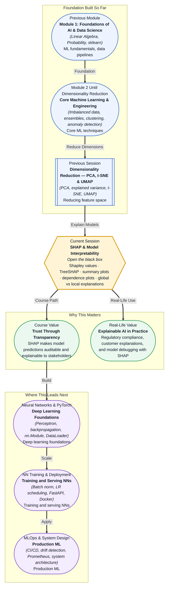

# Pre-read: SHAP & Model Interpretability

## Context of This Session in the Course

You submit a credit scoring model that rejects 30% of loan applications. The accuracy is strong, the cross-validation scores are consistent, and the feature importance chart shows that credit history and income are the top drivers. But the compliance officer asks a simple question: "Why was applicant A rejected but applicant B approved, when they have similar income and credit score?" You check the global feature importance again. It tells you that credit score matters most on average — but it does not tell you what was different about these two specific cases. The model is a black box, and in a regulated industry, a black box is a liability.

This is not only a compliance headache. When a hospital uses a model to flag high-risk patients, physicians need to know which symptoms drove the prediction for each individual. When a marketing team acts on churn predictions, they need to know why customer X is about to leave and customer Y is staying — so they can intervene differently. Global feature importance (the kind you get from a Random Forest's `feature_importances_` attribute) tells you what matters on average, but it cannot explain individual decisions. You need a method that can break any prediction into a fair, additive breakdown of feature contributions.

That is where **SHAP (SHapley Additive exPlanations)** becomes essential.

---

**What if** a regulator demanded an explanation for every prediction your model made in the last quarter — not just aggregate statistics, but a line-by-line audit of why each customer received their decision? You could not respond with a confusion matrix or a feature importance bar chart. Those tools do not answer per-instance questions. SHAP gives you exactly that power: for every prediction, it tells you how much each feature pushed the outcome up or down relative to the average. Suddenly, your black-box gradient boosting model becomes auditable. You can show a summary plot that reveals global behaviour and a dependence plot that uncovers feature interactions, all while being able to drill down to individual explanations. The session ahead is your key to turning model opacity into model transparency.

---

**SHAP** stands for **SHapley Additive exPlanations**. It is built on a surprisingly elegant idea borrowed from cooperative game theory: the **Shapley value**. Imagine a team of players — your features — working together to produce a payout — your model's prediction. Shapley values answer the question: how should the payout be fairly divided among the players, given that each contributed differently depending on which other players were present?

Here is the analogy. Suppose three colleagues — Alice, Bob, and Charlie — collaborate on a project and earn a bonus of \$3000. Alice alone would have earned \$1000, Alice and Bob together would have earned \$2000, Alice and Charlie together \$1800, and all three together \$3000. How much of the \$3000 should each person receive? Shapley values solve this by averaging each person's marginal contribution across every possible combination of teammates. SHAP applies this same logic to models: each feature is a player, the prediction is the payout, and the Shapley value of each feature is its fair contribution to the prediction, averaged over all possible subsets of features.

In this session, you will explore **Shapley value theory** and its core axioms — efficiency, symmetry, dummy, and additivity — that make the decomposition fair and unique. You will use **TreeSHAP**, a fast algorithm that computes Shapley values efficiently for tree-based models like XGBoost, LightGBM, and Random Forests. You will visualise results with **summary plots** (to see global feature importance and impact direction), **dependence plots** (to reveal how a feature's effect changes with its value), and **individual prediction explanations** (force plots or waterfall plots for single predictions). By the end, you will be able to explain any model's decisions both globally and locally with confidence.

---

In the **previous session**, you reduced high-dimensional data using **PCA, t-SNE, and UMAP**. You learned how to compress dozens or hundreds of features into a smaller set of components that capture the most variance, and you visualised high-dimensional structure in 2D scatter plots. That work was about reducing complexity — finding the signal in a dense feature space. SHAP approaches complexity from the opposite direction. Instead of compressing features, it expands each prediction into a full breakdown of every feature's contribution. Where dimensionality reduction asks "how can we see the big picture with fewer dimensions?", SHAP asks "how can we see exactly how each dimension shaped this single outcome?" The mental shift is from global structure discovery to local explanation — and it completes your toolbox for understanding what your models are really doing.

---

In this pre-read, you will discover:

- How to **interpret** individual model predictions using Shapley values from cooperative game theory.
- How to **apply** TreeSHAP to explain tree-based models like XGBoost and Random Forests.
- How to **build** summary and dependence plots that reveal global and local feature behaviour.
- How to **connect** model interpretability to regulatory compliance, debugging, and stakeholder trust.

---

## Why "Which Feature Matters Most" Is Not Enough

After training a gradient boosting model, you call `model.feature_importances_` and get a clean ranking: feature A matters most, then B, then C. This feels satisfying — you have identified the big drivers. But this global measure hides a critical truth: feature importance is not stable across predictions. A feature that is the top contributor for one prediction might be irrelevant for another.

Consider a house price model trained on location, square footage, number of bedrooms, and year built. For a small apartment in a prime location, `location` might explain 80% of the price premium. For a large suburban house, `square footage` and `bedrooms` might dominate. A global importance ranking averages these effects and tells you that location is the most important feature overall — but that average does not apply to either case individually.

SHAP solves this by computing **local explanations** — a separate importance breakdown for every single prediction. The global picture then emerges naturally: the average of all local Shapley values gives you a global importance measure that is both consistent and additive. You no longer have to choose between global and local understanding; SHAP gives you both from the same unified framework.

## How Shapley Values Turn Prediction into a Fair Game

The mathematical machinery behind SHAP comes from a 1953 paper by Lloyd Shapley on cooperative game theory. The question was: given a coalition of players who produce some total value, how should the payout be divided fairly? Shapley proposed four axioms that any fair division must satisfy. **Efficiency** says the sum of all Shapley values equals the total payout minus the average payout. **Symmetry** says if two features contribute identically to every possible subset of other features, they receive the same Shapley value. **Dummy** says a feature that never changes the prediction, regardless of which other features are present, gets a Shapley value of zero. And **Additivity** says if you combine two games, the Shapley value for each player in the combined game is the sum of their values from each individual game.

These axioms guarantee that the Shapley value is the **unique** fair division method. SHAP applies this to machine learning by treating each feature as a player, the model as the game, and the prediction as the payout. Computing the exact Shapley value requires evaluating the model on every possible subset of features — which is exponential and infeasible for models with many features. **TreeSHAP** solves this for tree-based models by exploiting the tree structure to compute exact Shapley values in polynomial time. For other model types, SHAP uses approximation methods like KernelSHAP.

The result is a single number per feature per prediction: for example, `credit_score` contributed +0.15 to the predicted probability of default, `income` contributed −0.08, and `num_late_payments` contributed +0.22. These numbers sum to the difference between the prediction and the average prediction, giving you a complete, additive, fair decomposition.

## Where SHAP Appears in Real Life

Model interpretability is not an academic luxury — it is a practical requirement across industries. In **banking and finance**, regulators in the EU, US, and India increasingly require financial institutions to explain credit decisions, fraud alerts, and risk scores. SHAP is the go-to tool for producing these explanations because it is model-agnostic (works with any classifier) and provides per-instance breakdowns that auditors can verify. A bank might deploy a gradient boosting model for loan underwriting and attach a SHAP explanation to every approval or rejection, stored in a compliance log.

In **healthcare**, a hospital using a model to predict patient readmission risk needs to justify why a particular patient was flagged as high-risk. A SHAP dependence plot might reveal that the patient's age and prior admissions interacted to push the risk score higher — information the care team can act on. Without SHAP, the model's recommendation would be a number without context, making it difficult for clinicians to trust or act upon.

In **insurance**, pricing models that set premiums must be explainable to both regulators and customers. If a customer's premium increases, the insurer must be able to say why — and SHAP provides the itemised breakdown. In **e-commerce**, recommendation systems and churn models benefit from SHAP when product managers need to understand why certain users are seeing specific recommendations or being targeted for retention campaigns. In **ML engineering**, SHAP is used daily for model debugging: when a model's performance degrades after a retrain, engineers run SHAP on the new and old predictions to see which features shifted in importance, revealing the root cause of the regression.

---

## What's Next

After this session, you will be able to:

- Compute Shapley values for individual predictions using the SHAP Python library.
- Generate and interpret summary plots to visualise global feature importance and impact direction.
- Create dependence plots to uncover feature interactions and non-linear effects.
- Apply TreeSHAP to explain XGBoost, LightGBM, CatBoost, and Random Forest models.
- Distinguish between global and local explanations and choose the right visualisation for each stakeholder.
- Debug model regressions by comparing SHAP values across model versions.

You do not need to memorise the Shapley axioms by heart right now. The goal is to build a strong mental model: **SHAP turns every prediction into a fair, additive story about how each feature shaped the outcome.**

---

## Interesting Questions for the Live Session

- When a SHAP summary plot shows that a feature has both high positive and high negative contributions across different predictions, what does that tell you about the feature's real-world behaviour, and how would you investigate further?
- TreeSHAP is efficient because it exploits tree structure, but it assumes feature independence when it averages over subsets. When does this assumption break down, and what happens to the explanations?
- A SHAP dependence plot can reveal interactions if you colour points by a second feature. How would you distinguish a genuine interaction from a spurious correlation caused by confounding variables?
- If a model is biased against a protected group, can SHAP help detect that bias, or could it potentially hide it if the biased feature is correlated with many others?

By the end of this session, SHAP should feel less like a complex theoretical framework and more like a practical debugging and communication tool: **every black-box prediction becomes a transparent ledger of feature contributions.**
