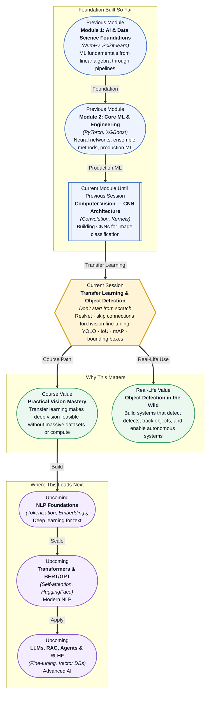

# Pre-read: Transfer Learning & Object Detection

## Context of This Session in the Course

You are building a visual inspection system for a manufacturing line. You collect 500 images of defective circuit boards and 500 of good ones — a solid dataset by industrial standards. Your first instinct, fresh from learning CNN architecture, is to design a network from scratch, initialise random weights, and train it on your 1000 images. After hours of tuning, the model plateaus at 72% accuracy. It keeps overfitting, training is painfully slow, and you wonder how every computer vision paper you read trains models that seem to see the world perfectly.

The problem is not your code. It is the assumption that starting from random weights every time makes sense. The networks that power modern vision systems have already spent weeks training on millions of diverse images from ImageNet — they have learned to detect edges, textures, corners, shapes, and even object parts. When you initialise from scratch, you discard all that hard-won visual knowledge and ask your small dataset to rediscover what edges look like. That is an unreasonable ask. The smarter approach is to take a network that already knows how to see and adapt it to your specific problem.

That is where **Transfer Learning &amp; Object Detection** becomes essential.

---

**What if** you were tasked with building a real-time detection system that identifies pedestrians, vehicles, and traffic signs from a drone's camera feed — with only a few hundred labelled examples per class and a strict latency requirement of 30 milliseconds per frame? You cannot collect a million images for every new object category. You cannot train a full network from scratch in the field. And you cannot afford to miss a single pedestrian because your detector was too slow. This session hands you the two tools that make such a system feasible: transfer learning, which lets you borrow visual intelligence from massive pre-trained models, and YOLO, an architecture designed to detect objects in a single, blazing-fast forward pass.

---

**Transfer learning** is the practice of taking a neural network trained on a large, generic dataset and adapting it to a smaller, specific task. Instead of initialising all weights randomly, you copy the weights from a pre-trained model — usually one trained on ImageNet's 14 million images across 1000 categories — and fine-tune only the parts that need to change for your new task. The intuition is straightforward: a network that already recognises edges, textures, and shapes does not need to relearn those concepts; it only needs to learn what combination of those features defines your specific classes.

Think of it like hiring a chef who has spent years mastering French cuisine and asking them to cook Italian. They already know how to chop, sauté, season, and plate. They understand heat control, knife angles, and flavour balance. You do not need to teach them how to cook — you only need to show them the new recipes. In the same way, a pre-trained CNN already knows how to extract meaningful visual features; transfer learning is the process of pointing that feature extractor at your domain and updating the final decision layers with your data. In this session, you will explore the **ResNet architecture**, whose **skip connections** solved the problem of training networks with 50, 101, and even 152 layers. You will use **torchvision** to load pre-trained models and fine-tune them on your own dataset. You will then move beyond classification into **object detection** with the **YOLO** architecture, learning to predict **bounding boxes**, evaluate localisation quality with **Intersection over Union (IoU)**, and measure overall detector performance using **mean Average Precision (mAP)**.

---

In the **previous session**, you built and trained a CNN for image classification. You applied convolution, kernels, stride, padding, and pooling to extract hierarchical feature maps from raw pixels, and you used those feature maps to classify images into categories like "cat" or "dog." That entire pipeline — from convolution through fully connected classification — now becomes the starting block for transfer learning. The CNN architecture you built is structurally identical to the feature extraction backbone inside ResNet, YOLO, and every modern object detector. The difference is that instead of training those convolutional layers from random weights, you will load weights that ImageNet already taught to recognise edges, textures, and shapes. Your previous session gave you the architectural vocabulary; this session gives you the practical shortcut that makes those architectures usable with realistic amounts of data.

---

In this pre-read, you will discover:

- How to **understand** the ResNet architecture and why skip connections enable training of very deep networks without vanishing gradients.
- How to **apply** transfer learning by fine-tuning a pre-trained torchvision model on your own custom dataset.
- How to **discover** the YOLO detection pipeline and how it reframes object detection as a single regression problem.
- How to **interpret** bounding boxes, Intersection over Union (IoU), and mean Average Precision (mAP) as evaluation metrics for detection.

---

## Why Skip Connections Changed Deep Learning

In theory, deeper neural networks should perform better — each additional layer adds representational capacity, allowing the network to model more complex functions. In practice, researchers in the mid-2010s discovered that networks beyond 20 or 30 layers actually performed worse than their shallower counterparts, even on the training set. This was the **degradation problem**: training error increased as layers were added, not because of overfitting, but because gradients vanished as they propagated backward through dozens of multiplications. When a gradient shrinks below the precision of 32-bit floats, the earliest layers receive effectively no learning signal and remain stuck at their random initialisation.

ResNet solved this with a remarkably simple idea: add a shortcut connection that skips one or more layers and adds the original input directly to the output of those layers. The skip connection, formally called an **identity shortcut**, allows the gradient to flow unimpeded through the network during backpropagation — it can bypass the stacked nonlinear layers entirely if needed. Mathematically, instead of learning a direct mapping H(x), the stacked layers learn a residual mapping F(x) = H(x) - x, and the output becomes F(x) + x. If the optimal mapping is the identity, the network can simply push the residual weights toward zero, which is far easier than learning the identity from scratch. This seemingly minor change — the addition operator — is what made 152-layer networks trainable and won ResNet the 2015 ILSVRC competition. Today, skip connections are a standard building block in virtually every deep architecture, from CNNs to Transformers, because they solve a universal problem: information must flow through depth without being destroyed.

## How YOLO Sees the Whole Picture at Once

Traditional object detectors worked in two stages: first, a region proposal network generated candidate bounding boxes (places where an object might be), then a classifier evaluated each candidate to decide what object it contained. This approach — exemplified by the R-CNN family — was accurate but slow, often taking hundreds of milliseconds per image. YOLO (You Only Look Once) introduced a fundamentally different philosophy: treat object detection as a single regression problem from image pixels to bounding box coordinates and class probabilities. Instead of scanning the image with a sliding window or evaluating thousands of region proposals, YOLO divides the input image into an S×S grid. Each grid cell is responsible for predicting a fixed number of bounding boxes, a confidence score for each box (how sure the model is that an object exists inside it), and class probabilities for the cell. The entire detection happens in one forward pass — hence the name.

This design gives YOLO extraordinary speed. A single network simultaneously predicts multiple bounding boxes and their associated class probabilities, then uses non-maximum suppression to remove duplicate detections of the same object. The trade-off has historically been lower recall on small objects compared to two-stage detectors, but successive versions — YOLOv3, YOLOv4, YOLOv5, and YOLOv8 — have closed that gap dramatically while maintaining real-time inference at 30 to 100 frames per second on consumer GPUs. When you deploy a model on a drone, a security camera, or a robotic arm, latency is not a nice-to-have — it is a hard requirement. YOLO's single-shot design is the reason real-time object detection is possible at all.

## Where Transfer Learning and Object Detection Appear in Real Life

In **manufacturing**, transfer learning is the default strategy for visual defect detection. Companies collect a few hundred images of defective products — scratched phone screens, misaligned circuit boards, cracked turbine blades — and fine-tune a pre-trained ResNet or EfficientNet to classify or detect those defects. Without transfer learning, each production line would need hundreds of thousands of labelled defect images, which is rarely feasible. In **autonomous vehicles**, object detectors based on YOLO variants process camera feeds at 30+ FPS to identify pedestrians, cyclists, traffic signs, and other vehicles. A false negative on a pedestrian is catastrophic, which is why these systems are among the most demanding test beds for detection accuracy and latency. In **healthcare**, fine-tuned CNNs localise tumours in CT scans, polyps in colonoscopy footage, and fractures in X-rays — tasks where labelled medical data is scarce and expensive to obtain. A radiologist might label a few hundred scans, and transfer learning extracts maximum value from that limited supervision. In **retail and logistics**, object detection powers automated inventory counting, shelf monitoring, and package sorting. Warehouses use YOLO-based systems to track parcels moving through conveyor belts and alert operators to jams or misroutes. In **security and surveillance**, people counting, perimeter intrusion detection, and abandoned object alerts all rely on pre-trained detectors adapted to specific camera viewpoints and lighting conditions. Across every one of these domains, the pattern is the same: start with a model that already knows how to see, adapt it to your specific objects with a modest amount of labelled data, and deploy a system that would have required years of data collection to build from scratch.

---

## What's Next

After this session, you will be able to:

- Fine-tune a pre-trained ResNet model from torchvision on a custom image classification dataset.
- Modify the final classification head of a pre-trained CNN to adapt it to a new number of classes.
- Explain how skip connections solve the vanishing gradient problem and enable networks of 50 layers or more.
- Describe the YOLO detection pipeline from image input through grid-based prediction to final bounding box output.
- Calculate Intersection over Union (IoU) between two bounding boxes and interpret its value as a measure of localisation quality.
- Interpret a mean Average Precision (mAP) score to evaluate an object detector's precision-recall trade-off across confidence thresholds.

You do not need to memorise every layer of ResNet-152 right now. The goal is to understand why starting from a pre-trained model is almost always better than starting from scratch: **don't build a new eye — borrow one that already knows how to see.**

---

## Interesting Questions for the Live Session

- A pre-trained model achieves 76% top-1 accuracy on ImageNet. You fine-tune it on a 5-class defect dataset and reach 94% test accuracy. If you had trained the same architecture from scratch on the same 500 images per class, what accuracy would you expect? What factor matters most in the gap?
- Skip connections provide an express route for gradients during backpropagation. If gradients can bypass a layer entirely, does that mean the layer's weights are irrelevant? What would happen if you removed every skipped layer during inference?
- YOLO divides the input image into an S×S grid, and each cell predicts bounding boxes. If a pedestrian spans multiple grid cells, how does the network decide which cell is responsible? What happens when no single cell contains the object's centre?
- IoU measures overlap between a predicted and ground-truth bounding box. A detector returns IoU = 0.9 but classifies the object wrong — is this a good or bad detection? What does this say about using IoU alone as an evaluation metric?

By the end of this session, transfer learning and object detection should feel less like advanced research topics and more like practical extensions of the CNN fundamentals you already understand: **pre-trained weights, fine-tuning, and bounding boxes — the three pillars of modern computer vision applications.**
