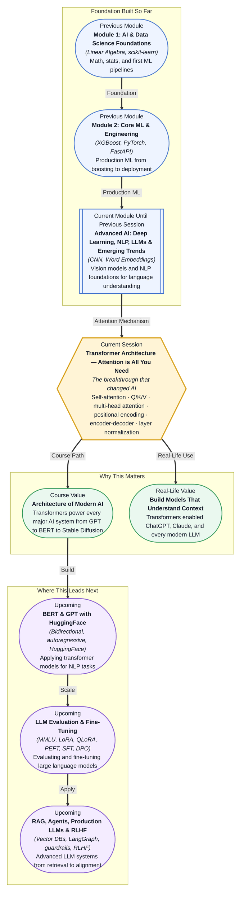

# Pre-read: Transformer Architecture — Attention is All You Need

## Context of This Session in the Course

You ask a question to a smart assistant — "What are the side effects of this medication?" — and it replies with a fluent paragraph. The answer reads well. It sounds authoritative. But it is completely wrong. It mixed up two drugs with similar names. This is not a hypothetical. Before the transformer, language models had severe architectural limits: they processed text one word at a time, could not look back far enough to resolve long-range dependencies, and had no efficient way to weigh which parts of the input actually mattered for each decision.

The intuitive approach to sequence modeling — reading left to right, maintaining a hidden state, updating it at every step — was codified in RNNs and LSTMs. But these architectures suffered from two fatal problems. First, the hidden state became a bottleneck: every piece of information had to pass through a single vector that was updated step by step, which meant early words were gradually diluted or forgotten by the time the model reached the end of a sentence. Second, the sequential nature of the computation made parallelization impossible — you could not process all words simultaneously, which made training on large corpora painfully slow. The deeper the network, the harder it was to train, and the more context was lost.

That is where the **transformer architecture** becomes essential. The seminal 2017 paper "Attention is All You Need" by Vaswani et al. introduced a fundamentally different approach: instead of processing words one at a time, the transformer looks at the entire sequence at once and uses a mechanism called **self-attention** to let every word directly attend to every other word. This single architectural shift eliminated the sequential bottleneck, enabled massive parallelization, and produced models that could capture context across thousands of tokens. It is the architecture behind every major AI system today.

---

**What if** you could build a model that reads a 50-page legal contract and correctly identifies every clause that contradicts another clause spread across different sections? Or a system that translates a live conversation between two speakers into a third language while preserving the tone, the speaker identity, and the culturally specific expressions? These tasks require understanding relationships between words that are far apart in the text — dependencies that span paragraphs, not just adjacent words. Before the transformer, this was computationally prohibitive.

The transformer solved this by giving every word a direct connection to every other word in a single computational step. This means the relationship between "plaintiff" on page 2 and "obligation" on page 48 is just as easy for the model to learn as the relationship between "the" and "cat" in the same sentence. The architecture scales to context lengths that would have been impossible with RNNs. The key that unlocks this capability is the attention mechanism — understanding it is the single most important step in understanding modern AI.

---

The transformer is built around a simple but profound idea: **attention** is a mechanism that computes a weighted sum over all elements in a sequence, where the weights are determined by the relevance between each pair of elements. Instead of compressing everything into a single hidden state, the model maintains a set of representations that can directly reference each other. Each element — every token in a sentence — gets to ask: "Which other tokens are most relevant to understanding me right now?" The answer comes in the form of a **Query, Key, and Value (Q/K/V)** computation, where the query represents what this token is looking for, the keys represent what other tokens offer, and the values represent the actual information those tokens contribute. The dot product between a query and all keys produces a score, which is normalized into an attention distribution via softmax, and that distribution is used to blend the corresponding values.

This mathematical machinery runs inside every transformer. To make it practical, the architecture adds **multi-head attention** (running several attention computations in parallel to capture different types of relationships), **positional encoding** (since the model has no built-in sense of word order, position information is injected as sinusoidal signals or learned embeddings), an **encoder-decoder** structure (where the encoder builds representations of the input and the decoder generates output while attending to those representations), and **layer normalization** (which stabilizes training by normalizing activations across the feature dimension). You will walk through each of these components from the ground up in the session.

---

In the **previous session**, you explored NLP foundations — subword tokenization with BPE and WordPiece, static embeddings like Word2Vec and GloVe, the mechanics of RNNs and LSTMs, and the fundamental limitations that led the transformer to replace them. You learned that RNNs process tokens one at a time and suffer from vanishing gradients, while LSTMs mitigated but did not eliminate the problem of long-range dependency loss. That historical context is now your launchpad. The transformer resolves every limitation you studied: it processes tokens in parallel, it connects any two tokens in constant time, and it scales to context windows of 8,000, 32,000, or even 128,000 tokens. The tokenization and embedding concepts from the previous session remain directly relevant — the transformer still tokenizes and embeds its input. What changes is *how* the model reasons about relationships between those embeddings.

---

In this pre-read, you will discover:

- How to **understand** why self-attention replaces recurrence as the core operation for sequence modeling.
- How to **learn** the Query/Key/Value (Q/K/V) derivation from scratch and how attention scores are computed.
- How to **connect** multi-head attention, positional encoding, and layer normalization into a complete transformer block.
- How to **recognise** that the encoder-decoder architecture enables the transformer to handle sequence-to-sequence tasks like translation and summarization.

---

## Why Self-Attention Replaces Recurrence

The fundamental limitation of RNNs and LSTMs was that they processed sequences sequentially. To understand why this matters, consider the sentence: "The cat that chased the mouse that ate the cheese was black." The subject of the sentence is "cat," and the verb "was" appears twelve words later. In an RNN, the hidden state must carry information about "cat" through every intervening word — each step dilutes or overwrites the representation. By the time the model reaches "was," the signal from "cat" may have faded to near zero. This is the vanishing gradient problem in practice, and it is why RNNs struggled with long-range dependencies.

**Self-attention** solves this by giving every token a direct connection to every other token. In a single computation, the representation of "cat" can attend to "was" and vice versa, regardless of the distance between them. The computational cost of this operation — an O(n²) matrix multiplication where n is the sequence length — is higher per layer than an RNN's O(n), but the ability to parallelize across all tokens makes training dramatically faster. More importantly, the information path between any two tokens is exactly one step: there is no sequential dilution. This means the transformer can capture dependencies that span hundreds or thousands of tokens with the same fidelity as adjacent words. The tradeoff is that O(n²) attention becomes expensive for very long sequences, which is why modern variants (sparse attention, sliding window attention, FlashAttention) optimize the computation while preserving the core idea.

## How Multi-Head Attention Sees Multiple Perspectives

A single attention computation tells each token which other tokens to focus on, but language is complex — the same word may need to attend to different parts of a sentence for different reasons. In "She handed him the book because he asked for it," the word "it" should attend to "book" for the object relationship, but it might also attend to "asked" to recognize the causal link. A single attention head must blend all these relationships into one set of weights, which can dilute each individual signal.

**Multi-head attention** solves this by running multiple attention computations in parallel, each with its own learned projections for queries, keys, and values. With, say, eight heads, the model can allocate one head to track subject-verb agreement, another to resolve pronoun references, another to capture semantic similarity, and yet another to model positional relationships. The outputs of all heads are concatenated and linearly projected back to the model dimension. This is not an optional enhancement — in practice, multi-head attention is what gives transformers their representational power. The original "Attention is All You Need" paper used eight heads and found that different heads consistently learned different types of relationships (e.g., one head focused on syntactic dependencies while another tracked nearby words). When you use a pretrained model like BERT or GPT, the multi-head attention mechanism is the core operation that makes contextual understanding possible.

## Where the Transformer Architecture Appears in Real Life

The transformer is not a niche research innovation — it is the architectural backbone of the most widely deployed AI systems in the world. When you use **ChatGPT or Claude**, every response is generated by a decoder-only transformer that predicts one token at a time while attending to all previously generated tokens. When you search with **Google**, the ranking system uses BERT-based transformers to understand the meaning of your query and match it to relevant pages, even when the exact keywords do not appear. **Google Translate** replaced its RNN-based system with a transformer in 2017, and the quality jump was dramatic enough that the company deprecated its older model entirely within months.

Beyond text, transformers have invaded every modality. **Stable Diffusion** and **DALL·E** use transformer components in their image generation pipelines — the diffusion U-Net incorporates attention layers that connect image regions to text prompts. **AlphaFold 2**, which predicted protein structures for millions of proteins, is built on a transformer architecture that treats amino acids as tokens and models their 3D spatial relationships through attention. In **healthcare**, transformer models process electronic health records by treating each patient event (diagnosis, medication, lab result) as a token in a sequence, enabling models to predict readmission risk or adverse drug reactions by attending to events months apart. In **finance**, transformers analyze earnings call transcripts, regulatory filings, and news articles to detect sentiment shifts and predict market movements.

The same architecture that reads a sentence, generates an image, folds a protein, and models patient outcomes — that is why understanding the transformer is not just about one paper or one model. It is about grasping the single most transferable idea in modern AI.

---

## What's Next

After this session, you will be able to:

- Derive the self-attention operation from scratch: compute Query, Key, and Value matrices, apply the softmax, and produce attended representations.
- Explain why multi-head attention captures different types of relationships in parallel and how the outputs are recombined.
- Describe how positional encoding injects order information into the transformer's parallel computation.
- Distinguish between the encoder and decoder stacks and understand when you would use each (or both).
- Trace how layer normalization stabilizes training in deep transformer networks.

You do not need to implement a full transformer from scratch in this session. The goal is to build an intuitive and mathematical understanding of each component: **the transformer is a stack of attention blocks where every token asks, every token answers, and position provides the order.**

---

## Interesting Questions for the Live Session

- Self-attention is O(n²) in sequence length — what happens to memory and computation when you scale from 512 tokens to 128,000 tokens, and what techniques can mitigate this?
- If multi-head attention uses eight heads, how do we know whether different heads actually learn different patterns, or whether they learn redundant representations?
- The original transformer used sinusoidal positional encoding, while modern LLMs use learned positional embeddings — what are the practical tradeoffs between fixed and learned position representations?
- Layer normalization is applied before or after the attention sublayer depending on the variant (Post-LN vs Pre-LN) — why does placement matter for training stability at 70B parameters?

By the end of this session, the transformer should feel less like an intimidating black box and more like an elegant, composable design: **attention is the operation that turns a sequence of tokens into a network of relationships.**
