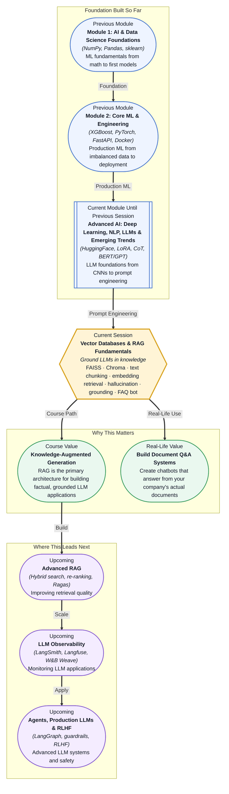

# Pre-read: Vector Databases & RAG Fundamentals

## Context of This Session in the Course

You just launched a customer support chatbot for your company's SaaS product. It sounds professional, handles small talk gracefully, and speaks with genuine fluency. Then a customer asks, "What happens if I exceed my plan's API rate limit?" — and the chatbot confidently describes a refund policy your company has never offered. The sentence structure is perfect. The tone is reassuring. The answer is completely wrong. The model invented a policy because it was doing what LLMs do best: generating plausible-sounding text from patterns it learned during training, not retrieving facts from your actual documentation.

The naive fix is to give the LLM a long system prompt with all your policies baked in. But prompt context windows have limits, your documentation is thousands of pages, and every policy update would require rewriting the prompt. Worse, LLMs do not know what they do not know — they cannot tell you "I don't have that information" because their training objective rewards completing the pattern, not admitting ignorance. The model will confidently fabricate answers on topics just outside its knowledge boundary, which is every topic that changes after its training cutoff date. A fluent but factually hallucinated answer can erode user trust faster than no answer at all.

That is where **Retrieval-Augmented Generation (RAG)** — the architecture that combines a retrieval system with a generation model to ground LLM outputs in external knowledge — becomes essential.

---

**What if** you were responsible for the AI assistant at a legal firm that answers partner questions about case law, contract clauses, and regulatory filings? One hallucinated citation could lead to a mistrial or a voidable contract. You cannot put the entire legal library in a prompt. You cannot retrain the model every week when new rulings are published. What if the assistant could, instead, search your firm's document database in real-time, find the exact paragraph relevant to the question, and generate an answer that is explicitly grounded in that source — with a citation you can verify? That is the capability RAG unlocks. Whether you are building a customer support bot, an internal knowledge base search, or a medical Q&A system, the same pattern applies: retrieve the right context first, then generate the answer.

---

At its core, RAG solves a fundamental limitation of LLMs: they are frozen in time at their training cutoff, and they do not have access to your private data. A **vector database** like FAISS or Chroma solves this by storing document chunks as mathematical embeddings — dense vector representations that capture semantic meaning rather than exact keywords. When a user asks a question, the system converts that question into the same embedding space and performs a similarity search to find the most relevant document chunks. These retrieved chunks are injected into the LLM's context window as grounding material, so the model generates its answer based on what you gave it — not on what it memorised during training. This is why **text chunking strategies** (how you split documents into retrievable pieces), **embedding-based retrieval** (how you search by meaning rather than keywords), and the **hallucination concept and grounding** (how you verify that the answer stays faithful to the source) are not implementation details — they are the core design decisions that determine whether your RAG system is trustworthy or just another confident liar. You will explore all of these through the **FAQ bot project**, building a working RAG system from scratch.

---

In the **previous session**, you mastered prompt engineering — designing system and user roles, using few-shot examples, crafting chain-of-thought reasoning, and enforcing structured output with function calling and JSON mode via Pydantic. You learned how to direct an LLM's behaviour through instructions alone. But instructions cannot inject facts the model was never trained on, and they cannot keep up with rapidly changing information. Prompt engineering shapes *how* the model answers; RAG controls *what* it answers from. Together, they form the two pillars of production LLM applications: you direct the model's behaviour with prompts and ground its answers with retrieval. The structured output patterns you already know — JSON mode, function calling — become even more powerful when paired with retrieved context, because you can now return structured, verified data rather than unstructured, unverifiable text.

---

In this pre-read, you will discover:

- How to **understand** why LLMs hallucinate and how retrieval-augmented generation grounds their outputs in external knowledge.
- How to **apply** vector databases like FAISS and Chroma for semantic search over document collections.
- How to **build** a complete RAG pipeline — from text chunking and embedding to retrieval and grounded generation.
- How to **connect** the hallucination problem to practical grounding strategies that make LLM applications trustworthy.

---

## Why LLMs Hallucinate and How RAG Grounds Them

Hallucination in LLMs is not a bug — it is a feature of how they work. A language model is a next-token prediction engine: given a sequence of words, it computes the probability distribution over the next word and samples from it. It has no internal representation of "truth" or "falsity", only of "textual coherence". When you ask an LLM a question it was not trained on, it does not know that it does not know; it simply continues the most statistically plausible pattern. This is why an LLM can write a perfect-sounding biography of a person who never existed — every sentence is grammatically correct and stylistically consistent, but the referent is a fiction.

RAG solves this by replacing the model's reliance on parametric memory (what it stored during training) with non-parametric memory (what you provide at query time). The architecture is elegantly simple: you maintain a vector index of your documents. When a query arrives, you embed it, find the top-k most similar chunks from your index, and insert those chunks into the LLM's prompt as context. The LLM then generates an answer conditioned on that context. This does not eliminate hallucination entirely — the model can still ignore or misinterpret the retrieved context — but it shifts the problem from "does the model know this fact?" to "does the retrieved context contain the right information and does the model use it faithfully?" The latter is a much more tractable engineering problem, measurable through metrics like faithfulness and answer relevance in evaluation frameworks like **Ragas**.

## How Vector Search Finds the Right Context

Traditional keyword search (like BM25) works by counting term frequency and inverse document frequency: it finds documents that share the exact words in your query. This fails when the query uses different words than the document — for example, searching "How do I reset my password?" will not find a document titled "Account recovery procedures" unless the terms overlap. Semantic search using **embeddings** solves this. An embedding model converts text into a dense vector of floating-point numbers (typically 384 to 1536 dimensions) where semantic similarity corresponds to spatial proximity — two sentences about password resets will have similar vectors even if they use no shared vocabulary.

**FAISS** (Facebook AI Similarity Search) and **Chroma** are two of the most widely used vector databases, but they operate at different levels. FAISS is a library for efficient similarity search and clustering of dense vectors — it indexes vectors using algorithms like IVF (inverted file indexing) and HNSW (hierarchical navigable small world graphs) to enable sub-second search across millions of vectors. Chroma is a higher-level vector database that wraps embedding and search into a simple API, handling persistence and metadata filtering out of the box. The choice between them depends on your scale and workflow: FAISS gives you fine-grained control over indexing and search parameters, while Chroma gets you from zero to a working RAG prototype faster. Both rely on the same underlying principle: convert everything — queries and documents — into the same embedding space, then find nearest neighbours by cosine similarity or Euclidean distance.

## Where Vector Databases and RAG Appear in Real Life

The RAG pattern has become the default architecture for any LLM application that needs factual grounding, and the use cases span industries. In **customer support**, companies like Intercom and Zendesk use RAG to power chatbots that answer from product documentation, knowledge base articles, and previous ticket resolutions — reducing hallucination from a business liability to a solved engineering problem. In **healthcare**, RAG systems retrieve from clinical guidelines, drug formularies, and patient histories to generate responses that are grounded in verified medical knowledge; a RAG-powered clinical decision support tool can answer "What are the contraindications for this patient?" by retrieving from both the drug database and the patient's electronic health record. In **legal technology**, firms use RAG to build contract analysis tools that retrieve relevant clauses, precedents, and regulatory text for every query — a lawyer can ask "Which force majeure clauses in our current agreements cover pandemic-related disruptions?" and receive an answer with retrievable citations to the actual contract language. In **education**, RAG powers tutoring systems that retrieve from curriculum materials and textbooks rather than generating answers from the model's potentially incomplete knowledge. And in **internal enterprise search**, companies index their entire knowledge base — wikis, runbooks, design documents, Slack archives — into vector databases, enabling employees to ask natural language questions and get answers grounded in the company's own documents. Across every domain, the pattern is the same: retrieve first, generate second, and always cite your sources.

---

## What's Next

After this session, you will be able to:

- Build a vector index using FAISS or Chroma from a collection of documents.
- Implement text chunking strategies (fixed-size, recursive, semantic) and understand their impact on retrieval quality.
- Embed queries and documents using a sentence-transformer model and perform similarity search.
- Construct a complete RAG pipeline that retrieves context and generates grounded answers using an LLM.
- Diagnose when an LLM is hallucinating and apply grounding techniques to keep answers faithful to source material.
- Build and evaluate a FAQ bot that answers questions from your own knowledge base.

You do not need to master every vector database or indexing algorithm right now. The goal is to understand the retrieval-and-generation pattern that makes LLMs trustworthy: **retrieve the truth before you generate the answer.**

---

## Interesting Questions for the Live Session

- If an LLM generates an answer that is grounded in the retrieved context but the context itself contains an error, who is responsible — the retriever that found the wrong document, the generator that trusted it, or the evaluator that failed to catch the mismatch?
- Text chunking seems like a simple preprocessing step, but chunk boundary placement can determine whether the retriever finds the right paragraph. How would you design a chunking strategy for a legal contract where a single clause spans multiple pages and cross-references other sections?
- Vector databases return the top-k most similar chunks, but similarity is not relevance — the most vector-similar document might be about the same topic but answer a different question. What techniques could you add between retrieval and generation to filter out irrelevant chunks?
- RAG reduces hallucination but does not eliminate it. If a model with perfect retrieval still hallucinates 1% of the time, what is the right deployment strategy — accept the rate, add a verification step, or fall back to a human-in-the-loop?

By the end of this session, RAG should feel less like a buzzword and more like an architectural pattern you can reach for whenever you need an LLM to be truthful: **retrieve what is real, generate what is useful.**
