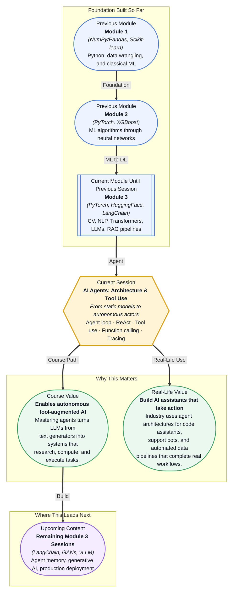

# Pre-read: AI Agents: Architecture & Tool Use

## Context of This Session in the Course

You ask an AI assistant to pull last quarter's sales data from your database, find the three regions with the steepest decline, write a Python script to visualize the trend, and email the chart to your team lead. The assistant replies: "I cannot access databases, execute code, or send emails. I can only generate text." The task that should have taken one conversation now requires you to manually run SQL, open a notebook, draft an email — every step by yourself.

This frustration is not a minor limitation — it is a fundamental gap between what LLMs can say and what they can do. A model trained on trillions of tokens can produce stunningly fluent text, but that fluency collapses the moment the task requires touching the outside world: querying a live API, running a computation on real data, checking the output of a command, or deciding what to do next based on a result. Without the ability to act and observe, the model is trapped inside its own generation, brilliant at conversation but powerless to execute.

That is where **AI Agents** — systems built around a continuous perceive → reason → act → observe loop — become essential. Instead of producing a single answer and stopping, an agent iterates: it perceives the user's request and the current state, reasons about what step to take next, acts by calling a tool or generating output, observes the outcome, and loops back to reason again. This architecture transforms the LLM from a conversational oracle into an autonomous worker that can use tools, interpret results, and adapt its behaviour in real time.

---

**What if** you could design an AI system that, given a goal like "analyse our customer churn data and prepare a presentation," autonomously navigates your database schema, writes and runs SQL queries, inspects the results for anomalies, generates statistical summaries, creates charts, and compiles everything into a slide deck — all without a human touching a keyboard between the initial request and the final output? The agent would decide which tools to call at each step, handle errors when a query fails, ask clarifying questions when data is ambiguous, and keep going until the goal is met. This is not a speculative future — it is a pattern being deployed today at companies like GitHub (Copilot agents), Salesforce (Agentforce), and numerous startups building autonomous coding, research, and operations assistants. This session provides the architectural blueprint: the agent loop, the ReAct reasoning pattern, LangChain's AgentExecutor, OpenAI function calling, and the debugging tools you need to build agents you can trust.

---

An **AI agent** is a system that repeatedly cycles through four stages: **perceive** the environment (a user message, a tool's output, a system state), **reason** about what action would make progress toward the goal, **act** by invoking a tool or producing a response, and **observe** the result to inform the next cycle. Think of it like a software developer debugging a failing test — they read the error message (perceive), decide which file to inspect (reason), add a print statement and rerun (act), check the new output (observe), and repeat until the bug is fixed. The **ReAct pattern** formalises this cycle as a structured trace: **Thought → Action → Observation**, repeated until the agent decides to stop. The Thought step makes the agent's reasoning explicit and auditable; the Action step invokes a tool (or generates a final answer); the Observation step feeds back the tool's output. In this session, you will implement this pattern using LangChain's **AgentExecutor**, which orchestrates the loop and manages tool calls, parse errors, and iteration limits. You will define **custom tools** that wrap any Python function — a calculator, a web search, a database query — into a format the agent can invoke through **OpenAI function calling syntax**, where the model selects from a list of typed tool definitions and returns a structured JSON call. And you will use **LangSmith** to trace every Thought, Action, and Observation, giving you visibility into why an agent made the choices it did.

---

In the **previous session**, you built a RAG pipeline using LangChain — chunking documents, embedding them into a vector store, retrieving relevant passages, and generating answers grounded in external knowledge. That pipeline was static: it retrieved once and generated once, then stopped. The LLM had access to context but no agency — it could not decide to retrieve a different set of documents when the first batch was insufficient, or call a calculator to verify a number before answering, or loop back to search again after learning something new. This session removes those guardrails. The LangChain patterns you already know — Document loaders, retrievers, chains — become internal components of a larger agent loop that the model itself controls. Where RAG gave the model an open book, agents give the model the ability to turn pages, take notes, and decide what to look up next.

---

In this pre-read, you will discover:

- How to **understand** the agent loop (perceive → reason → act → observe) and how it enables autonomous decision-making
- How to **apply** the ReAct pattern (Thought → Action → Observation) to structure agent reasoning and action sequences
- How to **build** custom tools and wire them into LangChain's AgentExecutor
- How to **interpret** agent execution traces using LangSmith for debugging and observability

---

## How the Agent Loop Transforms LLMs from Talkers to Doers

The defining limitation of a standard LLM call is that it is a single-shot interaction: you send a prompt, the model generates a response, and the connection ends. If the response contains a mistake — a miscalculated number, a hallucinated fact, a reference to a tool the model cannot actually use — there is no mechanism for the model to detect or correct it. The **agent loop** breaks this one-shot pattern by wrapping the LLM in a cycle that gives it persistence of purpose. After the model generates a response, the agent loop inspects the output: if it contains a tool call, the loop executes the tool, feeds the result back as an Observation, and sends the entire conversation history back to the model for the next reasoning step. This continues until the model produces a final answer or the agent hits a maximum iteration limit. The practical consequence is profound: a single agent invocation can perform multi-step workflows — query a database, analyse the results, generate a chart, and email it — that would otherwise require multiple separate tool invocations orchestrated by a human.

To see why this matters, contrast two approaches to answering "What was the average order value in March, and how does it compare to February?" Without an agent loop, you must manually run a SQL query, read the result, compute the comparison, and format the answer. With an agent loop, the LLM reasons "I need to query the orders table" and emits a tool call; the loop executes SQL, returns the row counts; the model sees both months' data, reasons "the average dropped 12%," and generates a final answer. The loop handles the orchestration — the model never leaves the driver's seat. LangChain's **AgentExecutor** manages this loop for you: it parses the model's output, detects tool invocation requests, routes them to the correct function, captures the return value, and repackages everything into the next prompt. It also handles edge cases like malformed tool calls (re-prompting the model), tool errors (passing the error message as an observation so the model can retry or adjust), and iteration limits (preventing infinite loops).

## Why the ReAct Pattern Makes Agent Behaviour Auditable

Without a structured reasoning format, an agent's behaviour can feel like a black box — a tool is called, but it is unclear why the model chose that tool or how it interpreted the result. The **ReAct pattern** solves this by requiring the model to produce explicit, interleaved **Thought**, **Action**, and **Observation** steps at every cycle. A Thought is a natural-language explanation of what the model believes the current state is and what it plans to do next. An Action is the concrete tool invocation or final response. An Observation is the tool's output, provided by the system. This three-step rhythm makes every decision auditable: you can read the trace and see exactly which reasoning path led to each tool call, what the tool returned, and how the model incorporated that result into its next thought.

This transparency is not just a debugging nicety — it is the foundation for trust in production agent systems. Consider an agent that incorrectly charges a customer's credit card. Without ReAct traces, you have no record of what the model was thinking when it called the payment API. With ReAct, the trace shows the Thought ("The customer requested a refund for order #12345"), the Action (chargeRefund(orderId: "12345")), and the Observation ("Refund processed successfully"). If something goes wrong, you can inspect the reasoning chain, identify whether the model misinterpreted the request or the tool returned unexpected data, and fix the root cause. LangSmith captures these traces automatically, recording every Thought, Action, and Observation as logged spans with timestamps and token counts. You can filter traces by agent session, compare runs side by side, and annotate failures to build a dataset for improving your agent's prompts or tool definitions over time.

## Where AI Agents Appear in Real Life

Agent architectures are moving from experimental demos into production systems across industries, driven by the realisation that LLMs are most valuable when they can act on their outputs rather than just generate them. In **software engineering**, GitHub Copilot's agent mode and similar tools write code, run tests, read error output, and iterate until the test suite passes — the ReAct pattern wrapped around a code-execution tool. The agent does not generate a single code block and stop; it generates code, observes the compiler output, fixes syntax errors, runs the tests, and refactors until the feature works. In **customer service**, companies like Klarna and Zendesk deploy agents that query order databases, check return policies, issue refunds, and update support tickets, all orchestrated through structured tool calls with human-in-the-loop approval for sensitive actions. The agent's Thought trace provides a complete audit log of why each action was taken, which is critical for compliance in regulated industries. In **data analysis and business intelligence**, agents connect to SQL databases, data warehouses, and BI tools to answer natural-language questions with real-time data — an agent can run a query, observe that the result contains outliers, decide to investigate further with a second query filtering by region, and present a final summary with charts. In **healthcare administration**, agents are being piloted to navigate electronic health record systems, check insurance eligibility, schedule follow-up appointments, and draft clinical notes, reducing the administrative burden on clinicians while maintaining audit trails through the ReAct observation log. And in **research and content production**, agents search the web, retrieve academic papers, synthesise findings, and draft reports — a workflow that previously required hours of manual search and synthesis can now be delegated to an agent that iterates on its research strategy based on what it discovers.

## What's Next

After this session, you will be able to:

- Build an agent loop that perceives user input, reasons about the next step, calls a tool, and observes the result before iterating
- Implement the ReAct pattern with explicit Thought → Action → Observation traces in your agent prompts
- Define custom tools using LangChain's tool decorator and wire them into the AgentExecutor for automatic invocation
- Structure tool definitions using OpenAI function calling syntax so the model selects tools by name and passes typed parameters
- Debug agent behaviour by inspecting full execution traces in LangSmith, including token usage, tool outputs, and decision points
- Handle edge cases — malformed tool calls, tool errors, and infinite loops — using AgentExecutor's built-in error recovery

You do not need to build a production-ready multi-agent system right now. The goal is to internalise the mental model that makes agents reliable: **perceive, reason, act, observe — then do it again, better.**

---

## Interesting Questions for the Live Session

- When an agent calls a tool and the result is an error, should it retry with the same parameters, rephrase the input, or escalate to a human — and what determines which choice is correct?
- The ReAct pattern inserts an explicit Thought step before every action, which adds latency and token cost — what kinds of applications can tolerate this overhead, and where would a faster, less transparent approach be preferable?
- How would you design a tool that should only be called under specific conditions — for example, a "send email" tool that must never be invoked without explicit human confirmation after the agent drafts the message?
- If an agent's observation from a tool call is ambiguous or incomplete (a database returns 0 rows — does that mean no data exists or the query was wrong?), what strategies can the agent use to resolve uncertainty before deciding the next action?

By the end of this session, AI agents should feel less like magic and more like a structured loop you can design, debug, and trust: **perceive, reason, act, observe — then do it again.**
