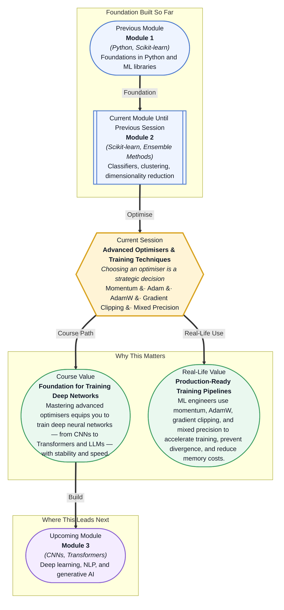

# Pre-read: Advanced Optimisers & Training Techniques

## Context of This Session in the Course

You have spent hours building a deep neural network — layers defined, activation functions chosen, data pipeline ready. You hit train and watch the loss curve. It drops, then stalls. It drops again, then zigzags. Hours later, the model has not reached the accuracy you know it is capable of. The architecture is right, the data is clean — but something in the training loop is holding it back.

The culprit is often the optimiser — the algorithm that updates your model's weights after every batch. Vanilla Stochastic Gradient Descent (SGD) treats every parameter the same, takes steps of the same size in every direction, and has no memory of where it has been. In loss landscapes with steep ravines or flat plateaus — which is most real neural networks — this causes oscillation, slow convergence, and sometimes outright divergence. The deeper your network, the more these problems compound.

That is where advanced optimisers and training techniques become essential. Momentum, adaptive learning rates, gradient clipping, and mixed precision training are not academic curiosities — they are the standard tools that make modern deep learning possible. This session demystifies how each works, when to use them, and why they matter.

What if you could train a large language model from scratch on a single consumer GPU? Or deploy a real-time object detection pipeline that converges in hours instead of days? These are not hypotheticals — they are routine achievements for engineers who understand how to wield optimisers strategically. The techniques in this session — AdamW, gradient clipping, mixed precision — are the same ones used by teams training GPT-class models and production vision systems. Mastering them puts you in control of the training process, turning you from a spectator into the architect of model performance.

An **optimiser** is the algorithm that updates a model's parameters to minimise the loss function. Think of it as a hiker navigating a mountain range in thick fog — you can only feel the slope beneath your feet (the gradient), and each step must bring you closer to the valley floor (the minimum). SGD is the simplest strategy: one step at a time, always downhill. But alone, it struggles. **Momentum** adds memory: instead of stepping purely downhill, you roll with accumulated velocity — like a ball that carries speed through small bumps and accelerates down consistent slopes. This dampens oscillations in narrow ravines and speeds up convergence. **Adaptive learning rates** (the 'A' in **Adam**) take this further by giving each parameter its own step size, scaled by how frequently that parameter has been updated. Rarely updated parameters take bigger steps; frequently updated ones take careful, small steps.

This session explores the complete modern optimiser toolkit: **SGD with momentum** for reliable baselines, **Adam** for adaptive, per-parameter learning rates, and **AdamW** which cleanly separates weight decay — a regularisation technique — from gradient updates. You will also learn **gradient clipping**, which caps gradient magnitudes to prevent exploding gradients in deep networks, and **mixed precision training**, which uses FP16 arithmetic to nearly double training throughput on compatible hardware.

In the **previous session**, you explored Time Series Analysis & Forecasting, where you fitted models to sequential data by selecting lag features, evaluating rolling statistics, and tuning ARIMA parameters. That process — choosing model parameters to minimise prediction error — is the same fundamental challenge that optimisers solve, but at a much larger scale and with gradient-based methods instead of classical statistical estimation. Where time series modelling introduced you to the discipline of model fitting, this session hands you the engine: gradient-based optimisers that can steer millions of parameters toward a minimum efficiently and stably.

In this pre-read, you will discover:
- How to **understand** why momentum transforms gradient descent from a wandering walk into a directed roll
- How to **discover** the mechanics behind Adam's per-parameter adaptive learning rates
- How to **apply** gradient clipping as a safety net against exploding gradients in deep architectures
- How to **recognise** when mixed precision training can double throughput without sacrificing model quality

---

## Why Momentum Changes the Game in Gradient Descent

Imagine trying to roll a marble down a wrinkled piece of paper. The marble (vanilla SGD) follows the local slope — but when it hits a small divot or ridge, it stops or bounces sideways. Now replace the marble with a steel ball bearing (SGD with momentum): it carries velocity from previous steps, gliding over small bumps and accelerating down consistent slopes. This is the essence of **momentum** — accumulating a velocity vector that blends the current gradient with past directions.

In practice, momentum solves two painful problems. First, it **dampens oscillations** in loss landscapes where the gradient oscillates, which is common in narrow valleys where vanilla SGD zigzags endlessly. Second, it **accelerates progress** across flat regions where gradients are tiny and vanilla SGD inches forward. The hyperparameter controlling this is the momentum coefficient (typically 0.9), which governs how much past velocity is retained. Too high, and the ball overshoots the minimum; too low, and you are back to vanilla SGD's inefficiencies. This simple idea — remember where you have been — is the foundation on which all modern optimisers are built.

## Adam, AdamW, and the Adaptive Learning Rate Revolution

**Adam** (Adaptive Moment Estimation) builds on momentum by adding per-parameter learning rates. It maintains two running estimates: the first moment (mean of gradients, like momentum) and the second moment (uncentred variance of gradients). Each parameter's update is scaled by its second moment — parameters with large, inconsistent gradients receive smaller updates, while parameters with small, consistent gradients get larger ones. The result is an optimiser that works well across a vast range of architectures without manual tuning, making it the default choice for most deep learning projects.

But Adam has a subtle flaw: it implements **weight decay** (L2 regularisation) inside the adaptive update, coupling it with the gradient history. **AdamW** fixes this by decoupling weight decay from the gradient-based update — applying it directly to the weights after the optimiser step rather than inside the adaptive rule. This small architectural change yields consistently better generalisation, which is why AdamW has become the default optimiser for training Transformers and LLMs. **Gradient clipping** acts as the safety belt: it rescales gradients when their norm exceeds a threshold, preventing the explosive updates that cause training to diverge. Used alongside Adam or SGD, it is indispensable for deep networks and any architecture where gradient magnitudes can spike unpredictably.

## Where Advanced Optimisers Appear in Real Life

**Large language model training** relies almost exclusively on AdamW — every Transformer-based model from BERT to GPT uses it, often paired with gradient clipping to handle the unpredictable gradients that arise at scale. **Autonomous vehicle perception systems** use SGD with momentum as their workhorse, favouring its reliable convergence behaviour over many training epochs on massive image datasets. In **healthcare AI**, where GPU memory is often constrained, mixed precision training enables researchers to train larger 3D medical image models by cutting memory usage nearly in half with negligible accuracy loss. **Financial machine learning** teams use gradient clipping extensively because financial time series frequently produce outlier gradients that can destabilise training. Across every domain, the choice of optimiser is not a footnote — it is a first-order decision that determines whether a model converges, how fast it trains, and how well it generalises.

## What's Next

After this session, you will be able to:
- Configure SGD with momentum and explain how the velocity term dampens oscillations during training
- Implement the Adam optimiser and interpret how it adapts learning rates per parameter based on gradient history
- Switch from Adam to AdamW and articulate why decoupled weight decay improves generalisation
- Apply gradient clipping to stabilise training of deep or recurrent architectures prone to exploding gradients
- Enable mixed precision training and measure its impact on training throughput and memory usage

You do not need to memorise the mathematical derivations of each optimiser right now. The goal is to build an intuition for when and why each technique matters — so you can make confident, informed decisions in your own training pipelines.

## Interesting Questions for the Live Session

- When training a deep network, the loss suddenly spikes to NaN during an epoch — which technique from this session would you investigate first, and what diagnostic steps would you take?
- Adam combines momentum with per-parameter scaling — what tradeoff does this introduce compared to SGD with momentum, and when might vanilla SGD actually outperform Adam?
- AdamW decouples weight decay from the gradient update — why does this subtle change lead to better generalisation, and does it matter equally for all model sizes?
- Mixed precision training stores weights in FP32 but computes gradients in FP16 — what happens to gradient values that underflow the FP16 range, and how might gradient clipping interact with this precision scheme to either help or hurt?

By the end of this session, optimisers should feel less like black-box solver buttons and more like a carefully tuned toolkit: **choose the right tool, train with confidence.**
