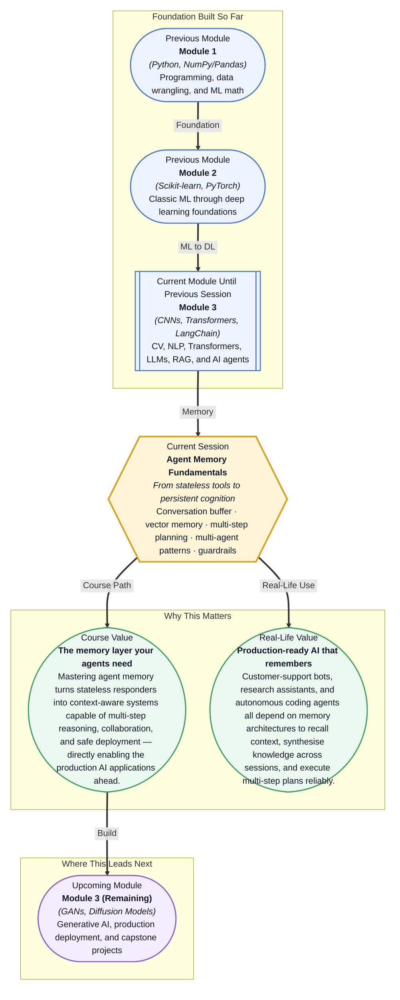

# Pre-read: Agent Memory Fundamentals

## Context of This Session in the Course

You have just spent twenty minutes explaining your project's architecture, coding conventions, and the specific bug you are trying to fix to an AI coding agent. It writes a flawless solution. Relieved, you ask it to adapt the same fix to a second service written in a different language — only to realise the agent has already forgotten your project structure, the original bug, and every detail you shared. The conversation restarts from zero.

This is not a minor inconvenience. It is the fundamental limitation of stateless agents: each interaction begins with a blank slate. No memory of past conversations, no awareness of progress across steps, no shared context between agents working on related tasks. As the complexity of your work grows — from a single code fix to a multi-file refactor spanning days — this amnesia becomes a hard blocker, not a quirk.

That is where **Agent Memory Fundamentals** becomes essential.

---

**What if** you could deploy an AI agent that remembers every user interaction from last week, plans and executes a ten-step pipeline without losing track, collaborates with a second agent specialised in data validation, and refuses prompt injection attacks — all autonomously? That is the difference between a demo and a production-grade agent system. This session gives you the memory architecture to make that happen.

---

Agent memory is what separates a helpful but forgetful assistant from a reliable autonomous system. In AI agents, **memory** refers to the mechanisms by which an agent stores, retrieves, and reasons about information across multiple interactions. **Conversation buffer memory** keeps recent dialogue in a short-term store so the agent can maintain coherent conversation — much like the mental scratchpad you use to hold a phone number you just heard. **Vector store memory** embeds and indexes information for long-term semantic recall, analogous to how your brain consolidates experiences into lasting knowledge you can retrieve years later.

If conversation buffer memory is a sticky note, vector memory is a well-organised library. The agent writes important information into the library as vector embeddings and retrieves it later by semantic similarity — not by exact keyword match. This allows the agent to recall relevant past conversations, project context, or domain knowledge even when the current query uses completely different wording. Without this layer, every agent interaction is an exercise in repeating yourself.

In this session, you will explore these two memory types alongside **multi-step task planning** (breaking a complex goal into sequenced, recoverable actions), **multi-agent collaboration patterns** (orchestrating specialised agents that communicate and share memory), and **agent safety** — including **prompt injection** detection and **guardrails** that keep agent behaviour within safe, intended boundaries.

---

In the **previous session**, you built your first AI agent using the ReAct pattern — perceive, reason, act, observe — and learned how to define custom tools, invoke OpenAI function calling, and trace agent behaviour with LangSmith. Each ReAct cycle started fresh, with no recollection of earlier cycles or external context beyond what was explicitly passed into the prompt. That agent was sharp but amnesic: it could use tools masterfully but could not remember what it did five minutes ago.

This session removes that constraint. The memory architectures you will learn here sit directly on top of the agent loop you already know. Instead of starting each Thought-Action-Observation cycle from zero, your agent will now carry forward conversation history, retrieve relevant past knowledge from a vector store, and coordinate shared context with other agents. The foundation is already built; now you are adding the persistence layer that makes agents truly autonomous.

---

In this pre-read, you will discover:

- How to **recognise** the limitations of stateless agents and the role of memory in overcoming them
- How to **learn** the differences between conversation buffer memory and vector store memory for short-term and long-term recall
- How to **apply** multi-step task planning and multi-agent collaboration patterns to real agent workflows
- How to **understand** prompt injection risks and the guardrails that protect production agent systems

---

## Why an Agent Without Memory Is Like a Chef Without a Recipe

Imagine a chef who must prepare a three-course meal without writing anything down. They can hold the starter in their head while they cook it, but by the time they start the main course, they have forgotten the plating details for the dessert. They improvise, repeat themselves, and occasionally serve dishes that contradict each other. That is a stateless agent.

**Conversation buffer memory** solves the short-term side of this problem. It keeps the last N turns of dialogue — or the most recent tokens — in a sliding window that the agent can reference. The agent uses this buffer like the chef's countertop: a limited but immediately accessible workspace. The challenge is deciding what fits in the buffer and what must be summarised or discarded when the window fills up. Without a thoughtful strategy, the agent either loses critical context or wastes tokens on noise.

**Vector store memory** addresses the long-term side. Here, the agent writes important information into a vector database as embeddings — dense numerical representations of meaning. Later, when a new query arrives, the agent searches the store by semantic similarity and retrieves the most relevant chunks. This is the chef's recipe book: shelves of knowledge that can be consulted at any time, organised not by exact title but by conceptual relevance. The tradeoff is retrieval latency and the risk of retrieving noise — semantic similarity does not guarantee factual relevance, so a retrieval scoring strategy becomes essential.

Together, these two memory types give your agent both a working memory for the current conversation and a long-term memory for everything that came before.

## How Multi-Step Planning Turns Thought into Execution

A single ReAct loop handles one action at a time. But real-world tasks are rarely single-step. Consider an agent asked to "research company X, summarise its latest earnings report, draft a competitive analysis memo, and email it to the team." That is four distinct subtasks that must execute in sequence, each depending on the output of the previous one.

**Multi-step task planning** is the mechanism by which an agent decomposes a high-level goal into a directed graph of sub-tasks, executes them in order, and handles failures along the way. The agent maintains a **task list** — itself a memory structure — that tracks what has been done, what is pending, and what needs to be retried. When a step fails (the earnings report is behind a login wall), the agent does not collapse; it logs the failure, updates the plan, and tries an alternative approach.

This is where memory and planning intersect. The agent's plan is stored in memory, updated as steps complete, and consulted when deciding what to do next. Without memory, the agent cannot distinguish between "I already fetched the data" and "I still need to fetch the data" — every retry loops infinitely. With memory, the agent becomes a project manager that tracks its own progress, learns from mistakes, and adapts when the environment changes.

## Where Agent Memory Architecture Appears in Real Life

Memory-equipped agents are already deployed across industries where stateless responses would be unacceptable. In **customer support**, a bot that remembers your previous tickets, account tier, and the fact that you were escalated to a human last Tuesday resolves issues in half the time — no repeating your case number every time you type a message. In **healthcare**, a clinical decision-support agent retrieves relevant patient history, recent lab results, and treatment guidelines from its vector store while maintaining a conversation buffer for the current consultation, synthesising information across sources that would overwhelm a human working memory.

In **software engineering**, autonomous coding agents use memory to track project context across sessions — which files were modified, what architectural decisions were made, which tests are flaky — while a multi-agent system assigns one agent to code generation, another to testing, and a third to security review, all sharing a vector store of design decisions. In **legal research**, an agent ingests thousands of case documents, stores them as embeddings, and responds to queries about precedent and jurisdiction while remembering the specific line of questioning across a multi-hour session — the difference between a search engine that returns links and a research assistant that builds a coherent argument. And in **fraud detection**, a multi-agent system correlates signals across transaction streams — one agent monitoring real-time purchases, another analysing account history, a third evaluating device fingerprints — surfacing patterns no single agent would catch.

---

## What's Next

After this session, you will be able to:

- Implement conversation buffer memory to maintain coherent, multi-turn agent dialogue
- Build a vector store memory system for long-term semantic recall across sessions
- Design multi-step task plans that decompose complex goals into sequenced, resumable actions
- Orchestrate multiple specialised agents using shared memory and collaboration patterns
- Apply guardrails to detect and mitigate prompt injection attacks in production

You do not need to build a full production memory system from scratch right now. The goal is to understand how memory transforms an agent from a single-shot replier into a persistent, context-aware collaborator — one you can trust with complex, multi-day tasks.

---

## Interesting Questions for the Live Session

- When an agent's conversation buffer exceeds the model's context window, you must decide what to keep, compress, or discard — what tradeoffs should guide that decision, and how do different compression strategies affect response quality?
- Vector store memory retrieves information by semantic similarity, but similarity does not guarantee relevance — how would you design a scoring or reranking layer that filters retrieval noise without adding prohibitive latency?
- In a multi-agent system, shared memory enables collaboration but also creates a security surface — what principles would you use to decide which memories are shared across agents versus kept private, and how does that decision change with the sensitivity of the domain?
- Prompt injection attacks exploit the boundary between trusted instructions and untrusted input — how does the presence of memory (both buffer and vector store) either amplify or reduce this vulnerability, and what architectural safeguards can you put in place?

By the end of this session, agent memory should feel less like an abstract concept and more like a practical architecture you can design and debug: **agents that remember are agents you can trust.**
